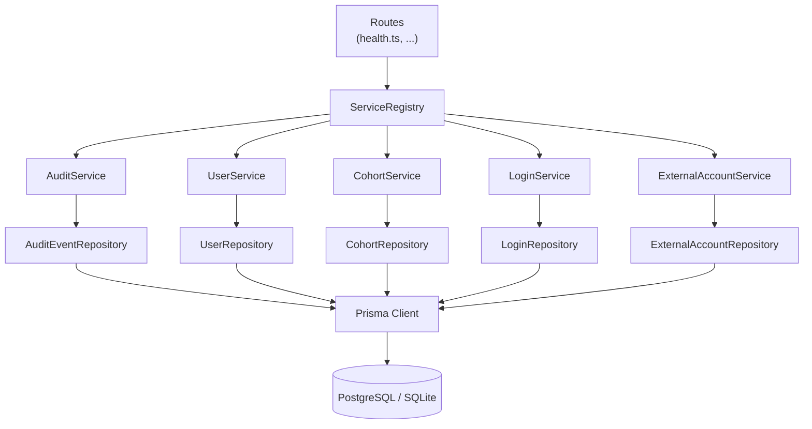
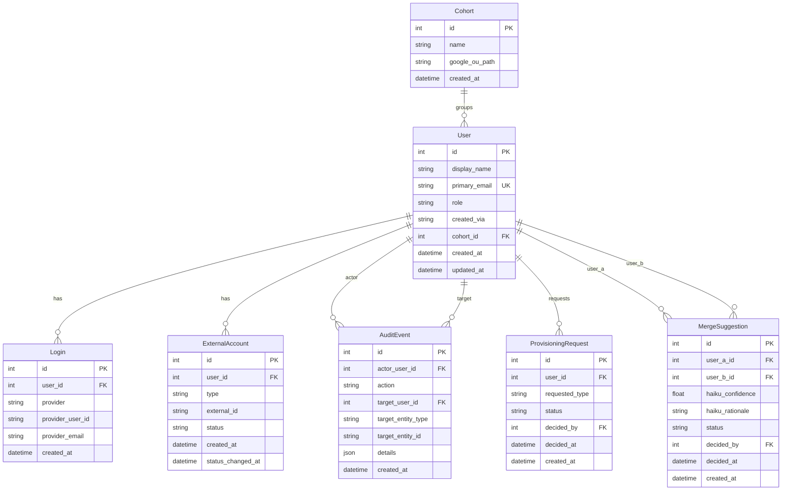

# Architecture — Sprint 001: Foundation (Initial Architecture)

Because this is the first sprint, this document is the initial architecture
for the entire system. There is no prior baseline to diff against. Later
sprint architecture-update documents will describe deltas from this one.

---

## What Changed

This sprint establishes the complete project foundation:

- Express + TypeScript server scaffold (already present in template; adapted
  for this application's domain)
- Prisma ORM wired to PostgreSQL (production) with a SQLite adapter for
  local development and integration tests
- Database schema: all seven domain entities with full constraints, indexes,
  and FK relationships
- Repository layer: one repository class per entity, each accepting a
  Prisma transaction client for composition
- AuditService: the cross-cutting module that records an `AuditEvent` row
  atomically inside any triggering transaction
- ServiceRegistry: extended with the new domain services
- Test infrastructure: Vitest + Supertest against a real SQLite database,
  factory helpers for all seven entities, global setup/teardown

---

## Why

Every subsequent sprint writes to these tables and calls the audit service.
Building the complete schema once eliminates retroactive migrations across
every later sprint. The audit service is particularly important to land
here because UC-021 requires atomicity (the audit row and the triggering
change commit together or not at all); retrofitting this across dozens of
action handlers is error-prone.

---

## Tech Stack

| Layer | Technology | Notes |
|---|---|---|
| Runtime | Node.js 20 LTS | Alpine base image in Docker |
| Web framework | Express 4.x + TypeScript | ESM (`"type": "module"`) |
| ORM / migrations | Prisma 7.x | Schema at `server/prisma/schema.prisma` |
| Database (production) | PostgreSQL 16 Alpine | Managed via `rundbat` MCP tools |
| Database (dev / test) | SQLite via `@prisma/adapter-better-sqlite3` | Same Prisma schema; adapter swapped by env |
| Testing | Vitest + Supertest | Integration tests against real SQLite; no mocking |
| Logger | pino + pino-http | Structured JSON; ring-buffer for admin log viewer |
| Config / secrets | dotconfig (SOPS + age) | Accessed via `rundbat` MCP tools, not directly |

### SQLite vs Postgres adapter strategy

The Prisma client is initialised with `@prisma/adapter-better-sqlite3`
when `DATABASE_URL` is a `file:` URL. In production, no adapter is passed
and Prisma uses its built-in Postgres connector. The schema is written to
be compatible with both drivers (no Postgres-only DDL in sprint 001). The
`prisma.ts` initialiser reads `DATABASE_URL` to determine which path to
take.

---

## Directory Layout

```
server/
  prisma/
    schema.prisma          # Declarative schema — single source of truth
    migrations/            # Versioned SQL migration files (prisma migrate)
    seed.ts                # Optional seed (not used in sprint 001)
  src/
    index.ts               # Process entry — imports env, inits Prisma, starts HTTP
    app.ts                 # Express app setup: middleware, routes, error handler
    env.ts                 # Loads .env for local dev (must import before process.env reads)
    errors.ts              # Typed error classes (NotFoundError, ConflictError, etc.)
    contracts/
      index.ts             # Shared TypeScript types (ServiceSource, etc.)
    middleware/
      errorHandler.ts      # Centralised error → HTTP response mapping
      requireAuth.ts       # Session-auth guard
      requireAdmin.ts      # Admin-role guard
      services.ts          # attachServices middleware (injects ServiceRegistry onto req)
    routes/
      health.ts            # GET /api/health
    services/
      prisma.ts            # Lazy-init Prisma client (proxy pattern)
      service.registry.ts  # Central registry — instantiates and exposes all services
      repositories/        # NEW: one file per entity
        user.repository.ts
        login.repository.ts
        external-account.repository.ts
        cohort.repository.ts
        audit-event.repository.ts
        provisioning-request.repository.ts
        merge-suggestion.repository.ts
      audit.service.ts     # NEW: cross-cutting audit write helper
      user.service.ts      # Adapted for new schema (was template demo User)
      cohort.service.ts    # NEW: cohort CRUD (no Google API yet)
      login.service.ts     # NEW: login CRUD (no OAuth yet)
      external-account.service.ts  # NEW: ExternalAccount CRUD (no API clients yet)
      provisioning-request.service.ts  # NEW: stub — schema + repo only; logic in later sprint
      merge-suggestion.service.ts      # NEW: stub — schema + repo only; logic in later sprint
tests/
  server/
    global-setup.ts        # Truncate all tables before/after suite
    setup.ts               # NODE_ENV=test, init Prisma, set DATABASE_URL
    helpers/
      factories.ts         # NEW: factory helpers for all 7 entities
    repositories/          # NEW: integration tests per repository
    services/
      audit.service.test.ts  # NEW: atomic write tests
    app.test.ts            # Smoke test: health endpoint
```

---

## Module Diagram



Repositories that are created in sprint 001 but whose owning services are
stubs (ProvisioningRequestRepository, MergeSuggestionRepository) are wired
into ServiceRegistry placeholders. Their services are completed in later
sprints.

---

## Data Model

### Entity-Relationship Diagram



### Full Field Definitions (Prisma schema level)

#### Cohort

```prisma
model Cohort {
  id            Int      @id @default(autoincrement())
  name          String   @unique
  google_ou_path String?
  created_at    DateTime @default(now())

  users         User[]
}
```

#### User

```prisma
enum UserRole {
  student
  staff
  admin
}

enum CreatedVia {
  social_login
  pike13_sync
  admin_created
}

model User {
  id            Int        @id @default(autoincrement())
  display_name  String
  primary_email String     @unique
  role          UserRole   @default(student)
  created_via   CreatedVia
  cohort_id     Int?
  created_at    DateTime   @default(now())
  updated_at    DateTime   @updatedAt

  cohort                Cohort?              @relation(fields: [cohort_id], references: [id])
  logins                Login[]
  external_accounts     ExternalAccount[]
  audit_events_as_actor AuditEvent[]         @relation("AuditActor")
  audit_events_as_target AuditEvent[]        @relation("AuditTarget")
  provisioning_requests ProvisioningRequest[] @relation("RequesterUser")
  provisioning_decisions ProvisioningRequest[] @relation("DeciderUser")
  merge_suggestions_a   MergeSuggestion[]    @relation("MergeUserA")
  merge_suggestions_b   MergeSuggestion[]    @relation("MergeUserB")
  merge_decisions       MergeSuggestion[]    @relation("MergeDecider")
}
```

Index: `(primary_email)` — covered by `@unique`. Additionally add a plain
index on `(role)` and `(cohort_id)` for directory queries.

#### Login

```prisma
model Login {
  id               Int      @id @default(autoincrement())
  user_id          Int
  provider         String   // 'google' | 'github'
  provider_user_id String
  provider_email   String?
  created_at       DateTime @default(now())

  user             User     @relation(fields: [user_id], references: [id], onDelete: Restrict)

  @@unique([provider, provider_user_id])
  @@index([user_id])
}
```

The `(provider, provider_user_id)` unique constraint prevents the same
OAuth identity from being attached to two different Users.

#### ExternalAccount

```prisma
enum ExternalAccountType {
  workspace
  claude
  pike13
}

enum ExternalAccountStatus {
  pending
  active
  suspended
  removed
}

model ExternalAccount {
  id                Int                   @id @default(autoincrement())
  user_id           Int
  type              ExternalAccountType
  external_id       String?
  status            ExternalAccountStatus @default(pending)
  created_at        DateTime              @default(now())
  status_changed_at DateTime?

  user              User                  @relation(fields: [user_id], references: [id], onDelete: Restrict)

  @@index([user_id])
  @@index([type, status])
}
```

Note: A unique constraint on `(user_id, type)` scoped to `status IN
('pending','active')` cannot be expressed declaratively in Prisma; it will
be added as a raw SQL migration step (partial unique index). This prevents
two active/pending accounts of the same type per user while allowing
historical removed records.

#### AuditEvent

```prisma
model AuditEvent {
  id                 Int      @id @default(autoincrement())
  actor_user_id      Int?
  action             String
  target_user_id     Int?
  target_entity_type String?
  target_entity_id   String?
  details            Json?
  created_at         DateTime @default(now())

  actor              User?    @relation("AuditActor",  fields: [actor_user_id],  references: [id], onDelete: SetNull)
  target             User?    @relation("AuditTarget", fields: [target_user_id], references: [id], onDelete: SetNull)

  @@index([actor_user_id, created_at])
  @@index([target_user_id, created_at])
  @@index([action, created_at])
}
```

`actor_user_id` is nullable for system-initiated actions (merge scanner,
scheduled jobs). `onDelete: SetNull` on both FK columns ensures audit
history is not destroyed if a User is deleted.

#### ProvisioningRequest

```prisma
enum ProvisioningType {
  workspace
  claude
}

enum ProvisioningStatus {
  pending
  approved
  rejected
}

model ProvisioningRequest {
  id             Int                @id @default(autoincrement())
  user_id        Int
  requested_type ProvisioningType
  status         ProvisioningStatus @default(pending)
  decided_by     Int?
  decided_at     DateTime?
  created_at     DateTime           @default(now())

  user           User               @relation("RequesterUser", fields: [user_id],    references: [id], onDelete: Cascade)
  decider        User?              @relation("DeciderUser",   fields: [decided_by], references: [id], onDelete: SetNull)

  @@index([user_id, status])
  @@index([status, created_at])
}
```

#### MergeSuggestion

```prisma
enum MergeStatus {
  pending
  approved
  rejected
  deferred
}

model MergeSuggestion {
  id               Int         @id @default(autoincrement())
  user_a_id        Int
  user_b_id        Int
  haiku_confidence Float
  haiku_rationale  String?
  status           MergeStatus @default(pending)
  decided_by       Int?
  decided_at       DateTime?
  created_at       DateTime    @default(now())

  user_a           User        @relation("MergeUserA",  fields: [user_a_id],   references: [id], onDelete: Cascade)
  user_b           User        @relation("MergeUserB",  fields: [user_b_id],   references: [id], onDelete: Cascade)
  decider          User?       @relation("MergeDecider", fields: [decided_by], references: [id], onDelete: SetNull)

  @@unique([user_a_id, user_b_id])
  @@index([status, created_at])
}
```

The `(user_a_id, user_b_id)` unique constraint prevents duplicate
suggestions for the same pair. Callers must canonicalise pair order
(lower ID first) before inserting.

---

## Audit Logging Pattern

### Requirement

UC-021 states: "AuditEvent is committed atomically with the triggering
change (same transaction, or compensating write on failure)." The error
flow states: "AuditEvent write fails: the triggering action is rolled
back."

### Implementation Pattern

Every service method that modifies data accepts an optional Prisma
interactive transaction client (`tx`) and calls `AuditService.record`
before committing:

```typescript
// Illustrative pattern — not executable code
async function provisionWorkspace(userId: number, actorId: number): Promise<void> {
  await prisma.$transaction(async (tx) => {
    // 1. Primary write
    await externalAccountRepo.create(tx, { userId, type: 'workspace', status: 'pending' });

    // 2. Audit write — inside the same tx
    await auditService.record(tx, {
      actor_user_id: actorId,
      action: 'provision_workspace',
      target_user_id: userId,
      target_entity_type: 'ExternalAccount',
      target_entity_id: String(newAccount.id),
      details: { email: workspaceEmail },
    });
    // tx commits here — both rows land atomically
  });
}
```

### AuditService Interface

```typescript
// Interface (not executable code)
interface AuditEventInput {
  actor_user_id?: number | null;  // null = system action
  action: string;
  target_user_id?: number | null;
  target_entity_type?: string;
  target_entity_id?: string;
  details?: Record<string, unknown>;
}

class AuditService {
  async record(tx: Prisma.TransactionClient, event: AuditEventInput): Promise<void>
}
```

`AuditService` has no business logic. It is a thin write helper that
takes a transaction client and an event payload and inserts the row.
It does not open transactions — the caller always owns the transaction
boundary.

### Canonical Action Strings

Action strings are lowercase snake-case. The following are defined for
use across all sprints:

| Action | When |
|---|---|
| `create_user` | New User record created |
| `add_login` | Login added to User |
| `remove_login` | Login removed from User |
| `provision_workspace` | League Workspace account created |
| `provision_claude` | Claude Team seat issued |
| `suspend_workspace` | Workspace account suspended |
| `suspend_claude` | Claude seat suspended |
| `remove_workspace` | Workspace account removed |
| `remove_claude` | Claude seat removed |
| `create_cohort` | Cohort created |
| `assign_cohort` | User cohort changed |
| `merge_approve` | Merge suggestion approved |
| `merge_reject` | Merge suggestion rejected |
| `merge_defer` | Merge suggestion deferred |
| `pike13_sync` | Pike13 sync completed |
| `pike13_writeback_github` | GitHub handle written to Pike13 |
| `pike13_writeback_email` | League email written to Pike13 |
| `create_provisioning_request` | Student-submitted provisioning request |
| `approve_provisioning_request` | Administrator approved request |
| `reject_provisioning_request` | Administrator rejected request |

---

## Service Layer Conventions

### Repository vs Service Split

**Repositories** own persistence: they translate typed method calls into
Prisma queries and return typed domain objects. They do not contain
business logic, validation, or cross-entity decisions.

**Services** own business logic: they enforce invariants, compose
repository calls, manage transaction boundaries, call AuditService, and
coordinate across repositories. They do not construct raw SQL or
reference Prisma internals.

**Routes** are thin adapters: parse HTTP input, call one service method,
format HTTP response. No business logic in routes.

### Transaction Boundaries

Transactions are owned by services, not repositories. A service opens
a `prisma.$transaction(async (tx) => { ... })` when it needs atomicity
across multiple writes. It passes `tx` to repository methods and to
`AuditService.record`. Repositories always accept an optional `tx`
parameter of type `PrismaClient | Prisma.TransactionClient` — if not
provided, they use the module-level Prisma client.

### ServiceRegistry Integration

New services are registered in `ServiceRegistry` exactly as the template
specifies: the registry instantiates them and passes the shared Prisma
client. The `source` field (`'UI' | 'API' | 'MCP' | 'SYSTEM'`) is
available on the registry for audit trails. In sprint 001 the value is
`'SYSTEM'` for all programmatic calls (no authenticated actors yet).

---

## Configuration and Secrets Flow

Secrets are managed by **dotconfig** (SOPS + age encryption) and
provisioned via **rundbat** MCP tools. The application never reads
`config/` files directly.

| Secret | Used By | How Set |
|---|---|---|
| `DATABASE_URL` | Prisma client | `rundbat create_environment` writes to `.env` |
| `SESSION_SECRET` | express-session | `dotconfig` / `rundbat set_secret` |
| `ANTHROPIC_API_KEY` | Claude Haiku (sprint 005+) | `rundbat set_secret` |
| `GOOGLE_CLIENT_ID` / `_SECRET` | OAuth (sprint 002+) | `rundbat set_secret` |
| `GITHUB_CLIENT_ID` / `_SECRET` | OAuth (sprint 002+) | `rundbat set_secret` |

In sprint 001, only `DATABASE_URL` and `SESSION_SECRET` are required. All
others can be absent; the app starts cleanly without them.

---

## Dev Database Lifecycle

The development Postgres container is managed exclusively via `rundbat`
MCP tools. Never run `docker` or `dotconfig` commands directly.

| Step | Tool Call |
|---|---|
| First-time setup | `rundbat create_environment` (env=dev) |
| Get connection string | `rundbat get_environment_config` |
| Check DB is up | `rundbat health_check` |
| Apply migrations | `cd server && npx prisma migrate deploy` |
| Start container | `rundbat start_database` |
| Stop container | `rundbat stop_database` |

For integration tests, the SQLite adapter is used (file-based, no
container required). `DATABASE_URL` defaults to `file:./data/test.db`
when not set.

---

## Testing Pattern

Integration tests use a real SQLite database (same Prisma schema, SQLite
adapter). No mocking of the database layer.

### Setup

- `tests/server/global-setup.ts` — truncates all tables once before the
  suite and once after. This is the existing template pattern; sprint 001
  extends it to cover the seven new entity tables.
- `tests/server/setup.ts` — sets `NODE_ENV=test` and initialises the
  Prisma client before any test file runs.

### Factory Helpers

`tests/server/helpers/factories.ts` provides async factory functions that
create valid entity rows with sensible defaults:

```typescript
// Illustrative — not executable code
makeUser(overrides?)       → Promise<User>
makeCohort(overrides?)     → Promise<Cohort>
makeLogin(user, overrides?) → Promise<Login>
makeExternalAccount(user, overrides?) → Promise<ExternalAccount>
makeAuditEvent(overrides?) → Promise<AuditEvent>
makeProvisioningRequest(user, overrides?) → Promise<ProvisioningRequest>
makeMergeSuggestion(userA, userB, overrides?) → Promise<MergeSuggestion>
```

Factories insert rows directly via the Prisma client (not via service
methods) to keep test setup independent of service-layer invariants.

### Test Organisation

```
tests/server/
  repositories/
    user.repository.test.ts
    login.repository.test.ts
    external-account.repository.test.ts
    cohort.repository.test.ts
    audit-event.repository.test.ts
    provisioning-request.repository.test.ts
    merge-suggestion.repository.test.ts
  services/
    audit.service.test.ts
  app.test.ts   (health check smoke test)
```

Each repository test covers: create, findById (hit), findById (miss),
update, delete, and any entity-specific lookup methods (e.g.,
`LoginRepository.findByProvider`).

The `audit.service.test.ts` covers the atomic rollback case: a
deliberate error after the primary write must roll back the `AuditEvent`
row.

---

## Impact on Existing Components

The template's demo `User` model (role: USER/ADMIN, `provider`,
`providerId` columns) is **replaced** by the application's domain `User`
model. The template's `UserProvider` model is replaced by `Login`.

The following template services are preserved but will need updates in
later sprints when their corresponding routes are removed or replaced:

- `user.service.ts` — rewritten to work with new User schema
- `session.service.ts` — unchanged; sessions still use Prisma session store
- `scheduler.service.ts` — unchanged; no domain logic yet
- `backup.service.ts` — unchanged; used by admin panel
- `counter.service.ts` — removed in sprint 001; counter feature is a
  template demo, not part of this application

The health route (`routes/health.ts`) is retained and enhanced to ping
the database.

---

## Migration Concerns

The template's SQLite-based schema (User, UserProvider, ScheduledJob,
Counter, Config, Session) is the starting point. Sprint 001 replaces the
application-domain models while keeping infrastructure models (Session,
Config, ScheduledJob) in place.

Migration sequence:

1. Drop template demo models: Counter, UserProvider, and the demo User
   columns (provider, providerId, avatarUrl).
2. Add new enums: UserRole (student/staff/admin), CreatedVia,
   ExternalAccountType, ExternalAccountStatus, ProvisioningType,
   ProvisioningStatus, MergeStatus.
3. Create Cohort table.
4. Alter User table: add domain columns, add cohort_id FK.
5. Create Login table.
6. Create ExternalAccount table + partial unique index.
7. Create AuditEvent table + indexes.
8. Create ProvisioningRequest table + indexes.
9. Create MergeSuggestion table + index.

SQLite does not support adding NOT NULL columns to an existing table
without a default. Steps that require this must use a `CREATE TABLE AS`
/ `DROP` / rename pattern in the migration SQL, or a default value must
be supplied and then removed. Prisma's migration generator handles this
automatically for common cases; the implementer should verify the
generated SQL before committing each migration.

---

## Design Rationale

### Decision 1: Repository Layer Between Service and Prisma

**Context:** The template has services call Prisma directly (e.g.,
`this.prisma.user.findMany()`). This is fine for the small template, but
the application has seven entities with complex relationships.

**Alternatives:**
1. Services call Prisma directly (template pattern).
2. Repository layer separating persistence from business logic.

**Choice:** Repository layer (option 2).

**Why:** With seven entities and many cross-entity operations, business
services will otherwise accumulate Prisma query logic alongside business
rules — violating cohesion. Repositories keep queries in one place;
services stay readable; both become independently testable.

**Consequences:** Extra files per entity. The benefit outweighs the cost
given the system's scope.

---

### Decision 2: AuditService Takes tx, Never Opens Its Own Transaction

**Context:** UC-021 mandates atomicity between the triggering write and
the audit record.

**Alternatives:**
1. AuditService opens its own transaction (two separate transactions per
   action, committed sequentially — not atomic).
2. AuditService receives the caller's `tx` and writes inside it (fully
   atomic).

**Choice:** Option 2.

**Why:** Option 1 produces a window where the triggering write succeeds
but the audit write fails, leaving the system in a state UC-021 explicitly
prohibits. Option 2 makes atomicity structural — it cannot be bypassed.

**Consequences:** Every service method that needs an audit trail must open
a `prisma.$transaction`. This is a small ergonomic cost that also
encourages correct transaction discipline across the codebase.

---

### Decision 3: SQLite for Dev/Test, Postgres for Production

**Context:** The template already uses SQLite via `@prisma/adapter-better-sqlite3`.
The application targets Postgres in production.

**Alternatives:**
1. Use a Postgres Docker container for local dev and tests.
2. Keep SQLite for local dev and tests; use Postgres only in CI and
   production.

**Choice:** Option 2 (status quo from template).

**Why:** SQLite eliminates container startup overhead in the inner
development loop. Integration tests run fast without Docker. The Prisma
adapter abstracts the difference for all schema features used in sprint 001.
The `DATABASE_URL` environment variable controls which adapter loads.

**Consequences:** Any Postgres-specific DDL (e.g., the partial unique index
on ExternalAccount) must be expressed as a raw SQL step in the migration
and tested explicitly in CI against Postgres. Sprint 001 uses the
`@@index` directive for all indexes that SQLite supports; the partial
unique index is added as a raw SQL migration step that both SQLite and
Postgres support in compatible syntax.

---

### Decision 4: Counter Model Removed

**Context:** The template's `Counter` model and `CounterService` are a
demo feature with no place in this application's domain.

**Choice:** Remove Counter from the schema and the service registry in
sprint 001.

**Consequences:** The counter route (`/api/counters`) and its test are
removed. The template's `HomePage.tsx` counter demo is a frontend concern
deferred to a later sprint when the UI is built.

---

## Resolved Decisions

The following questions were raised during architecture review and resolved
by the stakeholder on 2026-04-18.

### 1. onDelete on User's children (Login, ExternalAccount)

**Decision:** `onDelete: Restrict` on both `Login.user_id` and
`ExternalAccount.user_id` FKs.

**Rationale:** Deleting a User must fail at the database level if that User
still has Login or ExternalAccount rows. Deprovisioning must happen
explicitly via service calls before User deletion. The DB constraint is the
backstop so a bug cannot silently release external accounts (Workspace
seats, Claude seats) without an explicit deprovision step.

**Impact:** The DDL in this document has been updated from `onDelete: Cascade`
to `onDelete: Restrict` on both FKs. T004 acceptance criteria updated
accordingly. T003 is unaffected (Cohort→User FK is `onDelete: SetNull`,
which was not in question).

**Decided by:** Stakeholder, 2026-04-18.

---

### 2. Repository layer deviation from template pattern

**Decision:** Approved. Proceed as planned with the repository layer.

**Rationale:** The template has services call Prisma directly, which is fine
for the small template scope. Given seven domain entities and complex
cross-entity operations, the repository layer is appropriate and was approved
as described in Design Rationale Decision 1.

**Decided by:** Stakeholder, 2026-04-18.

---

### 3. Partial unique index on ExternalAccount(user_id, type)

**Decision:** Approved. The partial unique index scoped to
`status IN ('pending', 'active')` is the correct constraint.

**Implementation note:** T004 must verify that the index syntax works on
both Postgres and SQLite. SQLite has supported partial indexes since 3.8.9;
the `WHERE "status" IN ('pending', 'active')` clause is valid on both
engines. Verifying this cross-adapter compatibility is an explicit acceptance
criterion of T004.

**Decided by:** Stakeholder, 2026-04-18.
