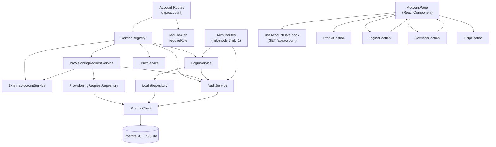

# Architecture Update — Sprint 003: Student Account Page — Self-Service View and Provisioning Requests

This document is a delta from the Sprint 002 architecture. Read the Sprint 001
initial architecture and Sprint 002 auth delta first for baseline definitions.

---

## What Changed

Sprint 003 delivers the first real student-facing screen and the provisioning
request workflow that administrators will act on in later sprints:

1. **ProvisioningRequestService fully implemented.** Sprint 001 left a stub
   with only `findPending` / `findByUser`. This sprint adds `create` (with
   the Claude-requires-League-email constraint), `approve` (seam for Sprint
   004), `reject` (seam for Sprint 004), and the constraint-enforcement logic.

2. **Account API routes** — a new route module `server/src/routes/account.ts`
   mounted at `/api/account`. Provides the aggregate data endpoint plus the
   login-remove and provisioning-request endpoints scoped to the signed-in user.

3. **Link-mode OAuth flow completed.** The Sprint 002 `?link=1` hook in
   `routes/auth.ts` is a stub that needs to attach a new Login to the current
   session user rather than creating a new user. This sprint makes it fully
   functional with audit logging.

4. **AccountPage React component** — replaces the template Account.tsx
   placeholder. Four sections: Profile, Logins, Services, Help.

5. **Staff redirect** — when a user with role=staff visits `/account`, the
   frontend redirects them to `/staff`.

---

## Why

Every subsequent sprint needs the provisioning request workflow to be in place:
Sprint 004 will add administrator approval, Sprint 005 will execute Claude seat
provisioning. Delivering the student-facing request surface now exercises the
data model end-to-end and gives administrators visibility into pending requests
as soon as Sprint 004 is live.

The Claude-requires-League-email constraint is specified explicitly in §4 and
§8.6. Enforcing it at the service layer (not only in the UI) is essential
because the rule is a data invariant, not a presentation choice.

---

## Module Diagram



---

## New Subsystems and Modules

### ProvisioningRequestService (fleshed out from Sprint 001 stub)

**File:** `server/src/services/provisioning-request.service.ts`

**Purpose:** Manages the lifecycle of provisioning requests from creation
through administrative decision.

**Boundary (inside):** Creating requests with constraint validation,
approving, rejecting, listing for a user, listing all pending (for admins).

**Boundary (outside):** Does not execute actual provisioning (that is Sprint
004+). Does not send notifications (seam left via a `notifyAdmin` hook that
is a no-op this sprint).

**Use cases served:** SUC-004, SUC-005.

**Methods added this sprint:**

```typescript
// Illustrative — not executable code
class ProvisioningRequestService {
  // Existing from Sprint 001 stub:
  async findPending(): Promise<ProvisioningRequest[]>
  async findByUser(userId: number): Promise<ProvisioningRequest[]>

  // New in Sprint 003:
  async create(
    userId: number,
    requestType: 'workspace' | 'workspace_and_claude',
    actorId: number
  ): Promise<ProvisioningRequest[]>
  // Returns one or two ProvisioningRequest rows depending on requestType.
  // Throws ConflictError (409) if a pending/active workspace request or
  // ExternalAccount already exists and requestType involves workspace.
  // Throws UnprocessableError (422) if requestType is 'claude' alone
  // (not supported — must use workspace_and_claude or wait for workspace
  //  to be pending/active first, then Claude alone is also disallowed
  //  unless workspace exists; see constraint below).
  // Claude-requires-League-email constraint: if requestType includes claude,
  // the service checks whether the user has a pending/active workspace
  // ExternalAccount OR a pending/approved workspace ProvisioningRequest.
  // If neither exists, throws UnprocessableError.
  // Records create_provisioning_request AuditEvent(s) atomically.

  async approve(
    requestId: number,
    deciderId: number
  ): Promise<ProvisioningRequest>
  // Seam for Sprint 004. Sets status=approved, decided_by, decided_at.
  // Records approve_provisioning_request AuditEvent.

  async reject(
    requestId: number,
    deciderId: number
  ): Promise<ProvisioningRequest>
  // Seam for Sprint 004. Sets status=rejected, decided_by, decided_at.
  // Records reject_provisioning_request AuditEvent.
}
```

**Claude-requires-League-email constraint (canonical rule):**

Before creating a claude ProvisioningRequest (whether requested as part of
`workspace_and_claude` or attempted standalone), the service checks:

1. Does the user have an ExternalAccount with type=workspace and
   status IN ('pending', 'active')? OR
2. Does the user have a ProvisioningRequest with requested_type=workspace
   and status IN ('pending', 'approved')?

If neither is true, the request is rejected with a 422 response.

This check runs inside the same `prisma.$transaction` as the write, so it
is race-condition-safe for the concurrent-request case.

---

### Account Routes

**File:** `server/src/routes/account.ts`

**Purpose:** Provides all endpoints scoped to the signed-in student's own
account. Every handler begins with `requireAuth` + `requireRole('student')`.

**Routes:**

| Method | Path | Description |
|---|---|---|
| GET | `/api/account` | Aggregate endpoint — returns profile, logins, externalAccounts, provisioningRequests |
| DELETE | `/api/account/logins/:id` | Remove a Login from the current user |
| POST | `/api/account/provisioning-requests` | Create one or two provisioning requests |
| GET | `/api/account/provisioning-requests` | List this user's provisioning requests |

**Role guard:** Every handler in this route module applies
`requireAuth` + `requireRole('student')`. Requests from users with role=staff
or role=admin return 403. Staff and admin users have their own views and
must not access the student self-service endpoints.

**GET /api/account response shape:**

```typescript
// Illustrative — not executable code
interface AccountData {
  profile: {
    id: number;
    displayName: string;
    primaryEmail: string;
    cohort: { id: number; name: string } | null;
    role: string;
    createdAt: string;
  };
  logins: Array<{
    id: number;
    provider: string;      // 'google' | 'github'
    providerEmail: string | null;
    providerUsername: string | null;
    createdAt: string;
  }>;
  externalAccounts: Array<{
    id: number;
    type: string;          // 'workspace' | 'claude' | 'pike13'
    status: string;        // 'pending' | 'active' | 'suspended' | 'removed'
    externalId: string | null;
    createdAt: string;
  }>;
  provisioningRequests: Array<{
    id: number;
    requestedType: string; // 'workspace' | 'claude'
    status: string;        // 'pending' | 'approved' | 'rejected'
    createdAt: string;
    decidedAt: string | null;
  }>;
}
```

This single endpoint is the data source for the entire AccountPage.
The frontend does one fetch on mount and re-fetches after mutations.

**POST /api/account/provisioning-requests request body:**

```typescript
// Illustrative — not executable code
interface CreateProvisioningRequestBody {
  requestType: 'workspace' | 'workspace_and_claude';
}
```

Note: `requestType: 'claude'` is not accepted (enforced in the service
layer with a 422 response that explains the League email requirement).

**DELETE /api/account/logins/:id — scope guard:**

The handler fetches the Login by id and confirms `login.user_id ===
req.session.userId`. If they differ, returns 404 (not 403, to avoid
information leakage about login IDs belonging to other users). This
keeps the scope guard consistent with the "never reveal cross-user data"
principle.

---

### Link-Mode OAuth Flow (completing Sprint 002 stub)

**Files modified:** `server/src/routes/auth.ts`,
`server/src/services/auth/sign-in.handler.ts`

**Purpose:** When a signed-in student clicks "Add Google" or "Add GitHub",
the browser hits `/api/auth/google?link=1` (or github). The OAuth callback
must attach the new Login to the current user rather than creating a new one.

**Flow:**

```
1. GET /api/auth/google?link=1
   — route saves { link: true, returnTo: '/account' } in session
   — redirects to Google OAuth

2. GET /api/auth/google/callback
   — Passport calls signInHandler (or a new linkHandler)
   — if session.link === true AND session.userId is set:
       a. Look up whether this provider_user_id is already attached to any user.
       b. If already attached to current user: redirect to /account (idempotent).
       c. If already attached to a DIFFERENT user: redirect to /account?error=already_linked.
       d. Otherwise: call LoginService.create({ userId: session.userId, ... })
          — records add_login AuditEvent atomically
          — redirect to /account
   — if session.link is NOT set: use normal sign-in handler (Sprint 002 path)
```

**Separation of concerns:** The link-mode logic is handled inside the auth
route (or a dedicated `link.handler.ts`), not inside the sprint's account
route. This keeps the account route free of OAuth mechanics.

**Safety constraint:** Link-mode must check that `req.session.userId` is set
before proceeding. If the session is absent, the `?link=1` parameter is
discarded and the normal sign-in flow runs (the user simply signs in).

---

### AccountPage React Component

**File:** `client/src/pages/Account.tsx` (replaces template stub)

**Purpose:** Student-facing account page with four sections. Replaces the
current Account.tsx which was built for the template's demo auth pattern.

**Data fetching approach:** The existing code uses a simple `fetch` + `useState`
pattern (see `useProviderStatus.ts`). React Query is already in `App.tsx`
(`@tanstack/react-query`). This sprint uses React Query's `useQuery` for the
main account data fetch, which provides automatic background refetching,
loading and error states, and cache invalidation after mutations. This is
consistent with the installed dependency and avoids adding a new pattern.

**Component structure:**

```
AccountPage
  useAccountData()            ← useQuery(['account'], fetchAccount)
  ProfileSection              ← profile.* fields
  LoginsSection               ← logins[], add buttons, remove buttons
    → links to /api/auth/[provider]?link=1 for Add
    → calls DELETE /api/account/logins/:id for Remove
  ServicesSection             ← externalAccounts[], provisioningRequests[]
    → POST /api/account/provisioning-requests for Request buttons
    → Claude seat request button conditionally rendered
  HelpSection                 ← mailto: or contact info
```

**State:** All mutable state is managed via React Query. After a mutation
(Login remove, provisioning request create), the component invalidates the
`['account']` query key to trigger a re-fetch. No local `useState` for
server-derived data.

**Loading and error states:**
- While `useQuery` is loading, each section shows a skeleton placeholder.
- On fetch error, a retry button appears with an error message.
- Mutation errors (e.g., 409 conflict, 422 constraint) are shown inline
  within the relevant section using a local error state per mutation.

**Staff redirect:** The component reads `user.role` from `AuthContext`. If
`user.role === 'staff'`, it renders `<Navigate to="/staff" replace />` before
fetching any account data.

---

## Audit Events Added (this sprint)

New call sites that record AuditEvents. All use the established pattern from
Sprint 001: caller owns the transaction; AuditService.record takes `tx`.

| Action string | When | Actor |
|---|---|---|
| `add_login` | Link-mode OAuth adds a new Login | Student (self) |
| `remove_login` | DELETE /api/account/logins/:id | Student (self) |
| `create_provisioning_request` | POST /api/account/provisioning-requests | Student (self) |
| `approve_provisioning_request` | Sprint 004 calls approve seam | Admin |
| `reject_provisioning_request` | Sprint 004 calls reject seam | Admin |

The `add_login` and `remove_login` action strings match the canonical strings
defined in the Sprint 001 architecture. `create_provisioning_request` also
matches Sprint 001's canonical table.

**Details payload for `create_provisioning_request`:**

```json
{
  "requestedType": "workspace",    // or "claude"
  "provisioningRequestId": 42
}
```

When two requests are created (workspace_and_claude), two AuditEvents are
written — one per ProvisioningRequest — inside the same transaction.

---

## Impact on Existing Components

### `server/src/routes/auth.ts`

The `?link=1` conditional branch is fleshed out. Previously a stub that fell
through to normal sign-in, now it:
- Detects `req.session.link === true` in the callback handler.
- Calls `LoginService.create` against `session.userId`.
- Clears the `link` session flag after use.
- Redirects to `/account` with an optional `?error=` query param on failure.

The normal sign-in path (no `?link=1`) is unchanged.

### `server/src/services/provisioning-request.service.ts`

The Sprint 001 stub (findPending, findByUser) is extended with `create`,
`approve`, and `reject`. The service now also takes `ExternalAccountService`
as a constructor dependency so it can check the League email constraint.

### `client/src/pages/Account.tsx`

Replaced wholesale. The template Account.tsx used `user.linkedProviders`,
`useProviderStatus`, and `/api/auth/unlink/:provider` (the template's
demo unlink endpoint). This sprint's AccountPage uses `/api/account` as
its data source and `DELETE /api/account/logins/:id` for removal. The
`/api/auth/unlink/:provider` template endpoint is not used by this page
and is not removed (it may serve other template demo purposes); it is
simply not wired into the new AccountPage. The `useProviderStatus` hook
is still used to determine which Add buttons to show.

### `client/src/App.tsx`

No structural changes. The `/account` route already points to
`client/src/pages/Account.tsx`. The `/staff` route (currently a 200 stub
from Sprint 002) is not changed by Sprint 003 — the student frontend simply
redirects there; the staff page content is Sprint 009.

---

## Migration Concerns

No schema changes in this sprint. All seven entity tables and all indexes
are as defined in Sprints 001 and 002.

One behavioural change to the existing auth routes (link-mode completion)
requires no migration but must be deployed atomically with the new account
routes so that the "Add provider" buttons and their callback destination are
consistent.

---

## Design Rationale

### Decision 1: Single Aggregate Endpoint (GET /api/account)

**Context:** The AccountPage needs profile, logins, external accounts, and
provisioning requests. These could be four separate endpoints or one.

**Alternatives:**
1. Four separate endpoints — `GET /api/account/profile`,
   `GET /api/account/logins`, etc.
2. One aggregate endpoint — `GET /api/account`.

**Choice:** Option 2.

**Why:** The page always needs all four pieces. Four round-trips on every
page load add latency and complicate loading-state coordination. A single
endpoint is served by a single service-layer call that composes four
repository reads inside one request. The payload size is small (no lists
are unbounded — a student has a small fixed number of logins, accounts, and
requests). This can be split later if the payload grows.

**Consequences:** The account route couples to four services (UserService,
LoginService, ExternalAccountService, ProvisioningRequestService). This is
acceptable: the coupling is explicit, read-only, and bounded to one route
handler.

---

### Decision 2: requestType=workspace_and_claude Rather Than Two Calls

**Context:** UC-007 Option B requests two provisioning records atomically.
The student could POST twice or POST once with a combined type.

**Alternatives:**
1. Two separate POST calls from the client.
2. Single POST with `requestType: 'workspace_and_claude'`.

**Choice:** Option 2.

**Why:** Option 1 requires the client to coordinate two requests and handle
partial failure (first succeeds, second fails). Option 2 keeps atomicity
at the service layer, which owns transactions. The server creates both
rows inside one `prisma.$transaction`, so they either both land or neither
does.

**Consequences:** The API surface has an unusual compound type string.
Client code is simpler. The type string `workspace_and_claude` is not stored
in the database — the service decomposes it into two separate
ProvisioningRequest rows with individual `requested_type` values.

---

### Decision 3: Link-Mode Logic in Auth Route, Not Account Route

**Context:** Adding a Login requires an OAuth round-trip, which means the
"add login" flow starts in the auth routes and ends at a callback URL,
before the account route can be involved.

**Choice:** Keep link-mode handling in `routes/auth.ts` (the existing callback
handlers). The account route provides only the data API and the remove endpoint.

**Why:** The callback URL is registered with the OAuth provider and cannot
be changed per-flow. Splitting the link flow across two route modules would
require cross-module session state coordination. Keeping it in the auth route
is the natural extension of what Sprint 002 stubbed.

**Consequences:** The account page's "Add provider" buttons are plain `<a>`
links to `/api/auth/[provider]?link=1`, not fetch calls. The page does not
call the account route for this action. The re-fetch after redirect is handled
by the React Query cache invalidation on page remount.

---

### Decision 4: React Query for Account Data Fetching

**Context:** The template Account.tsx uses bare `fetch` + `useState`. React
Query is already installed (used in App.tsx).

**Choice:** Use React Query's `useQuery` for the account data fetch and
`useMutation` (or manual invalidation) for mutations.

**Why:** React Query provides loading/error state management, automatic
refetching, and cache invalidation out of the box. Using it is consistent
with the installed dependency and avoids maintaining equivalent logic
manually with `useEffect` and `useState`.

**Consequences:** Account.tsx depends on the `QueryClientProvider` that is
already present in App.tsx. No new dependencies are added.

---

## Open Questions

**OQ-001: Administrator notification on provisioning request creation.**

UC-007 steps 5 and 6 mention "App notifies an administrator (method TBD in
build spec)." This sprint creates the ProvisioningRequest row but does not
send any notification. A `notifyAdmin` stub is called after the transaction
commits so Sprint 004 or later can implement it (email, webhook, or in-app
badge). The stakeholder should confirm the preferred notification channel
before Sprint 004 begins.

**OQ-002: What happens when the student who added a Login is currently
authenticated via that provider?**

If a student removes a Login that corresponds to the provider they used to
sign in this session, the session remains valid (session is keyed on userId,
not the Login). The student can still use the app and sign in next time with
any remaining Login. This is the intended behavior per the spec, but it should
be confirmed to avoid support confusion. Considered: forcing re-authentication
after removing the current-session provider — rejected as over-engineered for
this sprint.

**OQ-003: Can a student request a Claude seat alone after their workspace
request is approved but before provisioning is complete?**

The constraint check considers `ProvisioningRequest.status IN ('pending',
'approved')` as sufficient. An approved-but-not-yet-executed request means
the workspace is on its way. Allowing a Claude request at this point seems
correct (the administrator who approves workspace can then approve Claude
immediately after). Stakeholder should confirm this interpretation before
Sprint 004 implementation.

---

## What Is Explicitly NOT in This Sprint

- Administrator approval or rejection of provisioning requests (Sprint 004).
- Actual League Workspace account creation via Google Admin SDK (Sprint 004).
- Actual Claude Team seat provisioning via Claude Team API (Sprint 005).
- Pike13 write-back of GitHub handle when a Login is added (Sprint 006).
- Merge suggestion triggering on Login add (Sprint 007 — `mergeScan` stub
  is already wired from Sprint 002; no change needed here).
- Administrator-facing user directory or user detail view (Sprint 009).
- Staff directory page content at `/staff` (Sprint 009 — this sprint
  only adds a frontend redirect for staff users visiting `/account`).
- Profile field editing (not scheduled).
- Pike13 link from student account page (not in spec).
