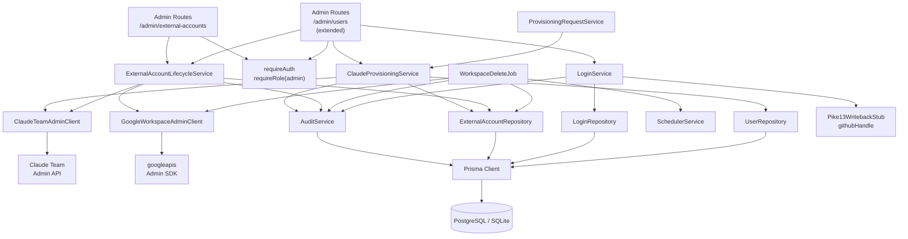
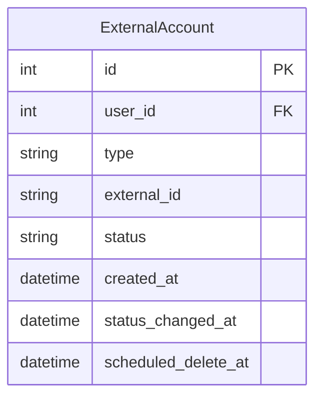

# Architecture Update — Sprint 005: Claude Team Integration — Seat Provisioning and Individual Lifecycle

This document is a delta from the Sprint 004 architecture. Read the Sprint 001
initial architecture and Sprint 002–004 update documents first for baseline
definitions.

---

## What Changed

Sprint 005 adds the Claude Team API client, wires the individual
suspend/remove lifecycle for both Workspace and Claude accounts, adds
admin-managed login operations, introduces the 3-day deferred deletion
mechanism for Workspace accounts, and connects the provisioning-request
approval path to Claude provisioning.

1. **`ClaudeTeamAdminClient`** — new API client module for the Claude Team
   admin API. Provides `inviteMember`, `suspendMember`, `removeMember`, and
   `listMembers`. Governed by a write-enable flag (`CLAUDE_TEAM_WRITE_ENABLED`)
   parallel to the pattern established in Sprint 004 for Google Workspace.

2. **`ClaudeProvisioningService`** — new service module that executes the
   complete Claude Team seat provisioning flow. Validates that an active
   workspace ExternalAccount exists for the user, calls
   `ClaudeTeamAdminClient.inviteMember`, creates the ExternalAccount row, and
   emits the audit event. Mirrors the `WorkspaceProvisioningService` pattern.

3. **`ExternalAccountLifecycleService`** — new service module responsible for
   suspend and remove operations on individual ExternalAccount records. Routes
   the API call to the appropriate client (Google or Claude) based on account
   type. Owns the 3-day scheduled-delete logic for Workspace removals. Emits
   audit events.

4. **`scheduled_delete_at` column on ExternalAccount** — new nullable
   `DateTime` column. Set to `now() + WORKSPACE_DELETE_DELAY_DAYS` (default 3)
   when a Workspace account is removed. Cleared after successful hard-delete.
   Requires a Prisma schema migration.

5. **`WorkspaceDeleteJob`** — a new scheduled job registered on the template's
   existing `SchedulerService` infrastructure. Runs on a configurable interval
   (default: every hour). Queries `ExternalAccount` records with type=workspace,
   status=removed, scheduled_delete_at <= now, and calls
   `GoogleWorkspaceAdminClient.deleteUser` for each. Records
   action=workspace_hard_delete audit events. Fails individually without
   stopping the batch.

6. **`ProvisioningRequestService.approve` — claude path wired** — Sprint 004
   left a TODO for claude approval. Sprint 005 fills it: when
   `requested_type === 'claude'`, `approve()` calls
   `ClaudeProvisioningService.provision(userId, deciderId, tx)` inside the same
   transaction.

7. **Admin External Account lifecycle routes** — new routes under
   `/admin/external-accounts/:id/`:
   - `POST .../suspend` — suspend the account
   - `POST .../remove` — remove the account (with scheduled-delete for workspace)

8. **Admin user deprovision route** — `POST /admin/users/:id/deprovision` —
   composite action: iterates over all active workspace and claude accounts for
   the user and calls `ExternalAccountLifecycleService` for each.

9. **Admin Login management routes** — new routes under `/admin/users/:id/`:
   - `POST .../logins` — add a Login on behalf of a user
   - `DELETE .../logins/:loginId` — remove a Login with last-login guard

10. **Pike13 write-back call site for GitHub Login add** — `pike13-writeback.stub.ts`
    extended with `githubHandle(userId, username)` no-op. Called by the admin
    login-add route when provider=github. Sprint 006 replaces the implementation.

11. **`FakeClaudeTeamAdminClient`** — in-memory fake for all integration tests
    that exercise `ClaudeProvisioningService` or `ExternalAccountLifecycleService`.

12. **New secrets/config:** `CLAUDE_TEAM_API_KEY`, `CLAUDE_TEAM_PRODUCT_ID`,
    `CLAUDE_TEAM_WRITE_ENABLED`, `WORKSPACE_DELETE_DELAY_DAYS` (optional,
    default 3).

---

## Why

The individual lifecycle surface (suspend, remove, deprovision) and the Claude
Team API integration share a common dependency on `ExternalAccountLifecycleService`
because both workspace and claude operations appear on the same admin user detail
view and drive the same ExternalAccount status machine. Splitting them would leave
the detail view half-functional.

The 3-day deferred deletion for Workspace accounts is a hard constraint from the
spec. It requires a persistent record of when the deletion should fire, which means
a schema column and a background job — both are simpler to build when the remove
flow is first implemented.

The Claude Team provisioning service mirrors `WorkspaceProvisioningService`
structurally because both have the same shape: validate preconditions, call external
API, create ExternalAccount, emit audit. A parallel structure reduces cognitive load
for implementers and reviewers.

---

## New Modules

### ClaudeTeamAdminClient

**File:** `server/src/services/claude-team/claude-team-admin.client.ts`

**Purpose:** All Claude Team admin API operations for this application — invite
member, suspend member, remove member, list members.

**Boundary (inside):** Loading API credentials, constructing HTTP requests to the
Claude Team admin API, enforcing the write-enable flag, translating API errors to
typed application errors.

**Boundary (outside):** No business logic, no Prisma calls, no transaction
management.

**Interface (not executable code):**

```typescript
interface ClaudeTeamAdminClient {
  inviteMember(params: InviteMemberParams): Promise<ClaudeTeamMember>;
  suspendMember(memberId: string): Promise<void>;
  removeMember(memberId: string): Promise<void>;
  listMembers(): Promise<ClaudeTeamMember[]>;
}

interface InviteMemberParams {
  email: string;  // must be the League Workspace address
}

interface ClaudeTeamMember {
  id: string;      // seat/member identifier
  email: string;
  status: 'active' | 'pending' | 'suspended';
}
```

**Typed errors thrown:**

| Error class | When |
|---|---|
| `ClaudeTeamWriteDisabledError` | Any mutating method called when CLAUDE_TEAM_WRITE_ENABLED is not "1" |
| `ClaudeTeamApiError` | API returns an HTTP error response |
| `ClaudeTeamMemberNotFoundError` | memberId does not exist in the team |

**Use cases served:** SUC-001, SUC-004, SUC-005.

---

### ClaudeProvisioningService

**File:** `server/src/services/claude-provisioning.service.ts`

**Purpose:** Executes the complete Claude Team seat provisioning flow for one
User, including precondition checks, API call, ExternalAccount creation, and
audit event.

**Boundary (inside):** Precondition validation, coordinating
`ClaudeTeamAdminClient`, `ExternalAccountRepository`, `AuditService`, and
`UserRepository`.

**Boundary (outside):** Does not manage the transaction boundary — the caller
passes a `tx`. Does not interact with ProvisioningRequest rows.

**Interface (not executable code):**

```typescript
class ClaudeProvisioningService {
  async provision(
    userId: number,
    actorId: number,
    tx: Prisma.TransactionClient
  ): Promise<ExternalAccount>
  // Validates: active workspace ExternalAccount exists, no active/pending claude account.
  // Calls ClaudeTeamAdminClient.inviteMember with workspace email.
  // Creates ExternalAccount(type=claude, status=active, external_id=member.id).
  // Calls AuditService.record(tx, { action: 'provision_claude', ... }).
}
```

**Use cases served:** SUC-001.

---

### ExternalAccountLifecycleService

**File:** `server/src/services/external-account-lifecycle.service.ts`

**Purpose:** Suspend and remove operations on individual ExternalAccount records,
including the 3-day deferred deletion mechanism for Workspace accounts.

**Boundary (inside):** Routing API calls by account type
(`GoogleWorkspaceAdminClient` for workspace, `ClaudeTeamAdminClient` for claude),
setting `scheduled_delete_at` on workspace removals, updating ExternalAccount
status, emitting audit events.

**Boundary (outside):** Does not manage the transaction boundary for individual
operations — the caller supplies a `tx`. Does not invoke the scheduler directly;
the scheduler reads `scheduled_delete_at` independently.

**Interface (not executable code):**

```typescript
class ExternalAccountLifecycleService {
  async suspend(
    accountId: number,
    actorId: number,
    tx: Prisma.TransactionClient
  ): Promise<ExternalAccount>
  // Routes to workspace or claude suspend based on account.type.
  // Updates status=suspended, status_changed_at=now.
  // Records audit event (suspend_workspace or suspend_claude).

  async remove(
    accountId: number,
    actorId: number,
    tx: Prisma.TransactionClient
  ): Promise<ExternalAccount>
  // For workspace: suspends if not suspended, sets scheduled_delete_at.
  // For claude: calls removeMember immediately.
  // Updates status=removed, status_changed_at=now.
  // Records audit event (remove_workspace or remove_claude).
}
```

**Use cases served:** SUC-004, SUC-005, SUC-006.

---

### WorkspaceDeleteJob

**File:** `server/src/jobs/workspace-delete.job.ts`

**Purpose:** Processes ExternalAccount records that have passed their deferred
deletion deadline, calling the Google Admin SDK to hard-delete each Workspace
account.

**Boundary (inside):** Querying eligible ExternalAccount records, calling
`GoogleWorkspaceAdminClient.deleteUser`, clearing `scheduled_delete_at`,
recording audit events. Registered on `SchedulerService`.

**Boundary (outside):** Does not update ExternalAccount.status (already
'removed'). Does not interact with ProvisioningRequest or other entities.

**Use cases served:** SUC-007 (scheduled deletion supporting UC-016/UC-017).

---

### FakeClaudeTeamAdminClient

**File:** `tests/server/helpers/fake-claude-team-admin.client.ts`

**Purpose:** In-memory implementation of `ClaudeTeamAdminClient` for use in all
integration tests. Records calls for assertion; returns configurable results;
never makes network calls.

**Boundary:** Test helper only. Not referenced by production code.

---

### Admin Routes — External Account Lifecycle

**File:** `server/src/routes/admin/external-accounts.ts`

**Purpose:** Suspend and remove individual ExternalAccounts.

**Routes:**

| Method | Path | Description |
|---|---|---|
| POST | `/admin/external-accounts/:id/suspend` | Suspend the account |
| POST | `/admin/external-accounts/:id/remove` | Remove the account |

All routes: `requireAuth` + `requireRole('admin')`.

---

### Admin Routes — User Deprovision and Login Management

Added to the existing `server/src/routes/admin/users.ts`:

| Method | Path | Description |
|---|---|---|
| POST | `/admin/users/:id/provision-claude` | Provision Claude seat for user |
| POST | `/admin/users/:id/deprovision` | Deprovision all accounts for departing student |
| POST | `/admin/users/:id/logins` | Add a Login on user's behalf |
| DELETE | `/admin/users/:id/logins/:loginId` | Remove a Login on user's behalf |

All routes: `requireAuth` + `requireRole('admin')`.

---

## Module Diagram



---

## Entity-Relationship Diagram — Data Model Change

Only the ExternalAccount entity changes in this sprint.



The new column `scheduled_delete_at` is nullable. It is set when
`ExternalAccount.type=workspace` and `status` transitions to `removed`. It is
cleared (set to null) after `WorkspaceDeleteJob` successfully calls
`deleteUser`. No other entities change.

---

## Impact on Existing Components

### `server/src/services/provisioning-request.service.ts`

`approve()` is extended: the existing TODO comment for the claude path is
replaced by a real call to `ClaudeProvisioningService.provision(userId,
deciderId, tx)` inside the same transaction. `ClaudeProvisioningService` is
injected as a constructor dependency alongside the existing
`WorkspaceProvisioningService`.

### `server/src/services/external-account.service.ts`

`ExternalAccountService.updateStatus` continues to exist as the pure
database-only status updater. `ExternalAccountLifecycleService` calls the
external APIs and then delegates the database write to
`ExternalAccountRepository` directly (following the same pattern as
`WorkspaceProvisioningService`). There is no coupling between the two services.

### `server/src/services/pike13-writeback.stub.ts`

Extended with a second no-op export: `githubHandle(userId, username)`. The
existing `leagueEmail` export is unchanged.

### `server/src/app.ts`

New admin routes mounted:
- `/admin/external-accounts` (new router from `external-accounts.ts`)

The existing `/admin/users` router is extended (same file, new endpoints).

### `client/src/pages/admin/` (admin user detail view)

The existing admin pages are extended to expose the new actions on the user
detail view:
- "Provision Claude Team Seat" button (with precondition tooltip).
- "Suspend" and "Remove" buttons on each ExternalAccount row (with confirmation dialogs).
- "Deprovision Student" button.
- "Add Login" and "Remove" on each Login row.

No new top-level React page is introduced; all new UI is within the existing
admin user detail view.

### `server/src/services/service.registry.ts`

Two new services registered: `ClaudeProvisioningService`,
`ExternalAccountLifecycleService`. `ProvisioningRequestService` constructor
updated to receive the new `ClaudeProvisioningService` dependency.

---

## Migration Concerns

### Schema migration required

A new Prisma migration must add `scheduled_delete_at DateTime?` to
`ExternalAccount`. This is backward-compatible: the column is nullable and
defaults to null for all existing rows. No data backfill needed.

### Operational prerequisites

1. `CLAUDE_TEAM_API_KEY` and `CLAUDE_TEAM_PRODUCT_ID` must be set in production
   before any Claude provisioning routes can succeed.
2. `CLAUDE_TEAM_WRITE_ENABLED=1` must be set explicitly to allow mutating API
   calls (same pattern as `GOOGLE_WORKSPACE_WRITE_ENABLED`).
3. `WORKSPACE_DELETE_DELAY_DAYS` is optional; defaults to 3. Can be set to a
   smaller value in staging environments for testing.

---

## Design Rationale

### Decision 1: ExternalAccountLifecycleService as a Separate Module

**Context:** The suspend/remove logic could be added directly to
`ExternalAccountService` or distributed across the route handlers.

**Alternatives:**
1. Add suspend/remove methods to `ExternalAccountService`.
2. Inline API calls in route handlers.
3. New `ExternalAccountLifecycleService`.

**Choice:** Option 3.

**Why:** `ExternalAccountService` is a CRUD service — it manipulates rows.
Lifecycle operations call external APIs and coordinate multiple writes inside a
transaction. The cohesion test: "ExternalAccountService manages ExternalAccount
rows; ExternalAccountLifecycleService manages the external API + status
transition." Each purpose is describable in one sentence. Option 2 puts business
logic in routes, violating the established layering convention.

**Consequences:** One more module. The route handlers become thin (call one
service method, return the result).

---

### Decision 2: ClaudeProvisioningService Mirrors WorkspaceProvisioningService

**Context:** Sprint 004 established `WorkspaceProvisioningService` with a
specific shape. Claude provisioning has the same shape.

**Alternatives:**
1. Mirror the shape exactly in a new `ClaudeProvisioningService`.
2. Generalize into a single `ProvisioningService` with a type discriminator.

**Choice:** Option 1.

**Why:** Option 2 would require the generalized service to branch on account type
throughout, coupling Google and Claude logic in one module. Each provisioning
service is independently testable, independently injectable, and independently
replaceable. The shared shape is a coincidence of the domain, not a reason to
merge.

**Consequences:** Two provisioning services exist. Both are injected into
`ProvisioningRequestService`.

---

### Decision 3: scheduled_delete_at on ExternalAccount, not a Separate ScheduledJob Table

**Context:** The template has a `ScheduledJob` table for persisting scheduled
work. Sprint 001 architecture mentions it. We could store deferred workspace
deletions there.

**Alternatives:**
1. Use the existing `ScheduledJob` table (or a job queue pattern).
2. Add `scheduled_delete_at` directly to `ExternalAccount`.

**Choice:** Option 2.

**Why:** The deletion job needs only one query: `WHERE type=workspace AND
status=removed AND scheduled_delete_at <= now()`. This is directly expressible
against the ExternalAccount table without a join. The ScheduledJob table is
designed for general-purpose background work, not for per-entity deferred
actions. A column on the entity is simpler, directly queryable, and visible in
the admin detail view without a secondary lookup.

**Consequences:** The ExternalAccount table gains one nullable column. The
WorkspaceDeleteJob queries ExternalAccount directly.

---

### Decision 4: Fail-Soft Deprovision Composite

**Context:** UC-017 deprovision may touch multiple external accounts. An API
failure on one account should not block removal of others.

**Alternatives:**
1. Abort on first failure (atomic composite).
2. Collect failures and continue (fail-soft).

**Choice:** Option 2 (fail-soft).

**Why:** UC-017 error flow explicitly states: "each is handled per UC-016 error
flow." If the Claude API fails but the Workspace API succeeds, the administrator
needs to know about the Claude failure without losing the Workspace removal.
Atomic rollback would revert work that succeeded — worse than partial completion
when the action is removal.

**Consequences:** The deprovision endpoint returns a structured response listing
successes and failures. The route handler must collect results rather than
propagating the first error.

---

## Open Questions

**OQ-001: Claude Team API invite semantics.**

The Claude Team admin API may return `status=pending` (invitation sent, not yet
accepted) rather than `status=active` on `inviteMember`. If so, the
ExternalAccount should be created with `status=pending`. The spec (UC-006
postconditions) allows either state. The implementer should inspect the actual
API response and choose accordingly. If the API consistently returns `active` for
invited users (pre-accepting on behalf of the user), `status=active` is correct.

**OQ-002: Claude Team API credentials format.**

The exact credential format for the Claude Team admin API (API key + team
product ID, or a different scheme) must be confirmed against the API
documentation before the client module is implemented. The env var names
`CLAUDE_TEAM_API_KEY` and `CLAUDE_TEAM_PRODUCT_ID` are placeholders.

**OQ-003: suspend semantics for Claude seats.**

It is unclear whether the Claude Team admin API supports a "suspend" operation
as distinct from "remove." If suspend is not supported, `ClaudeTeamAdminClient`
should map the suspend call to a no-op (or omit the method) and the admin UI
should not show a "Suspend" button for claude accounts. The UC-015 acceptance
criteria for claude suspend should be adjusted accordingly at implementation time.
