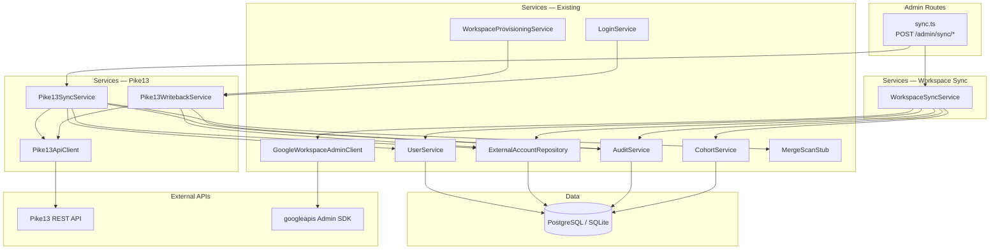
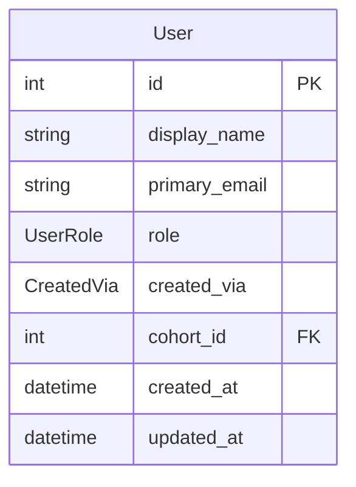

# Architecture Update — Sprint 006: External Source Sync — Pike13 and Google Workspace

This document is a delta from the Sprint 005 architecture. Read the Sprint 001
initial architecture and the Sprint 002–005 update documents first for baseline
definitions.

---

## What Changed

Sprint 006 delivers three epics that share a common "external source → app"
sync pattern:

1. **`Pike13ApiClient`** — new API client module. Paginates Pike13 person
   records, reads person details, and updates custom fields. Governed by a
   write-enable flag (`PIKE13_WRITE_ENABLED`) matching the pattern established
   in Sprint 004 for Google Workspace.

2. **`Pike13SyncService`** — new service module. Executes the full Pike13 sync
   flow: paginate via `Pike13ApiClient`, match/upsert Users and
   ExternalAccount(type=pike13) rows, invoke the merge similarity stub for each
   new User, and return a count report. Emits audit events.

3. **`Pike13WritebackService`** — new service module. Replaces
   `pike13-writeback.stub.ts` wholesale at the same import path. Implements the
   two public functions (`leagueEmail`, `githubHandle`) as real Pike13 API
   calls routed through `Pike13ApiClient`. Called by the existing
   `WorkspaceProvisioningService` and the admin login-add route (no call-site
   changes required).

4. **`GoogleWorkspaceAdminClient.listOUs`** — new read method added to the
   existing client. Wraps `directory.orgunits.list` filtered to the specified
   parent path. `listUsersInOU` already exists. This is a read-only method;
   no write-enable flag check.

5. **`WorkspaceSyncService`** — new service module. Provides four methods:
   `syncCohorts`, `syncStaff`, `syncStudents`, `syncAll`. Uses
   `GoogleWorkspaceAdminClient` for all reads; uses `CohortService`,
   `UserService`, `ExternalAccountRepository`, and `AuditService` for writes.

6. **`CohortService.upsertByOUPath`** — new method on the existing
   `CohortService`. Creates or updates a Cohort row by `google_ou_path`. Does
   NOT call `GoogleWorkspaceAdminClient.createOU` — used only by
   `WorkspaceSyncService` when the OU already exists in Workspace.

7. **`CreatedVia` enum extended** — new value `workspace_sync` added to the
   Prisma `CreatedVia` enum. Requires a schema migration.

8. **Admin Sync routes** — new router `server/src/routes/admin/sync.ts`:
   - `POST /admin/sync/pike13`
   - `POST /admin/sync/workspace/cohorts`
   - `POST /admin/sync/workspace/staff`
   - `POST /admin/sync/workspace/students`
   - `POST /admin/sync/workspace/all`

9. **Admin Sync UI** — new React page `client/src/pages/admin/SyncPanel.tsx`.
   Five buttons (one per sync action), a result panel showing counts
   (created/updated/unchanged/flagged), and a flagged-for-review list for
   Workspace sync. Wired into `App.tsx` and `AppLayout.tsx` ADMIN_NAV.

10. **`FakeGoogleWorkspaceAdminClient` extended** — fake gains a `listOUs`
    method for use in integration tests of `WorkspaceSyncService`.

11. **New secrets/config:** `PIKE13_API_URL`, `PIKE13_API_KEY`,
    `PIKE13_WRITE_ENABLED`, `PIKE13_CUSTOM_FIELD_GITHUB_ID`,
    `PIKE13_CUSTOM_FIELD_EMAIL_ID`.

---

## Why

Pike13 and Google Workspace sync share the same architectural pattern:
paginate an external source, match against local Users by email or external ID,
upsert rows, flag removals, emit audit events, return a count report. Delivering
both in one sprint allows a single admin Sync page, a single sync-route module,
and a consistent count-report shape — avoiding two parallel partial
implementations.

The `Pike13WritebackService` replaces the stub wholesale at the same import
path because `WorkspaceProvisioningService` and the login-add route already
call the stub. No call-site changes are needed; the stub is simply removed and
replaced with a real module exporting the same two functions.

`CohortService.upsertByOUPath` is added as a distinct method rather than
reusing `createWithOU` because the sync case must not create a Google OU (one
already exists). Separating the two methods makes the "no OU creation" invariant
explicit and testable.

---

## New Modules

### Pike13ApiClient

**File:** `server/src/services/pike13/pike13-api.client.ts`

**Purpose:** All Pike13 API operations for this application — paginate people,
read person details, update custom fields.

**Boundary (inside):** Loading API credentials from env vars, constructing HTTP
requests to the Pike13 REST API, enforcing the write-enable flag, translating
HTTP errors to typed application errors.

**Boundary (outside):** No business logic, no Prisma calls, no transaction
management.

**Interface:**

```typescript
interface Pike13ApiClient {
  listPeople(cursor?: string): Promise<Pike13PeoplePage>;
  getPerson(personId: string): Promise<Pike13Person>;
  updateCustomField(personId: string, fieldId: string, value: string): Promise<void>;
}

interface Pike13PeoplePage {
  people: Pike13Person[];
  nextCursor: string | null;
}

interface Pike13Person {
  id: string;
  first_name: string;
  last_name: string;
  email: string | null;
  custom_fields: Record<string, string>;
}
```

**Typed errors thrown:**

| Error class | When |
|---|---|
| `Pike13WriteDisabledError` | `updateCustomField` called when `PIKE13_WRITE_ENABLED !== '1'` |
| `Pike13ApiError` | API returns an HTTP error response |
| `Pike13PersonNotFoundError` | Person ID does not exist |

**Use cases served:** UC-004, UC-020.

---

### Pike13SyncService

**File:** `server/src/services/pike13/pike13-sync.service.ts`

**Purpose:** Executes the full Pike13 people sync: paginate, match/upsert Users
and ExternalAccounts, run merge scan stub for new Users, emit audit events.

**Boundary (inside):** Pagination loop, email/ID matching against existing Users,
User creation logic, ExternalAccount creation, merge scan invocation, count
accumulation, audit event emission.

**Boundary (outside):** Does not call Pike13 write operations. Does not manage
the transaction boundary for individual upserts — each upsert is its own
database write (no atomic rollback of a partial sync).

**Interface:**

```typescript
interface SyncReport {
  created: number;
  matched: number;
  skipped: number;
  errors: number;
  errorDetails: string[];
}

class Pike13SyncService {
  async sync(): Promise<SyncReport>
}
```

**Use cases served:** UC-004.

---

### Pike13WritebackService

**File:** `server/src/services/pike13/pike13-writeback.service.ts`
*(replaces `server/src/services/pike13-writeback.stub.ts`)*

**Purpose:** Writes League email address and GitHub username back to Pike13
custom fields on a user's Pike13 person record.

**Boundary (inside):** Looking up the user's Pike13 ExternalAccount,
calling `Pike13ApiClient.updateCustomField` for the appropriate field ID,
emitting audit events.

**Boundary (outside):** Never throws on Pike13 API failure (catches and logs
instead, so the primary action is not rolled back). Does not manage transaction
boundaries.

**Interface (matching existing stub):**

```typescript
export async function leagueEmail(userId: number, email: string): Promise<void>
export async function githubHandle(userId: number, handle: string): Promise<void>
```

The import path used by existing callers changes from
`./pike13-writeback.stub` to `./pike13/pike13-writeback.service`. All call
sites must be updated to the new path.

**Use cases served:** UC-020.

---

### WorkspaceSyncService

**File:** `server/src/services/workspace-sync.service.ts`

**Purpose:** Reads the Google Workspace OU tree and user lists to upsert Cohort
and User rows in the application database.

**Boundary (inside):** Calling `GoogleWorkspaceAdminClient.listOUs` and
`listUsersInOU`, matching against existing Cohort and User rows by
`google_ou_path` and `primary_email`, creating/updating rows via
`CohortService.upsertByOUPath` and `UserService`, flagging removed
ExternalAccounts via `ExternalAccountRepository`, emitting audit events.

**Boundary (outside):** Never calls write methods on `GoogleWorkspaceAdminClient`
(no OU creation, no user creation in Workspace). Does not manage transaction
boundaries across sub-operations — each upsert is independent.

**Interface:**

```typescript
interface WorkspaceSyncReport {
  cohorts?: { created: number; updated: number; unchanged: number };
  staff?: { created: number; updated: number; unchanged: number };
  students?: { created: number; updated: number; unchanged: number; flagged: number };
  flaggedAccounts?: FlaggedAccount[];
  errors?: string[];
}

interface FlaggedAccount {
  userId: number;
  email: string;
  reason: string;
}

class WorkspaceSyncService {
  async syncCohorts(): Promise<WorkspaceSyncReport>
  async syncStaff(): Promise<WorkspaceSyncReport>
  async syncStudents(): Promise<WorkspaceSyncReport>
  async syncAll(): Promise<WorkspaceSyncReport>
}
```

**Use cases served:** SUC-001, SUC-002, SUC-003, SUC-004.

---

### Admin Routes — Sync

**File:** `server/src/routes/admin/sync.ts`

**Purpose:** Expose admin-triggered sync actions as POST endpoints.

**Routes:**

| Method | Path | Description |
|---|---|---|
| POST | `/admin/sync/pike13` | Trigger Pike13 people sync |
| POST | `/admin/sync/workspace/cohorts` | Sync Google OUs → Cohorts |
| POST | `/admin/sync/workspace/staff` | Sync staff OU → Users |
| POST | `/admin/sync/workspace/students` | Sync student OUs → Users |
| POST | `/admin/sync/workspace/all` | Run all workspace sync operations |

All routes: `requireAuth` + `requireRole('admin')`.

All routes return HTTP 200 with a `SyncReport` or `WorkspaceSyncReport` JSON
body on success. The response is always returned even if some records errored
(partial success is surfaced in the report).

---

### SyncPanel (Admin UI)

**File:** `client/src/pages/admin/SyncPanel.tsx`

**Purpose:** Admin page providing buttons for each sync action plus a result
panel showing counts and the flagged-for-review list.

**Layout:**
- Five action buttons: "Sync Pike13 People", "Sync Cohorts", "Sync Staff",
  "Sync Students", "Sync All Workspace"
- Spinner/loading state during each async POST
- Result panel: created / updated / unchanged / flagged counts per operation
- Flagged accounts list: email + reason for each ExternalAccount flagged removed

Wired into `client/src/App.tsx` at `/admin/sync` and added to the `ADMIN_NAV`
array in `client/src/components/AppLayout.tsx`.

---

## Module Diagram



---

## Entity-Relationship Diagram — Data Model Change

Only the `CreatedVia` enum changes.



`CreatedVia` gains the value `workspace_sync` alongside the existing values
`social_login`, `pike13_sync`, `admin_created`. This is an additive change;
existing rows are unaffected. One Prisma migration is required.

---

## Impact on Existing Components

### `server/src/services/pike13-writeback.stub.ts`

Removed. Replaced by `server/src/services/pike13/pike13-writeback.service.ts`
which exports the same two function signatures. All call sites (two of them:
`WorkspaceProvisioningService` and the admin user-logins route) must update
their import path. No logic change at the call site.

### `server/src/services/google-workspace/google-workspace-admin.client.ts`

Extended with a new `listOUs(parentPath: string): Promise<WorkspaceOU[]>` read
method. The method wraps `directory.orgunits.list`. No existing methods change.
The `FakeGoogleWorkspaceAdminClient` gains the corresponding fake method.

The `GoogleWorkspaceAdminClient` interface gains one new type:

```typescript
interface WorkspaceOU {
  name: string;
  orgUnitPath: string;
}
```

### `server/src/services/cohort.service.ts`

Extended with `upsertByOUPath(ouPath: string, name: string): Promise<Cohort>`.
Uses Prisma `upsert` keyed on `google_ou_path`. Creates a Cohort row without
calling `GoogleWorkspaceAdminClient.createOU`. The existing `createWithOU`
method is unchanged.

### `server/src/services/service.registry.ts`

Two new services registered: `Pike13SyncService`, `WorkspaceSyncService`.
`Pike13ApiClient` is instantiated within `Pike13SyncService` and
`Pike13WritebackService` (not exposed directly on the registry — it is an
implementation detail of the pike13 services).

### `server/src/app.ts`

New admin router mounted: `/admin/sync` (from `routes/admin/sync.ts`).

### `client/src/App.tsx`

New admin route added: `/admin/sync` → `SyncPanel`.

### `client/src/components/AppLayout.tsx`

`ADMIN_NAV` array updated to include `{ label: 'Sync', path: '/admin/sync' }`.

### `server/prisma/schema.prisma`

`CreatedVia` enum: add `workspace_sync` value.

---

## Migration Concerns

### Schema migration required

One migration: add `workspace_sync` to `CreatedVia` enum.

For SQLite (dev): the migration alters the enum definition. In practice, SQLite
enums are stored as text; the migration adds the allowed value to the Prisma
schema and regenerates the client. In production (PostgreSQL), `ALTER TYPE
CreatedVia ADD VALUE 'workspace_sync'` is idempotent and backward-compatible.
No existing rows are affected.

### Import path change for Pike13 write-back callers

Two files import from `pike13-writeback.stub`:
1. `server/src/services/workspace-provisioning.service.ts`
2. `server/src/routes/admin/user-logins.ts`

Both must update their import to the new path. This is a mechanical change;
the function signatures are identical.

### Deployment prerequisites

1. Pike13 custom fields "GitHub Username" and "League Email Address" must be
   pre-created in Pike13 before write-back can succeed.
2. `PIKE13_API_URL`, `PIKE13_API_KEY`, and the two custom field ID vars must be
   set before Pike13 sync or write-back routes can succeed.
3. `PIKE13_WRITE_ENABLED=1` must be explicitly set to allow write-back calls.
4. `GOOGLE_STAFF_OU_PATH` must be set in `.env` to enable staff sync (the
   Sprint 004 default `/League Staff` applies if set; absent = skip staff sync).

---

## Design Rationale

### Decision 1: Pike13WritebackService Replaces Stub at Same Export Shape

**Context:** `pike13-writeback.stub.ts` exports `leagueEmail` and `githubHandle`
as module-level functions (not a class). Two call sites exist. The stub was
explicitly designed to be replaced wholesale (Sprint 004 architecture, Decision 4).

**Alternatives:**
1. Replace stub with a service class and inject it at call sites.
2. Keep the module-function pattern; replace the module body.

**Choice:** Option 2.

**Why:** Changing from module functions to a class injection point requires
touching `WorkspaceProvisioningService`, the login route, and `ServiceRegistry`.
The stub pattern was chosen precisely to avoid call-site changes. The cohesion
test passes: "Pike13WritebackService writes League email and GitHub handle to
Pike13." The import path change is the only disruption.

**Consequences:** The module is not injectable in the constructor-dependency
style. Integration tests must use a mock module (Jest module mocking) rather
than constructor injection. This is an accepted trade-off given the explicitly
designed seam.

---

### Decision 2: WorkspaceSyncService Does Not Create ExternalAccount Rows

**Context:** The sync TODO explicitly specifies "no auto-creation of
ExternalAccount rows on user sync." When syncing students, the app creates User
rows but does not create ExternalAccount(type=workspace) rows.

**Alternatives:**
1. Create ExternalAccount(type=workspace) rows during sync, linking the user to
   their Workspace identity.
2. Create User rows only; leave ExternalAccount creation to the admin
   provisioning flow.

**Choice:** Option 2.

**Why:** The sync reads Google's OU structure to reconstruct the app's user
list. It is not a provisioning operation. A user appearing in a Workspace OU
does not imply the app has provisioned their account — the account was created
outside this app. Creating ExternalAccount rows would blur the line between
"this app provisioned this account" and "this account exists in Workspace."
Administrators can provision from the user detail view after sync completes.

**Consequences:** After a Workspace sync, the admin will see new User rows in
the Users list but those users will have no Workspace ExternalAccount. The admin
must visit each user to provision (or use cohort bulk provisioning) if they want
app-managed accounts. This is the correct semantic for an "import" operation.

---

### Decision 3: Flag-Only Removal with ExternalAccount Status Change

**Context:** When a Workspace sync runs and a user no longer appears in any OU,
something must happen to indicate their Workspace account may be gone.

**Alternatives:**
1. Silently do nothing.
2. Flag the ExternalAccount as removed; emit audit event; never delete User row.
3. Automatically deprovision (call Google to suspend).

**Choice:** Option 2.

**Why:** Option 1 leaves stale data silently. Option 3 is destructive —
automated account suspension based on a sync reading is too dangerous (false
positives from Google API errors, temporary OU moves). Flag-only gives the
administrator visibility without irreversible action. The spec is explicit:
"never destructively delete User rows." ExternalAccount status=removed is the
appropriate flag for "this account may no longer exist in the external system."

**Consequences:** Administrators must check the flagged list after each sync and
decide whether to take action. The sync result panel surfaces the list.

---

### Decision 4: Pike13 Custom Field IDs via Environment Variables

**Context:** Pike13 custom fields have numeric IDs that differ between Pike13
environments (e.g., dev vs. production). The IDs for "GitHub Username" and
"League Email Address" are not discoverable without an API call.

**Alternatives:**
1. Hard-code the field IDs (brittle across environments).
2. Discover IDs by name on first use (adds latency and an extra API call).
3. Require IDs in env vars (`PIKE13_CUSTOM_FIELD_GITHUB_ID`,
   `PIKE13_CUSTOM_FIELD_EMAIL_ID`).

**Choice:** Option 3.

**Why:** Discovery adds complexity without benefit once the IDs are known. The
IDs are stable per environment. Env vars are the established pattern for
environment-specific integration configuration in this codebase.

**Consequences:** Operators must look up and configure the two field IDs before
write-back can succeed. This is documented as a deployment prerequisite.

---

## Open Questions

**OQ-001: Pike13 API pagination mechanism.**
The Pike13 REST API pagination style (offset, cursor, or page-number) must be
confirmed before implementing `Pike13ApiClient.listPeople`. The client interface
uses a cursor pattern as a placeholder; the implementation should match the
actual API.

**OQ-002: Pike13 authentication scheme.**
The exact authentication scheme (API key in header, OAuth token, or another
mechanism) must be confirmed from Pike13 API documentation. The env var name
`PIKE13_API_KEY` is a placeholder.

**OQ-003: Flagged-account review UI scope.**
The sync result panel shows flagged ExternalAccounts for the current sync run
only (transient). A future sprint may want a persistent "flagged accounts" list
visible outside the sync page. This is deferred.
