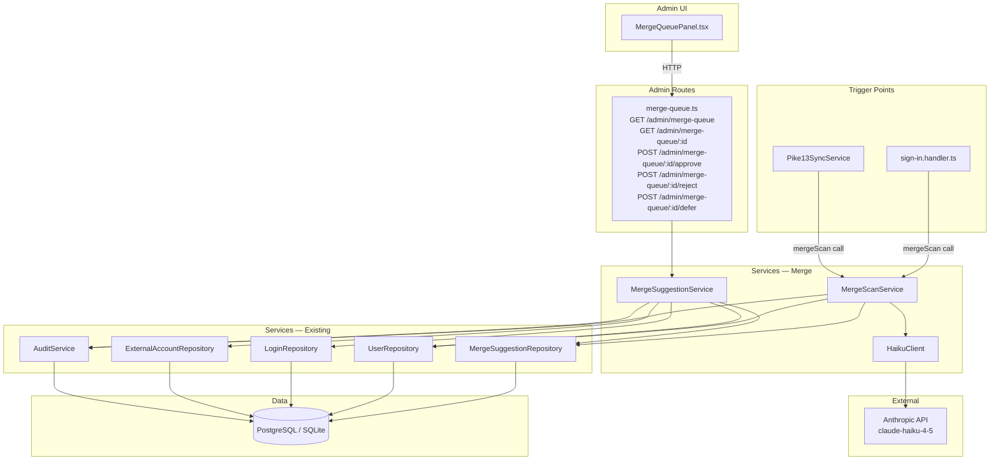
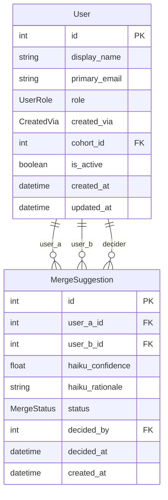

# Architecture Update — Sprint 007: Merge Suggestions — Haiku Scanner and Admin Merge Queue

This document is a delta from the Sprint 006 architecture. Read the Sprint 001
initial architecture and Sprint 002–006 update documents first for baseline
definitions.

---

## What Changed

Sprint 007 delivers two cohesive capabilities:

1. **`HaikuClient`** — new module. Thin wrapper around the Anthropic SDK
   for similarity-evaluation prompts. Accepts two User records, constructs
   a structured comparison prompt, calls `claude-haiku-4-5`, and returns a
   typed `{ confidence: number; rationale: string }` result.

2. **`MergeScanService`** — new module. Replaces `merge-scan.stub.ts` wholesale
   at the same import path (`server/src/services/auth/merge-scan.stub.ts` →
   `server/src/services/auth/merge-scan.service.ts` re-exported from the same
   path). Loads the candidate pool, calls `HaikuClient` per pair, writes
   `MergeSuggestion` records and audit events for pairs scoring >= threshold.
   Failure is non-fatal to User creation.

3. **`MergeSuggestionService` extended** — the existing stub service gains
   three new methods: `approve(id, survivorId, actorId)`,
   `reject(id, actorId)`, and `defer(id)`. The approve method executes
   a transactional merge: re-parents Logins and ExternalAccounts, deactivates
   the non-survivor, updates the suggestion status, and writes the audit event.

4. **Admin merge-queue routes** — new router
   `server/src/routes/admin/merge-queue.ts`:
   - `GET /admin/merge-queue` — list pending + deferred suggestions with user data.
   - `GET /admin/merge-queue/:id` — single suggestion detail with full user records.
   - `POST /admin/merge-queue/:id/approve` — approve with `{ survivorId }`.
   - `POST /admin/merge-queue/:id/reject` — reject.
   - `POST /admin/merge-queue/:id/defer` — defer.

5. **`MergeQueuePanel.tsx`** — new admin React page. Renders the merge queue
   list at `/admin/merge-queue` and a detail view (inline or sub-route) for
   side-by-side comparison plus Approve / Reject / Defer actions.

6. **`User.is_active` field** — new boolean field added to the `User` model
   (`@default(true)`). Set to `false` on the non-survivor during approve.
   All existing user listing queries are updated to filter `is_active=true`
   by default.

7. **`ServiceRegistry`** updated — `MergeScanService` is injected into
   `Pike13SyncService` and `SignInHandler` in place of the stub. The
   `MergeSuggestionService` constructor receives the updated implementation.

---

## Why

Sprint 006 (Pike13 sync) is the primary duplicate source in production — a
student signs in via GitHub, then the Pike13 sync creates a second record from
their Pike13 person entry. The merge workflow is most useful immediately after
Pike13 sync is delivered. Delivering UC-018 and UC-019 together means both
features are available as a complete workflow.

The stub-replacement pattern is intentional: `merge-scan.stub.ts` was designed
in Sprint 002 architecture to be replaced wholesale at the same import path.
No call-site changes in `sign-in.handler.ts` or `pike13-sync.service.ts` are
required.

`HaikuClient` is a distinct module from `MergeScanService` because the API
mechanics (authentication, retries, response parsing) change independently from
the scan orchestration logic (candidate loading, threshold application,
persistence). Keeping them separate also makes unit testing straightforward —
`MergeScanService` tests inject a fake `HaikuClient`.

---

## New Modules

### HaikuClient

**File:** `server/src/services/merge/haiku.client.ts`

**Purpose:** All Anthropic API interaction for merge-similarity evaluation.
Constructs the comparison prompt, calls `claude-haiku-4-5`, and parses the
structured JSON response.

**Boundary (inside):** Prompt construction, Anthropic SDK instantiation,
request parameters (model, max tokens, temperature), JSON response parsing,
typed error wrapping.

**Boundary (outside):** No Prisma calls, no business logic, no threshold
decisions.

**Interface:**

```typescript
interface UserSnapshot {
  id: number;
  display_name: string;
  primary_email: string;
  pike13_id?: string | null;
  cohort_name?: string | null;
  created_via: string;
  created_at: Date;
}

interface HaikuSimilarityResult {
  confidence: number;   // 0.0 – 1.0
  rationale: string;    // short human-readable explanation
}

class HaikuClient {
  constructor(apiKey: string)
  async evaluate(userA: UserSnapshot, userB: UserSnapshot): Promise<HaikuSimilarityResult>
}
```

**Typed errors thrown:**

| Error class | When |
|---|---|
| `HaikuApiError` | Anthropic SDK throws or returns a non-2xx status |
| `HaikuParseError` | Response body is not valid JSON or missing required fields |

**Use cases served:** SUC-007-001 (UC-018)

---

### MergeScanService

**File:** `server/src/services/auth/merge-scan.service.ts`
*(replaces `server/src/services/auth/merge-scan.stub.ts`)*

**Purpose:** Runs the Haiku similarity scan for a newly created user. Loads
candidates, calls `HaikuClient` for each pair, persists suggestions above the
confidence threshold, and emits audit events. Non-fatal to user creation.

**Boundary (inside):** Candidate pool loading, per-pair scan loop, threshold
comparison, `MergeSuggestionRepository.create` calls, audit event emission,
error catch-and-log.

**Boundary (outside):** Does not own the User creation transaction. Does not
modify any User records. Does not call any external API other than via
`HaikuClient`.

**Interface (matching existing stub):**

```typescript
export async function mergeScan(user: User): Promise<void>
```

The export shape is identical to the stub. All existing call sites
(`sign-in.handler.ts`, `pike13-sync.service.ts`) continue to work without
modification. The `ServiceRegistry` continues to import `mergeScan` from
`./auth/merge-scan.stub` — the stub file is updated to re-export from
`merge-scan.service.ts`, or the stub file is replaced and `ServiceRegistry`
updated to point to the service path directly (see Migration Concerns).

**Configuration read from environment:**

| Env var | Default | Purpose |
|---|---|---|
| `ANTHROPIC_API_KEY` | (required) | Passed to `HaikuClient` |
| `MERGE_SCAN_CONFIDENCE_THRESHOLD` | `0.6` | Pairs below this are discarded |

**Use cases served:** SUC-007-001 (UC-018)

---

### MergeSuggestionService — Extended Methods

**File:** `server/src/services/merge-suggestion.service.ts` (existing, extended)

**New methods added:**

```typescript
class MergeSuggestionService {
  // Existing:
  async findPending(): Promise<MergeSuggestion[]>
  async findByPair(userAId: number, userBId: number): Promise<MergeSuggestion | null>

  // New:
  async findQueueItems(): Promise<MergeSuggestionWithUsers[]>  // pending + deferred
  async findDetailById(id: number): Promise<MergeSuggestionDetail | null>
  async approve(id: number, survivorId: number, actorId: number): Promise<void>
  async reject(id: number, actorId: number): Promise<void>
  async defer(id: number): Promise<void>
}
```

The `approve` method executes a single Prisma interactive transaction:
1. Load the suggestion; verify it is pending or deferred.
2. Determine non-survivor = the user that is not `survivorId`.
3. Re-parent all Logins: `UPDATE login SET user_id = survivorId WHERE user_id = nonSurvivorId`.
4. Re-parent all ExternalAccounts: same pattern.
5. Cohort inheritance: if survivor has no cohort and non-survivor does, copy cohort.
6. Deactivate non-survivor: `UPDATE user SET is_active = false WHERE id = nonSurvivorId`.
7. Update MergeSuggestion: `status=approved, decided_by=actorId, decided_at=now()`.
8. Write AuditEvent: `action=merge_approve`, details.
On any constraint violation, Prisma rolls back the entire transaction.

**Use cases served:** SUC-007-002, SUC-007-003, SUC-007-004 (UC-019)

---

### Admin Routes — Merge Queue

**File:** `server/src/routes/admin/merge-queue.ts`

**Purpose:** Expose merge queue read and action endpoints to the admin UI.

**Routes:**

| Method | Path | Description |
|---|---|---|
| GET | `/admin/merge-queue` | List pending + deferred suggestions with User summaries |
| GET | `/admin/merge-queue/:id` | Suggestion detail: full User records, Logins, ExternalAccounts |
| POST | `/admin/merge-queue/:id/approve` | Approve: body `{ survivorId: number }` |
| POST | `/admin/merge-queue/:id/reject` | Reject |
| POST | `/admin/merge-queue/:id/defer` | Defer |

All routes: `requireAuth` + `requireRole('admin')`.

All list/detail routes include joined User data — client does not need to
make separate User lookups.

---

### MergeQueuePanel (Admin UI)

**File:** `client/src/pages/admin/MergeQueuePanel.tsx`

**Purpose:** Admin page for reviewing and acting on merge suggestions.

**Layout:**
- Queue list view (default): table of pending + deferred suggestions.
  Columns: User A, User B, Confidence, Rationale (truncated), Status, Actions.
- Detail view (rendered inline or via URL param `?id=NNN`):
  - Side-by-side comparison cards for User A and User B.
  - Each card: name, email, created_via, created_at, Logins list, ExternalAccounts list.
  - Confidence score and full rationale.
  - Survivor selector (radio buttons: "User A is survivor" / "User B is survivor").
  - Action buttons: Approve Merge, Reject, Defer.
- Loading states and error messages for all async operations.
- On approve/reject: navigates back to queue list.

Wired into `client/src/App.tsx` at `/admin/merge-queue` and added to
`ADMIN_NAV` in `client/src/components/AppLayout.tsx`.

---

## Module Diagram



---

## Entity-Relationship Diagram — Data Model Change



One field is added to `User`: `is_active Boolean @default(true)`.

`MergeSuggestion` schema is unchanged — all fields were defined in Sprint 001.

---

## Impact on Existing Components

### `server/src/services/auth/merge-scan.stub.ts`

Replaced. The stub module is removed and replaced by
`server/src/services/auth/merge-scan.service.ts`, which exports `mergeScan`
with the same signature. The stub file either becomes a thin re-export shim
(to avoid touching `service.registry.ts` import) or is deleted and
`service.registry.ts` import updated — either approach is acceptable. No
logic change at the call sites in `sign-in.handler.ts` or
`pike13-sync.service.ts`.

### `server/src/services/merge-suggestion.service.ts`

The existing stub service class is expanded to a full implementation. All
current callers (`ServiceRegistry`, admin routes that list suggestions) are
unaffected — no breaking changes to existing method signatures.

### `server/src/services/service.registry.ts`

The `ServiceRegistry` construction block for `Pike13SyncService` currently
passes `mergeScan` imported from `./auth/merge-scan.stub`. After this sprint
the import points to the real service. No structural change to the registry.

### `server/src/routes/admin/index.ts`

New admin router mounted: `/admin` path for `merge-queue.ts` router (same
pattern as `sync.ts`).

### `server/prisma/schema.prisma`

One change: `is_active Boolean @default(true)` added to the `User` model.
This is an additive change; all existing users get `true` via migration default.

### `client/src/App.tsx`

New admin route added: `/admin/merge-queue` → `MergeQueuePanel`.

### `client/src/components/AppLayout.tsx`

`ADMIN_NAV` array gains `{ label: 'Merge Queue', path: '/admin/merge-queue' }`.

### `server/src/services/user.service.ts`

`findAll()` and any user listing methods updated to add `where: { is_active: true }`
as default filter. A new `findByIdIncludingInactive(id)` method (or option flag)
supports admin detail views for deactivated users.

---

## Migration Concerns

### Schema migration required

One migration: add `is_active Boolean NOT NULL DEFAULT true` to the `User` table.

- **SQLite (dev):** `prisma db push` or `prisma migrate dev`. Existing rows
  receive `true` as default. No data migration needed.
- **PostgreSQL (prod):** `ALTER TABLE "User" ADD COLUMN is_active BOOLEAN NOT NULL DEFAULT true`.
  Backward-compatible; no existing rows affected.

### New npm dependency: `@anthropic-ai/sdk`

`HaikuClient` depends on `@anthropic-ai/sdk`. This package must be added to
`server/package.json` and installed before the server can start.

### New environment variable: `ANTHROPIC_API_KEY`

Already listed in `config/dev/secrets.env.example` as `anthropic_api_key`
(note: dotconfig maps this to `ANTHROPIC_API_KEY` in the loaded `.env` — verify
the exact casing used in existing config before relying on `process.env.ANTHROPIC_API_KEY`).

`MERGE_SCAN_CONFIDENCE_THRESHOLD` is optional (defaults to `0.6`); may be added
to `config/dev/public.env` for documentation purposes.

### User listing query impact

Any route or service method that lists Users without an explicit `is_active` filter
will now inadvertently include deactivated users unless updated. The migration
ticket (T001) must audit all `prisma.user.findMany` call sites and add the filter.

---

## Design Rationale

### Decision 1: HaikuClient Is a Separate Module from MergeScanService

**Context:** The scan involves two concerns: calling the Anthropic API and
orchestrating the scan (candidates, threshold, persistence).

**Alternatives:**
1. Inline the Anthropic API calls inside `MergeScanService`.
2. Separate `HaikuClient` for API mechanics; `MergeScanService` for orchestration.

**Choice:** Option 2.

**Why:** Option 2 allows `MergeScanService` tests to inject a fake `HaikuClient`
without mocking the Anthropic SDK. The two modules change for different reasons:
API mechanics (model name, retry logic, prompt format) vs. scan orchestration
(threshold, candidate selection, persistence). This passes the cohesion test.

**Consequences:** Requires one additional file but produces better-isolated tests
and cleaner code.

---

### Decision 2: MergeScanService Replaces Stub at Same Export Shape

**Context:** `merge-scan.stub.ts` was designed in Sprint 002 architecture to be
replaced wholesale at the same import path (Sprint 002 architecture, "merge scan
stub" decision). Two call sites exist: `sign-in.handler.ts` and `pike13-sync.service.ts`.

**Choice:** Replace the stub file body (or delete it and re-export from a new
`merge-scan.service.ts`). Either way the export is `mergeScan(user: User): Promise<void>`.

**Why:** No call-site changes required. This is the explicit design intent from
Sprint 002.

**Consequences:** The stub pattern is not injectable in the constructor-dependency
style. Jest module mocking is required for unit tests that need to stub the scan.

---

### Decision 3: Approve Transaction Uses Prisma `$transaction`

**Context:** The merge approve flow must atomically re-parent Logins and
ExternalAccounts, deactivate the non-survivor, and update the suggestion status.
A partial success is worse than a complete failure.

**Alternatives:**
1. Sequential individual writes with manual cleanup on error.
2. Prisma `$transaction([...])` batch.
3. Prisma interactive transaction `$transaction(async (tx) => { ... })`.

**Choice:** Option 3 (interactive transaction).

**Why:** Re-parenting Logins and ExternalAccounts requires reading then writing,
and cohort inheritance requires conditional logic mid-transaction. An interactive
transaction handles all of this without intermediate state leaking.

**Consequences:** Interactive transactions hold a database connection for their
duration. For SQLite this is a write lock; acceptable given the low volume of
merge operations.

---

### Decision 4: Deferred Suggestions Are Included in Queue Listing

**Context:** Deferred suggestions (status=deferred) are not finalized — they are
pending a future decision. The queue list should show them so administrators can
revisit them.

**Alternatives:**
1. Show only status=pending in the queue.
2. Show status in [pending, deferred] in the queue.

**Choice:** Option 2.

**Why:** A suggestion deferred into an invisible state is functionally forgotten.
Administrators need visibility into deferred items to eventually act on them.
A status badge distinguishes deferred from pending.

**Consequences:** The queue may grow if administrators defer frequently. A future
sprint could add filtering or a separate deferred view. Acceptable trade-off.

---

### Decision 5: Cohort Inheritance Is Auto-Resolved (No Admin Selection)

**Context:** When merging two users, one may have a cohort and the other may not.
The spec says "survivor's cohort is retained (or administrator selects)." Implementing
a cohort-selection UI adds complexity.

**Alternatives:**
1. Always use the survivor's cohort (even if null).
2. If survivor has no cohort, inherit from non-survivor.
3. Always show a cohort selector to the admin.

**Choice:** Option 2.

**Why:** Option 1 loses the non-survivor's cohort unnecessarily when the survivor
has none. Option 3 adds UI complexity for an edge case. Option 2 is the most
useful default: the survivor keeps their cohort if they have one; if they do not,
the merge is an opportunity to inherit the non-survivor's cohort. No admin
decision required.

**Consequences:** If both users have different cohorts, the survivor's cohort
wins silently. This is noted in the UI rationale display so the administrator can
correct it afterward if needed. A future sprint could add explicit cohort selection.

---

## Open Questions

**OQ-001: `ANTHROPIC_API_KEY` env var casing.**
The secrets inventory lists the secret as `anthropic_api_key` (lowercase via
dotconfig). When loaded to the runtime `.env`, the exact key name must match
what `HaikuClient` reads from `process.env`. The existing `config/dev/secrets.env`
should be checked during T002 to confirm the mapped name before hardcoding
`process.env.ANTHROPIC_API_KEY`.

**OQ-002: Haiku model name.**
`claude-haiku-4-5` is the current fastest Haiku model. If the Anthropic SDK
available at implementation time uses a different model ID, the ticket engineer
should confirm via `@anthropic-ai/sdk` documentation or the `claude-api` skill.

**OQ-003: Candidate pool scaling.**
For the current data volume (hundreds of users), scanning all existing users
per new-user creation is acceptable. If the user count grows to thousands,
a future sprint should introduce a pre-filter (e.g., name token similarity)
to reduce Haiku calls. This is deferred.

**OQ-004: Non-survivor hard-delete vs. is_active flag.**
The spec says "deactivated/deleted." This sprint uses `is_active=false` (soft
deactivation). If the stakeholder later wants hard-delete with FK cascade,
a follow-on migration is needed. The `is_active` approach is safer because it
preserves audit history.
