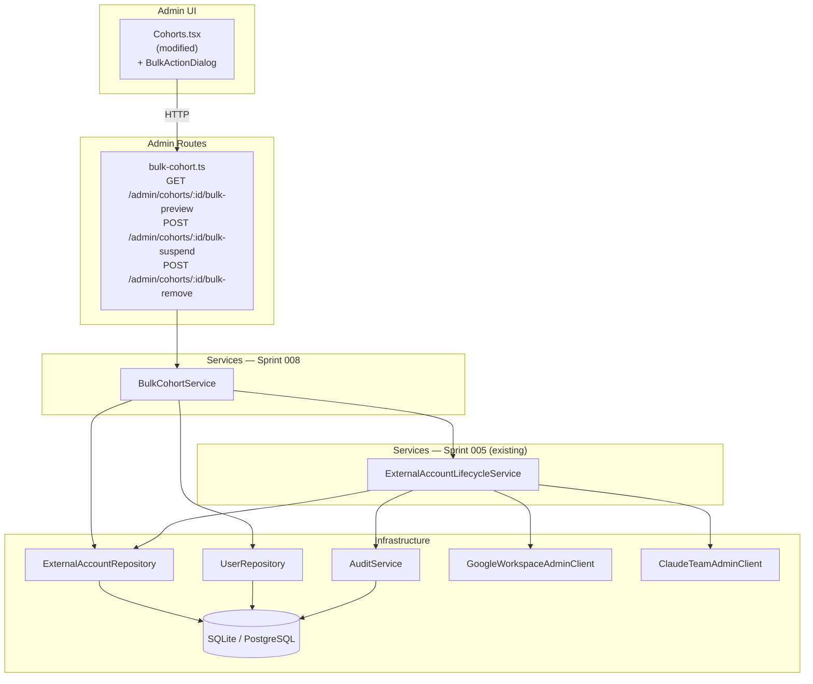

# Architecture Update — Sprint 008: Bulk Cohort Operations — Suspend and Remove

This document is a delta from the Sprint 007 (consolidated) architecture. Read
the Sprint 001 initial architecture and Sprints 002–007 update documents first
for baseline definitions.

---

## What Changed

Sprint 008 delivers the cohort-level bulk suspend and bulk remove workflows
(UC-013, UC-014). All individual suspend/remove logic already exists in
`ExternalAccountLifecycleService` (Sprint 005). This sprint adds only the
iteration layer on top.

### New modules

1. **`BulkCohortService`** — iterates all eligible ExternalAccounts in a
   cohort, dispatches per-account lifecycle operations, collects partial
   failures, and returns a structured result report. No external API calls;
   delegates entirely to `ExternalAccountLifecycleService`.

2. **`adminBulkCohortRouter`** — three Express route handlers:
   - `GET /admin/cohorts/:id/bulk-preview` — count eligible accounts (no
     mutation).
   - `POST /admin/cohorts/:id/bulk-suspend` — run bulk suspend.
   - `POST /admin/cohorts/:id/bulk-remove` — run bulk remove.

### Modified modules

3. **`Cohorts.tsx`** (admin UI) — adds a "Bulk Actions" dropdown to each
   cohort row plus a `BulkActionDialog` component. The dialog shows the
   confirmation message with affected count, handles in-flight spinner, and
   renders the result panel (succeeded / failed with per-user names).

4. **`ServiceRegistry`** — gains a `bulkCohort: BulkCohortService` property.

5. **`server/src/routes/admin/index.ts`** — mounts the new
   `adminBulkCohortRouter`.

### No data model changes

No Prisma schema changes in this sprint. All status transitions and audit
events are handled by the existing `ExternalAccountLifecycleService` paths.

---

## Why

The bulk operations are the natural end-of-term workflow: an administrator
retires a cohort by removing all accounts at once rather than one by one.
Sprint 005 delivered the correct, audited single-account paths. Sprint 008
simply places a loop and error collector around them, keeping the business
logic in one place (no duplication).

`BulkCohortService` is a separate class rather than a method on
`CohortService` because it has a different responsibility: orchestrating a
multi-account operation with partial failure semantics. `CohortService` owns
cohort CRUD; `BulkCohortService` owns bulk lifecycle iteration. They change
for different reasons.

---

## New Modules

### BulkCohortService

**File:** `server/src/services/bulk-cohort.service.ts`

**Purpose:** Iterate all eligible ExternalAccounts in a cohort and apply a
suspend or remove lifecycle operation to each, collecting per-account results.

**Boundary (inside):** Cohort membership lookup, per-user account enumeration,
per-account dispatch to `ExternalAccountLifecycleService`, error collection,
result aggregation.

**Boundary (outside):** Does not call any external API directly. Does not open
prisma transactions — each per-account operation runs inside its own
`prisma.$transaction` which is created by this service (matching the pattern
in `deprovision.ts`). Does not emit any audit events directly; all audit events
are emitted by `ExternalAccountLifecycleService`.

**Constructor:**

```
BulkCohortService(
  prisma: PrismaClient,
  externalAccountLifecycle: ExternalAccountLifecycleService,
  userRepository: typeof UserRepository,
  externalAccountRepository: typeof ExternalAccountRepository,
)
```

**Methods:**

```
async suspendCohort(
  cohortId: number,
  accountType: 'workspace' | 'claude',
  actorId: number,
): Promise<BulkOperationResult>

async removeCohort(
  cohortId: number,
  accountType: 'workspace' | 'claude',
  actorId: number,
): Promise<BulkOperationResult>

async previewCount(
  cohortId: number,
  accountType: 'workspace' | 'claude',
  operation: 'suspend' | 'remove',
): Promise<number>
```

**Return type:**

```
interface BulkOperationResult {
  succeeded: number[];  // accountIds that completed without error
  failed: {
    accountId: number;
    userId: number;
    userName: string;
    error: string;
  }[];
}
```

**Eligible accounts:**
- `suspend`: status = 'active', type = accountType
- `remove`: status in ['active', 'suspended'], type = accountType

**Use cases served:** SUC-008-002, SUC-008-003, SUC-008-004

---

### adminBulkCohortRouter

**File:** `server/src/routes/admin/bulk-cohort.ts`

**Purpose:** Expose bulk cohort operations to the admin UI. No business logic;
thin adapter layer.

**Routes:**

| Method | Path | Description |
|---|---|---|
| GET | `/admin/cohorts/:id/bulk-preview` | Query param: `accountType`, `operation`. Returns `{ eligibleCount }`. |
| POST | `/admin/cohorts/:id/bulk-suspend` | Body: `{ accountType: 'workspace' \| 'claude' }`. Returns BulkOperationResult. |
| POST | `/admin/cohorts/:id/bulk-remove` | Body: `{ accountType: 'workspace' \| 'claude' }`. Returns BulkOperationResult. |

**HTTP status codes:**
- 200 — all accounts succeeded (or zero eligible).
- 207 — at least one failure and at least one success.
- 400 — missing or invalid accountType / operation.
- 404 — cohort not found.
- 500 — unexpected error.

All routes: `requireAuth` + `requireRole('admin')` (enforced upstream by
`adminRouter`).

**Use cases served:** SUC-008-002, SUC-008-003, SUC-008-006

---

### Cohorts.tsx — Bulk Action Controls

**File:** `client/src/pages/admin/Cohorts.tsx` (modified)

**New UI elements:**
- Each cohort row gains a "Bulk Actions" `<select>` or button group with four
  options: Suspend Workspace, Suspend Claude, Remove Workspace, Remove Claude.
- Selecting an action opens a `BulkActionDialog` modal (inline component in
  the same file or a dedicated `BulkActionDialog.tsx`).
- The dialog:
  1. Fetches `GET /api/admin/cohorts/:id/bulk-preview` to populate the
     affected count.
  2. Displays an appropriate message (suspend vs. remove wording).
  3. Shows a spinner while preview is loading.
  4. On confirm, calls the appropriate bulk endpoint.
  5. Shows a result panel with succeeded count and failure details.
  6. Provides a "Close" / "Done" button that dismisses the dialog and
     refreshes the cohort list query.

**No new page routes.** The bulk action dialog is mounted inline within the
existing `/admin/cohorts` page.

**Use cases served:** SUC-008-001, SUC-008-002, SUC-008-003, SUC-008-005,
SUC-008-006

---

## Module Diagram



---

## Impact on Existing Components

### `server/src/services/external-account-lifecycle.service.ts`

No changes. Sprint 008 is a consumer of its public interface; no modifications
to `suspend()` or `remove()` are required.

### `server/src/services/service.registry.ts`

Add:
```typescript
readonly bulkCohort: BulkCohortService;
```

In the constructor:
```typescript
this.bulkCohort = new BulkCohortService(
  defaultPrisma,
  this.externalAccountLifecycle,
  UserRepository,
  ExternalAccountRepository,
);
```

### `server/src/routes/admin/index.ts`

Add:
```typescript
import { adminBulkCohortRouter } from './bulk-cohort';
// ...
adminRouter.use('/admin', adminBulkCohortRouter);
```

### `client/src/pages/admin/Cohorts.tsx`

The existing list/create functionality is unchanged. The bulk action controls
and dialog are additive UI additions to the same page.

---

## Migration Concerns

None. No schema changes, no new environment variables, no data migrations.

---

## Design Rationale

### Decision 1: BulkCohortService Is Separate from CohortService

**Context:** Bulk lifecycle operations involve iterating accounts and calling
an external API-facing service. CohortService handles cohort CRUD and OU
creation.

**Alternatives:**
1. Add `suspendCohort` and `removeCohort` methods directly to `CohortService`.
2. Keep them in a dedicated `BulkCohortService`.

**Choice:** Option 2.

**Why:** CohortService's responsibility is cohort data management. Bulk
lifecycle orchestration changes for different reasons (e.g., error-collection
strategy, which account types are eligible) than cohort CRUD. Mixing them
would make CohortService multi-concern. Option 2 passes the cohesion test:
"BulkCohortService iterates cohort members and applies lifecycle operations."

**Consequences:** One additional service file. ServiceRegistry gains one
property.

---

### Decision 2: Per-Account Transactions (Fail-Soft)

**Context:** A bulk operation across N accounts can fail partially. The spec
requires failures to be collected without aborting the batch.

**Alternatives:**
1. Single transaction for the entire batch (atomic, but all-or-nothing).
2. One transaction per account (fail-soft, matches Sprint 005 deprovision
   pattern).

**Choice:** Option 2.

**Why:** Option 1 does not match the spec (UC-013/UC-014 error flows). Option
2 mirrors the established pattern in `deprovision.ts` which was reviewed and
approved in Sprint 005. Consistency reduces cognitive overhead for the team.

**Consequences:** Partial state is possible — some accounts suspended, some
not. This is the intended design per the use cases. The result report surfaces
this to the administrator.

---

### Decision 3: Preview Count Endpoint (Pre-Flight)

**Context:** The confirmation dialog needs the affected count before the admin
commits to the operation.

**Alternatives:**
1. Return the count as part of the mutation response only.
2. Separate read-only preview endpoint queried before the confirm button is
   shown.

**Choice:** Option 2.

**Why:** Option 1 requires the dialog to first fire the mutating request,
which is poor UX. Option 2 allows the dialog to display "Suspend 23
Workspace accounts?" before the admin clicks Confirm — matching the spec's
confirmation dialog requirement (UC-013 step 3, UC-014 step 3).

**Consequences:** Two round-trips for a bulk operation: one preview, one
execute. Acceptable at this data scale.

---

### Decision 4: No New Page Route for Bulk Actions

**Context:** Bulk actions could live on a dedicated `/admin/cohorts/:id`
detail page or inline on the list page.

**Alternatives:**
1. Create a cohort detail page at `/admin/cohorts/:id`.
2. Add inline bulk action controls to the existing `/admin/cohorts` list page.

**Choice:** Option 2.

**Why:** The spec calls for "bulk actions on the Cohorts page." A dedicated
detail page adds routing complexity, a new page component, and navigation for
minimal additional value given that the bulk action model (select action →
confirm → result) fits cleanly in a dialog. A future sprint could add a full
cohort detail page if needed.

**Consequences:** The Cohorts page component grows somewhat but remains
single-responsibility: manage cohorts (including their bulk lifecycle actions).

---

## Open Questions

**OQ-001: Action selector UI pattern.**
The spec says "action selector" — this could be a `<select>` dropdown, a
button group, or a dropdown menu button. The ticket engineer should choose
the pattern that is consistent with the existing admin UI (which uses plain
buttons elsewhere). A simple `<select>` + "Go" button is acceptable.

**OQ-002: Zero-eligible-account UX.**
When a cohort has zero eligible accounts for a given action, the action
selector can either: (a) show all four actions and display "0 accounts
affected" in the dialog, or (b) disable options with zero accounts in the
selector. Option (a) is simpler to implement. The ticket engineer should
choose the simpler path unless the stakeholder specifies otherwise.
