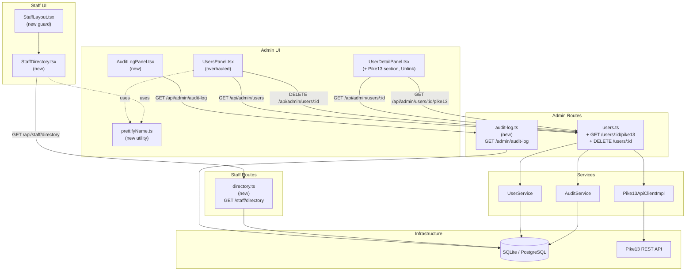

# Architecture Update — Sprint 009: Directory, Staff View, Audit Log Search, and Users Panel UX Overhaul

This document is a delta from the Sprint 008 architecture. Read the Sprint 001
initial architecture and Sprints 002–008 update documents first for baseline
definitions.

---

## What Changed

Sprint 009 delivers five distinct capability areas:

1. **Users panel UX overhaul** — `UsersPanel.tsx` gains search, unified filter
   dropdown (replacing tabs), sortable columns, row checkboxes with bulk delete,
   a three-dot row-actions menu, name prettification for `@jointheleague.org`
   addresses, and Name/Email rendered as links.

2. **Staff read-only directory** — new `StaffDirectory.tsx` page at
   `/staff/directory`, backed by a new `staffDirectoryRouter` that serves
   read-only student data scoped to `role=staff` users. Enforced at both
   API and route level.

3. **Audit log search page** — new `AuditLogPanel.tsx` admin page at
   `/admin/audit-log`, backed by a new `adminAuditLogRouter` that queries
   the existing `AuditEvent` table with filter and pagination support.

4. **UserDetailPanel additions** — Pike13 record snippet section (live fetch
   via new `GET /api/admin/users/:id/pike13` endpoint); rename "Remove" to
   "Unlink" on the Logins section; verify/improve button copy on External
   Accounts section.

5. **Role-based landing page routing** — correct post-login redirects for
   admin, staff, and student; staff cannot reach `/admin/*`; students cannot
   reach `/admin/*` or `/staff/*`.

### New modules

1. **`staffDirectoryRouter`** — read-only Express router mounted at
   `/api/staff`. Requires `requireAuth` + `requireRole('staff')`. Exposes
   `GET /staff/directory` (student list with cohort + external accounts).
   No write endpoints.

2. **`adminAuditLogRouter`** — Express router mounted at
   `/api/admin/audit-log`. Requires admin role. Exposes
   `GET /admin/audit-log` with filter + pagination query params.

3. **`StaffDirectory.tsx`** — read-only React page at `/staff/directory`.
   Displays students with search and filter. No provisioning or audit actions.
   Uses `StaffLayout` (new — identical structure to `AdminLayout` but only
   accessible to `role=staff`).

4. **`StaffLayout.tsx`** — role guard wrapper for staff routes. Analogous to
   `AdminLayout.tsx` but checks for `role=staff` (or `role=admin` for
   backwards compatibility if admin also needs to see it). Redirects
   unauthorized users.

5. **`AuditLogPanel.tsx`** — admin React page at `/admin/audit-log`. Filter
   form, paginated results table, inline detail expansion.

6. **`prettifyName` utility** — pure function co-located in
   `client/src/pages/admin/utils/prettifyName.ts`. No DB changes.

### Modified modules

7. **`UsersPanel.tsx`** — replaces role tabs with a unified Filter dropdown;
   adds search box, sortable column headers with active-sort indicator, row
   checkboxes (header toggle-all), bulk-delete toolbar, three-dot row-actions
   menu per row, Name and Email rendered as `<Link>` using `prettifyName`.
   Removes separate "Impersonate" button and "View" link columns (subsumed by
   the actions menu).

8. **`UserDetailPanel.tsx`** — adds Pike13 Record snippet section (fetches
   `GET /api/admin/users/:id/pike13`); renames "Remove" to "Unlink" in the
   Logins section; verifies button copy on External Accounts.

9. **`server/src/routes/admin/users.ts`** — adds
   `GET /admin/users/:id/pike13` route handler. Accesses Pike13 via
   `req.services.pike13Sync.pike13Client` (the `Pike13SyncService` already
   holds a reference to the client). If the route engineer prefers, a
   dedicated `readonly pike13Client: Pike13ApiClient` property can be added
   to `ServiceRegistry` (see OQ-005). Returns `{ present: false }`,
   `{ present: true, person: {...} }`, or `{ present: true, error: string }`.

10. **`App.tsx`** — adds routes for `/staff/directory` (wrapped in
    `StaffLayout`) and `/admin/audit-log` (wrapped in `AdminLayout`). Adds
    `DELETE /api/admin/users/:id` route to support row and bulk delete.

11. **`server/src/routes/admin/users.ts`** — adds
    `DELETE /admin/users/:id` route (soft-delete: sets `is_active=false`,
    records AuditEvent `action=delete_user`).

12. **`server/src/routes/admin/index.ts`** — mounts `staffDirectoryRouter`
    (under `/api`) and `adminAuditLogRouter` (under `/api/admin`).

13. **`components/AppLayout.tsx`** — adds "Directory" nav link for staff
    users pointing to `/staff/directory`.

14. **`server/src/routes/auth.ts`** — post-login redirect logic updated so
    staff users are sent to `/staff/directory` instead of any placeholder.

### No data model changes

No Prisma schema changes. All data queried by this sprint (Users, Logins,
ExternalAccounts, Cohorts, AuditEvents) already exists. The AuditEvent indexes
added in Sprint 001 (`actor_user_id + created_at`, `target_user_id +
created_at`, `action + created_at`) are sufficient for the audit log search
query patterns.

---

## Why

**UsersPanel UX overhaul:** The current tabs-based filter does not show the
active filter state clearly, provides no search, and requires users to scroll
to reach action buttons. The overhaul follows patterns established in the TODO
artifact: unified filter dropdown, sortable columns, row-level actions menu.
These changes make the panel usable at scale (hundreds of users) and match
the stakeholder's specified interactions exactly.

**Staff directory:** Staff are already authenticated (UC-003) but have no
dedicated view. They land on an unspecified redirect after sign-in. This sprint
delivers the promised org-wide read-only student view (UC-022) and correct
post-login routing.

**Audit log search:** The AuditEvent table has been populated since Sprint 001
but has no query UI. Administrators need to investigate provisioning history
and user actions. The existing indexes make server-side filtering efficient
without schema changes.

**Pike13 snippet:** Administrators currently need to switch to Pike13 to check
whether the sync wrote back the correct email and GitHub username. The snippet
surfaces that data inline at zero additional DB cost — it is a live fetch from
Pike13 keyed on the existing `external_id` on the Pike13 ExternalAccount.

**Routing cleanup:** Several post-login redirects have been placeholders since
Sprint 002. Now that all role-specific landing pages exist, the routing can be
made definitive.

---

## New Modules

### staffDirectoryRouter

**File:** `server/src/routes/staff/directory.ts`

**Purpose:** Serve the read-only student directory to staff users.

**Boundary (inside):** Auth check for `role=staff`, Prisma query for all
active users with `role=student`, cohort names, and external account types.
No write operations.

**Boundary (outside):** Does not perform any external API calls. Does not
modify any records. Does not expose provisioning, merge queue, or audit
endpoints.

**Routes:**

| Method | Path | Description |
|---|---|---|
| GET | `/staff/directory` | Returns all active students with cohort and external account type list. No action fields. |

Response shape per student: `{ id, displayName, email, cohort, externalAccountTypes }`.
No login details, no audit fields, no merge data.

**Guards:** `requireAuth` + `requireRole('staff')` — 403 for any other role.

**Use cases served:** SUC-009-007

---

### adminAuditLogRouter

**File:** `server/src/routes/admin/audit-log.ts`

**Purpose:** Serve paginated, filtered AuditEvent queries to the admin UI.

**Boundary (inside):** Prisma query on `AuditEvent` with optional filters;
response pagination; no mutations.

**Boundary (outside):** Does not call external APIs. Read-only.

**Routes:**

| Method | Path | Query params | Description |
|---|---|---|---|
| GET | `/admin/audit-log` | `actorId`, `targetUserId`, `action`, `from`, `to`, `page`, `pageSize` | Returns paginated AuditEvent records in descending `created_at` order. |

Response shape: `{ total, page, pageSize, items: [{ id, createdAt, actorId,
actorName, action, targetUserId, targetUserName, targetEntityType,
targetEntityId, details }] }`.

**Guards:** `requireAuth` + `requireRole('admin')` (enforced upstream by
`adminRouter`).

**Use cases served:** SUC-009-008

---

### StaffDirectory.tsx

**File:** `client/src/pages/staff/StaffDirectory.tsx`

**Purpose:** Read-only student directory for staff users.

**Boundary (inside):** Search and filter state, fetch from
`GET /api/staff/directory`, render student list and detail view. No mutation
calls.

**Boundary (outside):** Does not call admin endpoints. Does not render any
provisioning, merge, or audit controls.

**Use cases served:** SUC-009-007

---

### StaffLayout.tsx

**File:** `client/src/pages/staff/StaffLayout.tsx`

**Purpose:** Route guard for staff-only pages. Renders an `<Outlet>` if
`user.role === 'staff'` or `user.role === 'admin'`, otherwise redirects to
`/account`.

**Use cases served:** SUC-009-007, SUC-009-009

---

### AuditLogPanel.tsx

**File:** `client/src/pages/admin/AuditLogPanel.tsx`

**Purpose:** Admin page for filtering and browsing AuditEvent records.

**Boundary (inside):** Filter form state, paginated fetch from
`GET /api/admin/audit-log`, results table, inline detail expansion. No
mutations.

**Use cases served:** SUC-009-008

---

### prettifyName utility

**File:** `client/src/pages/admin/utils/prettifyName.ts`

**Purpose:** Pure function that derives a display name from a user record.
For `@jointheleague.org` addresses with `first.last` local parts: returns
`TitleCase(first) TitleCase(last)`. Fallback: `displayName` then email local
part.

**Use cases served:** SUC-009-001, SUC-009-004, SUC-009-007

---

## Module Diagram



---

## Impact on Existing Components

### `server/src/routes/admin/users.ts`

Two new handlers added:
- `GET /admin/users/:id/pike13` — reads the user's Pike13 ExternalAccount,
  calls `Pike13ApiClientImpl.getPerson(external_id)`, returns the snippet.
  Uses the existing `pike13` client from `ServiceRegistry` via `req.services`.
- `DELETE /admin/users/:id` — soft-deletes the user (`is_active=false`),
  records `AuditEvent` with `action=delete_user`.

No changes to existing GET or PUT handlers.

### `server/src/routes/admin/index.ts`

Mounts the new `adminAuditLogRouter` under `/admin`:
```typescript
import { adminAuditLogRouter } from './audit-log';
// ...
adminRouter.use('/admin', adminAuditLogRouter);
```

### `server/src/app.ts`

Mounts the new staff router under `/api` directly (not under `adminRouter`,
because it uses `requireRole('staff')` not `requireRole('admin')`):
```typescript
import { staffDirectoryRouter } from './routes/staff/directory';
// ...
app.use('/api', staffDirectoryRouter);
```

### `client/src/App.tsx`

New routes added:
```tsx
<Route element={<StaffLayout />}>
  <Route path="/staff/directory" element={<StaffDirectory />} />
</Route>
<Route element={<AdminLayout />}>
  {/* existing routes */}
  <Route path="/admin/audit-log" element={<AuditLogPanel />} />
</Route>
```

### `client/src/pages/admin/UsersPanel.tsx`

Substantial rewrite of the rendering layer; the data-fetching and mutation
API calls (`fetchUsers`, `toggleAdmin`, `handleImpersonate`) remain. The
`AdminUser` interface may need `externalAccounts` array added to support the
Accounts filter. The list endpoint already includes `providers`.

### `client/src/pages/admin/UserDetailPanel.tsx`

Additive changes only: new Pike13 section appended below External Accounts;
button label changes from "Remove" to "Unlink" in the Logins section.

### `client/src/components/AppLayout.tsx`

Navigation updated: staff users see a "Directory" link pointing to
`/staff/directory`. Existing admin-only links unchanged.

### `server/src/routes/auth.ts`

Post-login redirect (Google and GitHub OAuth callbacks) updated:
- `role=staff` → `/staff/directory`
- `role=admin` → `/admin/users` (or `/admin/provisioning-requests` — confirm
  with existing code; see OQ-001)

---

## Migration Concerns

No Prisma schema changes and no new environment variables. The existing
AuditEvent indexes (`actor_user_id + created_at`, `target_user_id +
created_at`, `action + created_at`) are sufficient for the audit log filter
queries. No data migration needed.

The `GET /api/admin/users` list endpoint currently returns each user's
`providers` array (Login providers). To support the Accounts filter in the
Users panel (filtering by Google/League/Pike13), the endpoint must also return
`externalAccountTypes` (the distinct type values from the user's
`external_accounts`). This is a non-breaking additive change to the response
shape.

---

## Design Rationale

### Decision 1: Client-Side Filtering for Users Panel

**Context:** The Users panel needs search, filter, and sort. The spec notes
that ≤400 users makes client-side filtering acceptable.

**Alternatives:**
1. Server-side filtering with query params on `GET /admin/users`.
2. Client-side filtering on the already-fetched full user list.

**Choice:** Option 2 (client-side).

**Why:** The existing `GET /admin/users` already fetches the full list. Adding
search/filter/sort purely in the component avoids a new server-side query API,
keeps the component self-contained, and matches the spec's explicit statement
that "client-side is fine for ≤400 users." If the user count grows past that
threshold, a future sprint can add server-side pagination to the list endpoint
without changing the filter UX.

**Consequences:** The full user list is always fetched on page load. The
`GET /admin/users` response must be extended to include `externalAccountTypes`
to support the Accounts filter section.

---

### Decision 2: Separate Staff Router, Not Admin Router Extension

**Context:** Staff need to query students but must not have access to any
admin mutation endpoints.

**Alternatives:**
1. Add staff-scoped read endpoints to `adminRouter` with dual role guards.
2. Create a standalone `staffDirectoryRouter` under `/api/staff` with its own
   `requireRole('staff')` guard.

**Choice:** Option 2.

**Why:** Mixing staff and admin routes in `adminRouter` would require careful
per-route role overriding and risks accidentally exposing staff to admin
mutations. A separate router with a distinct URL namespace makes the access
boundary explicit and enforceable at the router level. The URL path
(`/api/staff/...`) communicates the access level to developers and auditors.

**Consequences:** One additional router file. `app.ts` gains one `use()` call.

---

### Decision 3: Audit Log is Server-Side Filtered with Pagination

**Context:** AuditEvents accumulate over the lifetime of the application.
After many sprints, thousands of records will exist.

**Alternatives:**
1. Client-side filtering (fetch all AuditEvents, filter in the browser).
2. Server-side filtering with query params and page-based pagination.

**Choice:** Option 2.

**Why:** AuditEvents are unbounded and grow monotonically. Client-side
filtering would require fetching all events on every page load — unacceptable
as the table grows. Server-side filtering against the existing indexes is
efficient and scales to tens of thousands of rows with no schema changes.

**Consequences:** Unlike the Users panel, the audit log requires a new query
API. The filter params mirror the spec exactly (actorId, targetUserId, action,
from, to). Pagination is page-based (simpler than cursor-based for this
use case since the filter result set is bounded per query).

---

### Decision 4: Pike13 Snippet Is a Live Fetch, Not Cached

**Context:** The Pike13 snippet shows data from the Pike13 API for a specific
person. We could cache this in the DB or always fetch live.

**Alternatives:**
1. Cache Pike13 person data in the DB (sync on demand or on schedule).
2. Live fetch on every UserDetailPanel load.

**Choice:** Option 2 (live fetch), with fail-soft error handling.

**Why:** Pike13 is the source of truth for its person data. Caching introduces
staleness risk (the whole point of the snippet is to show the current state —
e.g., has the write-back taken effect?). The data volume is tiny (one person
record). Fail-soft: if Pike13 is unreachable, the panel renders an inline
error banner rather than breaking the entire detail view. The spec explicitly
calls for this behavior.

**Consequences:** The UserDetailPanel makes one extra HTTP call per load for
users with a Pike13 account. If Pike13 is down, the error is surfaced inline
without blocking the rest of the detail view.

---

### Decision 5: Soft Delete User

**Context:** The row-actions Delete and bulk Delete need to remove users from
the admin panel. The spec doesn't require hard deletion.

**Alternatives:**
1. Hard delete (cascade or restrict FK).
2. Soft delete (`is_active=false`).

**Choice:** Option 2 (soft delete).

**Why:** The existing `GET /admin/users` already filters on `is_active=true`.
Soft delete preserves all relational data (AuditEvents pointing to the user,
Logins, ExternalAccounts) and matches the precedent set by the existing
`is_active` field on `User`. Hard delete would require CASCADE or manual
cleanup of related records, risking data loss in development and test
environments.

**Consequences:** Deleted users are hidden from the Users panel but remain in
the DB. A future "restore user" feature would be straightforward. AuditEvents
referencing the deleted user remain intact.

---

## Open Questions

**OQ-001: Post-login redirect for admin users.**
The existing `server/src/routes/auth.ts` has a post-login redirect for admin
users. The current Sprint 008 and earlier implementations may send admins to
`/admin/provisioning-requests`. Ticket T009 (routing cleanup) must grep the
auth callback to confirm and update to `/admin/users` consistently with the
spec's intent.

**OQ-002: Staff layout navigation items.**
`StaffDirectory.tsx` needs a nav sidebar. Options are: (a) reuse `AppLayout`
with staff-visible links only, or (b) a dedicated `StaffLayout` with its own
nav. The ticket engineer should reuse `AppLayout`'s sidebar (it already
conditionally renders admin-only links) and add a staff-only "Directory" link
condition, rather than building a fully separate layout shell.

**OQ-003: `externalAccountTypes` on user list endpoint.**
The Users panel Accounts filter requires knowing which external account types
each user has. The current `GET /admin/users` response includes `providers`
(Login providers) but not external account types. The ticket engineer must
extend this endpoint to include `externalAccountTypes: string[]` in the
response (e.g., `['workspace', 'pike13']`). This is additive and non-breaking.

**OQ-005: Pike13ApiClient accessibility from routes.**
The `Pike13ApiClientImpl` instance is currently constructed as a local
variable in `ServiceRegistry`'s constructor and passed only to `Pike13SyncService`.
To keep `GET /admin/users/:id/pike13` clean, the ticket engineer should either:
(a) expose `readonly pike13Client: Pike13ApiClient` as a property on
`ServiceRegistry` (preferred — matches the `googleClient` precedent), or
(b) add a `getPerson(personId: string)` delegation method on `Pike13SyncService`.
Option (a) is recommended for consistency with how `googleClient` is exposed.

**OQ-004: Audit log actor/target user name resolution.**
The AuditEvent table stores `actor_user_id` and `target_user_id` as integer
foreign keys. The audit log UI needs to display names. The query endpoint
should join to User on both FK fields and return `actorName` and
`targetUserName` in the response, falling back to the ID if the user has been
soft-deleted.
