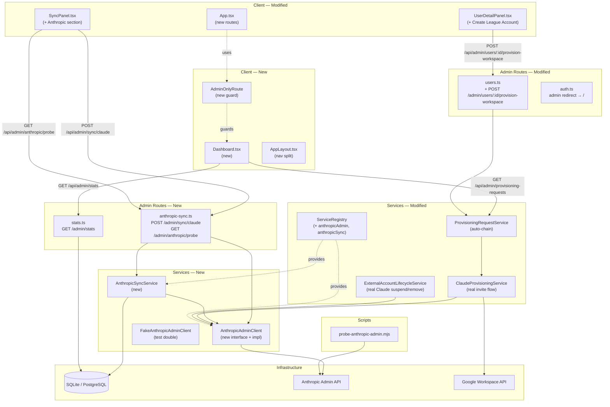

<!-- CLASI: Before changing code or making plans, review the SE process in CLAUDE.md -->

# Architecture Update — Sprint 010: Admin Console Consolidation, Anthropic Admin API, Env Var Cleanup

This document is a delta from the Sprint 009 architecture. Read the Sprint 001
initial architecture and Sprints 002–009 update documents first for baseline
definitions.

---

## What Changed

Sprint 010 delivers three independent workstreams that share the same sprint
boundary.

### Workstream A: Admin UX Overhaul

1. **`AdminOnlyRoute` component** — new `client/src/components/AdminOnlyRoute.tsx`. A
   lightweight React route guard: renders `<Outlet />` when `user.role === 'admin'`,
   otherwise redirects to `/account`.

2. **`Dashboard.tsx`** — new `client/src/pages/admin/Dashboard.tsx`. The admin
   landing page. Renders three widgets stacked vertically: Pending Requests,
   Cohorts, and User Counts by Role.

3. **`AppLayout.tsx` nav split** — admin-workflow links (Dashboard `/`, Provisioning
   Requests `/requests`, Cohorts `/cohorts`, Users `/users`, Sync `/sync`, Merge
   Queue `/merge-queue`) move into the main nav, shown only for `role=admin`.
   `ADMIN_NAV` retains only ops-only pages: Environment, Database, Logs,
   Sessions, Scheduled Jobs, Configuration, Import/Export.

4. **`adminStatsRouter`** — new `server/src/routes/admin/stats.ts`. Exposes
   `GET /admin/stats` returning `{ totalStudents, totalStaff, totalAdmins,
   pendingRequests, openMergeSuggestions, cohortCount }`. Single Prisma
   aggregation. No mutation.

5. **`POST /admin/users/:id/provision-workspace`** — new handler added to
   `server/src/routes/admin/users.ts`. Calls `WorkspaceProvisioningService.provision`.
   422 if not a student, no cohort, or already has an active workspace account.

6. **`ProvisioningRequestService.approve()` auto-chain** — modified in
   `server/src/services/provisioning-request.service.ts`. If
   `requestType === 'claude'` and the target user has no active workspace
   ExternalAccount, the service auto-promotes to `workspace_and_claude` semantics:
   runs WorkspaceProvisioningService first, then ClaudeProvisioningService.
   Records a single `request_approved` AuditEvent with `auto_chained: true`.

7. **Admin post-login redirect** — `server/src/routes/auth.ts` updated: admin
   OAuth callbacks redirect to `/` instead of `/admin/provisioning-requests`.

8. **`App.tsx` route table** — new routes added under `AppLayout` wrapped in
   `AdminOnlyRoute`: `/` → `Dashboard`, `/requests` → `ProvisioningRequests`,
   `/cohorts` → `Cohorts`, `/users` → `UsersPanel`, `/sync` → `SyncPanel`,
   `/merge-queue` → `MergeQueuePanel`. Existing `/admin/*` routes remain under
   `AdminLayout`.

9. **`UserDetailPanel.tsx` — Create League Account button** — for `role=student`
   users with no active workspace ExternalAccount and a cohort assigned, shows
   "Create League Account" button in the Workspace section. Posts to
   `POST /api/admin/users/:id/provision-workspace`. Staff and admin user rows
   render the External Accounts section read-only (no lifecycle buttons).

### Workstream B: Anthropic Admin API

10. **`AnthropicAdminClient`** — new module at
    `server/src/services/anthropic/anthropic-admin.client.ts`. Replaces the
    speculative `ClaudeTeamAdminClientImpl` endpoints with real Anthropic Admin
    API endpoints. Auth: `x-api-key: <ANTHROPIC_ADMIN_API_KEY>` +
    `anthropic-version: 2023-06-01`. No `product_id`. The old
    `server/src/services/claude-team/claude-team-admin.client.ts` is kept as a
    re-export shim for one release.

    Interface:
    ```
    listOrgUsers(cursor?)       → { users: AnthropicUser[]; nextCursor }
    getOrgUser(userId)          → AnthropicUser
    inviteToOrg({ email, role }) → AnthropicInvite
    listInvites(cursor?)        → { invites: AnthropicInvite[]; nextCursor }
    cancelInvite(inviteId)      → void
    deleteOrgUser(userId)       → void
    listWorkspaces()            → AnthropicWorkspace[]
    addUserToWorkspace(wsId, userId, role?) → void
    removeUserFromWorkspace(wsId, userId)   → void
    ```

11. **`FakeAnthropicAdminClient`** — new test double at
    `tests/server/helpers/fake-anthropic-admin.client.ts`. Re-exported as both
    `FakeAnthropicAdminClient` and `FakeClaudeTeamAdminClient` so the 8 existing
    test files compile without import changes.

12. **`AnthropicSyncService`** — new `server/src/services/anthropic/anthropic-sync.service.ts`.
    Reconciles Anthropic org state against local ExternalAccount rows.
    Returns `SyncReport { created, linked, invitedAccepted, removed, unmatched: string[] }`.

13. **`ExternalAccountLifecycleService` — Claude real ops** — modified in
    `server/src/services/external-account-lifecycle.service.ts`:
    - Suspend (claude): was a no-op (OQ-003 from Sprint 005). Now calls
      `AnthropicAdminClient.removeUserFromWorkspace(studentsWorkspaceId, externalId)`.
      Status → `suspended`.
    - Remove (claude): calls `AnthropicAdminClient.deleteOrgUser(externalId)`.
      Status → `removed`.

14. **`ClaudeProvisioningService.provision()` — real invite flow** — modified in
    `server/src/services/claude-provisioning.service.ts`:
    - Calls `AnthropicAdminClient.inviteToOrg({ email: leagueEmail })`.
    - Resolves Students workspace id once per process (cached); env override
      `CLAUDE_STUDENT_WORKSPACE` (default `"Students"`).
    - Creates `ExternalAccount(type='claude', status='pending', external_id=<invite id>)`.

15. **`anthropicSyncRouter`** — new `server/src/routes/admin/anthropic-sync.ts`:
    - `POST /admin/sync/claude` — runs `AnthropicSyncService.reconcile()`.
    - `GET /admin/anthropic/probe` — calls probe helper, returns org + credential status.

16. **`SyncPanel.tsx` Anthropic section** — modified
    `client/src/pages/admin/SyncPanel.tsx`: third section "Anthropic (Claude)"
    with probe status card + "Sync Claude accounts" button + SyncReport display.

17. **`scripts/probe-anthropic-admin.mjs`** — new standalone Node.js script.
    Hits four org-level endpoints and prints OK/FAIL summary.

18. **`ServiceRegistry` additions**:
    - `anthropicAdmin: AnthropicAdminClient` — constructed with
      `ANTHROPIC_ADMIN_API_KEY` preferred, falling back to `CLAUDE_TEAM_API_KEY`.
    - `anthropicSync: AnthropicSyncService`.

### Workstream C: GOOGLE_CRED_FILE Rename

19. **`google-workspace-admin.client.ts`** — `resolveCredentialsFileEnvVar()`
    updated to read only `GOOGLE_CRED_FILE`. Log source tags updated.

20. **`passport.config.ts`** — fail-secure warning message updated to reference
    `GOOGLE_CRED_FILE`.

21. **`scripts/sanity-check-service-account.mjs`** — all `GOOGLE_SERVICE_ACCOUNT_FILE`
    references replaced with `GOOGLE_CRED_FILE`.

22. **Test files** — all test files in `tests/server/` that set
    `GOOGLE_SERVICE_ACCOUNT_FILE` or `GOOGLE_CREDENTIALS_FILE` updated to set
    `GOOGLE_CRED_FILE`. The five env-var precedence tests reduced to one.

23. **`config/dev/secrets.env.example`** and **`config/prod/secrets.env.example`** —
    rewritten to describe only `GOOGLE_CRED_FILE` (inline JSON path remains
    separate).

24. **Architecture docs** — one-line annotation added to `architecture-update-002.md`
    and `architecture-update-004.md`: "Renamed to `GOOGLE_CRED_FILE` in Sprint 010."

25. **Agent rules** — `.claude/rules/api-integrations.md` and `.claude/rules/secrets.md`
    updated to reference `GOOGLE_CRED_FILE` where old names appear.

### No data model changes

No Prisma schema changes. `ExternalAccount` already has `type`, `status` (`pending |
active | suspended | removed`), and `external_id` fields sufficient for all invite
and user-id tracking.

---

## Why

**Admin UX Overhaul:** The current sidebar conflates day-to-day workflow with
ops tooling, and there is no overview landing page. Admins must navigate to a
specific page by memory. The route split separates concerns; the Dashboard gives
admins an at-a-glance status of the system's most time-sensitive data.

**Auto-chain:** A Claude-only request from a student without a League account
requires two separate admin approvals today. Since the League account is a
prerequisite for the Claude invite anyway, the second click adds no information
or oversight — it is pure ceremony. Auto-chaining removes it while preserving
the audit trail.

**Anthropic Admin API:** The `ClaudeTeamAdminClientImpl` targets guessed
endpoints that do not exist. A real `ANTHROPIC_ADMIN_API_KEY` is now available.
The rewrite replaces speculation with a working client, unblocks Claude
provisioning and suspension, and adds the sync/reconciliation loop that keeps
local ExternalAccount state consistent with Anthropic's org.

**GOOGLE_CRED_FILE rename:** The config already uses `GOOGLE_CRED_FILE` (set
in `config/dev/public.env`). Code still reads the old names, so Workspace
sign-in and sync are broken. This workstream completes the rename and removes
the confusing two-variable precedence logic.

---

## New Modules

### AdminOnlyRoute

**File:** `client/src/components/AdminOnlyRoute.tsx`

**Purpose:** Route guard that renders `<Outlet />` for `role=admin` users and
redirects others to `/account`.

**Boundary (inside):** Role check against `useAuth()`, redirect decision.

**Boundary (outside):** Does not fetch data. Does not render any UI. Not used
inside `/admin/*` routes (those use `AdminLayout`).

**Use cases served:** SUC-010-001, SUC-010-002, SUC-010-003, SUC-010-004,
SUC-010-005

---

### Dashboard.tsx

**File:** `client/src/pages/admin/Dashboard.tsx`

**Purpose:** Admin landing page. Three widgets: Pending Requests, Cohorts,
User Counts.

**Boundary (inside):** Fetch from `GET /api/admin/stats` and
`GET /api/admin/provisioning-requests?status=pending`. Render widget components.
Approve/Deny actions via existing provisioning-request endpoints.

**Boundary (outside):** Does not call any provisioning or lifecycle endpoints
directly. Approve/Deny delegate to existing provisioning-request route.

**Routes consumed:**
- `GET /api/admin/stats`
- `GET /api/admin/provisioning-requests?status=pending`
- `POST /api/admin/provisioning-requests/:id/approve`
- `POST /api/admin/provisioning-requests/:id/reject`

**Use cases served:** SUC-010-001, SUC-010-002, SUC-010-005

---

### adminStatsRouter

**File:** `server/src/routes/admin/stats.ts`

**Purpose:** Return aggregate counts for the admin Dashboard.

**Boundary (inside):** Single Prisma aggregation query spanning User, ProvisioningRequest,
MergeSuggestion, and Cohort tables. No mutation.

**Boundary (outside):** No external API calls. Read-only.

**Routes:**

| Method | Path | Description |
|---|---|---|
| GET | `/admin/stats` | Returns `{ totalStudents, totalStaff, totalAdmins, pendingRequests, openMergeSuggestions, cohortCount }` |

**Guards:** `requireAuth` + `requireRole('admin')` (enforced upstream by `adminRouter`).

**Use cases served:** SUC-010-005

---

### AnthropicAdminClient

**File:** `server/src/services/anthropic/anthropic-admin.client.ts`

**Purpose:** HTTP client for the Anthropic Admin API. Wraps org-level user
management and workspace-level membership operations.

**Boundary (inside):** HTTP fetch, auth headers (`x-api-key`, `anthropic-version`),
typed error classes (`AnthropicAdminApiError`, `AnthropicAdminNotFoundError`,
`AnthropicAdminWriteDisabledError`), pagination cursor handling.

**Boundary (outside):** No database access. No business logic. No audit events.

**Auth env vars (precedence):**
1. `ANTHROPIC_ADMIN_API_KEY` (primary)
2. `CLAUDE_TEAM_API_KEY` (legacy fallback; deprecated)

**Kill switch:** `CLAUDE_TEAM_WRITE_ENABLED=1` required for all mutating methods.

**Use cases served:** SUC-010-003, SUC-010-004, SUC-010-006, SUC-010-007, SUC-010-008

---

### AnthropicSyncService

**File:** `server/src/services/anthropic/anthropic-sync.service.ts`

**Purpose:** Reconcile Anthropic org state against local ExternalAccount rows.

**Boundary (inside):** Calls `AnthropicAdminClient` to enumerate org users and
invites. Reads and writes `ExternalAccount` rows via Prisma. Calls
`AnthropicAdminClient.addUserToWorkspace` for accepted invites. Emits
`claude_sync_flagged` AuditEvents. Returns a structured `SyncReport`.

**Boundary (outside):** Does not touch workspace (Google) accounts. Does not
modify `User` records. Does not send emails or notifications.

**Use cases served:** SUC-010-006

---

### anthropicSyncRouter

**File:** `server/src/routes/admin/anthropic-sync.ts`

**Purpose:** Expose Anthropic sync and probe operations to the admin UI.

**Routes:**

| Method | Path | Description |
|---|---|---|
| POST | `/admin/sync/claude` | Run `AnthropicSyncService.reconcile()`. Returns `SyncReport`. |
| GET | `/admin/anthropic/probe` | Call probe helper. Returns `{ ok, org, userCount, workspaces, invitesCount, writeEnabled }`. |

**Guards:** `requireAuth` + `requireRole('admin')` (enforced upstream by `adminRouter`).

**Use cases served:** SUC-010-006, SUC-010-007

---

## Module Diagram



---

## Entity-Relationship Notes

No schema changes. The existing `ExternalAccount` model already supports this
sprint's needs:

- `type`: `'claude'` for Anthropic-managed accounts
- `status`: `pending` (invite sent), `active` (org member), `suspended` (workspace-revoked), `removed` (org-deleted)
- `external_id`: stores invite ID pre-acceptance, Anthropic org user ID post-acceptance

The dual-purpose `external_id` field is by design (established in Sprint 005).
The `AnthropicSyncService.reconcile()` rewrite path overwrites the invite ID with
the org user ID when an invite is accepted.

---

## Impact on Existing Components

| Component | Impact |
|-----------|--------|
| `AppLayout.tsx` | Nav split: admin-workflow links added to main nav conditional on `role=admin`; removed from `ADMIN_NAV` |
| `App.tsx` | New routes under `AdminOnlyRoute` for Dashboard and admin-workflow pages at non-`/admin/*` paths |
| `AdminLayout.tsx` | Unchanged; remains the guard for ops-only `/admin/*` routes |
| `ProvisioningRequests.tsx` | Unchanged; route moves from `/admin/provisioning-requests` to `/requests` |
| `Cohorts.tsx` | Unchanged; route moves from `/admin/cohorts` to `/cohorts` |
| `UsersPanel.tsx` | Unchanged; route moves from `/admin/users` to `/users` |
| `SyncPanel.tsx` | Additive: Anthropic section appended |
| `MergeQueuePanel.tsx` | Unchanged; route moves from `/admin/merge-queue` to `/merge-queue` |
| `UserDetailPanel.tsx` | Additive: "Create League Account" button for students without workspace account |
| `ClaudeProvisioningService` | Modified: invite flow rewritten to use `AnthropicAdminClient` |
| `ExternalAccountLifecycleService` | Modified: Claude suspend (workspace-revoke) and remove (org-delete) implemented for real |
| `ProvisioningRequestService` | Modified: `approve()` gains auto-chain logic |
| `ServiceRegistry` | Modified: `anthropicAdmin` and `anthropicSync` properties added; legacy `claudeTeam` property updated to delegate to `AnthropicAdminClient` |
| `claude-team-admin.client.ts` | Kept as re-export shim for one release; no code changes |
| `google-workspace-admin.client.ts` | Modified: reads only `GOOGLE_CRED_FILE` |
| `passport.config.ts` | Modified: warning message text only |
| `auth.ts` (routes) | Modified: admin post-login redirect target |
| `admin/index.ts` (routes) | Modified: mounts `adminStatsRouter` and `anthropicSyncRouter` |

---

## Migration Concerns

**Route path changes:** Admin-workflow pages move from `/admin/*` to top-level paths
(`/requests`, `/cohorts`, `/users`, `/sync`, `/merge-queue`). Any saved bookmarks or
hardcoded links to the old paths will break. The old paths under `AdminLayout` are
removed from `App.tsx`. This is a breaking change for URLs, intentional per the
sprint scope.

**`GOOGLE_CRED_FILE` rename:** Any deployment that still sets `GOOGLE_CREDENTIALS_FILE`
or `GOOGLE_SERVICE_ACCOUNT_FILE` in its `.env` will silently fail to load credentials.
The `.env` on every environment (dev, prod) must be updated before or simultaneously
with this code change. `config/dev/public.env` already uses `GOOGLE_CRED_FILE` — no
change needed there.

**`ClaudeTeamAdminClient` shim:** The old module re-exports all types and the impl
class under their original names. Existing test imports continue to compile. The shim
is intended to be removed in a future sprint.

**`CLAUDE_TEAM_API_KEY` / `CLAUDE_TEAM_PRODUCT_ID`:** Kept as legacy fallback in
`ServiceRegistry` for environments that haven't set `ANTHROPIC_ADMIN_API_KEY` yet.
`CLAUDE_TEAM_PRODUCT_ID` is no longer used by the new implementation.

**No database migration required.** No Prisma schema changes.

**No new required environment variables for dev.** `ANTHROPIC_ADMIN_API_KEY` is
already set in `config/dev/secrets.env`. `CLAUDE_STUDENT_WORKSPACE` has a default
of `"Students"` and need only be set to override.

---

## Design Rationale

### Decision 1: Route Split — Admin-Workflow Pages at Top-Level Paths, Not Under `/admin/*`

**Context:** Admin-workflow pages (Requests, Cohorts, Users, Sync, Merge Queue) are used
every week; ops pages (DB, Logs, Env, Sessions) are used rarely. Currently all 13 pages
share a flat `/admin/*` namespace.

**Alternatives considered:**
1. Keep all admin pages under `/admin/*` but create subsections in the sidebar.
2. Move admin-workflow to top-level paths (`/requests`, `/cohorts`, etc.) gated by role.
3. Create a new `/admin/dashboard` URL and keep `/admin/users`, `/admin/cohorts`, etc.

**Why option 2:** Top-level paths align with the AppLayout's existing navigation model.
Option 3 creates a confusing hybrid where the Dashboard is at a new URL but the pages
it links to are still under `/admin/*`. Option 2 makes the role gate the only distinction
between admin-workflow pages and student/staff pages, which is clear and maintainable.
The ops-only `/admin/*` area retains a clear identity: "things admins rarely need."

**Consequences:** Bookmarks to old admin-workflow URLs break. Teams that link to
`/admin/users` in documentation will need to update those links. Tradeoff is accepted.

---

### Decision 2: Auto-Chain Is a Service-Layer Concern, Not a Route Concern

**Context:** When approving a Claude-only request for a workspace-less student, the
system needs to provision workspace first. This could be implemented in the route
handler or in `ProvisioningRequestService.approve()`.

**Alternatives considered:**
1. Route handler detects the case and calls workspace provisioning before forwarding
   to the service.
2. Service layer detects the case and auto-chains internally.

**Why option 2:** Route handlers are thin adapters. Business rules belong in the
service layer. The auto-chain rule ("Claude requires Workspace; if absent, create it")
is a business rule, not a transport concern. Keeping it in the service ensures it
applies whether the approval is triggered from the dashboard widget, the provisioning
requests page, or any future trigger (e.g., scheduled or webhook-driven).

**Consequences:** `ProvisioningRequestService` now imports `WorkspaceProvisioningService`.
This is a new dependency. Both services are already in `ServiceRegistry`, so no new
coupling is introduced at the registry level.

---

### Decision 3: AnthropicAdminClient Is a New Module, Not a Modification of ClaudeTeamAdminClientImpl

**Context:** The existing `ClaudeTeamAdminClientImpl` uses fake endpoints, a wrong
auth header format, and a `productId` that no longer applies.

**Alternatives considered:**
1. Modify `ClaudeTeamAdminClientImpl` in place.
2. Create a new `AnthropicAdminClientImpl` in a new module; keep the old file as a
   shim.

**Why option 2:** In-place modification of 8+ test files simultaneously with the
client rewrite creates a large, risky PR. The shim approach allows test files to
compile unchanged while the implementation is gradually migrated. The new module
also communicates the semantic shift: this is the org-admin API, not the team-seat API.

**Consequences:** One additional file. Re-export shim must be removed in a future sprint
to avoid confusion from two entry points for the same functionality.

---

### Decision 4: Dashboard Widget Renders Only User Counts by Role (No Merge-Suggestion Widget)

**Context:** The stakeholder considered adding a pending-merge-suggestions count to
the Dashboard stats. After discussion, the decision was to limit the stats endpoint
to user counts (students, staff, admins) and the widget count for pending requests.
`openMergeSuggestions` and `cohortCount` are included in the stats response for
completeness but are not rendered as separate Dashboard widgets.

**Consequences:** The Dashboard is not cluttered with widgets for low-frequency
concerns (the merge queue is rarely populated). A future sprint can add a merge-queue
widget by consuming the already-present `openMergeSuggestions` field from the stats
endpoint without a server change.

---

## Open Questions

**OQ-010-001: Route collision between admin-workflow top-level paths and future pages.**
`/requests`, `/cohorts`, `/users`, `/sync`, `/merge-queue` are now admin-only paths
at the top level of `App.tsx`. If a future sprint adds a student-facing page at
one of these paths, a conflict will arise. Consider whether a `/admin-work/*` prefix
(or similar) would have been safer. Flagged for future review; scope not changed in
this sprint.

**OQ-010-002: `CLAUDE_TEAM_PRODUCT_ID` deprecation timeline.**
The legacy env var is no longer read by `AnthropicAdminClientImpl`. It should be
removed from all `.env` files and documentation in a future sprint. Flagged so it
is not forgotten.

**OQ-010-003: Invite acceptance timing and the sync loop.**
`ClaudeProvisioningService.provision()` creates an ExternalAccount with
`status=pending` and `external_id=<invite id>`. The transition to `active` happens
only when `AnthropicSyncService.reconcile()` is run (hourly via `SchedulerService`
or manually). Between invite and acceptance, the ExternalAccount is `pending`. This
is correct per the stakeholder decision (Sprint 005 OQ-001), but the lag between
acceptance and local status update is now explicit and should be documented in the
admin UI ("status updates on next sync").
