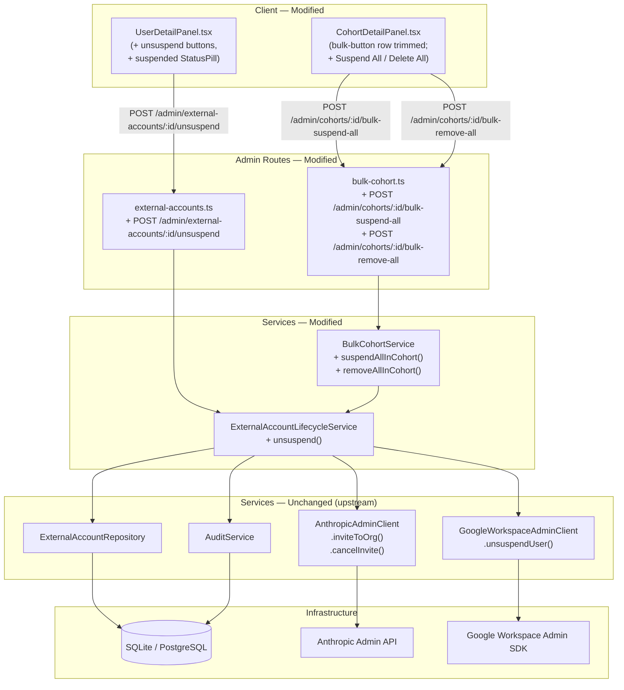

<!-- CLASI: Before changing code or making plans, review the SE process in CLAUDE.md -->

# Architecture Update — Sprint 011: Admin UX Cleanup

This document is a delta from the Sprint 010 architecture. It adds one
new lifecycle operation (unsuspend) and two new bulk-cohort methods,
and trims the cohort-detail UI to match how cohorts actually work.

---

## What Changed

Sprint 011 delivers two narrow admin-UX workstreams.

### Workstream A: Per-account Unsuspend

1. **`ExternalAccountLifecycleService.unsuspend`** — new method on
   `server/src/services/external-account-lifecycle.service.ts`.
   Mirrors the existing `suspend` / `remove` methods:
   - Fetches the account, validates it is currently `status = 'suspended'`
     (throws `UnprocessableError` if not).
   - For `type = 'workspace'`: calls
     `googleClient.unsuspendUser(email)` — the same method already used
     by `WorkspaceProvisioningService.provision` when it reactivates a
     prior-suspended/removed account (see `workspace-provisioning.service.ts`).
     On success, flips the row to `status = 'active'` and emits an
     `unsuspend_workspace` audit event.
   - For `type = 'claude'`:
     - If `external_id.startsWith('invite_')`: calls
       `claudeTeamClient.cancelInvite(oldInviteId)` (best-effort,
       warn-and-continue on failure), then
       `claudeTeamClient.inviteToOrg({ email: <leagueEmail> })`,
       derives the League email from the user's workspace ExternalAccount
       or `user.primary_email`, stores the new invite id in
       `external_id`, flips `status` to `'pending'`, and emits an
       `unsuspend_claude` audit event.
     - If `external_id.startsWith('user_')` (or anything not
       `invite_*`): throws `UnprocessableError` with the message
       "Claude user accounts cannot be un-suspended; delete this account
       and re-provision a new Claude seat instead." No state change.

2. **`POST /admin/external-accounts/:id/unsuspend`** — new handler in
   `server/src/routes/admin/external-accounts.ts`. Wraps the service call
   in a `prisma.$transaction`, returns the updated `ExternalAccount` row
   on 200, 404 on not-found, 422 on "not suspended" or "claude user
   account (irreversible)", 502 on provider errors.

3. **Admin user page — suspended state visible** — modifications to
   `client/src/pages/admin/UserDetailPanel.tsx`:
   - The **Claude** card no longer treats `suspended` as "no account".
     It renders the `StatusPill` and the `Anthropic ID`, and displays
     an **Unsuspend** button (for `invite_*` external ids) or a
     non-button informational hint for `user_*` external ids.
   - The **Student account** card renders its `StatusPill` alongside
     the workspace email when the workspace `ExternalAccount` is
     `suspended`, and surfaces a **Unsuspend** button.
   - The **Delete Student Account** button is gated to `status !==
     'removed'` and `status !== 'suspended'` stays allowed (delete
     remains the heavier sibling).

### Workstream B: Cohort page simplification

4. **`BulkCohortService.suspendAllInCohort(cohortId, actorId)`** — new
   method on `server/src/services/bulk-cohort.service.ts`. Loads every
   active `ExternalAccount` of type `workspace` OR `claude` for active
   students in the cohort, then runs the existing `_processAccounts`
   helper with `operation = 'suspend'`. Returns
   `BulkOperationResult & { type: 'workspace' | 'claude' }` inline on
   each failure entry via a small extension so the UI can render
   "student-name (claude): reason".

5. **`BulkCohortService.removeAllInCohort(cohortId, actorId)`** — new
   method. Loads every `active` OR `suspended` `ExternalAccount` of
   type `workspace` OR `claude` for active students in the cohort, then
   runs `_processAccounts` with `operation = 'remove'`. Same extended
   failure shape.

6. **`POST /admin/cohorts/:id/bulk-suspend-all`** — new handler in
   `server/src/routes/admin/bulk-cohort.ts`. No request body. Returns
   200 on all-succeed / zero-eligible, 207 on partial failure, 404 if
   cohort not found.

7. **`POST /admin/cohorts/:id/bulk-remove-all`** — new handler. Same
   contract.

8. **Cohort detail page trimmed** — modifications to
   `client/src/pages/admin/CohortDetailPanel.tsx`:
   - Remove `Create League`, `Suspend League`, `Suspend Claude`,
     `Delete League`, `Delete Claude` buttons.
   - Add `Suspend All` and `Delete All` buttons that call the two new
     endpoints.
   - Keep `Create Claude (N)` button (renamed from its current label
     for clarity if needed, retained functionally unchanged).
   - Update the banner renderer to handle the extended failure shape
     (`userName (type): error`).
   - No `Create Log` buttons exist in the current code — no change
     needed there; confirm during implementation.

### No data model changes

No Prisma schema changes. All work uses the existing
`ExternalAccount` fields (`status`, `status_changed_at`, `external_id`).

### No new environment variables

Reuses existing env state:
- `CLAUDE_STUDENT_WORKSPACE` (still optional; unused by the new
  Claude un-suspend path — invite flow doesn't need a workspace id).
- `ANTHROPIC_ADMIN_API_KEY` / `CLAUDE_TEAM_API_KEY`.
- `CLAUDE_TEAM_WRITE_ENABLED` (gates `inviteToOrg`, `cancelInvite`).
- `GOOGLE_CRED_FILE` (gates `unsuspendUser`).

---

## Why

**Unsuspend UI:** Today a suspended ExternalAccount looks like no
account at all on `/users/:id` — the status is invisible and every
lifecycle button is hidden. The only way to resurrect a suspended
student is through the student-facing "Request re-activation" flow
that chains through `WorkspaceProvisioningService.provision()`. That's
the wrong affordance for an admin dashboard: the admin already has the
context and authority to flip a single account back, and they should
not have to route through a student-initiated request. This sprint
surfaces the state and exposes the direct lever.

**Cohort page simplification:** The current button set reflects an
earlier assumption that League and Claude are separately bulk-managed.
In practice admins suspend "this cohort" or delete "this cohort",
end of sentence. The account-type split is friction. Merging to
`Suspend All` / `Delete All` also forward-compatibly covers future
app-level accounts (Sprint 012) without another UI re-design. Keeping
`Create Claude seats` (as distinct from a general `Create All`) is
justified because League accounts are a prerequisite for cohort
membership, so bulk-create across all account types is incoherent.

---

## New and Modified Modules

### ExternalAccountLifecycleService — new `unsuspend` method

**File:** `server/src/services/external-account-lifecycle.service.ts`

**Responsibility added:** Reverse a prior `suspend()` on a single
ExternalAccount — provider API call first, local status flip second,
audit event third.

**Boundary (inside):** Fetches account; validates
`status === 'suspended'`; dispatches to Google Admin or Anthropic
Admin client by account type; writes `status`, `status_changed_at`,
possibly `external_id` (new invite id); emits audit event.

**Boundary (outside):** Does not touch Pike13. Does not open its own
transaction. Does not alter other ExternalAccounts belonging to the
same user.

**Use cases served:** SUC-011-001

### adminExternalAccountsRouter — new unsuspend route

**File:** `server/src/routes/admin/external-accounts.ts`

**Routes:**

| Method | Path | Description |
|---|---|---|
| POST | `/admin/external-accounts/:id/unsuspend` | Calls `ExternalAccountLifecycleService.unsuspend`. |

**Guards:** `requireAuth` + `requireRole('admin')` (enforced upstream).

**Use cases served:** SUC-011-001

### BulkCohortService — new `suspendAllInCohort` / `removeAllInCohort`

**File:** `server/src/services/bulk-cohort.service.ts`

**Responsibility added:** Apply a single lifecycle operation across
every live `ExternalAccount` (both `workspace` and `claude`) belonging
to every active student in a cohort.

**Boundary (inside):** Loads eligible rows from Prisma;
iterates, each inside its own transaction; collects succeeded/failed;
returns the extended `BulkOperationResult`.

**Boundary (outside):** No external API knowledge. No knowledge of
provisioning (which is still per-type). No UI concerns.

**Use cases served:** SUC-011-002

### adminBulkCohortRouter — two new bulk-all routes

**File:** `server/src/routes/admin/bulk-cohort.ts`

**Routes:**

| Method | Path | Description |
|---|---|---|
| POST | `/admin/cohorts/:id/bulk-suspend-all` | Calls `BulkCohortService.suspendAllInCohort`. |
| POST | `/admin/cohorts/:id/bulk-remove-all` | Calls `BulkCohortService.removeAllInCohort`. |

**Use cases served:** SUC-011-002

### UserDetailPanel.tsx — suspended-state surfacing

**File:** `client/src/pages/admin/UserDetailPanel.tsx`

**Changes:** Widen the workspace "active" ExternalAccount match to
include `suspended`; render `StatusPill` on suspended accounts; render
`Unsuspend` button on suspended workspace and suspended claude accounts
(with claude-invite vs claude-user distinction at render time via
`external_id` prefix).

**Use cases served:** SUC-011-001

### CohortDetailPanel.tsx — simplified bulk row

**File:** `client/src/pages/admin/CohortDetailPanel.tsx`

**Changes:** Replace the six per-type bulk buttons with three total
(`Create Claude`, `Suspend All`, `Delete All`). New `runBulkAll` helper
posts to the new endpoints and renders the extended failure shape.

**Use cases served:** SUC-011-002

---

## Module Diagram

---

## Entity-Relationship Notes

No schema changes. The unsuspend path reuses the same `status` /
`status_changed_at` / `external_id` semantics established in Sprint 005:

- `workspace` unsuspend: `status` goes `suspended` → `active`,
  `external_id` (League email) unchanged.
- `claude` unsuspend (invite): `status` goes `suspended` → `pending`;
  `external_id` changes from the cancelled `invite_*` id to the newly
  issued `invite_*` id.
- `claude` unsuspend (user id): no state change; request fails with
  422.

---

## Impact on Existing Components

| Component | Impact |
|-----------|--------|
| `ExternalAccountLifecycleService` | Additive: new `unsuspend` method. Existing `suspend` and `remove` unchanged. |
| `adminExternalAccountsRouter` | Additive: new route. Existing `suspend` / `remove` routes unchanged. |
| `BulkCohortService` | Additive: new methods. Existing `suspendCohort`, `removeCohort`, `provisionCohort`, `previewCount` unchanged. |
| `adminBulkCohortRouter` | Additive: new routes. Existing routes unchanged. |
| `UserDetailPanel.tsx` | Modified: status rendering widened for suspended accounts; new button handlers. |
| `CohortDetailPanel.tsx` | Modified: bulk-button row reduced from 6 to 3 buttons; new run-all handlers. |
| `ServiceRegistry` | Unchanged. Both services already registered. |
| `AnthropicAdminClient` / `GoogleWorkspaceAdminClient` | Unchanged; existing methods reused. |
| Tests | Additive: new test cases for `unsuspend` on the lifecycle service, `bulk-suspend-all` and `bulk-remove-all` on the bulk-cohort service and routes. Existing tests unchanged. |

---

## Migration Concerns

**None.** No schema changes, no env var changes, no route path changes
to existing endpoints. Existing per-type bulk endpoints remain
available for any consumer outside the admin UI (none in-tree).

---

## Design Rationale

### Decision 1: Un-suspend is a service method, not a reuse of `WorkspaceProvisioningService.provision`

**Context:** `WorkspaceProvisioningService.provision` already handles
a reactivation path when a prior `suspended` / `removed` workspace
ExternalAccount exists. We could reuse that path directly from the
admin route.

**Alternatives considered:**
1. Call `workspaceProvisioning.provision(userId)` from the admin
   unsuspend route.
2. Add an explicit `ExternalAccountLifecycleService.unsuspend(accountId)`
   method.

**Why option 2:** The admin clicks a button on a specific
ExternalAccount card. They care about flipping that row, not about
"provisioning a workspace account for this user" — those are different
mental models with different preconditions. `provision` requires
cohort + `google_ou_path`; `unsuspend` does not. `provision` creates a
new `ExternalAccount` row if no prior exists; `unsuspend` always
targets an existing row. Keeping the two paths distinct makes each
one easier to reason about and easier to audit. It also naturally
extends to `claude`, which doesn't have a matching "provision chain
that secretly reactivates" path.

**Consequences:** Two entry points touch `googleClient.unsuspendUser`.
This duplication is worth the clarity.

### Decision 2: Claude unsuspend is invite-centric only

**Context:** A suspended claude ExternalAccount with a `user_*`
external_id means the invite was accepted before the suspension; the
user was removed from the Students workspace on suspend. The
Anthropic API does not expose a "re-add to workspace" round-trip that
cleanly reverses that (the admin client has `addUserToWorkspace`, but
the semantics of resuscitating a suspended user are not part of the
API contract we've tested).

**Alternatives considered:**
1. Attempt `addUserToWorkspace(studentsWorkspaceId, userId)` to mirror
   `removeUserFromWorkspace` in the suspend path.
2. Refuse the operation for `user_*` external ids, return 422, and
   tell the admin to delete and re-provision.

**Why option 2:** Sprint 011 is explicitly scoped "out of scope: deep
claude reactivation semantics beyond cancel-invite and re-invite."
Option 1 would couple this sprint to an Anthropic API surface we
haven't exercised; option 2 is honest about the limit and gives the
admin a clear next step.

**Consequences:** For `user_*` suspensions, the admin has to take two
steps (delete, re-provision). Acceptable because it's rare — the
common case post-suspend for most students is still an un-accepted
invite.

### Decision 3: Bulk suspend-all/remove-all accept both types per call, no `accountType` body

**Context:** Existing `bulk-suspend` and `bulk-remove` routes require
an `accountType` in the body because they operate on one type at a time.
The new routes operate on all types at once.

**Alternatives considered:**
1. Reuse the existing route shape with `accountType: 'all'`.
2. Add new dedicated routes with no body.

**Why option 2:** `accountType: 'all'` would either require special-
casing inside the existing handler (polluting its contract) or create
an asymmetry where `'all'` is a valid request shape for suspend/remove
but not for provisioning (which *does* remain per-type). Dedicated
routes keep each contract simple.

**Consequences:** Two new URLs in the admin route space. Documented
in the architecture, visible in the network tab.

---

## Open Questions

**OQ-011-001:** Should `unsuspend_workspace` / `unsuspend_claude`
appear as filter options in the admin audit-log search page? This
sprint emits them; the search page already has a free-text filter.
Adding them as pinned choices is a follow-up cosmetic change — flagged
but not in scope.

**OQ-011-002:** The `Create Claude (N)` button label on the cohort
page currently reads `Create Claude (N)`. Stakeholder confirmed it
stays. Left explicit here so a future reader doesn't second-guess it.
