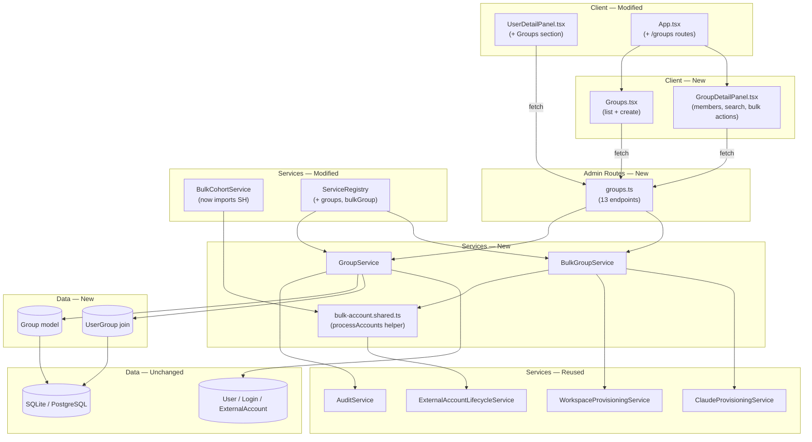

<!-- CLASI: Before changing code or making plans, review the SE process in CLAUDE.md -->

# Architecture Update — Sprint 012: App-level groups

Sprint 012 introduces a second user-grouping mechanism called **Group**
that lives entirely inside this application, independent of Google
Workspace OUs. Cohort stays as the OU-anchored 1:1 grouping (every
student belongs to exactly one cohort, each cohort maps to one OU).
Group is a many-to-many layer on top: admins can create arbitrary sets
of users and use those sets as the unit for bulk provisioning.

Name choice: "Group" (not "AppGroup"/"Team"/"Roster"). The client
codebase has no existing namespace collision. Google Workspace
"Groups" are not modelled in this project at all — the potential
confusion is paper-only.

---

## What Changed

### New data model

1. **`Group` model** — `server/prisma/schema.prisma`. Columns:
   - `id: Int @id @default(autoincrement())`
   - `name: String @unique`
   - `description: String?`
   - `created_at: DateTime @default(now())`
   - `updated_at: DateTime @updatedAt`
   - Relation: `users: UserGroup[]`

2. **`UserGroup` join model** — composite-PK `(user_id, group_id)`:
   - `user_id: Int`
   - `group_id: Int`
   - `created_at: DateTime @default(now())`
   - `@@id([user_id, group_id])`
   - `@@index([group_id])`, `@@index([user_id])`
   - FK `user` → `User` (`onDelete: Cascade`)
   - FK `group` → `Group` (`onDelete: Cascade`)

3. **`User` model** — add back-relation `groups: UserGroup[]`.
   No existing column changes.

Migration approach: `prisma db push` against the dev SQLite database
(dev DB is disposable per `.claude/rules/setup.md`). No data migration
necessary — the tables start empty.

### New services

4. **`GroupService`** — `server/src/services/group.service.ts`.
   Domain logic for the `Group` entity. Mirrors `CohortService`:
   - `create({ name, description? }, actorId)` — validates name is
     non-blank and unique, creates the row, emits `create_group`.
     Throws `ConflictError` on duplicate name, `ValidationError` on
     blank name.
   - `findById(id)` — throws `NotFoundError` if missing.
   - `findAll()` — returns groups ordered by name with member counts
     attached. The repository exposes a helper that attaches counts
     via a single query.
   - `update(id, { name?, description? }, actorId)` — updates the
     row and emits `update_group`. Same name uniqueness rules.
   - `delete(id, actorId)` — deletes the group and all its
     `UserGroup` rows inside a single `prisma.$transaction`; emits
     `delete_group`.
   - `addMember(groupId, userId, actorId)` — creates the `UserGroup`
     row; emits `add_group_member`. Throws `ConflictError` on dup,
     `NotFoundError` on missing group/user.
   - `removeMember(groupId, userId, actorId)` — deletes the join
     row; emits `remove_group_member`. Throws `NotFoundError` if not
     a member.
   - `listMembers(groupId)` — returns `{ group, users: [...] }`
     mirroring the `/admin/cohorts/:id/members` shape.
   - `searchUsersNotInGroup(groupId, q, limit)` — case-insensitive
     substring search across `User.display_name`,
     `User.primary_email`, `Login.provider_email`,
     `Login.provider_username`; excludes inactive users and users
     already in the group; returns the top `limit` matches (default
     25) with `{ id, displayName, email, matchedOn }`.
   - `listGroupsForUser(userId)` — returns `{ id, name }[]` for the
     groups the user belongs to, ordered by name.

5. **`GroupRepository`** — `server/src/services/repositories/group.repository.ts`.
   Typed CRUD:
   - `create(db, data)` / `findById(db, id)` / `findByName(db, name)`
   - `findAllWithMemberCount(db)` — uses a single Prisma `findMany`
     with `_count: { select: { users: true } }`.
   - `update(db, id, data)` / `delete(db, id)` (caller deletes
     `UserGroup` first inside the transaction).
   - `listMembers(db, groupId)` — returns users with
     `external_accounts` preloaded (same shape as cohort bulk page).
   - `searchUsersNotInGroup(db, groupId, q, limit)` — implemented as
     a Prisma `OR` across the four match fields, filtered by
     `is_active = true` and `groups: { none: { group_id: groupId } }`.
   - `listGroupsForUser(db, userId)` — returns `Group[]` joined
     through `UserGroup`.
   - `addMember(db, groupId, userId)` / `removeMember(...)` /
     `deleteMembershipsForGroup(db, groupId)`.

6. **`BulkGroupService`** — `server/src/services/bulk-group.service.ts`.
   Mirrors `BulkCohortService` but scopes to group membership instead
   of cohort. Methods:
   - `provisionGroup(groupId, accountType, actorId)`
   - `suspendAllInGroup(groupId, actorId)`
   - `removeAllInGroup(groupId, actorId)`
   - `previewCount(groupId, accountType, operation)` — optional,
     mirrors cohort preview.
   A shared helper `_processAccounts` is factored out into a new
   module `server/src/services/bulk-account.shared.ts` so
   `BulkCohortService` and `BulkGroupService` do not duplicate the
   per-account transaction + fail-soft loop. The two services still
   own their own eligibility SQL because the scoping predicates
   differ (`user: { cohort_id }` vs
   `user: { groups: { some: { group_id } } }`). This matches the
   stakeholder's guidance: "factor out a shared helper rather than
   duplicating".

### New admin API routes

7. **`adminGroupsRouter`** — `server/src/routes/admin/groups.ts`.
   Mounted under `/admin` by `admin/index.ts`. All routes require
   admin role (inherited). Endpoints:
   - `GET /admin/groups` — list with member counts.
   - `POST /admin/groups` — create (body `{ name, description? }`).
   - `GET /admin/groups/:id` — single group details.
   - `PUT /admin/groups/:id` — update name/description.
   - `DELETE /admin/groups/:id` — delete.
   - `GET /admin/groups/:id/members` — list members with their
     external accounts.
   - `POST /admin/groups/:id/members` — add member (body
     `{ userId }`).
   - `DELETE /admin/groups/:id/members/:userId` — remove member.
   - `GET /admin/groups/:id/user-search?q=...&limit=` — autocomplete
     for "add member".
   - `GET /admin/users/:id/groups` — groups a user belongs to.
   - `POST /admin/groups/:id/bulk-provision` — body
     `{ accountType: 'workspace' | 'claude' }`.
   - `POST /admin/groups/:id/bulk-suspend-all` — no body.
   - `POST /admin/groups/:id/bulk-remove-all` — no body.

   Status codes match the cohort bulk routes: 200 on full success or
   zero-eligible, 207 on partial failure, 400 on bad input, 404 on
   missing group, 409 on duplicate name/membership, 422 on blank
   name, 502 propagated from provider errors, 500 fallthrough.

### Service registry wiring

8. **`ServiceRegistry`** — `server/src/services/service.registry.ts`.
   Adds two new lazy-initialised services:
   - `groups: GroupService` — `new GroupService(defaultPrisma, this.audit)`
   - `bulkGroup: BulkGroupService` — same constructor shape as
     `bulkCohort`, sharing `externalAccountLifecycle`,
     `workspaceProvisioning`, `claudeProvisioning`.

### Client pages

9. **`/groups` list page** — `client/src/pages/admin/Groups.tsx`.
   Mirrors `Cohorts.tsx`: create form + sortable table. Columns:
   name (linked to `/groups/:id`), description, member count,
   created date.

10. **`/groups/:id` detail page** — `client/src/pages/admin/GroupDetailPanel.tsx`.
    Mirrors `CohortDetailPanel.tsx`. Sections:
    - Header: name, description, member count, **Edit** / **Delete**
      buttons. Edit opens an inline form.
    - **Bulk action buttons**: `Create League`, `Invite Claude`,
      `Suspend All`, `Delete All` — scoped to this group.
    - **Add member**: search input + dropdown list of matches (live
      autocomplete, 300 ms debounce). Clicking a match adds the
      user.
    - **Member table**: name (linked to `/users/:id`), email, League
      status pill, Claude status pill, Remove button.

11. **User detail page — Groups section** — modifications to
    `client/src/pages/admin/UserDetailPanel.tsx`. A new section
    placed between the identity card and the account cards:
    - List current memberships with per-row Remove buttons.
    - A combobox of groups the user is not in, with an Add button.

12. **Routing & navigation** — `client/src/App.tsx` adds:
    - `/groups` and `/groups/:id` routes inside `<AdminOnlyRoute>`.
    Sidebar navigation lives in `AppLayout.tsx`. A new "Groups" link
    is added there if the project surfaces a Cohorts link; otherwise
    the route is reachable from the admin Dashboard only (the
    Dashboard already links to feature pages and is the source of
    truth for primary navigation).

### Tests

13. **Server tests**:
    - `tests/server/services/group.service.test.ts` — unit tests
      for `GroupService` (create validation, uniqueness, add/remove
      member, search, cascading delete).
    - `tests/server/services/bulk-group.service.test.ts` — unit
      tests for `BulkGroupService` (eligibility SQL, fail-soft
      loop, shared helper, `suspendAllInGroup` /
      `removeAllInGroup` mixing workspace + claude).
    - `tests/server/admin-groups.routes.test.ts` — integration
      tests for every new route, structured like
      `bulk-cohort.routes.test.ts`.

14. **Client tests**:
    - `tests/client/Groups.test.tsx` — list page renders, create
      form submits, member counts shown.
    - `tests/client/GroupDetailPanel.test.tsx` — search + add,
      remove, bulk buttons call endpoints.
    - (UserDetailPanel already has a test file in Sprint 010 with
      known pre-existing drift — this sprint adds a narrow,
      self-contained test for the new Groups section rather than
      fixing the pre-existing drift.)

---

## Why

Groups serve two needs the current system can't cover cleanly:

1. **Arbitrary sets.** A student can be in exactly one cohort (OU).
   Instructors routinely want ad-hoc "this week's project team" or
   "kids trying the new curriculum" views. Today they paste emails
   into a spreadsheet and run per-user actions. Groups provide a
   persistent, app-native unit for those sets with audit trails.
2. **Bulk-provisioning surface for the LLM proxy (Sprint 013).**
   Sprint 013 will attach a token-access toggle to each group. This
   sprint puts the group skeleton, membership UX, and bulk provisioning
   in place so Sprint 013 only has to add a new bulk method and a
   button.

A native app entity keeps us out of Google Workspace write semantics
(Groups / Group membership changes require domain-wide delegation
scopes we don't have). Sync-to-Google-Group is opt-in later work
with a clean boundary: an app Group either has or does not have a
`google_group_id`; this sprint leaves the column out entirely because
we have no use for it yet and Sprint 013's LLM-proxy work only needs
the app model.

---

## New and Modified Modules

### Group model — new Prisma entities

**File:** `server/prisma/schema.prisma`

**Responsibility added:** Persist group identity (`Group`) and
user-group membership (`UserGroup`). No provisioning semantics.

**Boundary (inside):** Field definitions and FK-level constraints.

**Boundary (outside):** Does not reference any external system
(Google Workspace, Anthropic, Pike13). No foreign key to `Cohort`.

**Use cases served:** All.

### GroupService — new service

**File:** `server/src/services/group.service.ts`

**Responsibility added:** CRUD for `Group`, membership operations,
user search scoped to a group, audit-event recording.

**Boundary (inside):** Owns its transactions. Writes all five audit
actions in the same transaction as the corresponding mutation.

**Boundary (outside):** Does not provision external accounts. Does
not know about Cohorts. Search spans `User` + `Login` only.

**Use cases served:** SUC-012-001 through SUC-012-005.

### BulkGroupService — new service

**File:** `server/src/services/bulk-group.service.ts`

**Responsibility added:** Iterate a group's membership and dispatch
provisioning, suspend, or remove lifecycle operations to the existing
provisioning/lifecycle services, collecting per-user succeeded/failed
results.

**Boundary (inside):** Eligibility SQL scoped to group membership;
uses `_processAccounts` helper from the new
`bulk-account.shared.ts` module.

**Boundary (outside):** No external API knowledge. Does not handle
partial-transaction rollback — each per-account call runs in its
own `prisma.$transaction`.

**Use cases served:** SUC-012-006, SUC-012-007, SUC-012-008.

### bulk-account.shared.ts — new helper module

**File:** `server/src/services/bulk-account.shared.ts`

**Responsibility added:** Host the per-account transaction +
fail-soft loop shared by `BulkCohortService` and `BulkGroupService`.
Exports `BulkOperationResult`, `BulkOperationFailure`, `AccountType`,
and `processAccounts(prisma, externalAccountLifecycle, accounts,
actorId, operation)`.

**Boundary (inside):** Pure iteration helper, no eligibility SQL,
no provisioner dispatch.

**Boundary (outside):** Does not import Prisma model classes directly;
accepts a structural `DbClient`.

**Use cases served:** Supports SUC-012-008 and the existing cohort
bulk use cases.

### adminGroupsRouter — new route module

**File:** `server/src/routes/admin/groups.ts`

**Routes:**

| Method | Path | Description |
|---|---|---|
| GET | `/admin/groups` | List groups w/ member counts |
| POST | `/admin/groups` | Create |
| GET | `/admin/groups/:id` | Single group |
| PUT | `/admin/groups/:id` | Update name/description |
| DELETE | `/admin/groups/:id` | Delete (cascades to memberships) |
| GET | `/admin/groups/:id/members` | Members w/ external accounts |
| POST | `/admin/groups/:id/members` | Add member by user id |
| DELETE | `/admin/groups/:id/members/:userId` | Remove member |
| GET | `/admin/groups/:id/user-search` | Autocomplete for add |
| GET | `/admin/users/:id/groups` | User's group memberships |
| POST | `/admin/groups/:id/bulk-provision` | Bulk-create by type |
| POST | `/admin/groups/:id/bulk-suspend-all` | Bulk-suspend all |
| POST | `/admin/groups/:id/bulk-remove-all` | Bulk-remove all |

**Guards:** `requireAuth` + `requireRole('admin')` (inherited).

**Use cases served:** All.

### Groups.tsx / GroupDetailPanel.tsx — new client pages

**Files:** `client/src/pages/admin/Groups.tsx`,
`client/src/pages/admin/GroupDetailPanel.tsx`

**Responsibility added:** Admin UX for group CRUD, membership
management, and bulk provisioning. Styling and structure mirror
`Cohorts.tsx` / `CohortDetailPanel.tsx` (same table styles, banner
renderer, status pills).

**Use cases served:** SUC-012-001 through SUC-012-008.

### UserDetailPanel.tsx — Groups section

**File:** `client/src/pages/admin/UserDetailPanel.tsx`

**Responsibility added:** Show a user's group memberships; allow
add + remove inline.

**Use cases served:** SUC-012-004.

### ServiceRegistry — new bindings

**File:** `server/src/services/service.registry.ts`

**Responsibility added:** Construct `GroupService` and
`BulkGroupService` at registry init; expose them via the same
`req.services.*` pattern as existing services.

---

## Module Diagram



---

## Entity-Relationship Notes

New entities and relationships:

```
Group
  id  PK
  name (unique)
  description (nullable)
  created_at / updated_at

UserGroup
  user_id  FK → User.id  (onDelete: Cascade)
  group_id FK → Group.id (onDelete: Cascade)
  created_at
  @@id([user_id, group_id])
  @@index([group_id])
  @@index([user_id])
```

`User` gains a back-relation: `groups: UserGroup[]`. No existing
fields change.

**Cascading behaviour:**
- Deleting a `User` removes their `UserGroup` rows (they were a
  member of several groups; membership goes with them).
- Deleting a `Group` removes all `UserGroup` rows for that group.
  The service layer does this in a single transaction with the
  `delete_group` audit event to keep the action atomic and
  auditable.

**Why a composite PK instead of a surrogate id:**
- Natural key. The pair (user, group) is the identity of the
  membership; no consumer needs to reference a specific join row by
  surrogate id.
- Simpler unique constraint — no separate `@@unique` needed.
- Matches common idiom for M:N tables in Prisma.

---

## Audit Events

Five new action strings:

| Action | Emitted by | `target_entity_type` | `target_entity_id` | Notes |
|---|---|---|---|---|
| `create_group` | `GroupService.create` | `Group` | `group.id` | `details = { name, description }` |
| `update_group` | `GroupService.update` | `Group` | `group.id` | `details = { old, new }` |
| `delete_group` | `GroupService.delete` | `Group` | `group.id` | `details = { name, memberCount }` |
| `add_group_member` | `GroupService.addMember` | `Group` | `group.id` | `target_user_id = userId`, `details = { group_name }` |
| `remove_group_member` | `GroupService.removeMember` | `Group` | `group.id` | `target_user_id = userId`, `details = { group_name }` |

Bulk operations reuse the existing per-account actions (e.g.
`suspend_workspace`, `remove_claude`) emitted by
`ExternalAccountLifecycleService` — no new bulk-wide action is
emitted. This matches how cohort bulk ops work today and keeps the
audit log cleanly per-account.

---

## Impact on Existing Components

| Component | Impact |
|-----------|--------|
| `schema.prisma` | Additive: two new models, one back-relation on `User`. |
| `BulkCohortService` | Refactor: imports `processAccounts` from `bulk-account.shared.ts` instead of defining its own private method. Public surface unchanged. |
| `ServiceRegistry` | Additive: two new properties (`groups`, `bulkGroup`). |
| `UserDetailPanel.tsx` | Additive section: "Groups". Rest of the component untouched. |
| `App.tsx` | Additive: two new routes inside `AdminOnlyRoute`. |
| `AppLayout.tsx` | Additive: optional sidebar link to `/groups`. |
| `contracts/` (request typings) | `req.services` gains `groups` and `bulkGroup`. |
| Tests | Additive test files; no existing tests rewritten. Pre-existing button-label drift in `UserDetailPanel.test.tsx`, `Cohorts.test.tsx`, `LoginPage.test.tsx`, `UsersPanel.test.tsx` is out of scope (documented in Sprint 010/011 reflections) and not fixed here. |

---

## Migration Concerns

**Dev**: `prisma db push` applies the new `Group` and `UserGroup`
tables to the SQLite dev database. Dev DB is disposable per
`.claude/rules/setup.md`; the project prefers `db push` over
`migrate dev`.

**Prod**: The next deploy will run through whatever migration flow
the project standardises at that time. No data migration is required
because both new tables start empty.

**Backward compatibility**: All existing endpoints unchanged. All
existing tables and columns unchanged. The new service wiring uses
the standard `ServiceRegistry` additive pattern; adding a property
cannot break existing callers.

**No env var changes.**

---

## Design Rationale

### Decision 1: "Group" over "AppGroup"/"Team"/"Roster"

**Context:** The TODO calls out naming as an open question. Candidate
names are "Group", "AppGroup", "Team", and "Roster".

**Alternatives considered:**
1. `Group` — short, natural, potentially collides with Google Groups
   (which this project does not model).
2. `AppGroup` — explicit disambiguation. Verbose everywhere it appears
   in code and UI.
3. `Team` / `Roster` — require explaining that "team" does not mean
   Claude team; admins will guess wrong.

**Why option 1:** The project has no existing `Group` symbol and no
Google Groups surface. Using the plain word maximises UX clarity
("Groups" in the sidebar is obvious) and keeps the codebase readable.
If we ever add Google Group sync, the sync-source distinction can be
handled via a `google_group_id` column, not a rename.

**Consequences:** One search-engine-level confusion risk (developers
confusing `Group` with Google `Group` when grepping docs). Acceptable.

### Decision 2: Composite-PK join table, no surrogate id

**Context:** We need a user↔group M:N relationship.

**Alternatives considered:**
1. `UserGroup(user_id, group_id)` composite PK.
2. `UserGroup(id, user_id, group_id)` with a unique index on
   `(user_id, group_id)`.

**Why option 1:** No consumer needs to reference a specific
membership row by id (audit events carry `group_id` + `target_user_id`,
which uniquely identify the membership already). Composite PK is one
fewer column to maintain and avoids the implicit "id is meaningful"
read on a join table.

**Consequences:** If a future feature needs to attach attributes to
a membership row (e.g., "role within the group" or "added_by"), the
table can still evolve — a new column is easy; migrating away from a
composite PK is harder but not blocked.

### Decision 3: New bulk service, shared helper module

**Context:** Bulk operations for groups mirror bulk operations for
cohorts; only the eligibility predicate differs. The TODO says
"factor out a shared helper rather than duplicating".

**Alternatives considered:**
1. Add group methods to `BulkCohortService`. Rename it.
2. Create `BulkGroupService` alongside `BulkCohortService` and
   extract the per-account loop into a `bulk-account.shared.ts`
   module both services import.
3. Create a unified `BulkMembershipService` with a strategy argument
   that toggles between cohort and group eligibility SQL.

**Why option 2:** Option 1 bloats a service whose name now lies (it's
not cohort-specific). Option 3 is clever but hides two simple
services behind a branching strategy, making each individual bulk
operation harder to reason about. Option 2 keeps each service narrow
and testable; the shared helper captures the genuinely-common
mechanics (per-account transactions + fail-soft collection) without
forcing one service to know about the other.

**Consequences:** Three files in the bulk family instead of two. The
shared helper must be kept stable because both services depend on it.
Acceptable: the helper is tiny (≈40 lines), and its inputs are
structural enough to be trivially tested.

### Decision 4: Search is server-side, returns top-N matches

**Context:** The member-search box needs to work across
`display_name`, `primary_email`, and all associated
`Login.provider_email` / `Login.provider_username` values.

**Alternatives considered:**
1. Client-side filter of a preloaded user list.
2. Server-side search returning capped N matches with each call.

**Why option 2:** Option 1 requires shipping the entire user list to
the client whenever the admin opens `/groups/:id`; it does not scale
past ~a few thousand users and it re-ships login records purely for
search. Option 2 is cheap on the server (indexed prefix + substring
scan) and keeps the client dumb.

**Consequences:** Every keystroke triggers a request (with 300 ms
debounce in the UI). Server is authoritative for "user is already a
member" — no race-risk of stale client state.

### Decision 5: Search excludes inactive users

**Context:** "Inactive" users are soft-deleted (`is_active=false`).

**Why:** Inactive users are not ordinarily selectable anywhere in
the admin UI. Reintroducing them via group search would be a
surprise. Existing memberships with a now-inactive user stay intact
(nothing deletes the membership row on soft-delete); they surface in
the member list but cannot be added as new members via search.

### Decision 6: No LLM-proxy toggle, no default cohort, no default quota

**Context:** TODO asks whether groups should own any configuration.

**Why not in this sprint:** Keeping this sprint narrow. Sprint 013
adds the LLM-proxy toggle; that can introduce the column. Default
cohort / default quota are deferrable to a later sprint if a concrete
use case emerges. Adding config now with no use case is speculative
scope creep.

---

## Open Questions

**OQ-012-001:** Sidebar link placement. The admin sidebar lives in
`AppLayout.tsx`. Should "Groups" appear alongside "Cohorts", or on
a secondary row? This is a cosmetic decision deferred to
implementation — the expectation is alongside "Cohorts" with the
same ordering as the Dashboard cards.

**OQ-012-002:** Should `GET /admin/groups/:id/members` return
members in a stable order (alphabetical by display_name) or creation
order? We match the cohort endpoint (alphabetical by display_name)
for consistency. Flagged so a future reader does not second-guess it.
