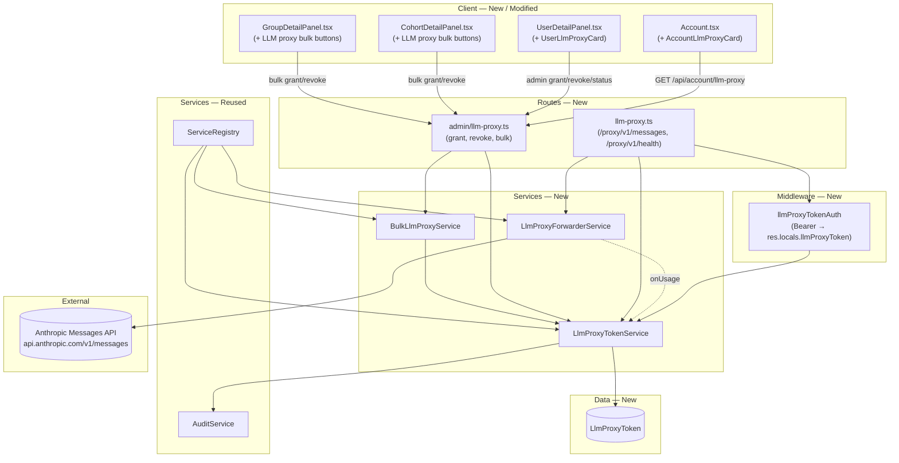

<!-- CLASI: Before changing code or making plans, review the SE process in CLAUDE.md -->

# Architecture Update -- Sprint 013: LLM proxy in-app — forwarder + per-user tokens + access control

Sprint 013 builds the LLM proxy **inside this Node application** as a
thin forwarder around the Anthropic Messages API, gated by per-user
opaque bearer tokens. It reuses the existing auth, audit, and bulk-
provisioning machinery, and keeps its surface small. The sprint depends
on Sprint 012's `Group` entity (bulk-by-group) and the
`bulk-account.shared.ts` helper.

---

## What Changed

### New data model

1. **`LlmProxyToken` model** — `server/prisma/schema.prisma`. Columns:
   - `id            Int      @id @default(autoincrement())`
   - `user_id       Int`
   - `token_hash    String   @unique` (hex SHA-256 of the opaque token)
   - `expires_at    DateTime`
   - `token_limit   Int`  (hard cut-off; zero = no calls allowed)
   - `tokens_used   Int     @default(0)`
   - `request_count Int     @default(0)`
   - `granted_by    Int?`  (actor user id; nullable so user deletion
     does not block row retention)
   - `granted_at    DateTime @default(now())`
   - `revoked_at    DateTime?`
   - `created_at    DateTime @default(now())`
   - `updated_at    DateTime @updatedAt`
   - Relations: `user User @relation(fields: [user_id], references:
     [id], onDelete: Cascade)`; `granter User? @relation("LlmProxyGranter",
     fields: [granted_by], references: [id], onDelete: SetNull)`.
   - Indexes: `@@index([user_id])`, `@@index([user_id, revoked_at,
     expires_at])` to serve the "active token for user" lookup and
     the hot-path bearer validation is served by the unique
     `token_hash` index.
2. **`User` model** — add back-relations:
   - `llm_proxy_tokens            LlmProxyToken[]`  (ownership)
   - `llm_proxy_tokens_granted    LlmProxyToken[] @relation("LlmProxyGranter")`
3. No cohort/group FK on `LlmProxyToken` — bulk origin is tracked
   purely via audit events; carrying a cohort/group FK on every token
   row adds a column whose only consumer is the audit trail that
   already captures it.

Migration approach: `prisma db push` against both the dev SQLite
database and the test database (Sprint 012 precedent). Both tables
start empty; no data migration.

### New services

4. **`LlmProxyTokenService`** — `server/src/services/llm-proxy-token.service.ts`.
   Domain logic for token granting/revocation and validation.
   - `grant(userId, { expiresAt, tokenLimit }, actorId)` →
     `{ token, row }`. Validates there is no active (non-revoked,
     non-expired) token; throws `ConflictError` if there is. Generates
     a 32-byte opaque token (`randomBytes(32).toString('base64url')`
     → 43 chars, prefixed with `llmp_` for easy identification in
     logs/pastes) and stores `sha256(token)` as the hash. Returns the
     plaintext token exactly once.
   - `revoke(userId, actorId)` → sets `revoked_at = now()` on the
     active token; throws `NotFoundError` if none.
   - `getActiveForUser(userId)` → returns the active token row (no
     plaintext).
   - `validate(token)` → looks up by hash, checks `revoked_at`,
     `expires_at`, `tokens_used < token_limit`; throws typed errors
     that the proxy route translates to HTTP codes.
   - `recordUsage(tokenId, inputTokens, outputTokens)` → atomic
     `update` that increments `tokens_used` and `request_count`.
     Runs outside a transaction — the increment is best-effort
     accounting, not a mutation that must be part of a larger write.
   All write methods record audit events in the same transaction:
   `grant_llm_proxy_token`, `revoke_llm_proxy_token`.
5. **`LlmProxyForwarderService`** — `server/src/services/llm-proxy-forwarder.service.ts`.
   Pure mechanics: hold the `ANTHROPIC_API_KEY`, expose
   `forwardMessages(req, res, { onUsage })` that proxies the request
   to `https://api.anthropic.com/v1/messages` using `fetch`. Uses the
   raw `fetch` path (not the `@anthropic-ai/sdk`) so we can stream
   SSE byte-for-byte. For non-streaming calls it parses
   `response.usage.{input_tokens,output_tokens}` from the JSON body.
   For streaming calls it transforms the upstream ReadableStream
   through a pass-through that also looks for `event: message_delta`
   frames and accumulates `usage.output_tokens` from them — the final
   value is handed to `onUsage()` once the stream finishes.
6. **`LlmProxyTokenRepository`** — `server/src/services/repositories/llm-proxy-token.repository.ts`.
   Typed CRUD:
   - `create`, `findById`, `findByHash`, `findActiveForUser`,
     `listForUser`, `incrementUsage`, `setRevokedAt`.
7. **`BulkLlmProxyService`** — `server/src/services/bulk-llm-proxy.service.ts`.
   Mirrors the shape of `BulkCohortService`/`BulkGroupService`. Two
   public methods: `bulkGrant(scope, { expiresAt, tokenLimit },
   actorId)` and `bulkRevoke(scope, actorId)`, where `scope` is a
   discriminated union `{ kind: 'cohort', id } | { kind: 'group', id }`.
   Each method:
   1. Resolves eligible users via the relevant repository.
   2. Runs per-user in its own `prisma.$transaction` (fail-soft) —
      re-using the *shape* of `bulk-account.shared.ts` but with a
      new local helper because this is token granting, not
      external-account lifecycle. The shared helper is scoped to
      `ExternalAccountLifecycleService` and is not a natural fit.
   3. Collects `{succeeded: userId[], failed: { userId, userName,
      error }[]}`.

### New bearer-auth middleware

8. **`llmProxyTokenAuth`** — `server/src/middleware/llmProxyTokenAuth.ts`.
   Reads `Authorization: Bearer …`, asks
   `LlmProxyTokenService.validate(token)`, and attaches the loaded
   row to `res.locals.llmProxyToken`. Maps typed errors to HTTP codes:
   - missing/unknown/revoked → 401
   - expired → 401 with "expired"
   - over-quota → 429

### New public route group

9. **`llmProxyRouter`** — `server/src/routes/llm-proxy.ts`. Mounted at
   `/proxy/v1` (NOT under `/api` — the path matches what Anthropic-
   compatible clients set as their `ANTHROPIC_BASE_URL`). Single
   endpoint today:
   - `POST /proxy/v1/messages` — bearer-authed forwarder. Accepts
     any JSON body; forwards to Anthropic unchanged (except strips
     any client-supplied auth header). Streaming: if the body has
     `stream: true`, pipes the upstream SSE straight to the client
     with the correct content-type; otherwise returns JSON.
   - `GET /proxy/v1/health` — unauthenticated 200 for tool
     connectivity checks. Returns `{ok: true, endpoint:
     '/proxy/v1/messages'}`.
   Missing `ANTHROPIC_API_KEY` → 503 with a clear error.

### New admin routes

10. **`adminLlmProxyRouter`** — `server/src/routes/admin/llm-proxy.ts`.
    All routes require admin role.
    - `POST   /admin/users/:id/llm-proxy-token` — grant; body
      `{expiresAt, tokenLimit}`. 201 `{token, expiresAt, tokenLimit}`.
    - `DELETE /admin/users/:id/llm-proxy-token` — revoke; 204.
    - `GET    /admin/users/:id/llm-proxy-token` — current status
      (no plaintext). 200 `{enabled, tokensUsed, tokenLimit,
      expiresAt, revokedAt}` or `{enabled: false}`.
    - `POST   /admin/cohorts/:id/llm-proxy/bulk-grant` — body
      `{expiresAt, tokenLimit}`. 200/207 with `{succeeded, failed}`.
    - `POST   /admin/cohorts/:id/llm-proxy/bulk-revoke` — no body.
      200/207.
    - `POST   /admin/groups/:id/llm-proxy/bulk-grant` — as above,
      scoped to group.
    - `POST   /admin/groups/:id/llm-proxy/bulk-revoke` — as above.

### New student-account route

11. **`/api/account/llm-proxy`** — additive route in
    `server/src/routes/account.ts`. GET returns
    `{enabled, endpoint, tokensUsed, tokenLimit, expiresAt}` when
    an active token exists, else `{enabled: false}`. Plaintext
    token is NEVER returned here — it is returned exactly once by
    the admin grant endpoint, which is the only safe moment to
    surface it. The student `/account` page instead displays the
    post-grant plaintext token through a one-shot session flash the
    first time the student loads `/account` after a grant (see
    implementation decision D2).

    **Implementation decision D2 (plaintext display):** Per the
    design doc, the plaintext token is shown *once* and only via the
    grant response. Rather than introduce a session-flash mechanism
    for students (and the risk that admins can't hand the token to
    students cleanly), the admin grant endpoint's response body
    becomes the source of truth: when granting, the admin sees the
    plaintext token immediately and must communicate it to the
    student (e.g., paste into chat). The student's `/account`
    section therefore shows only quota/expiry plus a "Contact an
    admin to rotate" note. This keeps the security model simple and
    mirrors how cohort passphrases work in the original design doc.
    The "Regenerate" functionality is out of scope per the sprint
    plan.

### Service registry wiring

12. **`ServiceRegistry`** — `server/src/services/service.registry.ts`.
    Adds four new lazy-initialised services:
    - `llmProxyTokens: LlmProxyTokenService`
    - `llmProxyForwarder: LlmProxyForwarderService`
    - `bulkLlmProxy: BulkLlmProxyService`
    (`LlmProxyTokenRepository` is a namespace of static methods, no
    registry entry.)

### App-wiring

13. **`app.ts`** — mounts the new routers:
    - `app.use('/proxy/v1', llmProxyRouter)` — NOT prefixed with
      `/api`. Anthropic-compatible clients set
      `ANTHROPIC_BASE_URL=<server-origin>/proxy/v1`.
    - `/admin/users/.../llm-proxy-token` lives inside the existing
      `adminRouter` mounted at `/api/admin`.
    - `/api/account/llm-proxy` joins the existing `accountRouter`.
14. **`ServiceRegistry.clearAll()`** — add `await (p as
    any).llmProxyToken.deleteMany()` before `user.deleteMany()` to
    preserve the FK-safe teardown order used by tests.

### Client pages

15. **`AccountLlmProxyCard`** — `client/src/pages/account/AccountLlmProxyCard.tsx`
    (new). Rendered inside `Account.tsx` after the external accounts
    section. Fetches `GET /api/account/llm-proxy`. If enabled, shows
    endpoint URL, quota bar (`tokensUsed / tokenLimit`), expiry, and
    setup snippets (curl and `ANTHROPIC_BASE_URL` env var). If not
    enabled, shows "Not enabled — ask an admin to grant access".
    The plaintext token is NEVER fetched here.
16. **`UserLlmProxyCard`** — `client/src/pages/admin/UserLlmProxyCard.tsx`
    (new). Added to `UserDetailPanel.tsx` between the identity card
    and the external-account cards. Shows current state from `GET
    /admin/users/:id/llm-proxy-token`. Three actions:
    - "Grant access" (when no active token): opens inputs for
      expiry (default +30 days) and token cap (default 1,000,000).
      On success, shows a one-shot plaintext token with Copy button
      and instructions to pass it to the student.
    - "Revoke" (when active token): confirmation → DELETE.
    - "Regenerate" is intentionally absent (see D2 above).
17. **`CohortDetailPanel`** and **`GroupDetailPanel`** — extend with
    two buttons: "Grant LLM proxy to all" and "Revoke LLM proxy
    from all". The grant button opens the expiry / cap inputs. Calls
    the bulk admin endpoints and renders the familiar
    `BulkActionDialog` success/failure breakdown.

### Tests

18. **Server tests** (under `tests/server/`):
    - `services/llm-proxy-token.service.test.ts` — unit tests for
      grant (with duplicate-active 409), revoke, validate (expired,
      revoked, over-quota), recordUsage (atomic increment).
    - `services/llm-proxy-forwarder.service.test.ts` — non-streaming
      path mocks `fetch`; streaming path uses a fake ReadableStream
      that emits two `message_delta` SSE frames and verifies the
      pass-through and usage accumulation.
    - `services/bulk-llm-proxy.service.test.ts` — cohort/group
      grant + revoke, eligibility filtering, per-user fail-soft.
    - `llm-proxy.routes.test.ts` — POST `/proxy/v1/messages` happy
      path, expired → 401, over-quota → 429, missing key → 503,
      streaming preservation.
    - `admin-llm-proxy.routes.test.ts` — grant/revoke endpoints,
      plaintext-once invariant, bulk endpoints.
    - `account-llm-proxy.routes.test.ts` — enabled + disabled
      views; never leaks plaintext.
19. **Client tests** (under `tests/client/`):
    - `AccountLlmProxyCard.test.tsx` — renders enabled + disabled
      states.
    - `UserLlmProxyCard.test.tsx` — grant flow surfaces plaintext
      once; revoke flow calls DELETE.

---

## Why

The design doc commits to a classroom-grade Claude proxy: small
audience, small blast radius, lots of demand for "just give my
students a token for this afternoon's workshop". The app already owns
identity and the grant/revoke UX (per-user, per-cohort, per-group);
moving the proxy forwarder into the same process avoids a second
deployment, a second database, and a second audit trail. Simplicity
wins.

Sprint 012 delivered `Group` and the `bulk-account.shared.ts` helper.
Sprint 013 lands the token schema, the forwarder, the admin UX, the
student UX, and the cohort/group bulk toggles — which is exactly the
work Sprint 012 set aside for this sprint.

---

## New and Modified Modules

### LlmProxyToken model — new Prisma entity

**File:** `server/prisma/schema.prisma`

**Responsibility added:** Persist per-user opaque bearer tokens with
expiry and hard token-limit quota. Track grant/revoke lifecycle and
usage counters.

**Boundary (inside):** Field definitions, FK constraints, indexes.

**Boundary (outside):** Does not reference Anthropic's API or
client-specific transport; pure persistence.

**Use cases served:** All SUC-013-*.

### LlmProxyTokenService — new service

**File:** `server/src/services/llm-proxy-token.service.ts`

**Responsibility added:** Grant / revoke / validate / record-usage for
`LlmProxyToken`. Owns the plaintext-is-shown-once invariant.

**Boundary (inside):** Writes audit events in the same transaction as
the corresponding mutation (AuditService invariant). Hashes tokens
before persistence.

**Boundary (outside):** Does not talk to Anthropic. Does not decide
HTTP status codes (the bearer-auth middleware maps typed errors).

**Use cases served:** SUC-013-001, SUC-013-002, SUC-013-003,
SUC-013-005.

### LlmProxyForwarderService — new service

**File:** `server/src/services/llm-proxy-forwarder.service.ts`

**Responsibility added:** Forward a validated proxy request to the
Anthropic Messages API using a server-side API key. Preserve
streaming. Report usage on completion.

**Boundary (inside):** Uses `fetch` directly; constructs `x-api-key`
+ `anthropic-version` headers itself.

**Boundary (outside):** Does not know about token rows or audit
events. Callers supply an `onUsage` callback.

**Use cases served:** SUC-013-003.

### BulkLlmProxyService — new service

**File:** `server/src/services/bulk-llm-proxy.service.ts`

**Responsibility added:** Iterate eligible users (cohort or group
scoped) and dispatch grant/revoke operations per user, collecting
successes and failures.

**Boundary (inside):** Eligibility SQL scoped to cohort membership or
group membership; uses `LlmProxyTokenService` for the per-user
mutation.

**Boundary (outside):** Does not handle external-account lifecycle.
Does not duplicate the `processAccounts` helper (different concern).

**Use cases served:** SUC-013-006, SUC-013-007.

### llmProxyRouter — new public route module

**File:** `server/src/routes/llm-proxy.ts`

**Responsibility added:** Serve the bearer-authed forwarder endpoint
at `/proxy/v1/messages` and a health probe at `/proxy/v1/health`.
Mounted outside `/api` so Anthropic-compatible clients can use the
origin unchanged.

**Use cases served:** SUC-013-003, SUC-013-005.

### adminLlmProxyRouter — new admin route module

**File:** `server/src/routes/admin/llm-proxy.ts`

**Routes:**

| Method | Path | Description |
|---|---|---|
| POST   | `/admin/users/:id/llm-proxy-token`           | Grant (plaintext once) |
| DELETE | `/admin/users/:id/llm-proxy-token`           | Revoke |
| GET    | `/admin/users/:id/llm-proxy-token`           | Status |
| POST   | `/admin/cohorts/:id/llm-proxy/bulk-grant`    | Bulk grant in cohort |
| POST   | `/admin/cohorts/:id/llm-proxy/bulk-revoke`   | Bulk revoke in cohort |
| POST   | `/admin/groups/:id/llm-proxy/bulk-grant`     | Bulk grant in group |
| POST   | `/admin/groups/:id/llm-proxy/bulk-revoke`    | Bulk revoke in group |

**Use cases served:** SUC-013-001, SUC-013-002, SUC-013-006,
SUC-013-007.

### accountRouter — additive endpoint

**File:** `server/src/routes/account.ts`

**Responsibility added:** GET `/api/account/llm-proxy` returns the
student's current quota/expiry/enabled state. Never returns the
plaintext token.

**Use cases served:** SUC-013-004.

### ServiceRegistry — new bindings

**File:** `server/src/services/service.registry.ts`

**Responsibility added:** Construct `LlmProxyTokenService`,
`LlmProxyForwarderService`, and `BulkLlmProxyService` at registry
init; expose via `req.services.*`.

### UserDetailPanel / CohortDetailPanel / GroupDetailPanel / Account — UI changes

**Files:** `client/src/pages/admin/UserDetailPanel.tsx`,
`client/src/pages/admin/CohortDetailPanel.tsx`,
`client/src/pages/admin/GroupDetailPanel.tsx`,
`client/src/pages/Account.tsx`.

**Responsibility added:** Render grant/revoke controls and quota
displays per SUC-013-001/002/004/006/007.

---

## Module Diagram



---

## Entity-Relationship Notes

New entity:

```
LlmProxyToken
  id            PK
  user_id       FK → User.id (onDelete: Cascade)
  token_hash    unique
  expires_at
  token_limit
  tokens_used
  request_count
  granted_by    FK → User.id (onDelete: SetNull)
  granted_at
  revoked_at
  created_at / updated_at

  @@index([user_id])
  @@index([user_id, revoked_at, expires_at])
```

`User` gains two back-relations (`llm_proxy_tokens`,
`llm_proxy_tokens_granted`). No existing columns change.

**Cascading behaviour:** Deleting a `User` removes their
`LlmProxyToken` rows (tokens have no meaning without their owner).
Deleting the granter nulls `granted_by` so the audit trail stays
intact for the user.

---

## Audit Events

Two new action strings:

| Action | Emitted by | `target_entity_type` | `target_entity_id` | Notes |
|---|---|---|---|---|
| `grant_llm_proxy_token`  | `LlmProxyTokenService.grant`  | `LlmProxyToken` | `token.id` | `target_user_id = userId`, `details = { expiresAt, tokenLimit, scope?: 'single'\|'cohort'\|'group', scopeId? }` |
| `revoke_llm_proxy_token` | `LlmProxyTokenService.revoke` | `LlmProxyToken` | `token.id` | `target_user_id = userId` |

Bulk operations emit one audit event per per-user mutation (not one
bulk-wide event), matching how cohort/group bulk ops work today.

---

## Impact on Existing Components

| Component | Impact |
|-----------|--------|
| `schema.prisma` | Additive: one new model + two back-relations on `User`. |
| `accountRouter` | Additive endpoint `/api/account/llm-proxy`. |
| `adminRouter` | Mounts the new `adminLlmProxyRouter`. |
| `app.ts` | Mounts `llmProxyRouter` at `/proxy/v1` (outside `/api`). |
| `ServiceRegistry` | Three new properties. `clearAll()` gains one deleteMany. |
| `UserDetailPanel.tsx` | Adds a card; otherwise untouched. |
| `CohortDetailPanel.tsx` / `GroupDetailPanel.tsx` | Adds two buttons + a dialog; existing bulk actions untouched. |
| `Account.tsx` | Adds a card. |
| Tests | Additive files; no existing tests rewritten. Pre-existing client drift in `UserDetailPanel.test.tsx`, `Cohorts.test.tsx`, `LoginPage.test.tsx`, `UsersPanel.test.tsx` stays out of scope (documented in Sprint 010/011/012 reflections). |

---

## Migration Concerns

**Dev**: `prisma db push` applies the new `LlmProxyToken` table to the
SQLite dev database. Then `DATABASE_URL="file:./data/test.db" npx
prisma db push` for the test database (Sprint 012 precedent).

**Prod**: The next production deploy applies the new model through
whichever migration flow the project standardises. No data migration
required; the table starts empty.

**Backward compatibility**: All existing endpoints unchanged. All
existing tables and columns unchanged.

**Env var changes**: None mandatory. `ANTHROPIC_API_KEY` is already in
dev and prod secrets (used by the Haiku merge scanner). The proxy
forwarder reuses it. If operators want a separate key for the proxy
specifically, `LLM_PROXY_ANTHROPIC_API_KEY` can be added later — the
forwarder reads `process.env.LLM_PROXY_ANTHROPIC_API_KEY ??
process.env.ANTHROPIC_API_KEY ?? ''` so that override is available
from day one without being required.

---

## Design Rationale

### Decision 1: Forwarder in-process, not a separate service

**Context:** The TODO and design doc both offer the option of running
the proxy as its own service.

**Alternatives considered:**
1. In-process forwarder inside the existing Node app.
2. Standalone service in a second container with its own DB.

**Why option 1:** Identity, cohort/group membership, audit trail,
admin UX, and the bulk-toggle pattern all already live here. A
second service would need its own auth channel to consult the same
identity + group data, doubling the operational surface for a feature
whose hot-path volume is measured in "students running a demo".

**Consequences:** The proxy shares the Node event loop with the admin
UI. If a stampede of streaming requests soaks all sockets, admin
pages feel sluggish. Acceptable given the audience size; a dedicated
service is still easy to spin out later by lifting `llmProxyRouter`
+ `LlmProxyForwarderService` + the token table into a new package.

### Decision 2: Opaque random token + SHA-256 hash, not JWT

**Context:** The sprint open question explicitly named "opaque random
+ hash vs JWT".

**Alternatives considered:**
1. Opaque random token (base64url 32 bytes) stored as SHA-256 hash.
2. JWT signed with a server secret and validated stateless.
3. JWT + DB-backed revocation list.

**Why option 1:** The design doc sketches exactly this. JWTs get us
nothing because we already hit the DB on every proxy call to
increment usage and enforce quota; stateless validation adds no
latency win. Revocation of JWTs requires a denylist table anyway
(option 3), and the combined complexity is greater than a single
hashed-opaque-token table.

**Consequences:** A row read per proxy call. This is one indexed
`findUnique` on `token_hash` — measured in microseconds on SQLite
and sub-millisecond on Postgres. Entirely acceptable for the expected
load.

### Decision 3: Hard cut-off at quota, not soft warning

**Context:** Sprint.md flags quota semantics as an open question.

**Why option 1 (hard cut-off):** Students will blow through limits
without noticing. A hard stop with a clear 429 is the cheapest way to
prevent a runaway class from consuming the whole org budget in an
afternoon. A soft warning adds a notification channel to design and
ignore.

**Consequences:** An admin mid-workshop must bump a student's cap
with a second grant (revoke + re-grant with higher cap). The admin UX
covers that in two clicks.

### Decision 4: Shared `ANTHROPIC_API_KEY`, not per-cohort keys

**Why:** Per-cohort keys are an operational burden with no benefit at
this scale. The org only has one Anthropic key to manage. If
cost-attribution per cohort becomes important, we add it via Anthropic
workspace scoping (Anthropic already supports per-workspace usage
reporting at the admin level) rather than per-cohort keys.

### Decision 5: Plaintext shown once via the admin grant response

**Context:** The design doc says "personal API token and the proxy
endpoint URL" shown once. The mechanics of "once" can be either (a)
student sees it on their own page immediately after grant, (b) admin
sees it and hands it to the student, or (c) student has a rotate
button that re-shows.

**Alternatives considered:** (a) server session-flashes the plaintext
into the student's first `/account` load after grant; (b) admin-only
plaintext reveal; (c) session-persisted student token with a rotate
button.

**Why option (b):** The simplest possible machinery — no session-
flash, no rotate route, no race where a student logs out before
seeing the token. The admin UX already exists and is the natural
surface for "create this token for Emily".

**Consequences:** An admin must communicate the token to the student
(paste into chat / email / SMS). In a classroom context — where the
whole design doc presumes the admin has a direct channel to the
cohort — this is a feature, not a bug.

### Decision 6: No `cohort_id` / `group_id` on `LlmProxyToken`

**Context:** The sprint calls these "optional".

**Why not:** Audit events already capture scope (`scope`, `scopeId`
in the `details` blob). Adding two nullable FK columns to a hot-path
table to duplicate data is overhead we don't need. If a future report
wants "all tokens granted during the September cohort", the audit
log is the authoritative source.

### Decision 7: Usage accounting is best-effort, outside a transaction

**Context:** Every proxy call must update `tokens_used` +
`request_count`.

**Why:** Usage is accounting, not security. If the update fails (DB
hiccup, server shutdown mid-request), the student gets "free" tokens
once and the quota catches up on the next call. Rolling the upstream
call into a transaction with the accounting write is absurd — we'd
have to hold the row lock for the duration of the Anthropic call.

**Consequences:** A rare undercount of `tokens_used`. Acceptable.

### Decision 8: Mount `/proxy/v1` outside `/api`

**Context:** The app already uses `/api` for everything.

**Why:** Claude Code and the VS Code extension accept
`ANTHROPIC_BASE_URL` and then append `/v1/messages`. If we put the
proxy at `/api/proxy/v1/messages`, the base URL becomes
`…/api/proxy` — awkward and implies the prefix is optional. Placing
it at `/proxy/v1` means the base URL is `<origin>/proxy`, matching
the shape of `https://api.anthropic.com/v1` → base
`https://api.anthropic.com`.

---

## Open Questions

**OQ-013-001:** Should the grant response URL-encode the token
prefix `llmp_` so accidental leakage in logs stands out? Low-value;
the prefix is already distinct. Left for the implementer.

**OQ-013-002:** Bulk grant behaviour on users who already have an
active token — skip silently or report as failed? Decision: skip
silently (count them in `skipped: number`, surface in the response
as a third bucket alongside `succeeded` / `failed`). Implementer
may deviate with a one-line justification in the PR.
