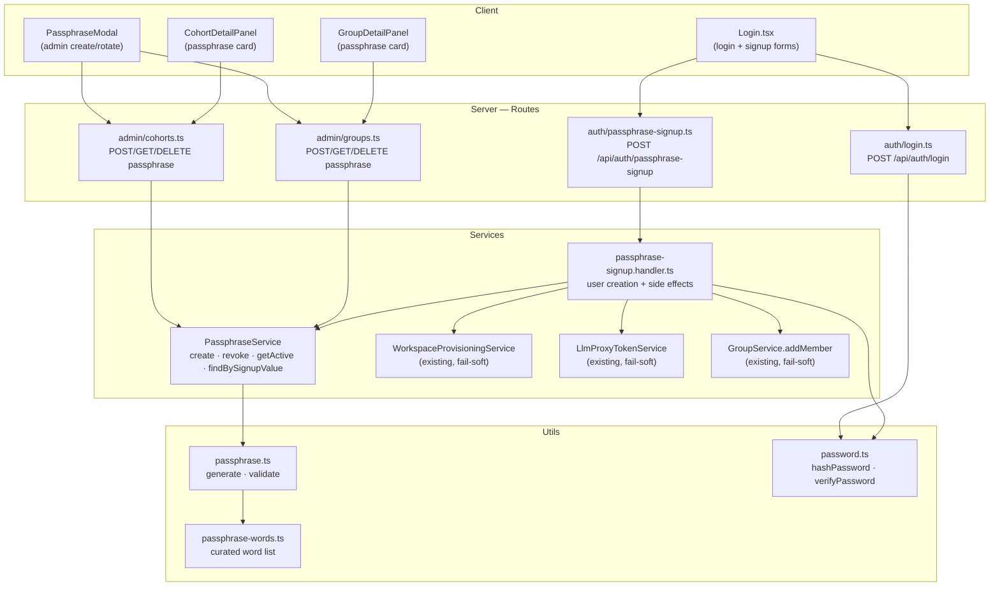
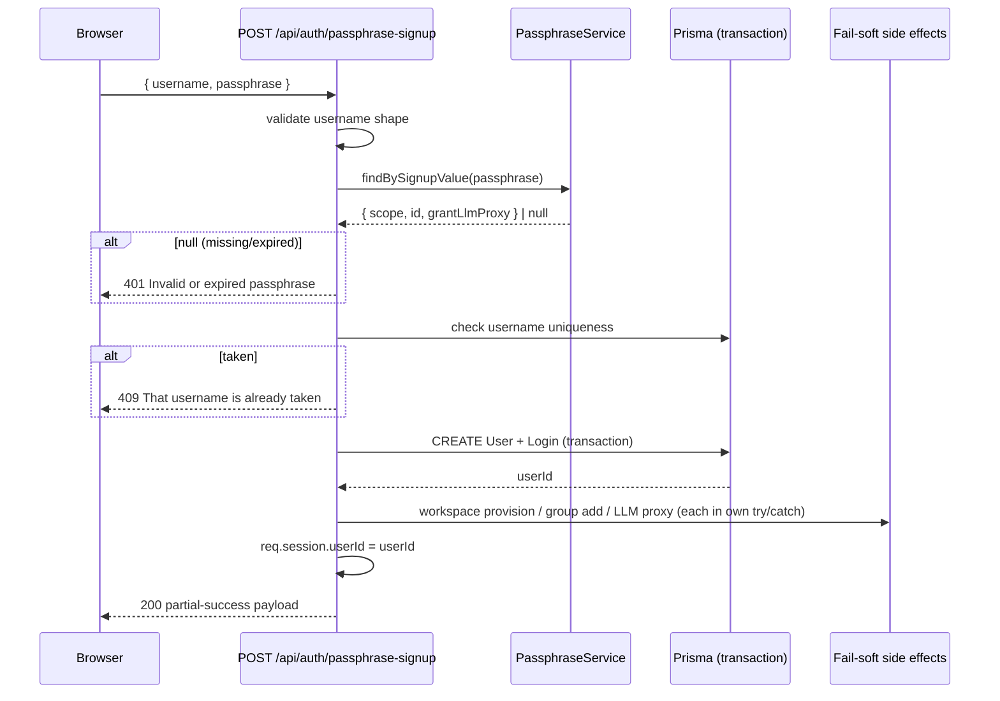
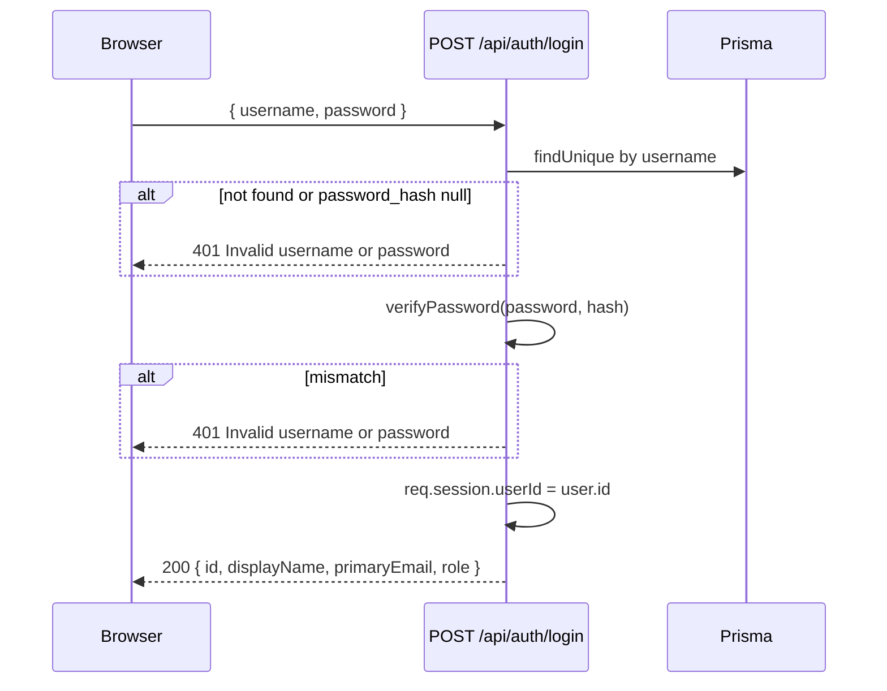

<!-- CLASI: Before changing code or making plans, review the SE process in CLAUDE.md -->

# Architecture Update — Sprint 015: Passphrase Self-Onboarding

## What Changed

### New Modules

| Module | Purpose |
|---|---|
| `server/src/utils/passphrase-words.ts` | Curated kid-safe word list (≥ 400 words) used for passphrase generation |
| `server/src/utils/passphrase.ts` | Pure helpers: `generatePassphrase`, `validatePassphraseShape` |
| `server/src/utils/password.ts` | `hashPassword` / `verifyPassword` via `crypto.scrypt` |
| `server/src/services/passphrase.service.ts` | `PassphraseService` — create/revoke/query passphrases; signup lookup |
| `server/src/services/auth/passphrase-signup.handler.ts` | Signup handler: validates, creates user, wires fail-soft side effects |
| `server/src/routes/auth/passphrase-signup.ts` | `POST /api/auth/passphrase-signup` public route |
| `server/src/routes/auth/login.ts` | `POST /api/auth/login` production username + password login |
| `client/src/components/PassphraseModal.tsx` | Admin UI: create/regenerate passphrase for a scope |

### Modified Modules

| Module | Change |
|---|---|
| `server/prisma/schema.prisma` | Add 5 passphrase fields to `Group` and `Cohort`; add `username`, `password_hash` to `User` |
| `server/src/routes/admin/cohorts.ts` | Add `POST/GET/DELETE /admin/cohorts/:id/passphrase` handlers |
| `server/src/routes/admin/groups.ts` | Add `POST/GET/DELETE /admin/groups/:id/passphrase` handlers |
| `server/src/services/service.registry.ts` | Register `passphrases: PassphraseService` |
| `server/src/routes/auth.ts` | Mount the new auth sub-routers |
| `client/src/pages/admin/CohortDetailPanel.tsx` | Mount passphrase card above member table |
| `client/src/pages/admin/GroupDetailPanel.tsx` | Mount passphrase card above member table |
| `client/src/pages/Login.tsx` | Real login endpoint; passphrase-signup disclosure panel |

---

## Data Model Changes

### Group and Cohort — passphrase fields (identical on both tables)

```
signup_passphrase                  String?
signup_passphrase_grant_llm_proxy  Boolean  @default(false)
signup_passphrase_expires_at       DateTime?
signup_passphrase_created_at       DateTime?
signup_passphrase_created_by       Int?
```

One active passphrase per scope at most. Rotation overwrites all five fields in-place. Revocation clears them. Plaintext is stored because the instructor must display it to the class; the threat model is "classroom curiosity", not internet attack.

### User — local-login credential fields

```
username       String?  @unique   -- local handle; only set for passphrase signups
password_hash  String?            -- "salt:keyHex" from crypto.scrypt; only set for passphrase signups
```

OAuth users retain `username = null` and `password_hash = null`. The `@unique` constraint on `username` is enforced at the database level; a 409 pre-check in the signup handler fires before the transaction to give a human-readable error.

### Login row for passphrase signups

`provider = 'passphrase'`, `provider_user_id = '<scope>:<scopeId>:<username>'`

This preserves the existing `(provider, provider_user_id)` unique constraint and gives the audit trail an attribution point.

---

## Component / Module Diagram



---

## Auth Flow — Passphrase Signup



---

## Auth Flow — Production Login



---

## SSE Topology

No new SSE topics or bus infrastructure. The existing `adminBus.notify()` calls are extended:

- Admin passphrase create/revoke → `notify('cohorts')` or `notify('groups')`
- Passphrase signup → `notify('users')` + scope topic

The React Query hooks in `CohortDetailPanel` and `GroupDetailPanel` already subscribe to `cohorts` and `groups` topics via `useAdminEventStream.ts`; passphrase card data is invalidated automatically on any mutation.

---

## Security Posture

This is explicitly **classroom-grade** security:

| Concern | Decision | Rationale |
|---|---|---|
| Passphrase storage | Plaintext on parent row | Instructor must display it; 1-hour TTL limits exposure |
| Student password | `crypto.scrypt` hash (salt:keyHex) | Node built-in, no extra dep; adequate for a closed classroom tool |
| Comparison | `crypto.timingSafeEqual` | Prevents timing oracle on password verify |
| Login enumeration | Generic 401 for both "no user" and "wrong password" | Does not reveal whether a username exists |
| Passphrase expiry | Lazy check at signup time only | Rotation/revoke is the instructor's control mechanism |
| Internet exposure | This app is an internal tool, not internet-exposed | Lowers the bar from web-app-grade to classroom-grade |

---

## Why

Students join the platform during class sessions. The current OAuth-then-admin-approve flow requires admin intervention that cannot realistically happen within the first 5 minutes of class. Passphrase signup removes that bottleneck entirely: the instructor creates a passphrase once, shares it, and students are live.

The username + passphrase login is needed so students can return to their accounts in subsequent sessions without triggering the OAuth flow they may not have set up.

---

## Impact on Existing Components

- **Auth router** (`server/src/routes/auth.ts`): mounts two new sub-routers; no changes to existing OAuth routes.
- **ServiceRegistry**: gains a `passphrases` slot; all existing services are unchanged.
- **CohortDetailPanel / GroupDetailPanel**: gain a passphrase card section; all existing functionality is unchanged.
- **Login.tsx**: the username/password form is re-pointed from `/api/auth/test-login` to `/api/auth/login`; a disclosure panel is added below the OAuth buttons. `/api/auth/test-login` itself is untouched.
- **Prisma schema**: additive fields only; existing queries are unaffected; dev DB uses `prisma/sqlite-push.sh` (no migration history in dev).

---

## Migration Concerns

- Dev DB: run `prisma/sqlite-push.sh` to apply schema additions. No migration history is needed; dev DB is disposable.
- Production DB: standard Prisma migration required before deploying; all new fields are nullable so existing rows are unaffected.
- No breaking API changes. No existing session or OAuth logic is modified.

---

## Design Rationale

**Decision**: Store passphrase plaintext on the parent row rather than a salted hash.
**Context**: The instructor must display the passphrase to students. A hashed value would require a different display mechanism (e.g., storing plaintext separately and showing it only once, or an extra column).
**Alternatives considered**: Store plaintext only at creation time, return it in the API response, discard it after — this prevents "rotate and display the existing passphrase" and makes the admin UX awkward.
**Why this choice**: Storing it plaintext keeps the admin UX simple: `GET /admin/<scope>/:id/passphrase` returns the live passphrase at any time. The 1-hour TTL is the primary mitigation.
**Consequences**: If an attacker reads the DB, they can see active passphrases. Acceptable given the classroom context and internal-tool threat model.

---

**Decision**: Use `provider='passphrase'` + `provider_user_id='<scope>:<id>:<username>'` in the `Login` table.
**Context**: The `Login` table enforces `(provider, provider_user_id)` uniqueness and is used for audit attribution.
**Alternatives considered**: Skip the `Login` row entirely, using only `User.username` for identity — this breaks the audit trail and the existing `req.session.userId` abstraction.
**Why this choice**: Reuses the existing identity model with zero schema changes to `Login`; the compound key format encodes scope for attribution.
**Consequences**: Username changes would orphan the `Login` row (not a concern for v1 — usernames are immutable).

---

## Open Questions

None. All decisions in the source TODO (`plan-passphrase-self-onboarding.md`) have been signed off by the stakeholder.
