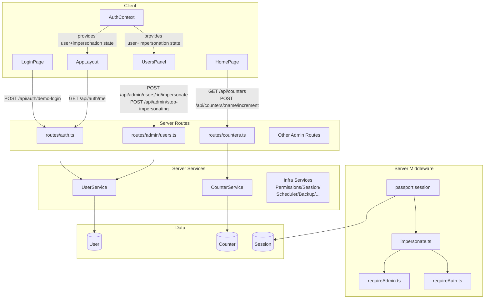
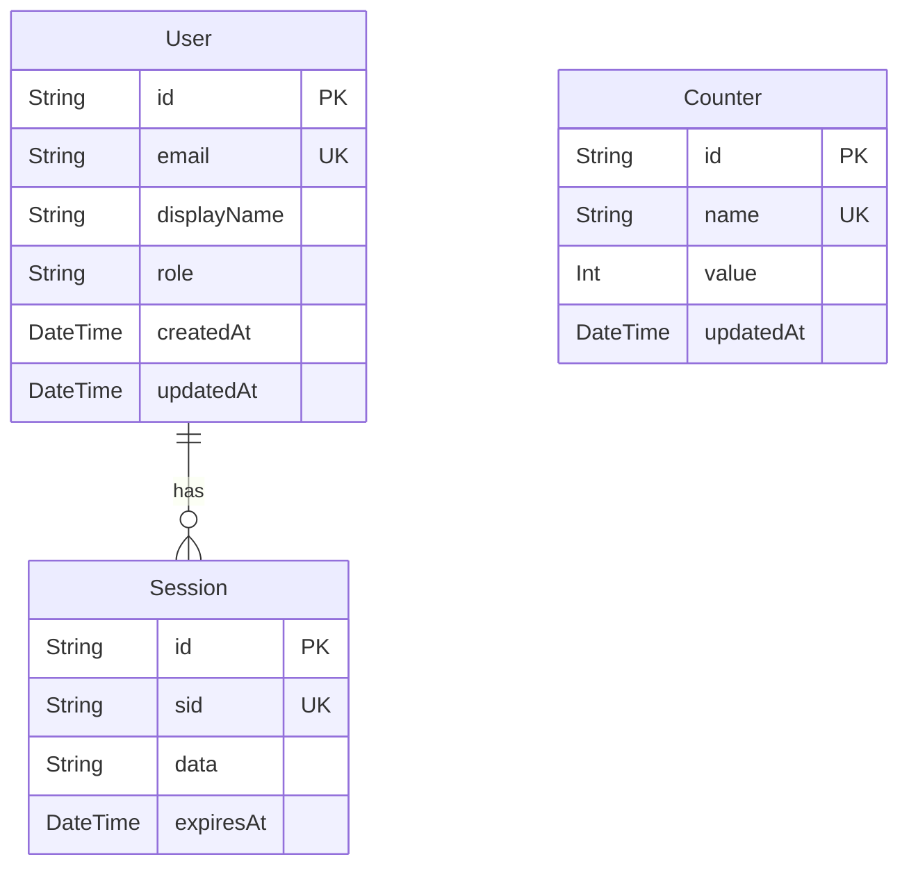

<!-- CLASI: Before changing code or making plans, review the SE process in CLAUDE.md -->

# Architecture Update — Sprint 018: Template Reset, Admin Impersonation, and Docs Migration

## What Changed

### Data Model

**Removed (all LEAGUEhub domain models from Sprint 017):**
- Models: `Instructor`, `Student`, `InstructorStudent`, `MonthlyReview`, `ReviewTemplate`,
  `ServiceFeedback`, `Pike13Token`, `TaCheckin`, `AdminNotification`, `VolunteerHour`,
  `StudentAttendance`, `VolunteerSchedule`, `VolunteerEventSchedule`, `Pike13AdminToken`,
  `AdminSetting`
- Enum: `ReviewStatus`
- Relation fields off `User`: `instructors`, `notifications`

**Added:**
- Model: `Counter` — `id String @id @default(uuid())`, `name String @unique`,
  `value Int @default(0)`, `updatedAt DateTime @updatedAt`

**User model:** relation fields removed; otherwise unchanged (`id`, `email`, `displayName`,
`role`, `createdAt`, `updatedAt`, `sessions`).

### Server: Services

**Removed (all LEAGUEhub domain services):**
- `InstructorService`, `StudentService`, `ReviewService`, `TemplateService`,
  `CheckinService`, `FeedbackService`, `EmailService`, `Pike13SyncService`,
  `VolunteerService`, `ComplianceService`, `NotificationService`

**Added:**
- `CounterService` (thin; may be inline in route handler given simplicity) — provides
  `list()` and `increment(name: string)` with upsert semantics.

**Kept (unchanged):**
- `UserService`, `PermissionsService`, `SessionService`, `SchedulerService`,
  `BackupService`, `DbIntrospector`, `LogBuffer`, `PrismaSessionStore`

### Server: Routes

**Removed:**
- `routes/instructor.ts`, `routes/reviews.ts`, `routes/templates.ts`,
  `routes/checkins.ts`, `routes/feedback.ts`, `routes/pike13.ts`
- `routes/admin/instructors.ts`, `routes/admin/compliance.ts`,
  `routes/admin/volunteer-hours.ts`, `routes/admin/admin-feedback.ts`,
  `routes/admin/notifications.ts`

**Added:**
- `routes/counters.ts` — `GET /api/counters`, `POST /api/counters/:name/increment`
- `routes/auth.ts` — new endpoint `POST /api/auth/demo-login` added; OAuth strategy
  registrations (Pike13/Google/GitHub) removed; Passport local serialization retained
- `routes/admin/users.ts` — new: `POST /admin/users/:id/impersonate`,
  `POST /admin/stop-impersonating`; existing user CRUD unchanged
- `routes/auth.ts` (`GET /api/auth/me`) — extended with `impersonating: boolean`,
  `realAdmin: { id, displayName } | null`

**Kept (unchanged):**
- `routes/admin/auth.ts`, `routes/admin/backups.ts`, `routes/admin/config.ts`,
  `routes/admin/db.ts`, `routes/admin/env.ts`, `routes/admin/logs.ts`,
  `routes/admin/permissions.ts`, `routes/admin/scheduler.ts`, `routes/admin/sessions.ts`,
  `routes/health.ts`, `routes/github.ts`, `routes/integrations.ts`

### Server: Middleware

**Removed:**
- `middleware/requireInstructor.ts`

**Modified:**
- `middleware/impersonate.ts` — no code change; now mounted in `app.ts` (was written but
  dormant). Reads `req.session.impersonatingUserId`; if set, swaps `req.user` and sets
  `req.realAdmin`.
- `middleware/requireAdmin.ts` — updated to check `req.realAdmin.role` when
  `req.realAdmin` is present, falling back to `req.user.role` otherwise.

**Kept (unchanged):**
- `middleware/requireAuth.ts`, `middleware/errorHandler.ts`, `middleware/mcpAuth.ts`

### Server: app.ts

**Removed:** registration of domain routers (`/api/instructor`, `/api/reviews`,
`/api/templates`, `/api/checkins`, `/api/feedback`, `/api/pike13`).

**Added:** `impersonateMiddleware` mounted after `passport.session()` (before all routes);
`countersRouter` registered at `/api/counters`.

### Client: Pages

**Removed:**
- `pages/DashboardPage.tsx`, `pages/ReviewListPage.tsx`, `pages/ReviewEditorPage.tsx`,
  `pages/TemplateListPage.tsx`, `pages/TemplateEditorPage.tsx`, `pages/CheckinPage.tsx`,
  `pages/FeedbackPage.tsx`, `pages/PendingActivationPage.tsx`, `pages/LoginPage.tsx`
  (replaced)

**Added:**
- `pages/HomePage.tsx` — displays `alpha` and `beta` counters fetched via React Query;
  each counter has a button that POSTs to increment and invalidates the query.
- `pages/Login.tsx` (or replaces existing `Login.tsx`) — username/password form with
  `user`/`pass` pre-fill; submits to `/api/auth/demo-login`; shows error on 401.

**Kept (unchanged):**
- `pages/About.tsx`, `pages/Account.tsx`, `pages/McpSetup.tsx`, `pages/NotFound.tsx`,
  `pages/Home.tsx` (replaced by HomePage — the old Home.tsx may be removed),
  all admin pages except those listed under removed.

### Client: Admin Pages

**Removed:**
- `pages/admin/InstructorListPanel.tsx`, `pages/admin/CompliancePanel.tsx`,
  `pages/admin/VolunteerHoursPanel.tsx`, `pages/admin/AdminFeedbackPanel.tsx`

**Kept (unchanged):**
- `pages/admin/AdminDashboardPanel.tsx`, `pages/admin/AdminLayout.tsx`,
  `pages/admin/AdminLogin.tsx`, `pages/admin/ConfigPanel.tsx`,
  `pages/admin/DatabaseViewer.tsx`, `pages/admin/EnvironmentInfo.tsx`,
  `pages/admin/ImportExport.tsx`, `pages/admin/LogViewer.tsx`,
  `pages/admin/PermissionsPanel.tsx`, `pages/admin/ScheduledJobsPanel.tsx`,
  `pages/admin/SessionViewer.tsx`, `pages/admin/UsersPanel.tsx` (modified — see below)

**Modified:**
- `pages/admin/UsersPanel.tsx` — "Impersonate" button added to each user row (own row
  excluded); calls `POST /api/admin/users/:id/impersonate`, reloads page on success.

### Client: Components

**Removed:**
- `components/InstructorLayout.tsx`
- `components/MonthPicker.tsx` (if domain-specific)

**Modified:**
- `components/AppLayout.tsx` — nav arrays updated: MAIN = [Home], BOTTOM = [MCP Setup,
  About], ADMIN_ONLY = [Configuration (→ /admin/config), Admin]; Pike13 branding removed;
  impersonation banner added above topbar when `user.impersonating` is true; "Stop
  impersonating" button replaces "Log out" in account dropdown during impersonation.
- `context/AuthContext.tsx` — `loginWithCredentials(username, password)` helper added;
  `AuthUser` type extended with `impersonating?: boolean`, `realAdmin?: { id, displayName }`.

### Client: App.tsx Route Table

Domain routes (`/dashboard`, `/reviews/*`, `/templates/*`, `/checkins`, `/feedback/:token`,
`/pending-activation`) removed. `/` → `HomePage` added.

### Server Dependencies (package.json)

**Removed:** `@sendgrid/mail`, `groq-sdk` (no longer needed after domain removal).

### Docs / Rules

**Moved to `.claude/rules/` with `paths:` front matter:**
`docs/api-integrations.md`, `docs/deployment.md`, `docs/secrets.md`, `docs/setup.md`,
`docs/template-spec.md` — originals deleted from `docs/`.

**Updated:** `CLAUDE.md` Documentation table — rows for migrated files removed or replaced
with note that they are auto-loaded as rules.

---

## Why

Sprint 017 introduced the full LEAGUEhub domain (15 Prisma models, 11 services, 6 route
files, 10+ pages) to serve a specific production application. This made the template unusable
as a generic starter for new projects. Sprint 018 reverts the domain layer while preserving
all accumulated infrastructure (Docker, CLASI, admin panels, Prisma dual-DB, Passport,
ServiceRegistry). The counter demo is chosen for its simplicity: two models, two buttons,
one route file, no auth complexity beyond basic session.

The impersonation middleware was written in an earlier sprint as a standalone file but never
activated. This sprint activates it with minimal changes — mounting in `app.ts` and wiring
the `requireAdmin` guard — plus the API surface and UI needed to actually use it.

The docs migration removes human-facing clutter from `docs/` for files that are purely
agent-context material, ensuring agents auto-load them without manual lookup.

---

## Component Diagram

## Entity-Relationship Diagram (Post-Sprint Data Model)

Note: All 15 LEAGUEhub domain models and their relations are absent from this diagram.

---

## Impact on Existing Components

| Component | Impact |
|-----------|--------|
| `ServiceRegistry` | 11 LEAGUEhub services unregistered; `CounterService` registered |
| `app.ts` | Domain routers removed; `countersRouter` added; `impersonateMiddleware` mounted |
| `App.tsx` | Domain routes removed; `/` → `HomePage` added |
| `Passport deserializeUser` | Instructor record loading removed; simplified to User-only |
| `requireAdmin` | Guard updated to check `req.realAdmin` during impersonation |
| `AppLayout` | Nav arrays trimmed; impersonation banner + stop-impersonating action added |
| Admin panels (generic) | Unchanged — Users/Env/DB/Config/Logs/Sessions/Permissions/Scheduler/Import-Export all kept |
| `AuthContext` | Extended type + `loginWithCredentials` helper |

---

## Migration Concerns

**Database migration:**
A new Prisma migration must be created that drops all 15 LEAGUEhub tables and adds the
`Counter` table. The dev SQLite database will be reset. No production data exists, so no
data migration is needed.

**Seed script:**
A seed script must insert `Counter` rows for `alpha` and `beta` with `value = 0`. Run
automatically via `prisma db seed` after migration.

**Server dependencies:**
`@sendgrid/mail` and `groq-sdk` should be removed from `package.json` and `package-lock.json`
after confirming no remaining imports. Run `npm install` to update the lockfile.

**Session store:**
No session schema change. Existing sessions will be invalidated by the database reset (SQLite
file removed), which is acceptable in dev.

**Environment variables:**
`PIKE13_CLIENT_ID`, `PIKE13_CLIENT_SECRET`, `SENDGRID_API_KEY`, `GROQ_API_KEY` references
should be removed from `.env.example` and `config/dev/public.env` if present. Check for
references in `config/` files.

---

## Design Rationale

### Decision: Strip-in-place rather than git rollback

**Context:** Sprint 017 added LEAGUEhub domain; we want to undo it. Commits `ac0606c` through
`f710d7d` added Docker, CLASI scaffolding, and config changes after the LEAGUEhub merge.

**Alternatives considered:**
1. `git reset --hard` to pre-017 state — loses all post-017 infrastructure commits.
2. Cherry-pick infrastructure commits onto a clean branch — fragile; high risk of conflicts.
3. Surgical deletion on current branch — preserves all infrastructure; known-good state.

**Choice:** Surgical deletion (option 3). Confirmed by stakeholder.

**Consequences:** Implementation tickets must be careful to delete only domain files and not
accidentally remove infrastructure that was added after 017.

### Decision: Two hardcoded credential pairs instead of configurable seed users

**Context:** The template needs a login mechanism that works without any external OAuth
provider and requires zero setup by the developer cloning the template.

**Alternatives considered:**
1. Configurable credentials via `.env` — adds setup friction.
2. Single admin account only — doesn't demonstrate role-based access.
3. Two hardcoded pairs (`user`/`pass` → USER, `admin`/`admin` → ADMIN) — zero setup, demos
   role switching.

**Choice:** Option 3. Confirmed by stakeholder.

**Consequences:** Credentials are intentionally obvious (this is a demo template, not
production). The `finds-or-creates` pattern means the database doesn't need to be seeded
with user records separately.

### Decision: Counter auto-upsert on first increment

**Context:** Counter rows for `alpha` and `beta` are seeded, but the route should be robust
if a seed has not been run.

**Choice:** `POST /api/counters/:name/increment` uses Prisma `upsert` semantics — creates
the row with `value = 1` on first call if absent. This makes the endpoint idempotent from
the caller's perspective.

**Consequences:** Counters with arbitrary names can be created by authenticated users calling
the API directly. Acceptable for a demo template.

### Decision: Impersonation state in session (not JWT claims)

**Context:** The app already uses express-session. Impersonation is a server-side concept.

**Choice:** Store `impersonatingUserId` and `realAdminId` in `req.session`. The existing
`impersonate.ts` middleware already implements this pattern — no architectural change.

**Consequences:** Impersonation does not survive session expiry (acceptable). All tabs in the
same browser share the session, so impersonation is visible across tabs (acceptable).

---

## Open Questions

1. **`docs/secrets.md` overlap with `.claude/rules/secrets.md`:** An existing
   `secrets.md` already exists in `.claude/rules/`. Ticket 010 must review both files and
   decide whether to merge, replace, or rename the migrated version to avoid collision.

2. **Server dependency audit:** Confirm `@sendgrid/mail` and `groq-sdk` are not referenced
   anywhere other than LEAGUEhub services before removing from `package.json`.

3. **`github.ts` and `integrations.ts` routes:** These were not introduced by Sprint 017
   and are not explicitly LEAGUEhub domain routes. Ticket 001 should confirm they are
   infrastructure (not domain) before preserving them.

4. **Existing `Home.tsx` vs new `HomePage.tsx`:** The codebase has both `Home.tsx` and
   a nascent `LoginPage.tsx`. Clarify which replaces which during ticket 002/005 execution to
   avoid dead file accumulation.
