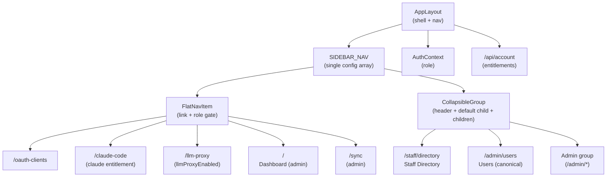
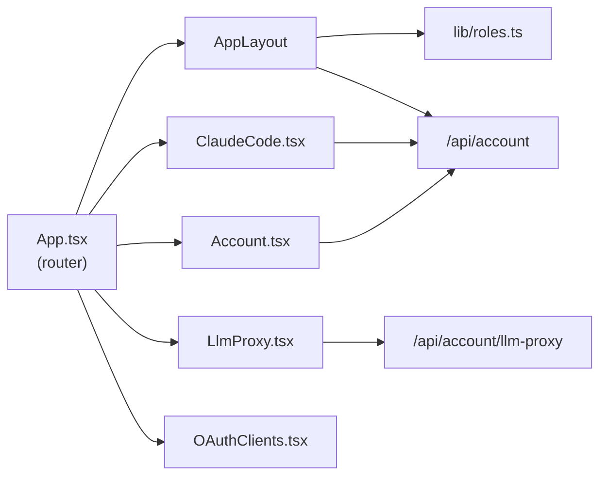
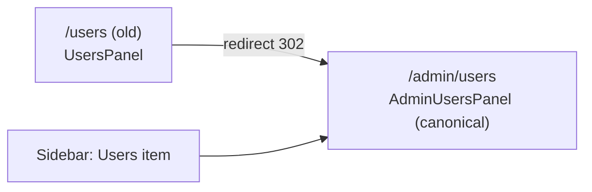

<!-- CLASI: Before changing code or making plans, review the SE process in CLAUDE.md -->

# Architecture Update — Sprint 021: Sidebar cleanup

## Sprint Changes Summary

**Client-only sprint. No server changes.**

| Category | Items |
|---|---|
| Deleted (client) | `Services.tsx`, `Services.test.tsx` |
| Added (client) | `ClaudeCode.tsx`, `LlmProxy.tsx`, `ClaudeCode.test.tsx`, `LlmProxy.test.tsx` |
| Modified (client) | `AppLayout.tsx` (nav redesign), `App.tsx` (routes), `Account.tsx` (restore workspace block), `AppLayout.test.tsx` (rewrite) |

---

## Step 1: Problem Understanding

Sprint 020 left the sidebar in a structurally problematic state: three
separate nav arrays (`APP_NAV`, `ADMIN_WORKFLOW_NAV`, `ADMIN_NAV`) plus an
`isAdminSection` flag that swaps the entire primary nav when the URL is under
`/admin/*`. This morph is disorienting and was explicitly called out by the
stakeholder. Additionally, the Services page acts as a consolidation landing
that nobody lands on successfully — individual entitlements should be their own
sidebar items. User-management pages are scattered at the top level rather than
grouped.

---

## Step 2: Responsibilities

**R1 — Unified nav configuration:** One data structure that represents all nav
items for all roles, supporting both flat links and collapsible groups.

**R2 — Entitlement-gated sidebar items:** Claude Code and LLM Proxy links
appear only when the user's account data confirms the entitlement. This
requires the nav to consult account data, not just the user's role.

**R3 — Collapsible group navigation:** A group header is both a toggle and a
navigation target (default child). Expand/collapse state is maintained in
component state (localStorage persistence is a nice-to-have, not required).

**R4 — Entitlement page content:** `ClaudeCode.tsx` and `LlmProxy.tsx` own
the content that was in `Services.tsx`. Each is a self-contained page.

**R5 — Workspace temp-password restoration:** `Account.tsx` restores the
workspace email + temp-password display that was moved to `Services.tsx` in
sprint 020.

**R6 — Route consolidation:** `/users` and `/admin/users` converge to one
canonical route with a redirect on the other.

---

## Step 3: Module Definitions

### `AppLayout` (modified)

**Purpose:** Render the application shell — sidebar, topbar, content outlet —
using a single stable nav configuration for all routes.

**Boundary (in):** Nav configuration data (`SIDEBAR_NAV`), `useAuth` context,
account data fetch for entitlement-gated items.

**Boundary (out):** Does not know about page content; does not vary nav shape
based on URL path prefix.

**Use cases:** SUC-001, SUC-002, SUC-003, SUC-004

### `ClaudeCode` page (new)

**Purpose:** Display Claude Code onboarding instructions to a student who has
a `claude` ExternalAccount.

**Boundary (in):** Account data (fetched via `/api/account`); `claude`
ExternalAccount status.

**Boundary (out):** No server mutations; no shared state.

**Use cases:** SUC-002

### `LlmProxy` page (new)

**Purpose:** Display LLM Proxy endpoint, token, quota, and usage snippet to a
student with `llmProxyEnabled`.

**Boundary (in):** LLM proxy status from `/api/account/llm-proxy`.

**Boundary (out):** No server mutations.

**Use cases:** SUC-003

### `Account` page (modified)

**Purpose:** Identity management — profile, logins, username/password,
workspace email + temp-password.

**Boundary change:** Re-adds the Workspace temp-password display block
(removed in sprint 020 when the Services page was introduced; now returned
here since Services is being deleted).

**Use cases:** SUC-001 (indirect — Account remains accessible via user-menu)

### `Services` page (deleted)

Reason: Superseded. Claude Code and LLM Proxy become their own pages.
Workspace block returns to Account. The empty-state path served no user need.

---

## Step 4: Diagrams

### Component diagram — new sidebar architecture

### Module dependency graph — client pages

### Route consolidation

`AdminUsersPanel` is the canonical choice because it sits behind the
`/api/admin/check` gate and has the richer feature set. `/users` (previously
the `ADMIN_WORKFLOW_NAV` entry) redirects to `/admin/users`. The sidebar User
Management group links directly to `/admin/users`.

---

## What Changed

### Deleted Modules (Client)

| Module | Reason |
|---|---|
| `client/src/pages/Services.tsx` | Superseded: Claude Code and LLM Proxy become own pages; Workspace block returns to Account. |
| `tests/client/pages/Services.test.tsx` | Tests for deleted page. |

### Added Modules (Client)

| Module | Purpose |
|---|---|
| `client/src/pages/ClaudeCode.tsx` | Claude Code onboarding instructions; shown only when user has a `claude` ExternalAccount. Mounted at `/claude-code` under `AppLayout`. Content migrated from `ClaudeCodeSection` in `Services.tsx`. |
| `client/src/pages/LlmProxy.tsx` | LLM Proxy endpoint, token, quota; shown only when `llmProxyEnabled`. Mounted at `/llm-proxy` under `AppLayout`. Content migrated from `LlmProxySection` in `Services.tsx`. |
| `tests/client/pages/ClaudeCode.test.tsx` | Entitlement gating and content rendering for ClaudeCode page. |
| `tests/client/pages/LlmProxy.test.tsx` | Entitlement gating and content rendering for LlmProxy page. |

### Modified Modules (Client)

| Module | Change |
|---|---|
| `client/src/components/AppLayout.tsx` | Replace `APP_NAV` + `ADMIN_WORKFLOW_NAV` + `ADMIN_NAV` + `isAdminSection` branch with a single `SIDEBAR_NAV` config supporting flat items and collapsible group entries. Fetch account data (`useQuery(['account'])`) to resolve entitlement gates for Claude Code and LLM Proxy items. Remove "Back to App" mode-switch link. Remove Account and Services from nav. Add User Management collapsible group (default child: `/staff/directory`). Add Admin collapsible group for `/admin/*` ops pages. Dashboard and Sync remain as flat items (admin-gated). |
| `client/src/pages/Account.tsx` | Restore Workspace email + temp-password display block (was in `Services.tsx` since sprint 020; returns here on Services deletion). Source from `ServicesSection` in `Services.tsx` before that file is deleted. |
| `client/src/App.tsx` | Add `/claude-code` and `/llm-proxy` routes under `AppLayout`. Remove `/services` route. Add `<Route path="/users" element={<Navigate to="/admin/users" replace />} />` redirect. Remove `Services` import. |
| `tests/client/AppLayout.test.tsx` | Substantially rewrite: assert single-nav structure, no-morph on `/admin/*` navigation, User Management group expand-and-navigate behaviour, entitlement gates for Claude Code and LLM Proxy items, Admin group presence for admin role. |

---

## Why

The three-array nav with an `isAdminSection` swap was a sprint 020 stopgap.
The stakeholder explicitly flagged the morph as wrong UX. Promoting individual
services to their own pages gives users a direct path; the Services aggregation
page solved a problem that the sidebar role-gating already handles better.
Grouping user-management pages reduces sidebar clutter and makes the
information architecture match the domain model (users, cohorts, groups are
all "user management" concerns).

---

## Impact on Existing Components

- `AppLayout` changes its nav rendering entirely. Any test that asserts
  specific nav items by label must be updated (`AppLayout.test.tsx` is
  substantially rewritten in ticket 006).
- `Services.tsx` is deleted; its import in `App.tsx` is removed.
- `Account.tsx` gains a Workspace block; its existing tests must account for
  the new section (or the block must be conditionally rendered so existing
  test setups still pass).
- `AdminUsersPanel` becomes the canonical users page; `UsersPanel` is left
  in place with its route redirected. A follow-up sprint may delete it.
- `AdminLayout` continues to wrap the `/admin/*` ops pages (unchanged). It is
  no longer the trigger for a sidebar swap because `isAdminSection` is removed.

---

## Migration Concerns

No server changes, no database migration, no Prisma schema changes.

The `/users` → `/admin/users` redirect is a client-side React Router
`<Navigate>` element; no server redirect needed.

The old `/services` URL becomes a 404 (caught by the `*` route in `App.tsx`).
No redirect is added — the route existed only since sprint 020 and no external
links are expected.

---

## Design Rationale

### Decision: Single SIDEBAR_NAV config array instead of three separate arrays

**Context:** Sprint 020 used `APP_NAV`, `ADMIN_WORKFLOW_NAV`, and `ADMIN_NAV`
that were conditionally composed based on `isAdminSection` and role.

**Alternatives considered:**
1. Keep three arrays, fix the morph by not swapping on route change (always
   show all three sections). Rejected: still three sources of truth; ordering
   becomes fragile.
2. Single array with a `CollapsibleGroup` type, rendered by one loop.
   Chosen: one source of truth, easy to read and reorder, collapse state is
   self-contained.

**Why this choice:** A single config array satisfies the cohesion test (one
reason to change: "what nav items exist"), eliminates the `isAdminSection`
branch, and makes the no-morph invariant trivially true — the array never
changes at runtime.

**Consequences:** The render loop handles two item shapes (`flat` and `group`).
Entitlement gates for Claude Code / LLM Proxy require account data in
`AppLayout`, added via `useQuery(['account'])` which shares the React Query
cache with the Account page.

### Decision: AdminUsersPanel as canonical users page

**Context:** `/users` (`UsersPanel`) and `/admin/users` (`AdminUsersPanel`)
are overlapping pages that both list users.

**Why AdminUsersPanel:** It sits behind `/api/admin/check` which is the
correct access gate; it has the richer feature set (impersonation, role edits).
The sidebar User Management group links to `/admin/users` directly.

**Consequences:** `UsersPanel` is left in place (route redirects away from it)
to avoid churn. A follow-up sprint can delete it once references are audited.

---

## Open Questions

1. **Entitlement fetch cache key:** The implementor must confirm that
   `AppLayout`'s `useQuery` for account data uses `['account']` — the same key
   as `Account.tsx` — to avoid a double fetch when the user navigates to the
   Account page.

2. **localStorage collapse persistence:** The plan calls this a "nice-to-have."
   The implementor may omit it and default groups to collapsed (with active-path
   auto-expansion being sufficient). This decision does not need stakeholder
   input.

3. **UsersPanel deletion:** The current plan redirects `/users` to
   `/admin/users` and leaves `UsersPanel.tsx` in place. If the implementor
   finds no other references to `UsersPanel`, it may be deleted in this sprint.
   Either outcome is acceptable.
