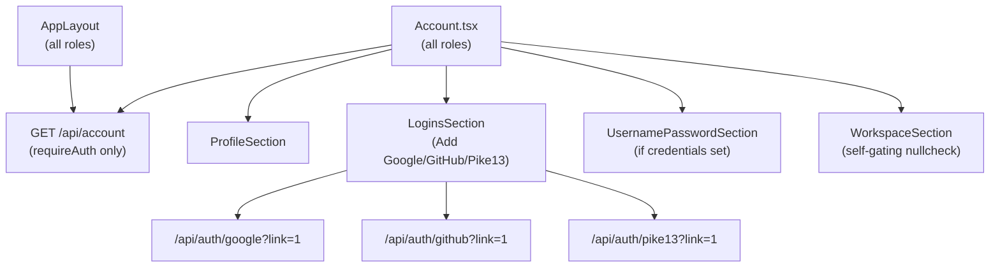
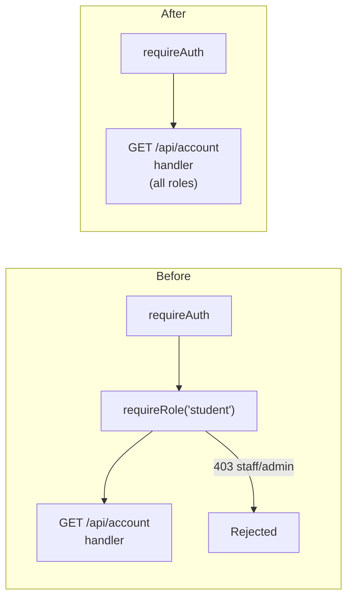

<!-- CLASI: Before changing code or making plans, review the SE process in CLAUDE.md -->

# Architecture Update — Sprint 022: Identity for Everyone

## Step 1: Problem Understanding

Sprint 020 redesigned Account.tsx into an identity-only page and added three
Add-Login buttons (Google, GitHub, Pike 13). However, the implementation
gated the entire identity surface behind `requireRole('student')` on the
server and `{isStudent && data && (...)}` on the client. Staff and admin
users see only `HelpSection`.

This was documented in the sprint 020 source TODO as a known shortcoming and
explicitly deferred. Sprint 022 closes the gap: widen the server endpoint to
all authenticated users; drop the client role gate; keep the WorkspaceSection
student-conditional via its existing internal nullcheck.

A separate gap from sprint 021 is also addressed: the hook-order fix that
moved `useQuery` above the conditional early return in `AppLayout` was never
covered by a test, because the test suite always mocked `useAuth` to return
`loading: false` immediately and never traversed the failing path.

---

## Step 2: Responsibilities

**R1 — Universal account data access:** `GET /api/account` must succeed for
any authenticated role. The response shape is identical for all roles; fields
that do not apply (cohort, workspaceTempPassword, llmProxyEnabled for
non-students) return their null/false/empty defaults naturally from the DB
queries.

**R2 — Role-neutral identity rendering on the client:** The Account page must
render ProfileSection, LoginsSection (with all three Add buttons), and
UsernamePasswordSection for every authenticated user who has account data —
not just students.

**R3 — WorkspaceSection remains self-gating:** WorkspaceSection already
returns null when neither a workspace ExternalAccount nor a League-format
primary email is present. No new role gate is needed. Non-student accounts
that happen to have a workspace ExternalAccount (unlikely but possible for
staff) would see the section correctly.

**R4 — Regression safety on AppLayout hook order:** A test must mount
AppLayout with `loading: true`, then transition to `loading: false`, and
assert that no React hook-order error occurs and the sidebar renders.

---

## Step 3: Module Definitions

### `server/src/routes/account.ts` (modified)

**Purpose:** Serve the signed-in user's account data to any authenticated
role.

**Change:** Remove `requireRole('student')` from `GET /api/account` and
`DELETE /api/account/logins/:id`. The handlers already read `userId` from the
session; they will work correctly for any role. No business-logic changes are
needed — cohort, workspaceTempPassword, and llmProxyEnabled naturally return
null/false/empty for users who have no such records.

**Boundary (in):** `requireAuth` middleware, session `userId`.

**Boundary (out):** `logins`, `externalAccounts`, `users`, `cohorts`,
`llmProxyTokens` services — unchanged.

**Use cases:** SUC-022-001, SUC-022-002, SUC-022-003.

### `client/src/pages/Account.tsx` (modified)

**Purpose:** Identity management page for all authenticated users.

**Changes:**
1. Remove the `enabled: isStudent` guard from `useQuery`. The query is now
   enabled for any authenticated user (`enabled: !!user && !loading`), matching
   the pattern already used in `AppLayout`.
2. Remove the `{isStudent && data && (...)}` wrap around ProfileSection,
   LoginsSection, and UsernamePasswordSection. Render these sections whenever
   `data` is available.
3. The loading and error early-returns should also be widened: show loading
   spinner and error state for all roles (not just `isStudent`). The guard was
   only needed to suppress a 403 console noise — after the server fix it is
   both unnecessary and harmful.
4. `hasCredentials` drops the `isStudent &&` prefix; it evaluates to false
   naturally when `data.profile.username` is null and `has_password` is false.
5. WorkspaceSection call site is unchanged — it receives `data` and applies
   its own nullcheck.

**Boundary (in):** `useAuth` context, `useQuery(['account'])` cache.

**Boundary (out):** `/api/account`, `/api/account/logins/:id`,
`/api/account/profile`, `/api/account/credentials` — no changes to these.

**Use cases:** SUC-022-001, SUC-022-002, SUC-022-003.

### `tests/client/pages/Account.test.tsx` (modified)

**Purpose:** Extend the existing Account test suite with staff and admin
rendering assertions that were previously asserting the ABSENCE of identity
sections.

**Changes:** Flip the existing "does not show student-only sections for
admin/staff" tests to assert that Profile, LoginsSection, and Add buttons ARE
rendered. Add a staff-with-data render test. The `makeFetch` helper already
supports returning account data; the tests just need to pass
`includeAccount = true` for admin and staff cases.

**Use cases:** SUC-022-001, SUC-022-002, SUC-022-003.

### `tests/client/AppLayout.test.tsx` (modified)

**Purpose:** Add a regression test for the loading-to-resolved hook-order
transition.

**New test approach:**
- Render AppLayout with `useAuth` mocked to return `{ loading: true, user: null }`.
- Assert the loading spinner renders (no hook-order crash in this phase).
- Update the mock to return `{ loading: false, user: makeUser('student') }`;
  trigger a re-render.
- Assert the sidebar renders (Account link visible) without React errors.

React Testing Library's `act()` wrapping and the `mockReturnValueOnce` /
`mockReturnValue` sequence on `useAuth` support this pattern. The test
does not need to await any async operations beyond the initial paint.

**Use cases:** SUC-022-004.

---

## Step 4: Diagrams

### Component diagram — widened account data flow



### Role-gating comparison — before and after sprint 022



### AppLayout hook order — loading transition

```mermaid
sequenceDiagram
    participant Browser
    participant AppLayout
    participant AuthContext
    participant ReactQuery

    Browser->>AppLayout: mount
    AuthContext-->>AppLayout: { loading: true, user: null }
    Note over AppLayout: useQuery called unconditionally (above early return)
    ReactQuery-->>AppLayout: query disabled (user null)
    AppLayout-->>Browser: render loading spinner

    AuthContext-->>AppLayout: { loading: false, user: {...} }
    Note over AppLayout: re-render; query now enabled
    ReactQuery->>+AccountAPI: GET /api/account
    AccountAPI-->>ReactQuery: 200 OK
    AppLayout-->>Browser: render sidebar + content
```

---

## Step 5: What Changed

### Modified Modules (Server)

| Module | Change |
|---|---|
| `server/src/routes/account.ts` | Remove `requireRole('student')` from `GET /api/account` and `DELETE /api/account/logins/:id`. Comment block updated to reflect widened access. |

### Modified Modules (Client)

| Module | Change |
|---|---|
| `client/src/pages/Account.tsx` | Drop `enabled: isStudent` from `useQuery`. Drop `{isStudent && data && (...)}` wrap on ProfileSection, LoginsSection, UsernamePasswordSection. Widen loading/error early-returns to all roles. Drop `isStudent &&` prefix from `hasCredentials`. |

### Modified Tests (Client)

| File | Change |
|---|---|
| `tests/client/pages/Account.test.tsx` | Flip admin/staff "does not show identity sections" tests to assert sections ARE rendered; add `makeFetch(true)` account data for these cases. |
| `tests/client/AppLayout.test.tsx` | Add one new describe block: loading-to-resolved hook-order regression test. |

### No Changes

- No Prisma schema changes.
- No database migration.
- No new routes, services, or modules.
- `DELETE /api/account/logins/:id` also removes its `requireRole('student')`
  guard for consistency — a staff or admin user should be able to remove their
  own logins on the same page.
- `GET /api/account/llm-proxy` retains its `requireRole('student')` guard
  (the LLM proxy feature is student-only; non-students have no token to view).

---

## Step 6: Design Rationale

### Decision: Widen GET /api/account rather than add a separate endpoint

**Context:** The simplest fix is to remove the `requireRole('student')`
middleware from the existing endpoint. The handler already computes cohort,
workspaceTempPassword, and llmProxyEnabled lazily from DB queries — if the
queries return no records, the response naturally contains null/false/empty
values. No separate "staff/admin account" endpoint is needed.

**Alternatives considered:**
1. Add a new `GET /api/account/identity` endpoint for non-students returning
   only profile and logins. Rejected: violates YAGNI; the same data is already
   returned by the existing handler without modification; maintaining two
   endpoints for what is the same resource is unnecessary coupling.
2. Keep `requireRole('student')` but add a separate `GET /api/account/profile`
   endpoint. Rejected: splits the data contract for the same page; clients
   would need conditional fetch logic.

**Why this choice:** Single endpoint, identical response shape for all roles.
The React Query cache key `['account']` remains shared between AppLayout and
Account.tsx — no new cache entries, no extra fetches.

**Consequences:** Non-students who inadvertently have llmProxyEnabled or
cohort data (if such a state ever arises) would see it. This is not a
security concern — users see only their own data.

### Decision: Drop isStudent client gate rather than pass role to sections

**Context:** An alternative is to thread `isStudent` down as a prop so each
section can decide what to render. But ProfileSection, LoginsSection, and
UsernamePasswordSection contain no student-specific rendering — they are
already role-neutral internally. The gate was purely a guard against the
server 403; with the server fix, the gate is the only thing to remove.

**Why this choice:** Minimal diff, no prop drilling, no new conditional
rendering paths. WorkspaceSection already has its own internal nullcheck and
needs no change.

---

## Step 7: Open Questions

1. **llm-proxy endpoint role gate:** `GET /api/account/llm-proxy` keeps
   `requireRole('student')` in this sprint. The sidebar gate already hides the
   LLM Proxy nav item for non-students. If a non-student navigates directly to
   `/llm-proxy`, they get a 403 from the API. This is acceptable; if staff/admin
   LLM proxy access is ever added, it can be addressed in a future sprint.

2. **DELETE /api/account/logins/:id role gate:** The task description targets
   `GET /api/account`. The delete route also carries `requireRole('student')`.
   This sprint widens both, since a staff or admin user on the Account page
   must be able to remove a linked login. If there is a reason to keep the
   delete student-only, the implementor should flag it.

3. **WorkspaceSection for staff with League email:** A staff user whose
   `primaryEmail` is `@jointheleague.org` would see the WorkspaceSection (the
   `isLeagueEmail` check would pass). This is probably correct and desirable
   behavior — no change needed, but worth noting for the implementor.
