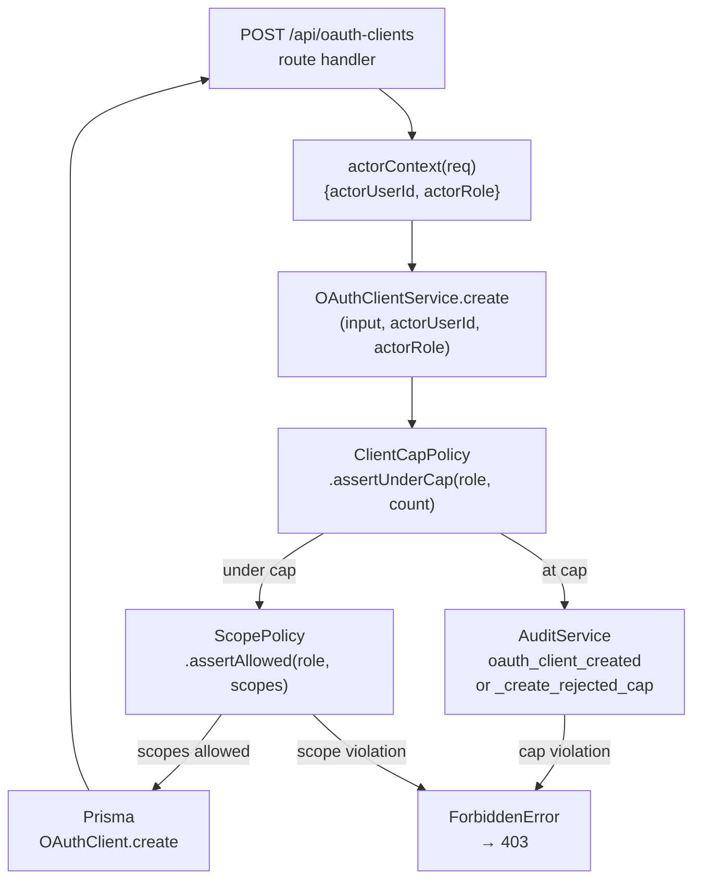
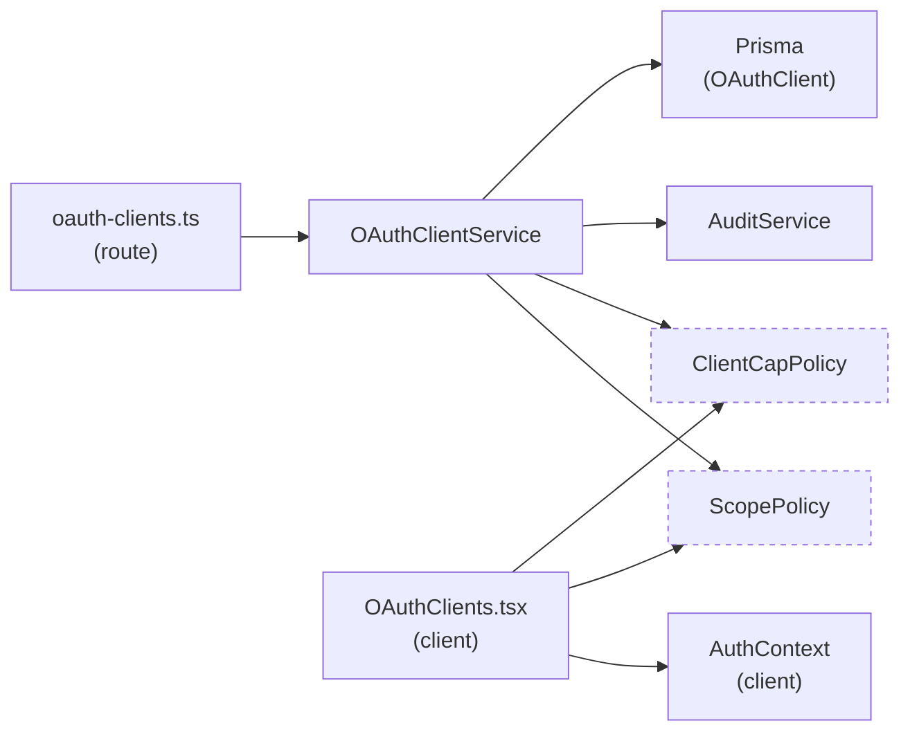
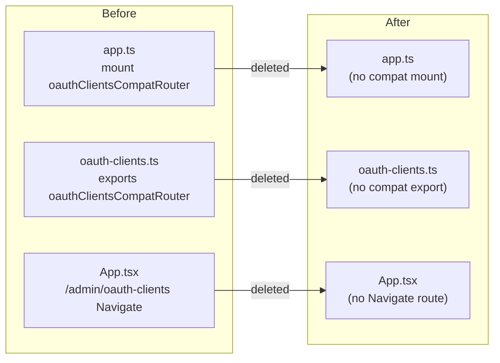

<!-- CLASI: Before changing code or making plans, review the SE process in CLAUDE.md -->

# Architecture Update — Sprint 023: OAuth Clients Hardening

## Step 1: Problem Understanding

Sprint 020 democratized OAuth client registration for all authenticated users
but explicitly deferred two security controls:

1. **Scope ceilings** — any user can register a client requesting `users:read`,
   enabling directory enumeration by students. Documented as a risk in the
   sprint 020 architecture update and in a TODO comment in `OAuthClients.tsx`.
2. **Per-user client caps** — no limit on how many clients a single user can
   create. Stakeholder direction (2026-05-01): students are limited to one;
   staff and admin have no limit.

A third loose end is the temporary compat routing layer shipped in sprint 020:
`oauthClientsCompatRouter` on the server (308-redirecting `/api/admin/oauth-clients`
to `/api/oauth-clients`) and a `<Navigate to="/oauth-clients" replace />` route
in the client. Both were marked "drop in a follow-up release."

This sprint closes all three gaps cleanly with no schema changes.

---

## Step 2: Responsibilities

**R1 — Scope policy definition:** A single source of truth encoding which scopes
each role may request. Lives in the server service layer.

**R2 — Scope enforcement on write paths:** `create` and `update` in
`OAuthClientService` must validate that requested scopes do not exceed the actor's
ceiling, throwing a typed error on violation.

**R3 — Client cap policy definition:** A single source of truth encoding the
maximum number of active clients per role.

**R4 — Cap enforcement on create path:** `OAuthClientService.create` counts the
actor's existing non-disabled clients and rejects when the count meets the cap.
Cap rejection is audited.

**R5 — Admin shared-pool regression safety:** The existing `enforceOwnership`
logic already permits admin-on-any-client mutations. This sprint adds explicit
tests so the invariant cannot regress silently.

**R6 — Compat redirect removal:** `oauthClientsCompatRouter` is deleted from
the server router file and its mount removed from `app.ts`. The client
`<Navigate>` route is removed from `App.tsx`.

**R7 — Client UX for policy restrictions:** `OAuthClients.tsx` computes the
actor's allowed scopes and renders only those checkboxes. The create
button/form is hidden when the actor is at their cap, replaced by an
explanatory inline message.

---

## Step 3: Module Definitions

### `server/src/services/oauth/scope-policy.ts` (NEW)

**Purpose:** Declare which scopes each role may request on an OAuth client.

**Boundary (in):** Actor role string (`'student'`, `'staff'`, `'admin'`).

**Boundary (out):** A string array of allowed scope identifiers; a typed
`ForbiddenError` when the requested scopes exceed the ceiling.

**Key API:**
- `ScopePolicy.allowedScopesFor(role: string): string[]`
- `ScopePolicy.assertAllowed(role: string, requestedScopes: string[]): void`
  — throws `ForbiddenError` if any requested scope is not in the allowed set.

**Use cases:** SUC-023-003, SUC-023-004.

### `server/src/services/oauth/client-cap-policy.ts` (NEW)

**Purpose:** Declare the maximum number of active OAuth clients per role.

**Boundary (in):** Actor role string; a count of existing non-disabled clients
for the actor.

**Boundary (out):** Passes silently when under the cap; throws `ForbiddenError`
when at or over the cap.

**Key API:**
- `ClientCapPolicy.maxClientsFor(role: string): number | null`
  — `null` means unlimited.
- `ClientCapPolicy.assertUnderCap(role: string, currentCount: number): void`
  — throws `ForbiddenError` (with audit-friendly message) when the cap is reached.

**Use cases:** SUC-023-001, SUC-023-002.

### `server/src/services/oauth/oauth-client.service.ts` (modified)

**Purpose:** Domain logic for the OAuthClient entity — unchanged in purpose;
new capability: policy checks on write paths.

**Changes:**
- `create(input, actorUserId, actorRole?)`: Accept optional `actorRole`. When
  provided, call `ClientCapPolicy.assertUnderCap` (counting existing
  non-disabled clients where `created_by = actorUserId`) and
  `ScopePolicy.assertAllowed`. Record a new `oauth_client_create_rejected_cap`
  audit event on cap violation. `actorRole` is also threaded through to enable
  the cap bypass for staff/admin.
- `update(id, patch, actorUserId, actor?)`: When `patch.allowed_scopes` is
  present and `actor.actorRole` is available, call `ScopePolicy.assertAllowed`
  before writing.
- `create` signature change: the route already passes `actorUserId`; the route
  handler must now also pass `actorRole` (from the session, already available
  via `actorContext(req)`).

**Boundary (in):** `ScopePolicy`, `ClientCapPolicy` (no new external dependencies).

**Use cases:** SUC-023-001, SUC-023-002, SUC-023-003, SUC-023-004, SUC-023-005.

### `server/src/routes/oauth-clients.ts` (modified)

**Purpose:** CRUD routes for OAuth clients — unchanged in purpose.

**Changes:**
- `POST /oauth-clients` handler: pass `actor.actorRole` to `oauthClients.create`.
- Delete `oauthClientsCompatRouter` and its two `oauthClientsCompatRouter.all`
  route definitions.
- Remove the `export { oauthClientsCompatRouter }` statement.

**Use cases:** SUC-023-001, SUC-023-002, SUC-023-003, SUC-023-004, SUC-023-006.

### `server/src/app.ts` (modified)

**Purpose:** Express app configuration — unchanged in purpose.

**Change:** Remove `oauthClientsCompatRouter` from the import and remove the
`app.use('/api', oauthClientsCompatRouter)` mount.

**Use cases:** SUC-023-006.

### `client/src/pages/OAuthClients.tsx` (modified)

**Purpose:** OAuth Clients management page for all authenticated users —
unchanged in purpose.

**Changes:**
1. Import `useAuth` to read `user.role`.
2. Compute `allowedScopes` from role using a client-side copy of the policy table
   (a simple const map — same values as the server `ScopePolicy`).
3. Pass `allowedScopes` as the scope list to `ScopeCheckboxGroup` so only
   permitted scopes are rendered as checkboxes.
4. Compute `isAtCap` from `user.role` and `clients.length` using a client-side
   copy of the cap table. Render a read-only "You have reached your client
   limit" message instead of the "+ New OAuth Client" button when `isAtCap`.
5. Remove the two `// TODO (sprint.md "Out of Scope: Scope ceilings")` comments.

**Use cases:** SUC-023-001, SUC-023-002, SUC-023-003, SUC-023-004.

### `client/src/App.tsx` (modified)

**Purpose:** Client-side routing — unchanged in purpose.

**Change:** Remove the line:
```
<Route path="/admin/oauth-clients" element={<Navigate to="/oauth-clients" replace />} />
```

**Use cases:** SUC-023-006.

### `tests/server/routes/oauth-clients.test.ts` (modified)

**Purpose:** Server-side route integration tests.

**Changes:** Add tests for:
- Student create with `users:read` → 403.
- Student create with `profile` → 201.
- Student second create → 403 (cap).
- Staff create with `users:read` → 201.
- Staff Nth create → 201 (no cap).
- Admin create with any scope → 201.
- Admin A edits/rotates/disables Admin B's client → success.
- Non-admin attempts to mutate another user's client → 403.
- Remove compat redirect tests; add a test that `GET /api/admin/oauth-clients` returns 404.

**Use cases:** All SUC-023-NNN.

### `tests/client/pages/OAuthClients.test.tsx` (modified)

**Purpose:** Client-side page unit tests.

**Changes:** Add tests for:
- Student: only `profile` checkbox renders; `users:read` is absent.
- Student at cap: create button absent; explanation message shown.
- Admin: both scope checkboxes render; create button present regardless of count.

**Use cases:** SUC-023-001, SUC-023-003.

---

## Step 4: Diagrams

### Policy enforcement flow — create path



### Policy table — inline reference

| Role | Allowed Scopes | Max Clients |
|------|---------------|-------------|
| `student` | `profile` | 1 |
| `staff` | `profile`, `users:read` | unlimited |
| `admin` | `profile`, `users:read` | unlimited |

### Module dependency graph



Note: The dashed nodes on the client side represent a local const copy of the
same policy table — not a shared import. The server is the authoritative
enforcement point; the client copy is for UX only.

### Compat redirect removal



---

## Step 5: What Changed

### New Modules (Server)

| Module | Reason |
|---|---|
| `server/src/services/oauth/scope-policy.ts` | Single-source-of-truth for role→allowed-scopes policy. |
| `server/src/services/oauth/client-cap-policy.ts` | Single-source-of-truth for role→max-clients policy. |

### Modified Modules (Server)

| Module | Change |
|---|---|
| `server/src/services/oauth/oauth-client.service.ts` | `create` accepts `actorRole`; calls `CapPolicy.assertUnderCap` + `ScopePolicy.assertAllowed`; audits cap rejections. `update` calls `ScopePolicy.assertAllowed` when `allowed_scopes` is patched. |
| `server/src/routes/oauth-clients.ts` | POST handler passes `actorRole` to service. Delete `oauthClientsCompatRouter` and its route definitions. |
| `server/src/app.ts` | Remove `oauthClientsCompatRouter` import and mount. |

### Modified Modules (Client)

| Module | Change |
|---|---|
| `client/src/pages/OAuthClients.tsx` | Compute `allowedScopes` and `isAtCap` from actor role; filter scope checkboxes; suppress create form at cap. Remove TODO comments. |
| `client/src/App.tsx` | Delete `<Navigate to="/oauth-clients" replace />` route for `/admin/oauth-clients`. |

### Modified Tests

| File | Change |
|---|---|
| `tests/server/routes/oauth-clients.test.ts` | Add role × scope coverage; cap tests; admin shared-pool tests; compat 404 test; remove old redirect tests. |
| `tests/client/pages/OAuthClients.test.tsx` | Add scope-filtering and cap-suppression tests per role. |

### No Changes

- No Prisma schema changes.
- No database migration.
- No new routes (only deletions).
- No changes to the OAuth authorization flow, token issuance, or `verifySecret`.
- `AdminLayout`, `StaffLayout`, and all other pages are unaffected.

---

## Step 6: Design Rationale

### Decision: Two dedicated policy modules rather than inline role checks

**Context:** Scope ceilings and cap limits could be encoded as `if (role === 'student')` conditionals inside the service methods.

**Alternatives considered:**
1. Inline conditionals — simple but scattered. If a third role or a new scope is added, changes must be hunted across multiple method bodies.
2. Policy objects in the service constructor — adds configuration indirection for something that is currently a compile-time constant.

**Why dedicated modules:** Each module passes the cohesion test — one reason to change (policy table update). They make the policy visible at a glance, testable in isolation, and easy to extend. The client copy (a plain const map) shares the same values without creating a cross-boundary import.

**Consequences:** Two new files; no architectural complexity. Policy tables are small and unlikely to need runtime configuration in the near term.

### Decision: `actorRole` added to `create` signature rather than passed via `ActorContext`

**Context:** `ActorContext` already carries `{ actorUserId, actorRole }`. The `create` method currently takes `(input, actorUserId: number)` without an `ActorContext`.

**Why:** Consistency with the other mutating methods (`update`, `rotateSecret`, `disable`) which accept an optional `actor?: ActorContext`. Passing an `ActorContext` to `create` aligns the interface and avoids a separate `actorRole` parameter.

**Change to implementation:** `create(input, actorUserId, actor?: ActorContext)` — the route handler passes the full `actorContext(req)` as the third argument.

### Decision: Client-side policy copy rather than a server-side "allowed scopes" endpoint

**Context:** The client needs to know which scopes to show before the form is submitted.

**Alternatives considered:**
1. `GET /api/oauth-clients/policy` returning the policy for the current user — adds a round trip and a new endpoint.
2. Embed in the account response — couples unrelated data.
3. Client-side const map mirroring the server policy — simplest, no new endpoints, acceptable because the policy changes infrequently and both sides share the same values.

**Why option 3:** The server remains authoritative; the client copy is defensive UX only. If the two diverge, the server 403 is the correct outcome and the client will display the server error.

---

## Step 7: Open Questions

1. **Disabled clients and the cap:** The cap check counts non-disabled clients
   (`disabled_at IS NULL`). A student who creates a client and then disables it
   can create a new one. This is intentional (disabled = surrendered) but should
   be confirmed with the stakeholder before implementation.

2. **`update` scope enforcement and existing clients:** If a student already has
   a client with `users:read` (created before this sprint), a subsequent `update`
   call that re-sends the same `allowed_scopes: ['users:read']` would be rejected
   post-sprint. The implementor should decide: enforce on update unconditionally,
   or only enforce when `allowed_scopes` changes from the stored value. Simpler
   to enforce unconditionally.

3. **Staff scope ceiling — final confirmation:** The backlog TODO (item C) left
   staff cap unresolved; stakeholder direction (2026-05-01) resolved it as
   unlimited. Staff scope ceiling (item B) was resolved as "any scope" (same as
   admin). These are now recorded in the policy table; no further clarification
   needed unless the stakeholder reverses direction.
