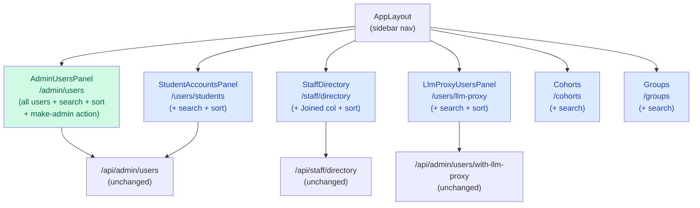

# Architecture Update — Sprint 024: User Management list polish

## What Changed

### 1. Sidebar navigation order and labels (AppLayout.tsx)

The `SIDEBAR_NAV` User Management group in `AppLayout.tsx` is reordered
and relabelled:

| Before | Route | After |
|---|---|---|
| Staff Directory | /staff/directory | Staff |
| Users | /admin/users | Users |
| League Students | /users/students | Students |
| LLM Proxy Users | /users/llm-proxy | LLM Proxy Users |
| Cohorts | /cohorts | Groups |
| Groups | /groups | Cohorts |

New order in the children array:
Users → Students → Staff → LLM Proxy Users → Groups → Cohorts.

The group's `defaultTo` property changes from `/staff/directory` to
`/admin/users` so that clicking the "User Management" group header
navigates admins to the primary list.

No changes to route paths, gates, or any other sidebar sections.

### 2. AdminUsersPanel.tsx — replacement with all-users view

`AdminUsersPanel.tsx` (currently a staff-filtered view) is replaced with
the logic from `UsersPanel.tsx`:

- Fetches all users from `GET /api/admin/users` (unchanged endpoint).
- Adds search bar (filter by name or email, client-side).
- Adds sortable column headers: Name, Email, Cohort, Accounts, Joined.
- Adds the `FilterDropdown` component for role/account/cohort pre-filters.
- Adds the three-dot row action menu (Edit, Delete, Impersonate).
- Adds bulk selection and bulk delete.
- Preserves the make-admin / remove-admin action from the old
  AdminUsersPanel. This action is surfaced as a dedicated "Admin" button
  in the row action menu, restricted to rows where the user holds a
  staff or admin role.

The guards from the old component are preserved:
- Self-demotion is blocked (button disabled + server 403).
- Last-admin demotion is blocked (button disabled + server 409).

### 3. UsersPanel.tsx — deleted

After AdminUsersPanel is updated, `UsersPanel.tsx` has no remaining
callers and is deleted. Its test file (`UsersPanel.test.tsx`) is either
deleted or migrated to an `AdminUsersPanel.test.tsx`.

### 4. StudentAccountsPanel.tsx — search + sortable headers

Adds:
- Search bar (input type="search") above the table, filtering by display
  name or email (client-side, case-insensitive).
- Sortable column headers for: Name, Email, Cohort, Accounts, Joined.
  Default sort remains creation date descending.

Existing behaviour preserved: checkbox selection, bulk-suspend action,
new-user row highlight.

### 5. StaffDirectory.tsx — Joined column + sortable headers

Adds:
- A "Joined" column showing `createdAt` formatted as a locale date.
- Sortable column headers for all columns: Name, Email, Cohort, Accounts,
  Joined.

Existing behaviour preserved: search bar, cohort filter, account-type
filter, inline student detail panel.

The page fetches from `GET /api/staff/directory` which already returns
`createdAt`; no backend changes are needed.

### 6. LlmProxyUsersPanel.tsx — search + sortable headers

Adds:
- Search bar filtering by display name or email (client-side).
- Sortable column headers for: Name, Email, Cohort, Usage, Expires.

Existing behaviour preserved: checkbox selection, bulk-revoke action.

### 7. Cohorts.tsx — search bar

Adds a search bar above the table filtering by cohort name (client-side).
Existing sortable headers (`name`, `google_ou_path`, `createdAt`) are
not changed.

### 8. Groups.tsx — search bar

Adds a search bar above the table filtering by group name or description
(client-side). Existing sortable headers (`name`, `description`,
`memberCount`, `createdAt`) are not changed.

---

## Why

The stakeholder defined a clear hierarchy for the User Management section
and requires every list to support search and sort. The current state has
inconsistent labels, a wrong page at `/admin/users`, and only three of
seven panels supporting search.

Keeping all filtering and sorting client-side is appropriate because list
sizes are small (hundreds of rows at most) and the `/api/admin/users`
endpoint already fetches the full list for cache sharing.

---

## Component Diagram

Green: replaced/rewritten. Blue: extended in-place.

---

## Impact on Existing Components

- **AppLayout.tsx**: Two label strings changed; children array reordered.
  All tests that assert on the label "Staff Directory" or "League
  Students" must be updated to "Staff" and "Students" respectively.
  Tests asserting order within the User Management group must be updated.
- **AdminUsersPanel.tsx**: Effectively a full rewrite. Its old test
  (if any) must be rewritten.
- **UsersPanel.tsx / UsersPanel.test.tsx**: Deleted. Any test that imports
  UsersPanel must be migrated or removed.
- **App.tsx routing**: The route `/users` currently redirects to
  `/admin/users` via UsersPanel. If the redirect logic lives inside
  UsersPanel, the redirect must be preserved in `App.tsx` directly or
  via a small wrapper. Ticket 002 must audit this.
- All other panels (StudentAccountsPanel, StaffDirectory, LlmProxyUsersPanel,
  Cohorts, Groups): additive changes only; API contracts and data models
  are unchanged.

---

## Migration Concerns

None. All changes are purely front-end. No database schema changes, no
API endpoint changes, no data migrations.

---

## Design Rationale

### Decision: Absorb UsersPanel logic into AdminUsersPanel rather than swap the file

**Context:** Two files both render user lists at different routes. The
stakeholder wants `/admin/users` to be the all-users view.

**Alternatives considered:**
1. Delete AdminUsersPanel and move UsersPanel to the `/admin/users` route.
2. Rewrite AdminUsersPanel in place, importing helpers from UsersPanel.
3. Absorb UsersPanel logic directly into AdminUsersPanel, then delete UsersPanel.

**Choice:** Option 3.

**Why:** Option 1 preserves UsersPanel but leaves AdminUsersPanel's
make-admin logic homeless. Option 2 creates a transient shared-logic
dependency between two files that are about to be merged. Option 3
produces one authoritative file for the all-users view with no orphaned
code paths and no intermediate shared module.

**Consequences:** UsersPanel.tsx and its test are deleted; AdminUsersPanel
becomes the sole owner of all-user listing and admin-toggle logic.

### Decision: Inline search/sort pattern per panel; do not extract a shared DataTable

**Context:** Seven panels need the same search-bar and sortable-header
shape. A shared component would reduce duplication.

**Alternatives considered:**
1. Extract `<DataTable>` now.
2. Inline the pattern per panel this sprint; extract later.

**Choice:** Option 2.

**Why:** Extracting the component mid-sprint would require defining a
stable API for a component that serves seven different column schemas and
action patterns. The risk of getting the abstraction wrong is high and
the payoff is low because the set of panels is unlikely to grow in the
near term. The inline pattern is well-understood from UsersPanel.tsx,
which already implements it correctly.

**Consequences:** Some code duplication across panels. A `<DataTable>`
extraction is noted as a future sprint TODO.

---

## Open Questions

None. Stakeholder requirements were given verbatim and are complete.
Route renames were explicitly ruled out. Backend pagination was
explicitly ruled out.

---

## Future TODO

Extract a shared `<DataTable>` component that encapsulates the
search-bar + sortable-header pattern, reducing duplication across
AdminUsersPanel, StudentAccountsPanel, StaffDirectory,
LlmProxyUsersPanel, Cohorts, and Groups.
