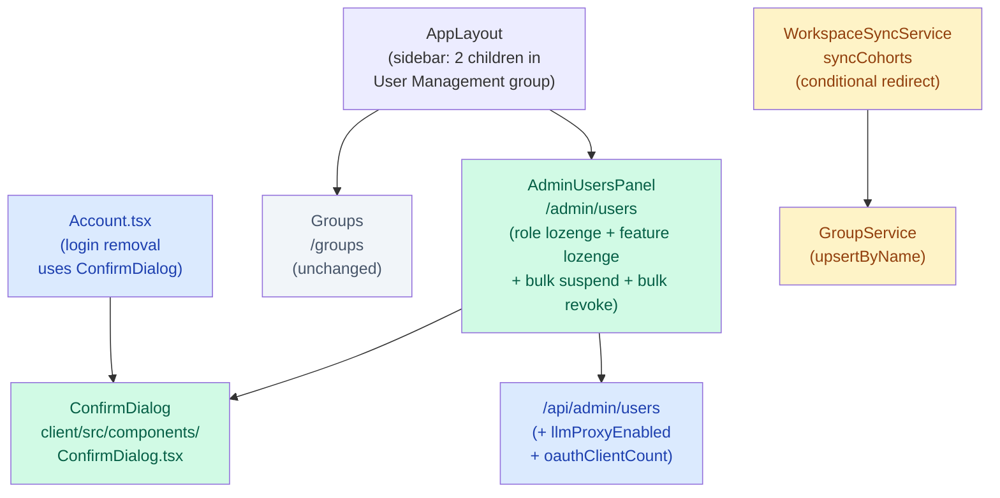

# Architecture Update — Sprint 025: User Management v2

## What Changed

### 1. New component: `<ConfirmDialog>` (`client/src/components/ConfirmDialog.tsx`)

A reusable modal dialog for destructive confirmations. It renders as an
in-page overlay (not a browser `alert` or `confirm`), styled to match the
application's existing design language.

**Interface (props):**
- `open: boolean` — controls visibility
- `title: string` — heading shown in the dialog
- `message: string` — body text (may include the provider name or count)
- `confirmLabel?: string` — defaults to "Confirm"
- `cancelLabel?: string` — defaults to "Cancel"
- `onConfirm: () => void`
- `onCancel: () => void`

**Boundary:** `<ConfirmDialog>` owns only presentation and the confirm/cancel
callbacks. It has no knowledge of the action being confirmed. Callers own the
mutation logic.

**Use cases served:** SUC-001, SUC-006.

### 2. Account.tsx — login removal confirmation (`client/src/pages/Account.tsx`)

The "Remove" button in `LoginsSection` now opens `<ConfirmDialog>` instead of
calling the DELETE directly. The dialog message names the provider
(e.g., "Remove the Google login from your account?") and includes the
re-link hint. The DELETE is issued only on `onConfirm`.

No changes to the API endpoint or to any other section of `Account.tsx`.

**Use cases served:** SUC-001.

### 3. Backend — `/api/admin/users` response extended

`server/src/routes/admin/users.ts` `serializeUser` function is updated to
include two new fields on each user object:

- `llmProxyEnabled: boolean` — `true` if the user has at least one
  `LlmProxyToken` row where `expires_at > now()` and `revoked_at IS NULL`.
  Derived server-side from the `llm_proxy_tokens` relation; no new column
  is added to the User table.
- `oauthClientCount: number` — count of `OAuthClient` rows where
  `created_by = user.id`. Derived via a `_count` aggregate on the
  `oauth_clients_created` Prisma relation.

The `GET /api/admin/users` query is updated to include both relations in the
`include` / `_count` clause.

No schema migration is needed. No new tables or columns are added.

**Use cases served:** SUC-003, SUC-004, SUC-006.

### 4. AdminUsersPanel — lozenge filters replace FilterDropdown

`client/src/pages/admin/AdminUsersPanel.tsx` gains two filter bars above the
table:

**Role lozenge group (radio semantics, exactly one active):**
Rendered as a row of pill buttons: `All | Staff | Admin | Student`.
Clicking any pill deactivates the others. Maps to the `role` field on the
user object (case-normalized: ADMIN → admin, STAFF → staff, USER → student).
Default: `All`.

**Feature lozenge group (toggle semantics, each independently on/off):**
Five pill buttons: `Google | Pike 13 | GitHub | LLM Proxy | OAuth Client`.
Each maps to a boolean predicate on the user object:
- Google: `providers.some(p => p.provider === 'google')`
- Pike 13: `externalAccountTypes.includes('pike13')`
- GitHub: `providers.some(p => p.provider === 'github')`
- LLM Proxy: `llmProxyEnabled === true`
- OAuth Client: `oauthClientCount > 0`

When multiple feature toggles are on, the result is their intersection (user
must satisfy all active predicates).

The existing `<FilterDropdown>` component (and its cohort-filter branch) is
removed. The cohort query (`GET /api/admin/cohorts`) is no longer fetched by
this panel.

**Bulk actions extended:**
- "Suspend accounts" bulk action (previously in StudentAccountsPanel) is moved
  into the AdminUsersPanel bulk toolbar.
- "Revoke LLM Proxy" bulk action (previously in LlmProxyUsersPanel) is added
  to the bulk toolbar, enabled only when the visible selection contains at
  least one user with `llmProxyEnabled === true`.
- Both use `<ConfirmDialog>` for confirmation.

**Cohort column removed:** The "Cohort" sortable column header and cell are
removed from the table. The `cohortLabel` helper and cohort-sort comparator
are also removed. The `cohort` field remains on the API response but is no
longer rendered.

**Use cases served:** SUC-002, SUC-003, SUC-004, SUC-006.

### 5. Sidebar — User Management group shrunk

`client/src/components/AppLayout.tsx` `SIDEBAR_NAV` User Management group
children are reduced from six to two:

```
Before (post-sprint-024):
  Users → /admin/users
  Students → /users/students
  Staff → /staff/directory
  LLM Proxy Users → /users/llm-proxy
  Groups → /groups
  Cohorts → /cohorts

After (sprint-025):
  User Management → /admin/users
  Groups → /groups
```

The `defaultTo` property remains `/admin/users`.

**Use cases served:** SUC-005.

### 6. Pages and routes deleted

The following client-side pages and their test files are deleted:

| File | Route | Covered by |
|---|---|---|
| `client/src/pages/admin/StudentAccountsPanel.tsx` | `/users/students` | AdminUsersPanel + Student lozenge |
| `client/src/pages/admin/LlmProxyUsersPanel.tsx` | `/users/llm-proxy` | AdminUsersPanel + LLM Proxy lozenge |
| `client/src/pages/staff/StaffDirectory.tsx` | `/staff/directory` | AdminUsersPanel + Staff lozenge |
| `client/src/pages/admin/Cohorts.tsx` | `/cohorts` | Not replaced |
| `client/src/pages/admin/CohortDetailPanel.tsx` | `/cohorts/:id` | Not replaced |

The corresponding `App.tsx` routes are also removed. Any test files for these
components are deleted.

**Use cases served:** SUC-005.

### 7. Google Workspace sync — conditional redirect (investigation ticket)

`server/src/services/workspace-sync.service.ts` `syncCohorts` method
currently imports student OUs as `Cohort` rows via `CohortService` and
`CohortRepository`. The ticket investigates whether this path is active and,
if so, redirects the writes to `GroupService` instead:

- Each OU name that would have become a Cohort name becomes a Group name.
- The new Group rows are created via `GroupService.upsertByName` (or
  equivalent). If no such helper exists, a minimal one is added to
  `group.service.ts`.
- The `cohortService` and `CohortRepository` imports are removed from
  `WorkspaceSyncService` if no longer referenced.
- The `WorkspaceSyncReport.cohortsUpserted` field is renamed or aliased to
  `groupsUpserted` in the report shape; callers of the sync route that
  inspect this field are updated.

If the investigation finds that `syncCohorts` does not currently create
Cohort rows (e.g., the Google client is unconfigured or returns empty), no
code change is made; the ticket closes with a documentation note.

No schema migration. Existing Cohort rows are left in place.

**Use cases served:** SUC-007.

---

## Why

Sprint 024 restructured the sidebar labels and added search/sort to all panels
but stopped short of consolidation. Sprint 025 completes that work: one
canonical users list with inline filtering eliminates navigational redundancy
and removes the email-domain bug introduced by per-panel filter predicates.
The cohort deprecation is a stakeholder direction to simplify the conceptual
model; deferring the data migration keeps the blast radius small. The confirm
dialog addresses a usability regression reported immediately after sprint 024.

---

## Component Diagram



Green: new. Blue: modified. Yellow: conditionally modified. Grey: unchanged.

**Deleted components (not shown):** StudentAccountsPanel, LlmProxyUsersPanel,
StaffDirectory, Cohorts, CohortDetailPanel.

---

## Impact on Existing Components

- **AppLayout.tsx:** User Management group children array reduced from six to
  two. Tests asserting sidebar link counts or specific child labels must be
  updated.
- **AdminUsersPanel.tsx:** FilterDropdown removed; cohort column removed;
  lozenge filters added; AdminUser type gains `llmProxyEnabled` and
  `oauthClientCount`; two new bulk actions added. Existing tests need updates
  for the removed filter and removed column.
- **App.tsx:** Five route definitions removed (/users/students, /users/llm-proxy,
  /staff/directory, /cohorts, /cohorts/:id).
- **Account.tsx:** Login removal path adds a `<ConfirmDialog>` state gate;
  no change to the API call itself.
- **WorkspaceSyncService:** `syncCohorts` may change its write target from
  CohortService to GroupService; the sync report shape may gain a
  `groupsUpserted` field. Change is conditional on investigation findings.
- **serializeUser (server/src/routes/admin/users.ts):** Extended with
  `llmProxyEnabled` and `oauthClientCount`. The Prisma query must include the
  `llm_proxy_tokens` relation and `_count` for `oauth_clients_created`.
  Existing tests of this endpoint must assert the two new fields.

---

## Migration Concerns

No database schema changes in this sprint. The Cohort table and all its rows
remain in place. The `cohort_id` foreign key on User is preserved. The
migration of existing Cohort-to-User assignments into Group membership rows is
a follow-up sprint.

There is a minor breaking change in the `/api/admin/users` response shape:
two new fields appear on all user objects. Any existing client code or tests
that perform strict shape checking on this response (e.g., snapshot tests)
will need updating.

---

## Design Rationale

### Decision: Role as a radio group, features as independent toggles

**Context:** The prior `<FilterDropdown>` supported only a single active
filter at a time. The new spec requires role (mutually exclusive) and feature
(additive intersection) filtering simultaneously.

**Alternatives considered:**
1. Extend the existing dropdown to support multi-select.
2. Replace dropdown with two separate lozenge bars (role radio + feature toggle).
3. Single unified multi-select lozenge bar for everything.

**Choice:** Option 2.

**Why:** Role is inherently mutually exclusive — a user has exactly one role.
Features are independent boolean predicates — a user can have Google AND LLM
Proxy simultaneously. Modeling them with different interaction patterns (radio
vs. toggle) communicates the semantics to the user and simplifies the filter
logic. Option 3 would require special-casing role exclusivity in the UI and
the predicate logic.

**Consequences:** Two filter rows instead of one dropdown; the toolbar is
taller but the interaction model is clearer. The FilterDropdown component is
deleted; no shared code is carried forward.

### Decision: `llmProxyEnabled` and `oauthClientCount` derived server-side

**Context:** The feature toggles require two data points not currently in the
`/api/admin/users` response.

**Alternatives considered:**
1. Compute client-side by inspecting `externalAccountTypes` (for LLM proxy)
   and making a separate `/api/admin/oauth-clients` call.
2. Add the fields to the backend response, derived from existing relations.

**Choice:** Option 2.

**Why:** `llmProxyEnabled` cannot be inferred from `externalAccountTypes`
because LLM proxy tokens are not ExternalAccount rows — they are a separate
`LlmProxyToken` table. A separate client-side fetch for OAuth client counts
would add a round-trip and synchronization complexity. Deriving both fields
in the existing query keeps the client simple and the response self-contained.

**Consequences:** The `GET /api/admin/users` Prisma query becomes slightly
heavier (adds a `_count` and a token relation filter). At current user-count
scales (hundreds of rows) this is negligible.

### Decision: Fold bulk-revoke and bulk-suspend into AdminUsersPanel; delete LlmProxyUsersPanel and StudentAccountsPanel

**Context:** Two bulk actions live in panels that are being retired. The
actions must survive.

**Alternatives considered:**
1. Keep LlmProxyUsersPanel alive as a hidden (non-sidebar) page solely for
   bulk-revoke.
2. Move bulk-revoke and bulk-suspend into AdminUsersPanel's bulk toolbar.
3. Drop the bulk actions.

**Choice:** Option 2.

**Why:** Option 1 preserves a page no longer in the navigation, creating a
dead URL. Option 3 removes functionality the stakeholder uses. Option 2
centralises all user management actions in the unified page, which is the
sprint's goal. The bulk toolbar already supports multiple actions
(bulk-delete); adding two more is additive.

**Consequences:** AdminUsersPanel's bulk toolbar grows by two action buttons.
LlmProxyUsersPanel and StudentAccountsPanel are fully deleted.

---

## Open Questions

None. All decisions are locked in the backlog TODO (stakeholder decisions
section, dated 2026-05-02):
- Cohort column: hidden.
- Cohort data migration: deferred.
- Login-removal confirmation: custom in-page modal (`<ConfirmDialog>`).

The sync investigation outcome (whether `syncCohorts` currently writes Cohort
rows) is determined during ticket 006 execution, not during planning.
