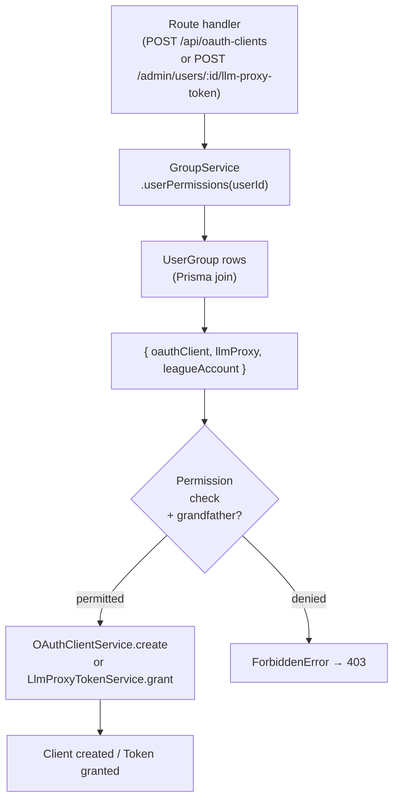
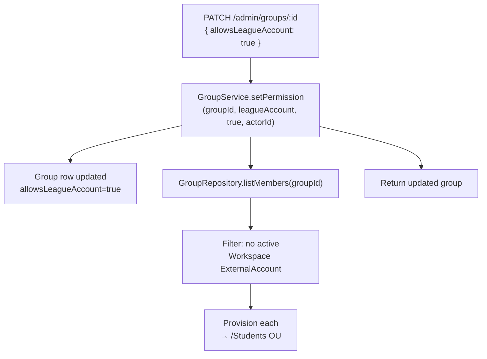
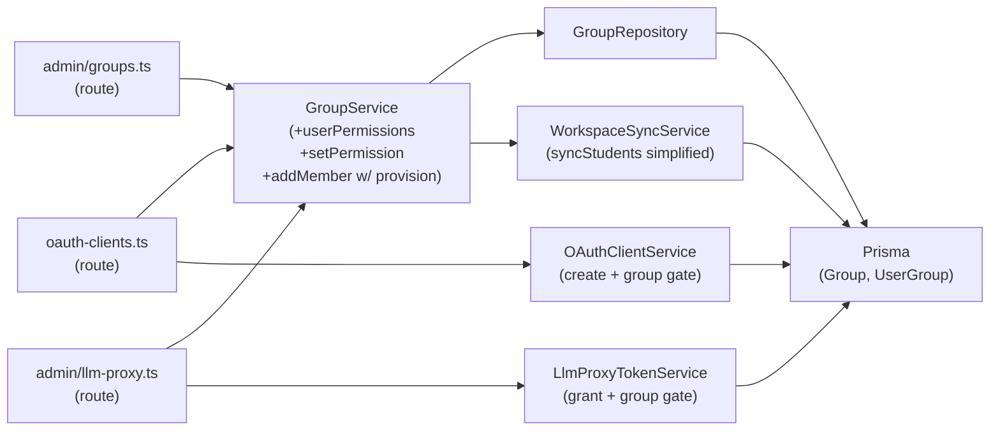
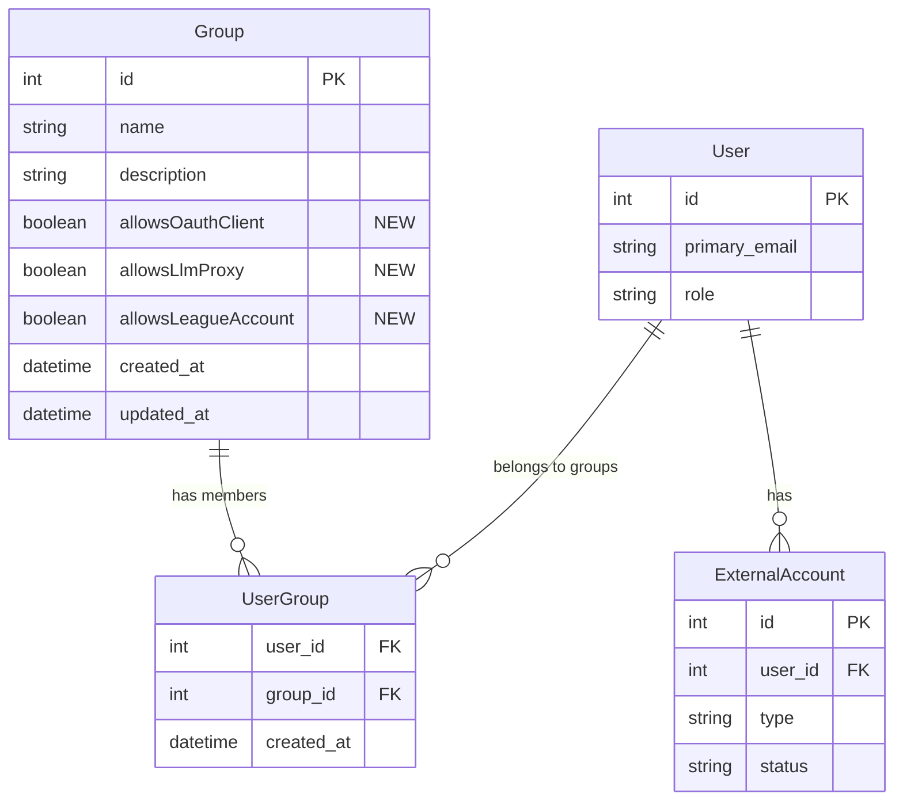

<!-- CLASI: Before changing code or making plans, review the SE process in CLAUDE.md -->

# Architecture Update — Sprint 026: Groups as Permission Carriers

## Step 1: Problem Understanding

Sprint 025 created a unified AdminUsersPanel with LLM Proxy and OAuth Client feature
lozenges. Those lozenges surface per-user capability but do not provide a way to grant
that capability at scale. Sprint 026 lifts the permission model from per-user to
per-group: three boolean flags on a Group control which capabilities its members receive.
The change is additive across groups (union semantics) and does not revoke existing
users' access (grandfather rule).

---

## Step 2: Responsibilities

**R1 — Group permission schema**: Persist three permission flags on the Group entity.
Defaults to false; no migration needed for existing rows.

**R2 — Additive permission computation**: A single function derives the effective
permission set for a user by taking the union across all their groups. This function
is the single source of truth — no inline group queries in service methods.

**R3 — OAuth client create gate**: `OAuthClientService.create` rejects non-admin
callers who lack both the group permission AND existing clients (grandfather).

**R4 — LLM proxy grant gate**: `LlmProxyTokenService.grant` rejects grants when the
target user's groups do not grant `llmProxy`.

**R5 — Group permission management and provisioning fan-out**: A new
`GroupService.setPermission` method updates the flag and, when `leagueAccount` is
toggled on, fans out provisioning for every unprovisioned member. `addMember` also
triggers provisioning when the group has `allowsLeagueAccount`.

**R6 — Workspace provisioning to /Students only**: `WorkspaceSyncService.syncStudents`
drops the per-cohort OU iteration. All new Workspace accounts target `/Students`.

**R7 — Group detail permission UI**: GroupDetailPanel exposes three toggles wired to
a PATCH endpoint.

**R8 — AdminUsersPanel lozenge cleanup**: Remove the LLM Proxy and OAuth Client
feature lozenges (permissions are now group-managed, not user-filtered).

---

## Step 3: Module Definitions

### `server/prisma/schema.prisma` (modified)

**Purpose**: Persist the three group permission flags.

**Boundary (in)**: Three boolean fields added to `model Group`.

**Boundary (out)**: Prisma-generated client exposes them on the `Group` type.

**Change**:
```prisma
model Group {
  // ... existing fields ...
  allowsOauthClient    Boolean @default(false)
  allowsLlmProxy       Boolean @default(false)
  allowsLeagueAccount  Boolean @default(false)
}
```

No migration is needed for new columns with `@default(false)`.
A Prisma migration file is generated for production; dev uses `prisma db push`.

**Use cases served**: SUC-001.

---

### `server/src/services/group.service.ts` (modified)

**Purpose**: Domain logic for the Group entity, extended with three new responsibilities:
(1) permission computation, (2) permission flag updates with provisioning fan-out,
(3) auto-provisioning on member add.

**Boundary (in)**:
- `userPermissions(userId: number)` — user identifier.
- `setPermission(groupId, perm, value, actorId)` — permission key is one of
  `'oauthClient' | 'llmProxy' | 'leagueAccount'`; boolean value; admin actor.
- `addMember` (existing, extended) — same signature; provisioning is a side-effect.
- Depends on `GroupRepository`, and on a provisioning helper
  (existing `WorkspaceSyncService` or the bulk-account service already used for
  `bulk-provision`).

**Boundary (out)**:
- `userPermissions` → `{ oauthClient: boolean, llmProxy: boolean, leagueAccount: boolean }`
- `setPermission` → updated Group row
- `addMember` → void (unchanged contract; provisioning is a side-effect)

**Use cases served**: SUC-002, SUC-005, SUC-006.

---

### `server/src/services/oauth/oauth-client.service.ts` (modified)

**Purpose**: `create` path extended with a group-permission gate. Cohesion unchanged:
owns domain logic for the OAuthClient entity.

**Change**: After existing cap and scope checks, the route handler passes a pre-fetched
`userPermissions` object via the `actor` parameter (or a new optional field on
`ActorContext`). The `create` method checks:

```
if (actor && !isAdmin) {
  const grandfathered = existingClientCount > 0;
  if (!grandfathered && !actor.userPermissions?.oauthClient) {
    throw ForbiddenError('No group grants oauthClient permission');
  }
}
```

The route handler (`POST /api/oauth-clients`) fetches `GroupService.userPermissions`
before calling `create`, keeping the service free of a GroupService import.

**Use cases served**: SUC-003.

---

### `server/src/services/llm-proxy-token.service.ts` (modified)

**Purpose**: `grant` method extended with a group-permission gate. Cohesion unchanged:
owns domain logic for the LlmProxyToken entity.

**Change**: `GrantOptions` gains an optional `llmProxyAllowed?: boolean` field.
When `llmProxyAllowed === false`, `grant` throws `ForbiddenError` before creating the
token. The route handler (`POST /admin/users/:id/llm-proxy-token`) calls
`GroupService.userPermissions(targetUserId)` and passes `.llmProxy` as
`opts.llmProxyAllowed`.

**Use cases served**: SUC-004.

---

### `server/src/services/workspace-sync.service.ts` (modified)

**Purpose**: `syncStudents` simplified by removing the per-cohort OU iteration. All
other sync methods are unchanged.

**Change**:
- Remove the `const cohorts = await this.cohortRepo.findAllWithOUPath(db); for (const cohort ...)`
  block from `syncStudents`.
- All `_upsertUserFromWorkspace` calls use `cohortId=null`.
- `CohortRepository` may remain in the constructor (for other callers) or be removed
  if this was its only usage in this service.

The `syncStudents` flow after the change:
```
1. Fetch all users from studentRoot OU → upsert with cohort_id=null.
2. Flag removed workspace ExternalAccounts.
3. Deactivate not-seen students.
```

**Use cases served**: SUC-007.

---

### `server/src/routes/admin/groups.ts` (modified)

**Purpose**: Admin group management API, extended with a PATCH endpoint for
permission flags.

**New endpoint**: `PATCH /admin/groups/:id`

```
Body:  { allowsOauthClient?: boolean, allowsLlmProxy?: boolean, allowsLeagueAccount?: boolean }
Returns: updated group object including all three permission flags
```

For each key in the body, calls `GroupService.setPermission`. Unknown keys are ignored.
The `PUT /admin/groups/:id` endpoint is unchanged (name/description only).

**Use cases served**: SUC-005, SUC-008.

---

### `client/src/pages/admin/GroupDetailPanel.tsx` (modified)

**Purpose**: Group detail page extended with three permission toggle controls.
Cohesion unchanged: renders a single group's detail view.

**Change**: Three toggle rows added to the detail panel header area:

| Toggle label | Field | API field |
|---|---|---|
| OAuth Client registration | allowsOauthClient | `allowsOauthClient` |
| LLM Proxy access | allowsLlmProxy | `allowsLlmProxy` |
| League Account provisioning | allowsLeagueAccount | `allowsLeagueAccount` |

Each toggle fires `PATCH /admin/groups/:id` with the single changed flag on change.
Caption: "Toggling this on grants the capability to every member."

The `GET /admin/groups/:id` response is extended to include the three permission flags
so the initial toggle state is accurate.

**Use cases served**: SUC-008.

---

### `client/src/pages/admin/AdminUsersPanel.tsx` (modified)

**Purpose**: Feature lozenge bar simplified by removing two lozenges.
Cohesion unchanged: unified user list with role and feature filtering.

**Change**:
- Remove `'llm-proxy'` and `'oauth-client'` from `FeatureFilter` type.
- Remove the two lozenge button renders.
- Remove `llmProxyEnabled` and `oauthClientCount` predicate functions from
  the client-side filter logic.
- The API fields may be removed from the `AdminUser` type or kept (they remain
  in the server response but are no longer used for filtering).

After: Feature lozenge bar has three pills: `Google | Pike 13 | GitHub`.

**Use cases served**: SUC-009.

---

## Step 4: Diagrams

### Permission computation and gate flow



### GroupService.setPermission — leagueAccount=true fan-out



### Module dependency graph



No cycles. Dependency direction: routes → services → repositories → Prisma.

### Entity-relationship — Group with permission columns (new columns highlighted)



---

## Step 5: What Changed

### Schema

| Addition | Detail |
|---|---|
| `Group.allowsOauthClient` | Boolean, `@default(false)`. Members may register OAuth clients. |
| `Group.allowsLlmProxy` | Boolean, `@default(false)`. Members may receive LLM proxy tokens. |
| `Group.allowsLeagueAccount` | Boolean, `@default(false)`. Members receive Workspace provisioning in `/Students`. |

### Server — new/extended

| Module | Change |
|---|---|
| `GroupService.userPermissions(userId)` | New method. Additive union of group flags. |
| `GroupService.setPermission(groupId, perm, value, actorId)` | New method. Updates flag; fans out provisioning for `leagueAccount=true`. |
| `GroupService.addMember` | Extended: triggers Workspace provisioning if group has `allowsLeagueAccount=true`. |
| `OAuthClientService.create` | Extended: group-permission gate with grandfather bypass. |
| `LlmProxyTokenService.grant` | Extended: group-permission gate via `GrantOptions.llmProxyAllowed`. |
| `WorkspaceSyncService.syncStudents` | Simplified: per-cohort OU loop removed; all upserts use `cohort_id=null`. |
| `PATCH /admin/groups/:id` | New endpoint. Updates permission flags; delegates to `GroupService.setPermission`. |
| `GET /admin/groups/:id` | Extended response to include `allowsOauthClient`, `allowsLlmProxy`, `allowsLeagueAccount`. |

### Client

| Component | Change |
|---|---|
| `GroupDetailPanel.tsx` | Three permission toggles added; fires PATCH on change. |
| `AdminUsersPanel.tsx` | LLM Proxy and OAuth Client feature lozenges removed. |

### Policy table

| Permission flag | API path gated | Admin bypass | Grandfather rule |
|---|---|---|---|
| `allowsOauthClient` | `POST /api/oauth-clients` | Yes (admin unchecked) | Yes — user with existing non-disabled client may create another |
| `allowsLlmProxy` | `POST /admin/users/:id/llm-proxy-token` | N/A (admin-only endpoint; gate is on target user) | No — gate applies on every new grant |
| `allowsLeagueAccount` | Triggers provisioning fan-out on toggle and on `addMember` | — | Existing Workspace accounts not deleted on toggle-off |

---

## Why

Sprint 025 built the AdminUsersPanel with per-user lozenge filters for LLM Proxy and
OAuth Client. Stakeholder direction (2026-05-02): the Group is the permission unit.
Per-user lozenge management does not scale to a classroom of students; granting a group
the capability is the correct abstraction. The grandfather rule protects students who
already have clients or tokens from losing access on the sprint boundary.

---

## Impact on Existing Components

- **`OAuthClientService.create`**: route handler must call `GroupService.userPermissions`
  before calling `create`. Tests that call `create` directly with an `ActorContext`
  must pass `userPermissions` or the check is skipped (consistent with current
  behavior where `actor` is optional).
- **`LlmProxyTokenService.grant`**: route handler must pass `llmProxyAllowed` in
  `GrantOptions`. Bulk grant path (`bulkLlmProxy.bulkGrant`) must also be updated —
  the target user's permission should be checked per-user during the bulk loop.
- **`AdminUsersPanel` tests**: existing tests that assert on five feature lozenges
  must be updated to assert on three.
- **`GET /admin/groups/:id` response**: serializer updated to include permission flags.
  Any existing snapshot tests on this endpoint shape need updating.
- **`WorkspaceSyncService.syncStudents`**: the per-cohort section that calls
  `this.cohortRepo.findAllWithOUPath` is removed. Tests for `syncStudents` that mock
  cohort data will be simplified or removed.

---

## Migration Concerns

**Schema**: No data migration required. `@default(false)` handles existing Group rows.
In dev: `prisma db push` applies the change non-destructively. In prod: a generated
Prisma migration adds the three columns with default values.

**Grandfather rule**: No data migration. The grandfather rule is computed at call time
from existing `OAuthClient` rows — no new boolean column on User is needed.

**Existing tokens**: No action required. Active `LlmProxyToken` rows remain valid.
The group permission gate applies only to new `grant` calls.

**Workspace accounts**: Existing `ExternalAccount` rows with `type=workspace` are
unaffected. The `/Students` OU assignment applies only to new provisioning calls
triggered by this sprint's paths.

---

## Design Rationale

### Decision: Compute `userPermissions` live from Group rows on each request

**Context**: Permissions could be denormalized onto the User table or cached in a
Redis-like store between requests.

**Alternatives considered**:
1. Add per-user boolean columns derived from groups — requires keeping them in sync
   with membership and permission changes.
2. Per-request cache via AsyncLocalStorage — adds infrastructure for marginal gain.
3. Live DB query joining `UserGroup` → `Group` — simplest; consistent; fast at scale.

**Choice**: Option 3.

**Why**: The system has O(hundreds) of users in O(few) groups. One small indexed join
is negligible. Denormalization would require invalidation logic on every membership or
permission flag change — more moving parts than the query cost justifies.

**Consequences**: Each permission-gated API call adds one DB read. Acceptable at
current scale.

---

### Decision: Grandfather exemption is "has existing clients at call time", not a stored flag

**Context**: The stakeholder's migration rule is "existing OAuth clients stay registered."

**Choice**: At `create` time, count the actor's non-disabled clients. If count > 0,
skip the group permission check. No migration flag is stored.

**Why**: Simple invariant with no additional column. If the user disables all old
clients, the next create is gated — which is correct behavior for students who
voluntarily surrendered their access.

**Consequences**: A grandfathered student can still create a second client (subject to
the per-user cap from Sprint 023). This is intentional.

---

### Decision: Route handler pre-fetches permissions; services remain dependency-free

**Context**: Both `OAuthClientService` and `LlmProxyTokenService` need group permission
data. Option A: inject `GroupService` into each service constructor. Option B: route
handler pre-fetches and passes a boolean flag.

**Choice**: Option B.

**Why**: Keeps the service dependency graph acyclic. Services depend on repositories
and policy objects, not on each other. Route handlers already assemble context; one
extra async call per gated endpoint is cheap. Tests can pass arbitrary permission
values without mocking GroupService internals.

**Consequences**: Two route handlers gain one extra async call. Service method
signatures gain one optional field (`llmProxyAllowed` in `GrantOptions`;
`userPermissions` in `ActorContext`).

---

### Decision: PATCH /admin/groups/:id for permission flags; PUT unchanged

**Context**: Existing `PUT /admin/groups/:id` handles name/description.

**Choice**: Add `PATCH` for permission flags. The existing `PUT` is unchanged.

**Why**: PATCH semantics match toggle behavior — each toggle fires with a single-flag
payload. PUT would require re-sending all group fields on each toggle. The REST verb
correctly conveys partial update intent.

**Consequences**: Two update endpoints for groups. Acceptable; both serve distinct
purposes and clients know which to use.

---

## Open Questions

1. **Provisioning fan-out synchrony**: `setPermission(leagueAccount=true)` fans out
   provisioning inline before returning. For a large group this could take seconds.
   Should the endpoint return `202 Accepted` and run provisioning async, or block until
   complete? The TODO says "IMMEDIATE" — current plan is inline / synchronous. If a
   group has many members, the implementor should add a warning and consider a
   background-job approach. Stakeholder confirmation recommended before ticket 005
   begins implementation.

2. **`GET /admin/groups` (list) permission flags**: The list endpoint currently returns
   `id, name, description, memberCount, createdAt`. Should it also return the three
   permission flags (for a future "badges" UI on the list)? Current plan: add flags
   only to the `GET /admin/groups/:id` single-group response. Stakeholder or implementor
   can extend the list response in a follow-up.

3. **Bulk LLM proxy grant path**: `POST /admin/groups/:id/llm-proxy/bulk-grant` calls
   `bulkLlmProxy.bulkGrant`. This bulk path should also check `userPermissions` per
   target user and skip users who lack `allowsLlmProxy`. Ticket 004 should include
   this update to the bulk path.
