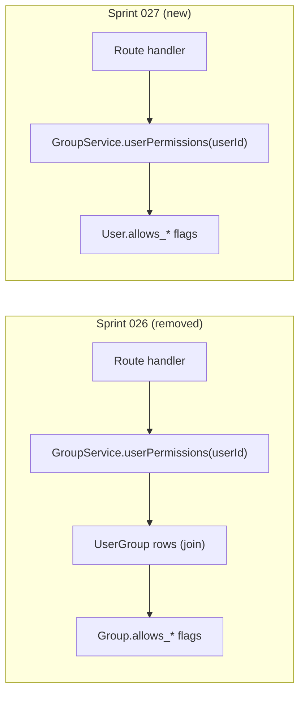
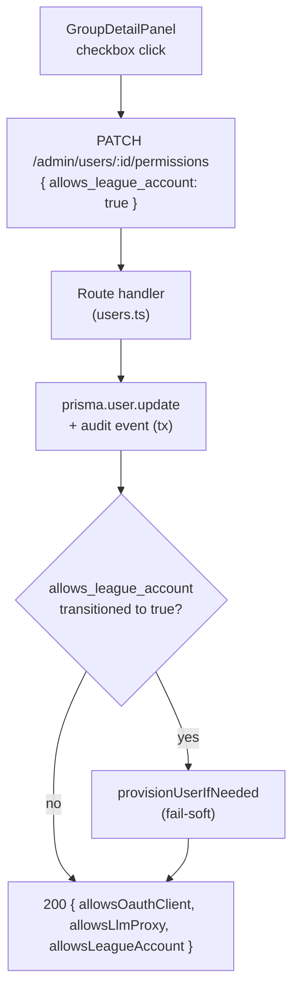
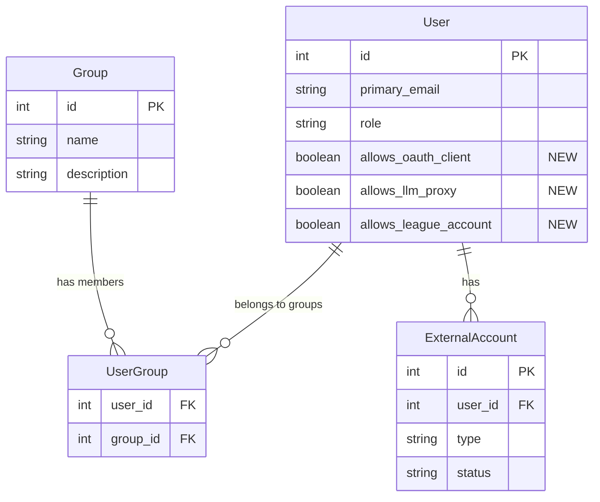
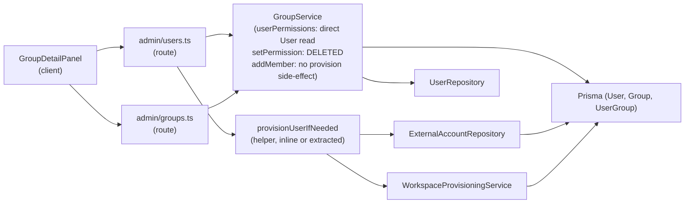

<!-- CLASI: Before changing code or making plans, review the SE process in CLAUDE.md -->

# Architecture Update — Sprint 027: Per-user permissions via group member grid

## Step 1: Problem Understanding

Sprint 026 moved three boolean permission flags (`allows_oauth_client`,
`allows_llm_proxy`, `allows_league_account`) onto the `Group` entity and
derived a user's effective permissions as the additive union across all their
groups. Stakeholder direction (2026-05-02): the group is not the right
permission carrier. Permissions must be per-user. The group's member grid is
the right UI surface for setting them (it provides a classroom-scoped context),
but the data must live on the `User` row.

This sprint reverses the schema change and rewrites every layer that touched
group-derived permissions. Sprint 026 shipped but was not promoted to
production and no group flags were ever set — so no data migration is needed.

---

## Step 2: Responsibilities

**R1 — User permission schema**: Persist the three boolean flags on `User`.
Defaults to false; no migration for existing rows. Remove the three columns
from `Group`.

**R2 — Permission read path**: `GroupService.userPermissions(userId)` now
performs a single `User` row lookup instead of a join over `UserGroup` →
`Group`. The return type is unchanged.

**R3 — Permission write path**: A new `PATCH /api/admin/users/:id/permissions`
endpoint accepts a subset of `{ allows_oauth_client, allows_llm_proxy,
allows_league_account }` and updates the User row. Records an audit event.

**R4 — Per-user provisioning helper**: Extract a single-user provisioning
function from `GroupService._provisionMembersWithoutWorkspace`. The new
route handler calls it after setting `allows_league_account = true`. The group
fan-out in `setPermission` is deleted along with `setPermission` itself.
`GroupService.addMember`'s provisioning side-effect is simplified or removed
(the group no longer carries `allows_league_account`).

**R5 — Member grid data extension**: `GroupService.listMembers` / the
`GET /admin/groups/:id/members` response is extended to include each member's
three permission flags so the client grid can render checkboxes without a
separate per-user fetch.

**R6 — Client member grid checkboxes**: `GroupDetailPanel` replaces the
"Permissions" section with three checkbox columns in the member table. Each
checkbox fires `PATCH /api/admin/users/:id/permissions`.

**R7 — Client UI removal**: The "Permissions" section in `GroupDetailPanel`
is deleted. `GET /admin/groups/:id` drops the three permission fields.
`PATCH /admin/groups/:id` handler is simplified (permission flag processing
removed). Any per-user "Grant LLM proxy" / "Create League account" buttons
found elsewhere are removed.

---

## Step 3: Module Definitions

### `server/prisma/schema.prisma` (modified) — SUC-001

**Purpose**: Persist the three permission flags on `User`, removing them from
`Group`.

**Boundary (in)**: Three boolean fields added to `model User`; three boolean
fields removed from `model Group`.

**Boundary (out)**: Prisma-generated client reflects the updated `User` and
`Group` types.

**Change**:
```prisma
model User {
  // ... existing fields ...
  allows_oauth_client   Boolean @default(false)
  allows_llm_proxy      Boolean @default(false)
  allows_league_account Boolean @default(false)
}

model Group {
  // allows_oauth_client   REMOVED
  // allows_llm_proxy      REMOVED
  // allows_league_account REMOVED
}
```

Dev: `prisma db push`. Prod: Prisma migration adds three columns to User, drops
three from Group.

---

### `server/src/services/group.service.ts` (modified) — SUC-002, SUC-004

**Purpose**: Domain logic for the Group entity. Simplified by removal of
`setPermission` and group-derived permission computation.

**Changes**:
- `userPermissions(userId)`: rewritten to query `prisma.user.findUnique` and
  return `{ oauthClient: user.allows_oauth_client, llmProxy: user.allows_llm_proxy,
  leagueAccount: user.allows_league_account }`. No group join.
- `setPermission`: deleted entirely.
- `_provisionMembersWithoutWorkspace`: refactored into a standalone exported
  helper `provisionUserIfNeeded(prisma, workspaceProvisioning, userId, actorId)`
  in a new module or in the same file. The group fan-out loop is gone.
- `addMember`: the `allows_league_account` side-effect is removed. `addMember`
  no longer provisions — provisioning is only triggered by the explicit permission
  toggle.
- `PERM_COLUMN_MAP` and `PermissionKey` types: deleted.
- `GroupService` constructor: `workspaceProvisioning` optional dep can be removed
  if `addMember` provisioning is dropped.

**Boundary (out)**: `userPermissions` signature unchanged. `setPermission`
signature removed.

---

### `server/src/services/workspace-provisioning.service.ts` (or inline helper) — SUC-004

**Purpose**: Provide a reusable single-user provisioning check-and-call.

**New helper** (`provisionUserIfNeeded`):
```
async function provisionUserIfNeeded(
  prisma, workspaceProvisioning, userId, actorId
): Promise<void>
```
1. Query `ExternalAccountRepository.findActiveByUserAndType(prisma, userId, 'workspace')`.
2. If found (active or pending), return without action.
3. Call `workspaceProvisioning.provision(userId, actorId, tx)` inside a
   `prisma.$transaction`.
4. Fail-soft: catch and log errors without propagating.

This helper is called from the `PATCH /api/admin/users/:id/permissions` route
handler when `allows_league_account` flips to `true`.

---

### `server/src/routes/admin/users.ts` (modified) — SUC-003, SUC-004

**Purpose**: Admin user management API, extended with a permissions PATCH.

**New endpoint**: `PATCH /admin/users/:id/permissions`

```
Body:   { allows_oauth_client?: boolean, allows_llm_proxy?: boolean,
          allows_league_account?: boolean }
Returns: { allowsOauthClient, allowsLlmProxy, allowsLeagueAccount }
```

Handler:
1. Validate body field types (400 on non-boolean).
2. Look up user (404 on missing).
3. Build `updateData` from provided fields.
4. If `updateData` is empty → return current permission state (200).
5. Persist update + audit event in a transaction.
6. If `allows_league_account === true` and the previous value was `false`,
   call `provisionUserIfNeeded` (fail-soft, does not affect HTTP response).
7. Return updated permission state.

Emits `adminBus.notify('users')` and `userBus.notifyUser(id)` on success.

---

### `server/src/routes/admin/groups.ts` (modified) — SUC-006

**Purpose**: Admin group management API, simplified by removal of permission
flag processing.

**Changes**:
- `PATCH /admin/groups/:id`: remove the `allowsOauthClient`, `allowsLlmProxy`,
  `allowsLeagueAccount` processing block and calls to `GroupService.setPermission`.
  The PATCH endpoint can be removed entirely or kept for future non-permission
  partial updates. Removing it is cleaner given nothing else uses it currently.
- `GET /admin/groups/:id`: remove `allowsOauthClient`, `allowsLlmProxy`,
  `allowsLeagueAccount` from the response shape.
- `permissionsQuery` in `GroupDetailPanel` references this endpoint — that
  query is deleted in the client change.

---

### `server/src/services/repositories/group.repository.ts` (modified) — SUC-005

**Purpose**: Data access for the Group entity. `listMembers` extended to return
permission flags per member.

**Change**: The Prisma query in `listMembers` adds
`select: { allows_oauth_client, allows_llm_proxy, allows_league_account }` on
the `User` join. The `MemberRow` type gains three optional boolean fields.

---

### `client/src/pages/admin/GroupDetailPanel.tsx` (modified) — SUC-005, SUC-006

**Purpose**: Group detail page. Replaces the group-level Permissions section
with per-row checkboxes.

**Removals**:
- `permissionsQuery` (the separate `GET /admin/groups/:id` fetch for group flags).
- `GroupPermissions` interface.
- `patchPermission` function.
- `PermissionToggleRow` subcomponent.
- `leagueAccountPending` state and `permPatchError` state.
- `permSectionStyle` CSS constant.
- The `{permissionsQuery.data && (<div style={permSectionStyle}>...)}` block.

**Additions**:
- `Member` interface gains `allowsOauthClient`, `allowsLlmProxy`,
  `allowsLeagueAccount` boolean fields (from updated `listMembers` API shape).
- Three new `<th>` columns in the table header: "OAuth", "LLM Proxy", "Lg Acct".
- Three new `<td>` cells per row, each with a checkbox bound to the member's
  corresponding flag.
- `patchUserPermission(userId, field, value)` function that calls
  `PATCH /api/admin/users/:id/permissions`.
- Per-row error handling is fail-soft: on PATCH failure, show the existing
  banner with the error message.

---

## Step 4: Diagrams

### Permission read path — before (Sprint 026) and after (Sprint 027)



### Permission write path — new PATCH endpoint



### Entity-relationship — User with permission columns (sprint 027)



### Module dependency graph (sprint 027 changes only)



No cycles. Routes depend on services; services depend on repositories; repositories
depend on Prisma.

---

## Step 5: What Changed

### Schema

| Change | Detail |
|---|---|
| `User.allows_oauth_client` added | Boolean, `@default(false)`. User may register OAuth clients. |
| `User.allows_llm_proxy` added | Boolean, `@default(false)`. User may receive LLM proxy tokens. |
| `User.allows_league_account` added | Boolean, `@default(false)`. User receives Workspace provisioning in `/Students`. |
| `Group.allows_oauth_client` removed | Was `@default(false)`. No data loss. |
| `Group.allows_llm_proxy` removed | Was `@default(false)`. No data loss. |
| `Group.allows_league_account` removed | Was `@default(false)`. No data loss. |

### Server — changed/removed

| Module | Change |
|---|---|
| `GroupService.userPermissions(userId)` | Rewritten: reads `User.allows_*` directly. One DB call, no join. |
| `GroupService.setPermission` | Deleted. |
| `GroupService._provisionMembersWithoutWorkspace` | Refactored into `provisionUserIfNeeded` helper (exported or module-level). |
| `GroupService.addMember` | Simplified: no `allows_league_account` side-effect. |
| `GroupRepository.listMembers` | Extended: returns `allowsOauthClient`, `allowsLlmProxy`, `allowsLeagueAccount` per member from the User row. |
| `PATCH /admin/users/:id/permissions` | New endpoint. Updates User permission flags. Triggers provisioning for `leagueAccount=true`. |
| `PATCH /admin/groups/:id` | Removed or gutted: permission flag processing deleted. |
| `GET /admin/groups/:id` | Permission fields (`allowsOauthClient`, etc.) removed from response. |

### Client

| Component | Change |
|---|---|
| `GroupDetailPanel.tsx` | "Permissions" section deleted. Three checkbox columns added to member grid. |

### Policy table (unchanged from sprint 026)

| Permission flag | API path gated | Admin bypass | Grandfather rule |
|---|---|---|---|
| `allows_oauth_client` | `POST /api/oauth-clients` | Yes (admin unchecked) | Yes — existing non-disabled client counts as grandfather |
| `allows_llm_proxy` | `POST /admin/users/:id/llm-proxy-token` | N/A (admin-only) | No — gate applies on every new grant |
| `allows_league_account` | Triggers provisioning on toggle-on | — | Existing Workspace accounts not deleted on toggle-off |

---

## Why

Sprint 026 added group-level permission toggles. Stakeholder feedback after
ship: the group should be a viewport for managing individual users, not a
permission carrier. "All members of this group can create OAuth clients" is
not the right granularity — "this specific student can create an OAuth client"
is. Moving flags to `User` and surfacing them as per-row checkboxes in the
group grid is the correct model.

---

## Impact on Existing Components

- **`OAuthClientService.create`**: unchanged. Route handler still calls
  `GroupService.userPermissions` before calling `create`; the return value
  now reflects the User row instead of the group union. Behavior is identical
  from the perspective of `OAuthClientService`.

- **`LlmProxyTokenService.grant`**: unchanged. Route handler still passes
  `llmProxyAllowed` from `GroupService.userPermissions`. Source changed, gate
  unchanged.

- **`bulk-llm-proxy.service.ts`**: If it calls `userPermissions` per-user in
  the bulk grant loop, the source change is transparent. If it does not,
  behavior is the same as before (bulk grant never checked per-user group
  permissions — that was an open question in sprint 026).

- **`GroupDetailPanel` tests**: Tests asserting on the "Permissions" section
  must be removed. Tests for the new checkbox columns must be added. The
  `permissionsQuery` mock is removed.

- **Route tests for `GET /admin/groups/:id`**: Assertions on `allowsOauthClient`
  etc. in the response must be removed.

- **`GroupService` tests**: Tests for `setPermission` are removed. Tests for
  `userPermissions` are updated to mock a User row, not a group membership.

---

## Migration Concerns

**Schema**: No data migration. Sprint 026 shipped but group permission flags
were never set in production (they defaulted to false). The new User columns
add with `@default(false)`.

Dev environment: `prisma db push` resets to the new schema. Because the dev
database is disposable (per project convention), no migration history is
preserved.

Prod environment: A Prisma migration file adds the three columns to User,
drops the three from Group. Column drop is safe because values were all false.

**API clients**: Any client that reads `allowsOauthClient` / `allowsLlmProxy`
/ `allowsLeagueAccount` from `GET /admin/groups/:id` will receive `undefined`
after this sprint. The only known consumer is `GroupDetailPanel`'s
`permissionsQuery`, which is deleted in this same sprint.

---

## Design Rationale

### Decision: PATCH /admin/users/:id/permissions as a dedicated sub-resource endpoint

**Context**: Could extend `PUT /admin/users/:id` to accept permission fields.

**Alternatives**:
1. Extend `PUT /admin/users/:id` — adds permission fields to a general-purpose
   endpoint, mixes concerns, requires full-user body on each toggle.
2. New `PATCH /admin/users/:id/permissions` sub-resource — matches PATCH
   semantics (partial update), clear intent, no coupling to general user fields.

**Choice**: Option 2.

**Why**: PATCH semantics correctly express "update some fields of this user's
permissions." The checkbox in the grid fires with a single-field payload; PUT
would require re-sending all fields. Separate endpoint keeps permission logic
isolated from name/role/email update logic.

**Consequences**: Two update paths for User (PUT for identity fields, PATCH for
permission flags). Acceptable — both serve distinct purposes.

---

### Decision: Route handler owns the provisioning side-effect, not GroupService

**Context**: When `allows_league_account` is toggled to `true`, provisioning
should fire. This could live in a service method called by the route, or in
the route handler directly.

**Choice**: Route handler calls `provisionUserIfNeeded` directly after persisting
the permission change.

**Why**: Keeps `GroupService` free of the `WorkspaceProvisioningService`
dependency for this specific path. The service is no longer the orchestration
point for provisioning (that was `setPermission`'s role). The route handler
is an appropriate place to coordinate the two steps (flag update, then
provisioning side-effect).

**Consequences**: The permissions route handler has two concerns (DB update +
provisioning call). This is acceptable because provisioning is explicitly fail-soft
and does not affect the HTTP response — it is a fire-and-soft-fail side-effect.

---

### Decision: Drop addMember provisioning side-effect

**Context**: Sprint 026 extended `addMember` to auto-provision users when the
group had `allows_league_account = true`. Now the group no longer carries that
flag.

**Choice**: Remove the provisioning side-effect from `addMember` entirely.

**Why**: `addMember` should not read the User's `allows_league_account` flag
to decide whether to provision — that would add a new dependency and implicit
behavior that is hard to reason about. Provisioning is now explicitly triggered
only by the permission toggle, which is the correct causal event.

**Consequences**: Adding a member to a group no longer auto-provisions them
even if `allows_league_account = true`. Admin must check the checkbox in the
member grid. This is the intended behavior.

---

## Open Questions

1. **PATCH /admin/groups/:id endpoint**: Should it be removed entirely (clean)
   or kept as a stub for future non-permission PATCH uses? Current plan: remove
   it and the corresponding client `patchPermission` function. Implementor can
   keep it if they anticipate future partial-update use cases.

2. **`addMember` provisioning**: The decision above removes the side-effect.
   If the stakeholder wants "add a member who already has `allows_league_account=true`
   to a group and get them auto-provisioned," that is a follow-up sprint.
