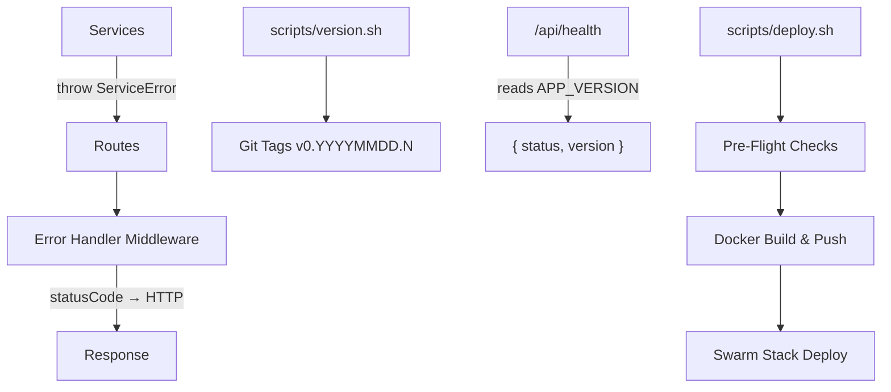

# Architecture

## Architecture Overview

This sprint adds three independent infrastructure components that improve
error handling, release management, and deployment safety. None require
database changes or new external dependencies.



## Technology Stack

- **TypeScript** — Error class hierarchy (server/src/errors.ts)
- **Express** — Error handler middleware update
- **Bash** — Version and deploy scripts
- **Git tags** — Version storage
- **Docker/Swarm** — Existing deployment target (no changes)

## Component Design

### Component: ServiceError Hierarchy

**Purpose**: Provide typed error classes that automatically map to HTTP status codes.

**Boundary**: Inside — error classes and error handler middleware. Outside — route handlers and client code.

**Use Cases**: SUC-001

New file `server/src/errors.ts` exports: ServiceError (base), NotFoundError (404),
ValidationError (400), UnauthorizedError (401), ForbiddenError (403), ConflictError (409).

The existing `server/src/middleware/errorHandler.ts` is updated to check
`instanceof ServiceError` and use `err.statusCode` for the response.

Services (UserService, etc.) are updated to throw typed errors instead of
raw Error objects or returning null.

### Component: Version Management

**Purpose**: Assign date-based version identifiers to releases via git tags.

**Boundary**: Inside — version script, npm scripts, health endpoint version field. Outside — CI/CD, Docker image tagging (handled by deploy script).

**Use Cases**: SUC-002

New file `scripts/version.sh` calculates `0.YYYYMMDD.N` from existing tags.
Health endpoint reads `APP_VERSION` env var (set at deploy time) or falls
back to reading the latest git tag.

### Component: Deploy Script

**Purpose**: Validate preconditions and execute the full deployment pipeline.

**Boundary**: Inside — pre-flight checks, Docker build/push, Swarm deploy, migration. Outside — CI/CD triggers, monitoring, rollback.

**Use Cases**: SUC-003

New file `scripts/deploy.sh` runs sequential pre-flight checks then
builds, pushes, deploys, and migrates.

## Dependency Map

```
DeployScript → VersionScript (reads git tags created by version:tag)
DeployScript → Docker/Swarm (existing infrastructure)
ErrorHandler → ServiceError (instanceof check)
Services → ServiceError (throw subclasses)
HealthEndpoint → APP_VERSION env var (set by deploy script)
```

## Data Model

No database changes. No new models or migrations.

## Security Considerations

- Error handler must not leak stack traces in production (500 errors
  return generic message only)
- Deploy script validates clean working tree to prevent deploying
  uncommitted secrets
- Version tags are annotated (signed if GPG is configured)

## Design Rationale

**Error hierarchy over error codes**: Classes with instanceof checking
are more idiomatic in TypeScript than numeric error codes. They're
self-documenting and extensible.

**Date-based versioning over semver**: This app deploys frequently and
doesn't have external API consumers who need semver guarantees. Date-based
versions are simpler and immediately tell you when something was deployed.

**Bash deploy script over CI/CD**: The project doesn't have CI/CD yet.
A bash script provides immediate value and can be wrapped by CI/CD later.

## Open Questions

None — all three components are well-defined by the TODO specs and follow
patterns proven in the inventory app.

## Sprint Changes

Changes planned:

### Changed Components

**Added:**
- `server/src/errors.ts` — ServiceError class hierarchy
- `scripts/version.sh` — Date-based version calculator
- `scripts/deploy.sh` — Deployment script with pre-flight checks

**Modified:**
- `server/src/middleware/errorHandler.ts` — ServiceError-aware error handling
- `server/src/routes/health.ts` — Add version field to response
- `server/src/services/user.service.ts` — Throw typed errors
- `package.json` — Add version:bump, version:tag, deploy npm scripts

### Migration Concerns

None — no database changes, no breaking API changes.
