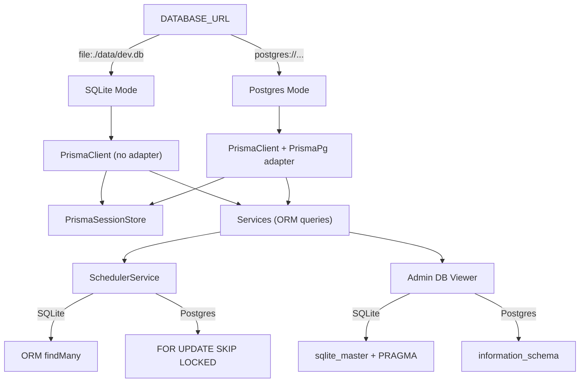

# Architecture

## Architecture Overview

This sprint makes the database layer provider-agnostic, supporting both
SQLite (student development) and PostgreSQL (production). The key changes
are in the Prisma schema, client initialization, session store, and raw
SQL elimination.



## Technology Stack

- **Prisma 7** — dual provider `["sqlite", "postgresql"]`
- **Express session** — Store interface for PrismaSessionStore
- **TypeScript** — all service changes
- **SQLite** — via Prisma built-in support (no driver adapter needed)
- **@prisma/adapter-pg** — retained for Postgres mode only

## Component Design

### Component: Dual-Provider Prisma Schema

**Purpose**: Allow the same schema to work on both SQLite and PostgreSQL.

**Boundary**: Inside — schema file, provider list. Outside — migration strategy.

**Use Cases**: SUC-001, SUC-004

Changes: `provider = ["sqlite", "postgresql"]`, remove `@db.VarChar(255)` and
`@db.Timestamptz(6)` from Session model. Enums stay (Prisma handles both).

### Component: Branching Prisma Client

**Purpose**: Initialize the correct Prisma client based on DATABASE_URL.

**Boundary**: Inside — `prisma.ts`, `isSqlite()` helper. Outside — all consuming code.

**Use Cases**: SUC-001, SUC-004

SQLite: `new PrismaClient()` (no adapter). Postgres: `new PrismaClient({ adapter: new PrismaPg(...) })`.
Export `isSqlite()` for use by other modules that need to branch behavior.

### Component: PrismaSessionStore

**Purpose**: Database-agnostic Express session store using Prisma ORM.

**Boundary**: Inside — get/set/destroy/touch methods. Outside — Express session middleware.

**Use Cases**: SUC-002

Replaces `connect-pg-simple`. Implements `session.Store` interface with
`prisma.session.findUnique()`, `prisma.session.upsert()`, `prisma.session.delete()`.

### Component: ORM-Based SessionService

**Purpose**: Replace raw SQL queries with Prisma ORM calls.

**Boundary**: Inside — list/count/deleteExpired methods. Outside — admin sessions panel.

**Use Cases**: SUC-003

Replaces `$queryRaw` with `prisma.session.findMany()`, `prisma.session.count()`,
`prisma.session.deleteMany()`.

### Component: Branching SchedulerService

**Purpose**: Support concurrent-safe job scheduling on both databases.

**Boundary**: Inside — tick() method. Outside — scheduled job handlers.

**Use Cases**: SUC-003

Postgres: existing `FOR UPDATE SKIP LOCKED` raw SQL.
SQLite: `prisma.scheduledJob.findMany()` ORM query (single-writer, no contention).

### Component: DbIntrospector

**Purpose**: Abstract database metadata queries for the admin DB viewer.

**Boundary**: Inside — listTables/getTableDetail methods. Outside — admin DB routes.

**Use Cases**: SUC-003

Interface with PostgresIntrospector (`information_schema`) and
SqliteIntrospector (`sqlite_master` + `PRAGMA table_info()`).

### Component: Branching BackupService

**Purpose**: Support backup/restore on both databases.

**Boundary**: Inside — createBackup/restoreBackup methods. Outside — admin backup panel.

**Use Cases**: SUC-003

SQLite: copy .db file. Postgres: existing pg_dump/psql logic.
exportJson() unchanged (pure ORM).

## Dependency Map

```
prisma.ts → @prisma/adapter-pg (Postgres only)
PrismaSessionStore → prisma (ORM)
SessionService → prisma (ORM, replaces $queryRaw)
SchedulerService → prisma (ORM for SQLite, raw SQL for Postgres)
DbIntrospector → prisma ($queryRaw, provider-specific SQL)
BackupService → fs (SQLite) / docker exec (Postgres)
app.ts → PrismaSessionStore (replaces connect-pg-simple)
```

## Data Model

No schema changes. The Session model loses `@db.VarChar(255)` and
`@db.Timestamptz(6)` annotations (Postgres-specific native types that
are unnecessary — Prisma's base types work on both).

## Security Considerations

- SQLite files must not be committed (add data/ to .gitignore)
- SQLite is dev-only; production must use Postgres
- Session data stored identically on both databases

## Design Rationale

**PrismaSessionStore over dual stores**: One implementation works everywhere.
No need to maintain two session store dependencies.

**`prisma db push` for SQLite**: Students don't need migration history.
It's appropriate for a dev-only database that gets recreated freely.

**ORM over raw SQL**: Prisma ORM queries work on both databases. Raw SQL
is only kept where Postgres-specific features provide real value (FOR UPDATE
SKIP LOCKED for concurrency safety).

## Open Questions

None.

## Sprint Changes

### Changed Components

**Added:**
- `server/src/services/prisma-session-store.ts` — PrismaSessionStore
- `server/src/services/db-introspector.ts` — DbIntrospector interface + implementations

**Modified:**
- `server/prisma/schema.prisma` — dual provider, remove @db annotations
- `server/src/services/prisma.ts` — branch initialization, export isSqlite()
- `server/src/app.ts` — replace connect-pg-simple with PrismaSessionStore
- `server/src/services/session.service.ts` — raw SQL → ORM
- `server/src/services/scheduler.service.ts` — branch tick()
- `server/src/services/backup.service.ts` — SQLite backup support
- `server/src/routes/admin/db.ts` — use DbIntrospector
- `docker/wait-for-db.sh` — skip for SQLite
- `package.json` — update dev scripts, remove connect-pg-simple

**Removed:**
- `connect-pg-simple` dependency

### Migration Concerns

- Existing Postgres migrations are unchanged
- SQLite uses `prisma db push` (no migration files)
- No data migration needed — this is a development workflow change
