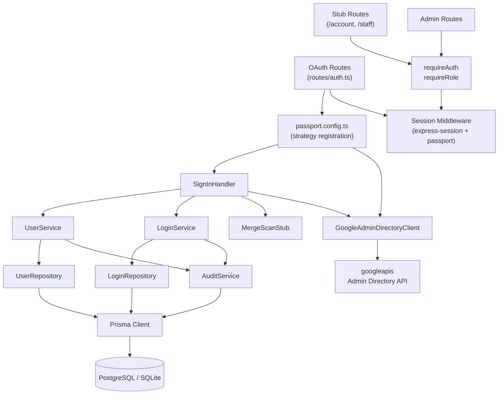

# Architecture Update — Sprint 002: Authentication — Social Sign-In and Staff OU Detection

This document is a delta from the Sprint 001 initial architecture
(`docs/clasi/sprints/done/001-foundation-scaffold-data-model-audit-infrastructure/architecture-update.md`).
Read Sprint 001's document first for baseline module definitions, directory
layout, data model, and service layer conventions.

---

## What Changed

Sprint 002 adds the complete authentication layer on top of Sprint 001's
service and repository foundation:

1. **Passport.js integration** — `passport-google-oauth20` and
   `passport-github2` strategies wired into the Express app. Session
   serialization/deserialization completed (stubs were left in `app.ts`
   by Sprint 001).
2. **OAuth route module** (`server/src/routes/auth.ts`) — four OAuth routes
   plus logout; replaces/extends the template's demo-login stub.
3. **Sign-in handler** (`server/src/services/auth/sign-in.handler.ts`) —
   the shared business logic that runs after any OAuth callback: Login lookup,
   conditional User creation, merge-scan stub call, session establishment.
4. **`GoogleAdminDirectoryClient`** abstraction
   (`server/src/services/auth/google-admin-directory.client.ts`) — wraps the
   Google Admin SDK for OU membership lookups. Dependency-injected so tests
   can swap in a fake.
5. **Staff OU detection** — within the Google OAuth callback, for
   `@jointheleague.org` accounts only, calls `GoogleAdminDirectoryClient` and
   updates `user.role` to `staff` when the OU prefix matches.
6. **Merge-scan stub** (`server/src/services/auth/merge-scan.stub.ts`) — a
   no-op function that logs "merge-scan deferred to Sprint 007". Wired at every
   new-User creation call site.
7. **Auth middleware** (`server/src/middleware/requireAuth.ts` — already
   scaffolded in Sprint 001 but now functional; `server/src/middleware/requireRole.ts`
   — new) — session-based guards used by all protected routes.
8. **Session shape** — `req.session` gains typed fields `userId: number` and
   `role: UserRole`. Session serialization stores only these two fields.
9. **Stub landing routes** — `GET /account` and `GET /staff` return HTTP 200
   with placeholder text; content is Sprint 003.
10. **Secrets expansion** — four OAuth env vars and two Admin SDK env vars are
    now required at runtime (all gated: missing vars return 501 gracefully).

---

## Why

Nothing in the application is accessible without a signed-in User. Sprint 002
closes this gap: after this sprint real Users can authenticate, and every
subsequent sprint can build on a real session with a real `userId` and `role`.

Staff OU detection is bundled here because it is a conditional branch inside the
same Google OAuth callback. Separating it into a later sprint would require
touching the callback again and retesting the same flows.

---

## Auth Stack

### Session Infrastructure (unchanged from Sprint 001)

Express uses `express-session` with a Prisma-backed session store. The
`SESSION_SECRET` env var signs the session cookie. Sprint 001 left stubs for
`passport.serializeUser` and `passport.deserializeUser` in `app.ts`; Sprint 002
completes them.

Serialization contract:
- `serializeUser` — stores `{ id: user.id }` in the session.
- `deserializeUser` — loads `User` from the database by `id`; attaches to
  `req.user`.

`req.session` typed extension (new in Sprint 002):

```typescript
// Illustrative — not executable code
declare module 'express-session' {
  interface SessionData {
    userId: number;
    role: UserRole;  // 'student' | 'staff' | 'admin'
  }
}
```

Only `userId` and `role` are stored in the session. No email, display name, or
OAuth tokens are persisted server-side beyond these two fields.

### Passport Strategy Registration

Both strategies are registered in a new module
`server/src/services/auth/passport.config.ts`:

- `passport-google-oauth20` strategy with scopes `['profile', 'email']`.
  Callback URL: `process.env.GOOGLE_CALLBACK_URL` (environment-specific;
  defaults available per `.claude/rules/api-integrations.md`).
- `passport-github2` strategy with scopes `['read:user', 'user:email']`.
  Callback URL: `process.env.GITHUB_CALLBACK_URL`.

Both strategies invoke the shared **Sign-In Handler** (see below) as their
verify callback. Neither strategy stores OAuth tokens — this application uses
OAuth for identity only, not for ongoing API access on the user's behalf.

---

## OAuth Route Layout

All routes are in `server/src/routes/auth.ts`. The module is mounted at `/api`
in `app.ts`.

| Method | Path | Description |
|---|---|---|
| GET | `/api/auth/google` | Initiates Google OAuth redirect |
| GET | `/api/auth/google/callback` | Google OAuth callback — calls sign-in handler |
| GET | `/api/auth/github` | Initiates GitHub OAuth redirect |
| GET | `/api/auth/github/callback` | GitHub OAuth callback — calls sign-in handler |
| POST | `/api/auth/logout` | Destroys session; redirects to sign-in page |
| GET | `/api/auth/me` | Returns `{ userId, role }` for the current session or 401 |

Stub landing routes (content provided by Sprint 003):

| Method | Path | Description |
|---|---|---|
| GET | `/account` | Student account page — placeholder in Sprint 002 |
| GET | `/staff` | Staff directory — placeholder in Sprint 002 |

---

## Sign-In Handler

`server/src/services/auth/sign-in.handler.ts`

The sign-in handler is the shared verify callback invoked by both Passport
strategies. It is a pure service function (no Express types) so it can be
tested independently.

**Responsibility:** Given a provider name and a provider profile, find or create
a User and Login, run the merge-scan stub for new Users, and return the User
for session establishment.

**Boundary:** The handler does not read from or write to `req`/`res`. It accepts
typed inputs and returns a typed result. The Passport verify callback in
`auth.ts` translates between the Passport API and this handler.

**Flow:**

```
signInHandler(provider, profile, adminDirClient?)
  1. LoginService.findByProvider(provider, profile.id)
  2. If found → return existing User (no creation steps)
  3. If not found:
     a. user = await UserService.createWithAudit({
          display_name, primary_email, role: 'student',
          created_via: 'social_login',
          actorId: null  // system action
        })
        // UserService.createWithAudit opens its own transaction,
        // creates the User row, and records the create_user AuditEvent
        // atomically — consistent with Sprint 001 service-layer convention.
     b. await LoginService.create({
          userId: user.id, provider, provider_user_id,
          provider_email, provider_username
        })
        // LoginService.create opens its own transaction and records
        // the add_login AuditEvent atomically.
     c. mergeScan(user)  // no-op stub
  4. If provider=google AND email domain is @jointheleague.org:
     a. ou = await adminDirClient.getUserOU(email)
     b. if ou starts with GOOGLE_STAFF_OU_PATH:
          await UserService.update(user.id, { role: 'staff' })
          // UserService.update goes through the service layer,
          // not the repository directly, per Sprint 001 convention.
  5. return user (with updated role if staff)
```

**Note on Admin SDK injection:** The `adminDirClient` parameter is optional and
defaults to the live `GoogleAdminDirectoryClient`. In tests, a fake is passed
that returns a controlled OU path without network calls.

---

## Google Admin Directory Client

`server/src/services/auth/google-admin-directory.client.ts`

**Responsibility:** Reads a user's OU path from the Google Admin Directory API.
Single method: `getUserOU(email: string): Promise<string>`.

**Boundary:** All Google Admin SDK details are contained within this module.
Nothing outside it imports from `googleapis` for OU lookups.

**Implementation:**
- Uses a Google service account JSON key loaded via one of two env vars:
  - `GOOGLE_SERVICE_ACCOUNT_JSON_FILE` — filesystem path to a JSON key file.
    Preferred for local development. File path is not a secret (set in
    `public.env`); the file contents are secret (never committed).
  - `GOOGLE_SERVICE_ACCOUNT_JSON` — the full JSON object as an inline string.
    Preferred for Docker Swarm environments where secrets are mounted as files
    and parsed inline.
  - When both are set, `GOOGLE_SERVICE_ACCOUNT_JSON_FILE` wins.
  - When neither is set, `getUserOU()` throws `StaffOULookupError` (MISSING_CREDENTIALS).
  - When `_FILE` is set but the file is missing or contains invalid JSON, throws
    `StaffOULookupError` (MALFORMED_CREDENTIALS).
- Impersonates `GOOGLE_ADMIN_DELEGATED_USER_EMAIL` for domain-wide delegation
  (the impersonated account must have Admin SDK read access).
- Scope required: `https://www.googleapis.com/auth/admin.directory.user.readonly`.
- Returns the `orgUnitPath` field from the Admin SDK `users.get` response.
- Throws a typed `StaffOULookupError` on failure (network error, API error,
  or missing credentials). Callers treat this as access denied for
  `@jointheleague.org` accounts.
- Logs at INFO which credential source was used (`_FILE` or `_JSON`) on the first
  successful credential resolution.

**Interface (not executable code):**

```typescript
interface AdminDirectoryClient {
  getUserOU(email: string): Promise<string>;
}

class GoogleAdminDirectoryClient implements AdminDirectoryClient {
  constructor(serviceAccountJson: string, delegatedUser: string) { ... }
  async getUserOU(email: string): Promise<string> { ... }
}

// In tests:
class FakeAdminDirectoryClient implements AdminDirectoryClient {
  constructor(private ouPath: string) {}
  async getUserOU(_email: string): Promise<string> { return this.ouPath; }
}
```

**Production concern:** Setting up the Google service account with domain-wide
delegation is an out-of-band operational step — it requires a Google Cloud
project, a service account, downloading the JSON key, granting the account
Admin SDK read scope in the Google Admin console, and storing the JSON in
dotconfig. Sprint 002 does not automate this setup. The service account
must exist and be configured before the OU check can run in production.
See "Open Questions" at the end of this document for the decision about what
happens when credentials are absent in non-production environments.

---

## Merge-Scan Stub

`server/src/services/auth/merge-scan.stub.ts`

A single exported function:

```typescript
// Not executable — illustrative
async function mergeScan(user: User): Promise<void> {
  logger.info({ userId: user.id },
    'merge-scan deferred to Sprint 007 — no-op call site');
}
```

Called immediately after new User creation in the sign-in handler. The call
site and its location in the flow are intentional; Sprint 007 replaces the
implementation, not the call site.

This stub is **not** called for staff Users (staff identity does not enter the
student merge queue).

---

## Auth Middleware

### `requireAuth`

`server/src/middleware/requireAuth.ts` — already scaffolded in Sprint 001,
now functional.

Checks `req.session.userId`. If absent: returns 401. If present: continues.

### `requireRole`

`server/src/middleware/requireRole.ts` — new in Sprint 002.

```typescript
// Not executable — illustrative
function requireRole(...roles: UserRole[]): RequestHandler {
  return (req, res, next) => {
    if (!req.session.role || !roles.includes(req.session.role)) {
      return res.status(403).json({ error: 'Forbidden' });
    }
    next();
  };
}
```

Usage in routes:

```typescript
router.get('/admin/users', requireAuth, requireRole('admin'), handler);
router.get('/staff/directory', requireAuth, requireRole('staff', 'admin'), handler);
router.get('/account', requireAuth, handler); // any role
```

Both middleware check session fields only — no database calls in the hot path.

---

## Module Diagram



---

## Data Model Changes

No schema changes in Sprint 002. The `User.role` and `Login` tables from
Sprint 001 are sufficient. One field mapping is clarified:

### GitHub Username Storage

The Sprint 001 `Login` schema has `provider_email String?` but no dedicated
`provider_username` field. GitHub usernames must be stored somewhere for future
Pike13 write-back (UC-020). Two options were evaluated:

1. Store the GitHub username in `provider_email` (overload existing field).
2. Add a `provider_username String?` column to `Login` via a migration.

**Decision:** Add `provider_username String?` to the `Login` model via a new
migration. Overloading `provider_email` would make the field semantically
ambiguous and violate cohesion. The migration is a non-breaking nullable column
addition.

**Migration:** Additive `ALTER TABLE "Login" ADD COLUMN "provider_username" TEXT;`
— no data change required; safe for both SQLite and Postgres.

### Updated Login Schema (delta)

```prisma
model Login {
  id               Int      @id @default(autoincrement())
  user_id          Int
  provider         String
  provider_user_id String
  provider_email   String?
  provider_username String? // NEW: GitHub username; null for Google logins
  created_at       DateTime @default(now())

  user             User     @relation(fields: [user_id], references: [id], onDelete: Restrict)

  @@unique([provider, provider_user_id])
  @@index([user_id])
}
```

---

## Secrets Required

All secrets are loaded at runtime via `process.env`. They are stored in
`config/{env}/secrets.env` (SOPS-encrypted) and accessed via dotconfig.
No hardcoding. Missing secrets cause the affected OAuth integration to return
HTTP 501 with a setup message, not a crash.

| Secret / Env Var | Used By | Notes |
|---|---|---|
| `GOOGLE_CLIENT_ID` | passport-google-oauth20 | Google Cloud Console OAuth 2.0 client |
| `GOOGLE_CLIENT_SECRET` | passport-google-oauth20 | |
| `GOOGLE_CALLBACK_URL` | passport-google-oauth20 | Dev: `http://localhost:5173/api/auth/google/callback` |
| `GITHUB_CLIENT_ID` | passport-github2 | GitHub Developer Settings OAuth App |
| `GITHUB_CLIENT_SECRET` | passport-github2 | |
| `GITHUB_CALLBACK_URL` | passport-github2 | Dev: `http://localhost:5173/api/auth/github/callback` |
| `GOOGLE_SERVICE_ACCOUNT_JSON_FILE` | GoogleAdminDirectoryClient | Path to service account JSON key file (preferred for local dev; not a secret — file contents are) |
| `GOOGLE_SERVICE_ACCOUNT_JSON` | GoogleAdminDirectoryClient | Full service account JSON as an inline string (preferred for Docker Swarm secrets). Fallback when `_FILE` is not set. |
| `GOOGLE_ADMIN_DELEGATED_USER_EMAIL` | GoogleAdminDirectoryClient | Admin email for impersonation |
| `GOOGLE_STAFF_OU_PATH` | sign-in handler | OU prefix for staff detection (e.g., `/League Staff`) |
| `SESSION_SECRET` | express-session | Already required from Sprint 001 |

`GOOGLE_SERVICE_ACCOUNT_JSON_FILE` / `GOOGLE_SERVICE_ACCOUNT_JSON` and
`GOOGLE_ADMIN_DELEGATED_USER_EMAIL` are only required in production (or any
environment where UC-003 must work). In dev/test, the `GoogleAdminDirectoryClient`
is replaced by a fake via dependency injection.

For local development the preferred approach is `GOOGLE_SERVICE_ACCOUNT_JSON_FILE`
pointing to `config/files/gapps-integrations-fc9a96a0f34a.json`. Set the path in
`config/dev/public.env` — the file path is not a secret. The file itself is
gitignored (must not be committed).

---

## Testing Strategy

### Integration Tests

OAuth flows cannot be tested end-to-end in an automated suite without hitting
real OAuth providers. Instead, Sprint 002 tests use **Passport mock strategies**:

- A `MockGoogleStrategy` that bypasses the OAuth redirect and calls the verify
  callback directly with a controlled profile object.
- A `MockGitHubStrategy` with the same pattern.

Both mocks are registered in a `tests/server/helpers/passport-test-setup.ts`
helper that swaps the real strategies for fakes when `NODE_ENV=test`. The real
Passport session middleware (`serializeUser`/`deserializeUser`) still runs — only
the OAuth redirect/callback round-trip is replaced by a direct verify call.

**`GoogleAdminDirectoryClient` in tests:** Every test that exercises the Google
callback with a `@jointheleague.org` account passes a `FakeAdminDirectoryClient`
via dependency injection. Tests cover:
- Staff OU path matches → role becomes staff.
- Staff OU path does not match → role stays student.
- Client throws `StaffOULookupError` → response is 403 / error page.

### Test Coverage Required

| Scenario | Test |
|---|---|
| Google OAuth: new user created | Integration: callback with unknown profile |
| Google OAuth: existing user signed in | Integration: callback with known profile |
| Google OAuth: non-jointheleague.org | Integration: no OU check called |
| Google OAuth: jointheleague.org, in staff OU | Integration: role=staff |
| Google OAuth: jointheleague.org, not in staff OU | Integration: role=student |
| Google OAuth: Admin SDK failure | Integration: access denied |
| GitHub OAuth: new user created | Integration: callback with unknown profile |
| GitHub OAuth: existing user signed in | Integration: callback with known profile |
| GitHub OAuth: no public email | Integration: placeholder email stored |
| Logout | Integration: session destroyed |
| requireAuth: no session | Unit: 401 returned |
| requireRole: wrong role | Unit: 403 returned |
| mergeScan stub | Unit: called after new User; logs deferral |

---

## Impact on Existing Components

### `app.ts`

- `passport.initialize()` and `passport.session()` middleware registered.
- `passport.serializeUser` / `passport.deserializeUser` stubs replaced with
  full implementations.
- New route module `routes/auth.ts` mounted.
- Stub routes `/account` and `/staff` added.

### `middleware/requireAuth.ts`

Was a scaffold returning 401. Now reads `req.session.userId` and calls `next()`
if present.

### `services/service.registry.ts`

No changes to `ServiceRegistry` itself. `GoogleAdminDirectoryClient` is
infrastructure, not a business service — it is instantiated in
`server/src/services/auth/passport.config.ts` alongside the Passport strategies
and injected directly into the sign-in handler at construction time. This keeps
the registry focused on business services as established in Sprint 001.

### Admin Routes

`server/src/routes/admin/` routes that were unguarded in Sprint 001 are now
protected by `requireAuth` + `requireRole('admin')`.

---

## Migration Concerns

One new database migration:
- Add `provider_username TEXT` nullable column to `Login` table.
- Safe for both SQLite and Postgres. No data migration required.
- Migration must run before Sprint 002 deployment (additive change, no downtime
  risk).

Session cookie settings should be reviewed for production:
- `secure: true` in production (HTTPS only).
- `sameSite: 'lax'` is appropriate for OAuth redirect flows.
- These are configuration concerns for the implementer, not schema changes.

---

## Design Rationale

### Decision 1: Shared Sign-In Handler, Not Per-Provider Route Logic

**Context:** Both Google and GitHub OAuth callbacks follow nearly identical flows
(lookup → create → merge-scan → session). The only difference is the staff OU
check, which is conditional on domain.

**Alternatives:**
1. Duplicate the flow in each route handler (simpler at first, diverges over time).
2. Shared handler function invoked by both strategies.

**Choice:** Option 2.

**Why:** Duplication means any change to the shared flow (e.g., adding a `login_used`
audit event in Sprint 005) must be applied in two places. A single handler is
cohesive, testable in isolation, and keeps the route handlers as thin adapters.

**Consequences:** The handler needs a small interface for the Admin SDK client to
support injection. This is a minor complexity trade-off that pays for itself in
testability.

---

### Decision 2: `GoogleAdminDirectoryClient` as an Injected Abstraction

**Context:** The Google Admin SDK requires a real service account with domain-wide
delegation. In dev and test environments this credential is unavailable.

**Alternatives:**
1. Wrap the Admin SDK call in a conditional (`if (process.env.GOOGLE_SERVICE_ACCOUNT_JSON)`)
   and skip the check when credentials are absent.
2. Define an interface and inject either the real client or a fake.

**Choice:** Option 2.

**Why:** Option 1 introduces an untested code path in production (the OU check)
and a tested-but-incorrect path in dev (always skipping the check). Option 2
lets tests exercise the full sign-in handler logic with a controlled fake,
while production runs the real client. The interface is small (one method).

**Consequences:** Production deployment requires the service account credentials
to be configured via dotconfig before UC-003 can work. This is an operational
dependency, not a code problem.

---

### Decision 3: Merge-Scan Stub as a Separate Module, Not an Inline Comment

**Context:** UC-001 and UC-002 require calling the merge similarity check on
new User creation. Sprint 007 implements it. The call site must exist now.

**Alternatives:**
1. Inline comment `// TODO Sprint 007: call merge scan here`.
2. Named no-op function that logs the deferral.

**Choice:** Option 2.

**Why:** An inline comment leaves nothing to refactor — Sprint 007 must find the
comment and add code around it. A named function in its own module (`merge-scan.stub.ts`)
is replaced wholesale by Sprint 007 with the real implementation at the same import
path. This makes Sprint 007's task a clean module swap, not a code-reading exercise.

---

### Decision 4: `provider_username` Column Added to Login

**Context:** GitHub usernames are needed for future Pike13 write-back (UC-020,
Sprint 006). The existing `provider_email` field is semantically for email
addresses and should not be overloaded.

**Choice:** Add `provider_username String?` column to `Login`.

**Why:** Cohesion. `provider_email` holds an email or null; `provider_username`
holds a provider-specific username or null. This is a nullable additive column —
zero migration risk and no impact on existing data.

---

## Resolved Decisions

The following questions were open at draft time and resolved by the stakeholder
on 2026-04-18.

---

**RD-001 (was OQ-001): Missing Google Admin service account credentials at sign-in**

Stakeholder: Eric Busboom, 2026-04-18.

Decision: **Fail-secure.** If `GOOGLE_SERVICE_ACCOUNT_JSON` or
`GOOGLE_ADMIN_DELEGATED_USER_EMAIL` is absent or misconfigured, all
`@jointheleague.org` sign-in attempts are rejected with a clear error message.
The system must NOT fall back to treating the user as a student — that would
allow unverified accounts into the system.

Reasoning: A silent fallback to student role would create a security gap if
credentials are accidentally removed or misconfigured in production. Hard
rejection forces operators to notice and correct the configuration. The error
must be observable: the denial is logged at ERROR level and, where possible, an
audit event is written so the condition appears in the audit trail.

Impact: `GoogleAdminDirectoryClient` throws `StaffOULookupError` whenever
credentials are missing. The sign-in handler treats a `StaffOULookupError` on
a `@jointheleague.org` account as a deny — HTTP 403 or redirect to an error
page — never as a student assignment. This supersedes the "graceful skip" behavior
described for non-production environments in the original Secrets section; that
description applied only to app startup, not to the sign-in path.

---

**RD-002 (was OQ-002): GitHub OAuth returns no public email**

Stakeholder: Eric Busboom, 2026-04-18.

Decision: **Use `<username>@github.invalid` as the `primary_email` fallback.**
Sign-in completes normally. The student can update their primary email later
on the student account page (Sprint 003).

Reasoning: Blocking sign-in until an email is supplied requires a post-OAuth
form and significant additional UX work that is out of scope for Sprint 002.
The `.invalid` TLD is an RFC-reserved sentinel; it cannot be a real deliverable
address, so downstream code can detect and distinguish it from a real email.
Sprint 003 will provide the account page where students can supply a real email.

Impact: The acceptance criterion "when GitHub returns no public email,
`primary_email` is set to `<github_username>@github.invalid` and a warning is
logged" is now a firm requirement, not a placeholder pending review.

---

**RD-003 (was OQ-003): `@jointheleague.org` account not in staff OU**

Stakeholder: Eric Busboom, 2026-04-18.

Decision: **Treat as student.** If a `@jointheleague.org` account is found in
the Admin Directory but its OU path does not match `GOOGLE_STAFF_OU_PATH`,
assign `role=student` and sign in normally. Do NOT hard-deny.

Reasoning: Staff accounts not yet moved to the staff OU (e.g., newly hired
staff during onboarding) should still be able to sign in rather than being
locked out. A student role is the safe default — it provides access to the
student-facing features without granting elevated staff privileges. Role
correction can be done by an admin once the OU assignment is updated in Google
Workspace.

Impact: The sign-in handler does not deny access on OU mismatch for
`@jointheleague.org` accounts; it continues with `role=student`. Only a
`StaffOULookupError` (missing credentials, API failure — covered by RD-001)
causes a deny.
