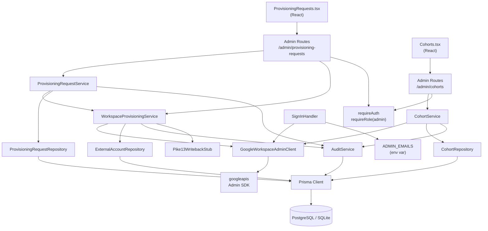

# Architecture Update — Sprint 004: Google Workspace Integration — Cohort OUs and Workspace Provisioning

This document is a delta from the Sprint 003 architecture. Read the Sprint
001 initial architecture, Sprint 002 auth delta, and Sprint 003 account-page
delta first for baseline definitions.

---

## What Changed

Sprint 004 adds the Google Workspace write layer and wires administrator
approval of provisioning requests to real external API operations:

1. **`GoogleWorkspaceAdminClient`** — extends (or supersedes as a renamed
   class) the Sprint 002 `GoogleAdminDirectoryClient`. Adds write methods:
   `createUser`, `createOU`, `suspendUser`, `deleteUser`, `listUsersInOU`.
   Broadens OAuth scopes to include write access. The existing `getUserOU`
   method (read-only, used at sign-in) is preserved and still used by the
   sign-in handler.

2. **Domain/OU guard** — a hard check inside `GoogleWorkspaceAdminClient`
   that refuses to create accounts on any domain other than
   `GOOGLE_STUDENT_DOMAIN` or any OU outside `GOOGLE_STUDENT_OU_ROOT`.
   Throws `WorkspaceDomainGuardError` if violated. This guard runs on every
   `createUser` call, even if the caller has already validated.

3. **Write-enable flag** — `GOOGLE_WORKSPACE_WRITE_ENABLED=1` must be set
   for any write call to proceed. When absent, the client throws
   `WorkspaceWriteDisabledError`. Prevents accidental write calls in
   development or misconfigured environments.

4. **`CohortService.createWithOU`** — a new transactional method that calls
   `GoogleWorkspaceAdminClient.createOU` and `CohortRepository.create`
   inside a single `prisma.$transaction`. If the Admin SDK call fails, no
   Cohort row is written. Handles UC-012 end-to-end.

5. **`WorkspaceProvisioningService`** — a new service module responsible
   solely for executing League Workspace account creation. Validates
   preconditions, calls `GoogleWorkspaceAdminClient.createUser`, creates
   the ExternalAccount row, emits the audit event, and calls the Pike13
   write-back stub. All writes occur inside the transaction passed by the
   caller.

6. **`ProvisioningRequestService.approve` — wired** — Sprint 003 left
   `approve` as a seam (sets status=approved, emits audit event). This
   sprint extends it to call `WorkspaceProvisioningService.provision`
   immediately after approval, within the same transaction. Reject remains
   a pure status change.

7. **Admin provisioning-requests page** — new route `GET /admin/provisioning-requests`
   (list pending requests), `POST /admin/provisioning-requests/:id/approve`,
   `POST /admin/provisioning-requests/:id/reject`. React component in
   `client/src/pages/admin/ProvisioningRequests.tsx`.

8. **Admin cohort management page** — new routes `GET /admin/cohorts` (list)
   and `POST /admin/cohorts` (create). React component in
   `client/src/pages/admin/Cohorts.tsx`.

9. **Admin role assignment** — resolved via `ADMIN_EMAILS` environment
   variable (see Design Rationale Decision 5). The sign-in handler is
   updated to check whether a newly authenticated `@jointheleague.org`
   user's email is in the `ADMIN_EMAILS` list; if so, their session role
   is elevated to `admin`. `requireRole('admin')` middleware continues to
   work without change.

10. **Pike13 write-back stub** — `server/src/services/pike13-writeback.stub.ts`
    (new module). Exports `leagueEmail(userId, email)` as a no-op that logs
    "Pike13 write-back deferred to Sprint 006." Called by
    `WorkspaceProvisioningService` immediately after ExternalAccount creation.
    Sprint 006 replaces the implementation at the same import path.

11. **`FakeGoogleWorkspaceAdminClient`** — a fake implementation of the
    `GoogleWorkspaceAdminClient` interface for all integration tests. Stores
    calls in-memory; allows test assertions on what was called with what
    arguments.

12. **New secrets/config:** `GOOGLE_STUDENT_OU_ROOT`, `GOOGLE_STUDENT_DOMAIN`,
    `GOOGLE_WORKSPACE_WRITE_ENABLED`, `ADMIN_EMAILS`.

---

## Why

Cohort creation and Workspace provisioning are tightly coupled: a cohort must
exist (and its OU must exist) before any Workspace account can be created.
Grouping them in one sprint avoids splitting the Admin SDK client across
multiple sprints.

Sprint 003 delivered the provisioning request workflow but left `approve` as a
seam. Sprint 004 fills the seam: approval now triggers real provisioning. This
completes the loop from student self-service request through administrator
decision to actual account creation.

Admin role assignment is resolved here because the admin provisioning UI
requires it. The `ADMIN_EMAILS` approach is the minimal viable solution that
unblocks execution. Stakeholders can migrate to an OU-based approach later
without changing the middleware interface.

---

## New Modules

### GoogleWorkspaceAdminClient

**File:** `server/src/services/google-workspace/google-workspace-admin.client.ts`

**Purpose:** All Google Admin SDK operations for this application — read OU
membership (reused from Sprint 002 via the same credential loader) and write
operations for user and OU management.

**Boundary (inside):** Loading service-account credentials, constructing the
Admin SDK auth client, executing API calls, enforcing the domain/OU guard,
enforcing the write-enable flag, translating SDK errors to typed application
errors.

**Boundary (outside):** No business logic, no Prisma calls, no transaction
management. Callers own transactions.

**Interface (not executable code):**

```typescript
interface GoogleWorkspaceAdminClient {
  // Read — used by sign-in handler (Sprint 002)
  getUserOU(email: string): Promise<string>;

  // Write — new in Sprint 004
  createUser(params: CreateUserParams): Promise<CreatedUser>;
  createOU(name: string): Promise<CreatedOU>;
  suspendUser(email: string): Promise<void>;
  deleteUser(email: string): Promise<void>;
  listUsersInOU(ouPath: string): Promise<WorkspaceUser[]>;
}

interface CreateUserParams {
  primaryEmail: string;     // must be on GOOGLE_STUDENT_DOMAIN
  orgUnitPath: string;      // must be under GOOGLE_STUDENT_OU_ROOT
  givenName: string;
  familyName: string;
  sendNotificationEmail: boolean;
}

interface CreatedUser {
  id: string;               // Google Workspace user ID
  primaryEmail: string;
}

interface CreatedOU {
  ouPath: string;           // full path including GOOGLE_STUDENT_OU_ROOT
}
```

**Credential loading:** Reuses the same two-env-var resolution established in
Sprint 002 (`GOOGLE_SERVICE_ACCOUNT_FILE` wins over
`GOOGLE_SERVICE_ACCOUNT_JSON`; bare filenames resolved against `config/files/`).

**Scope change:** Sprint 002 uses
`https://www.googleapis.com/auth/admin.directory.user.readonly`. Sprint 004
adds `https://www.googleapis.com/auth/admin.directory.user` (for user writes)
and `https://www.googleapis.com/auth/admin.directory.orgunit` (for OU writes).
The broader scopes must be granted in the Google Admin console (domain-wide
delegation settings) before write operations can succeed in production.

**Typed errors thrown:**

| Error class | When |
|---|---|
| `WorkspaceDomainGuardError` | `primaryEmail` domain is not `GOOGLE_STUDENT_DOMAIN`, or `orgUnitPath` is not under `GOOGLE_STUDENT_OU_ROOT` |
| `WorkspaceWriteDisabledError` | Any write method called when `GOOGLE_WORKSPACE_WRITE_ENABLED` is not `"1"` |
| `WorkspaceApiError` | Admin SDK returns an HTTP error response |
| `StaffOULookupError` | `getUserOU` fails (retained from Sprint 002) |

---

### WorkspaceProvisioningService

**File:** `server/src/services/workspace-provisioning.service.ts`

**Purpose:** Executes the complete League Workspace account creation flow for
one User, including precondition checks, Admin SDK call, ExternalAccount
creation, write-back stub call, and audit event.

**Boundary (inside):** Precondition validation, coordinating
`GoogleWorkspaceAdminClient`, `ExternalAccountRepository`,
`AuditService`, and the Pike13 write-back stub.

**Boundary (outside):** Does not manage the transaction boundary — the
caller (`ProvisioningRequestService.approve` or the direct admin route
handler) passes a `tx`. Does not interact with `ProvisioningRequest` rows.
Does not send notifications.

**Why ExternalAccountRepository and not ExternalAccountService:** The
caller owns the transaction (`tx`). `ExternalAccountService` opens its own
transactions internally (Sprint 001 pattern). Passing `tx` down to the
repository layer is the established pattern (Sprint 001 architecture,
"Transaction Boundaries" section) and avoids nested transaction conflicts.
`WorkspaceProvisioningService` calls the repository directly because it
needs to write the ExternalAccount inside the caller's transaction, not
inside a new one.

**Use cases served:** UC-005, SUC-002.

**Interface (not executable code):**

```typescript
class WorkspaceProvisioningService {
  async provision(
    userId: number,
    actorId: number,
    tx: Prisma.TransactionClient
  ): Promise<ExternalAccount>
  // Validates: user.role === 'student', cohort has google_ou_path,
  // no active/pending workspace ExternalAccount exists, write-enable flag set.
  // Calls GoogleWorkspaceAdminClient.createUser.
  // Creates ExternalAccount(type=workspace, status=active, external_id).
  // Calls pike13WritebackStub.leagueEmail (no-op this sprint).
  // Calls AuditService.record(tx, { action: 'provision_workspace', ... }).
  // Returns the created ExternalAccount.
}
```

---

### CohortService.createWithOU (extended method)

**File:** `server/src/services/cohort.service.ts` (existing, method added)

**Purpose:** The single transaction-safe entry point for cohort creation that
ensures the Google OU and the Cohort row are created atomically.

**Boundary:** Calls `GoogleWorkspaceAdminClient.createOU` then
`CohortRepository.create` inside one `prisma.$transaction`. Emits
`create_cohort` AuditEvent. If `createOU` throws, the transaction is
aborted and no Cohort row is written.

**Use cases served:** UC-012, SUC-001.

**Interface (not executable code):**

```typescript
// Added to existing CohortService:
async createWithOU(
  name: string,
  actorId: number
): Promise<Cohort>
```

---

### Pike13WritebackStub

**File:** `server/src/services/pike13-writeback.stub.ts`

**Purpose:** Provides the call site for Pike13 write-back operations that
Sprint 006 will implement. Acts as a no-op this sprint.

**Boundary:** No database calls, no external API calls. Logs at INFO level
that the write-back is deferred. Sprint 006 replaces this module wholesale at
the same import path.

**Interface (not executable code):**

```typescript
export async function leagueEmail(userId: number, email: string): Promise<void> {
  logger.info({ userId, email },
    'pike13-writeback: leagueEmail deferred to Sprint 006 — no-op call site');
}
```

---

### FakeGoogleWorkspaceAdminClient

**File:** `tests/server/helpers/fake-google-workspace-admin.client.ts`

**Purpose:** In-memory implementation of `GoogleWorkspaceAdminClient` for
use in all integration tests. Records calls for assertion; returns
configurable results; never makes network calls.

**Boundary:** Test helper only. Not referenced by production code.

---

### Admin Routes — Provisioning Requests

**File:** `server/src/routes/admin/provisioning-requests.ts`

**Purpose:** List pending provisioning requests and handle approve/reject
actions.

**Routes:**

| Method | Path | Description |
|---|---|---|
| GET | `/admin/provisioning-requests` | List all pending ProvisioningRequests |
| POST | `/admin/provisioning-requests/:id/approve` | Approve and provision |
| POST | `/admin/provisioning-requests/:id/reject` | Reject request |

All routes: `requireAuth` + `requireRole('admin')`.

---

### Admin Routes — Cohort Management

**File:** `server/src/routes/admin/cohorts.ts`

**Purpose:** List cohorts and create new cohorts (with OU creation).

**Routes:**

| Method | Path | Description |
|---|---|---|
| GET | `/admin/cohorts` | List all Cohorts |
| POST | `/admin/cohorts` | Create cohort + OU |

All routes: `requireAuth` + `requireRole('admin')`.

---

## Module Diagram



---

## Data Model Changes

No new tables or columns. All seven entities are established. One constraint
clarification:

### Cohort.google_ou_path

The `google_ou_path` column was defined as nullable in Sprint 001
(`String?`). After `CohortService.createWithOU`, this field is always
populated. Cohorts created before Sprint 004 (e.g., seed data) may have
`null`; those cohorts cannot be used for Workspace provisioning until
`google_ou_path` is backfilled. No migration required; the nullability is
intentional for forward compatibility.

---

## Admin Role Assignment

**Chosen approach: `ADMIN_EMAILS` environment variable (OQ-001 resolution).**

The sign-in handler is updated as follows:

```
signInHandler — admin role check (new branch, after existing staff check):
  if (user.email is in ADMIN_EMAILS env var list):
    await UserService.update(user.id, { role: 'admin' })
    session.role = 'admin'
```

`ADMIN_EMAILS` is a comma-separated list of `@jointheleague.org` addresses.
This check runs for `@jointheleague.org` sign-ins only (after the staff OU
check). If an email is in `ADMIN_EMAILS`, the user gets `role=admin`
regardless of OU membership.

**Why this approach over the alternatives:**

- **Option (a): admin OU in Google Workspace** — requires operational setup
  of a new OU and moving existing admin accounts. Higher coordination cost
  for the first sprint that needs admin access. Can be adopted later.
- **Option (b): `ADMIN_EMAILS` env var** — zero Google Workspace configuration
  changes. Immediately testable. Simple to reason about. The stakeholder can
  enumerate admins explicitly.
- **Option (c): DB-level admin flag** — requires a UI for toggling it, which
  itself needs an admin. Bootstrapping problem.

`ADMIN_EMAILS` is the minimal viable solution. A future sprint can replace it
with OU-based detection without changing the `requireRole('admin')` middleware.

**Security:** Admins are still authenticated via Google OAuth. The `ADMIN_EMAILS`
check determines role elevation only. An attacker cannot forge an `@jointheleague.org`
Google identity without compromising the Google account.

---

## Write-Enable Flag Pattern

`GOOGLE_WORKSPACE_WRITE_ENABLED=1` is checked by `GoogleWorkspaceAdminClient`
before any write method executes. When absent or not exactly `"1"`, the client
throws `WorkspaceWriteDisabledError` and logs at ERROR level.

This is an explicit opt-in for environments where writes are safe. Development
environments do not set it by default. This prevents accidental OU or user
creation during development or test runs.

Read methods (`getUserOU`, `listUsersInOU`) are not gated by this flag — they
are safe in all environments.

---

## Testing Strategy

### FakeGoogleWorkspaceAdminClient

All integration tests that exercise `CohortService.createWithOU`,
`WorkspaceProvisioningService.provision`, or `ProvisioningRequestService.approve`
receive a `FakeGoogleWorkspaceAdminClient` via constructor injection. The fake:

- Records every call (`createUser`, `createOU`, etc.) with arguments.
- Returns configurable responses (success or thrown error) per-method.
- Is inspectable in test assertions (`fake.calls.createUser[0].primaryEmail`).

No test makes a network call to the Google Admin SDK.

### Test Coverage Required

| Scenario | Service/Layer |
|---|---|
| `createWithOU` — success: OU created, Cohort row persisted, audit recorded | CohortService integration |
| `createWithOU` — Admin SDK failure: no Cohort row created (transaction rollback) | CohortService integration |
| `createWithOU` — duplicate name: validation error before API call | CohortService integration |
| `provision` — success: ExternalAccount created, audit recorded, write-back stub called | WorkspaceProvisioningService integration |
| `provision` — no cohort: blocked before API call | WorkspaceProvisioningService integration |
| `provision` — user not student: blocked | WorkspaceProvisioningService integration |
| `provision` — active workspace already exists: blocked | WorkspaceProvisioningService integration |
| `provision` — Admin SDK failure: no ExternalAccount created | WorkspaceProvisioningService integration |
| Domain guard: student domain enforced | Unit (client guard) |
| Domain guard: OU outside student root blocked | Unit (client guard) |
| Write-enable flag: absent → WriteDisabledError | Unit (client flag) |
| `approve` wires to `provision`: request approved + ExternalAccount created atomically | ProvisioningRequestService integration |
| `reject`: status=rejected, no API call | ProvisioningRequestService integration |
| Admin role: ADMIN_EMAILS elevates role=admin at sign-in | sign-in handler integration |
| GET /admin/provisioning-requests: 403 for non-admin | Route integration |
| POST /admin/cohorts: 403 for non-admin | Route integration |
| Full UC-005 path via approval flow | End-to-end integration |
| Full UC-012 path via cohort create | End-to-end integration |

### Smoke Test Note

The real `GoogleWorkspaceAdminClient` (with live credentials) is exercised
only via a manual smoke test run against the dev environment, gated on
`GOOGLE_WORKSPACE_WRITE_ENABLED=1`. This is not part of the automated suite.

---

## Secrets and Configuration

| Env Var | Required | Description |
|---|---|---|
| `GOOGLE_STUDENT_OU_ROOT` | Yes (for writes) | Root OU path for all student cohorts, e.g. `/Students` |
| `GOOGLE_STUDENT_DOMAIN` | Yes (for writes) | Student email domain, e.g. `students.jointheleague.org` |
| `GOOGLE_WORKSPACE_WRITE_ENABLED` | Yes (for writes) | Must be exactly `"1"` to allow write calls; absent = reads only |
| `ADMIN_EMAILS` | Yes (for admin login) | Comma-separated list of admin `@jointheleague.org` email addresses |
| `GOOGLE_SERVICE_ACCOUNT_FILE` / `GOOGLE_SERVICE_ACCOUNT_JSON` | Yes (production) | Same resolution as Sprint 002 — broader scopes required now |
| `GOOGLE_ADMIN_DELEGATED_USER_EMAIL` | Yes (production) | Same as Sprint 002 |

All existing Sprint 002 secrets (`GOOGLE_CLIENT_ID`, `GOOGLE_CLIENT_SECRET`,
`GOOGLE_STAFF_OU_PATH`, etc.) are unchanged.

New vars must be added to `config/dev/secrets.env.example` and
`config/prod/secrets.env.example`.

---

## Impact on Existing Components

### `server/src/services/auth/google-admin-directory.client.ts`

This module is renamed or superseded by `google-workspace-admin.client.ts`.
The existing `getUserOU` method and its error types (`StaffOULookupError`) are
preserved. The sign-in handler's import path changes.

Options for the implementer:

1. **Extend in place:** Rename the file and class, add write methods to the
   same class. Simpler. Recommended.
2. **Compose:** Keep the old read-only client as-is; create a new write client
   that internally instantiates the old one. More complex, less recommended.

This document assumes option 1. The existing `AdminDirectoryClient` interface
is replaced by `GoogleWorkspaceAdminClient` interface which includes both
read and write methods. The `FakeAdminDirectoryClient` from Sprint 002 tests
is replaced by `FakeGoogleWorkspaceAdminClient` which covers all methods.

### `server/src/services/auth/sign-in.handler.ts`

Updated to:
- Import from the renamed `google-workspace-admin.client.ts`.
- Check `ADMIN_EMAILS` list after the staff OU check for `@jointheleague.org`
  accounts. If matched, update `user.role` to `admin`.

No change to the sign-in flow for non-`@jointheleague.org` accounts.

### `server/src/services/provisioning-request.service.ts`

`approve` is extended from a status-only update to a transactional
sequence: set status=approved + call `WorkspaceProvisioningService.provision`
+ emit audit events, all inside one `prisma.$transaction`.

`WorkspaceProvisioningService` is injected as a constructor dependency
(same pattern as `ExternalAccountService` injected in Sprint 003).

### `server/src/services/cohort.service.ts`

`createWithOU` is added. Existing `findAll` and `findById` methods are
unchanged.

### `server/src/app.ts`

New admin route modules mounted:
- `/admin/provisioning-requests`
- `/admin/cohorts`

### `client/src/App.tsx`

Two new admin routes added:
- `/admin/provisioning-requests` → `ProvisioningRequests` component
- `/admin/cohorts` → `Cohorts` component

---

## Migration Concerns

No schema changes. No new migrations required.

Operational prerequisites before Sprint 004 can execute in a live environment:
1. The Google service account must be granted broader scopes in the Google
   Admin console (add `admin.directory.user` and `admin.directory.orgunit`
   to the domain-wide delegation settings).
2. `GOOGLE_STUDENT_OU_ROOT` must exist in Google Workspace before any
   `createOU` call succeeds.
3. `ADMIN_EMAILS` must be set before any admin can log in and use the new
   admin pages.

---

## Design Rationale

### Decision 1: Extend GoogleAdminDirectoryClient Rather Than Creating a Parallel Client

**Context:** Sprint 002's `GoogleAdminDirectoryClient` is read-only
(`admin.directory.user.readonly`). Sprint 004 needs write operations.

**Alternatives:**
1. Extend the existing class with write methods, rename it
   `GoogleWorkspaceAdminClient`.
2. Create a new write-only client that coexists with the read-only one.

**Choice:** Option 1.

**Why:** The read and write operations share all credential-loading logic,
the impersonated delegated user, and the googleapis auth setup. Maintaining
two clients for the same API connection is shotgun surgery — a credential
change requires touching two files. One class, one credential resolution path.

**Consequences:** The sign-in handler's import path changes. Both the
sprint-002 `FakeAdminDirectoryClient` and the new `FakeGoogleWorkspaceAdminClient`
must implement the unified interface. Existing Sprint 002 tests must be updated
to use the new fake (the behavior under test does not change).

---

### Decision 2: WorkspaceProvisioningService as Its Own Module

**Context:** The provisioning logic could live in `ExternalAccountService`,
`ProvisioningRequestService`, or a new dedicated service.

**Alternatives:**
1. Add `provisionWorkspace` to `ExternalAccountService`.
2. Add it to `ProvisioningRequestService` (which calls `approve`).
3. Separate `WorkspaceProvisioningService`.

**Choice:** Option 3.

**Why:** `ExternalAccountService` is a CRUD service for the ExternalAccount
entity. Adding Admin SDK coordination to it violates the one-concern-per-module
rule. `ProvisioningRequestService` manages request lifecycle — it should
not own provisioning logic (which is independent of whether a request exists,
since admins can also provision directly). A dedicated service is the cohesive
choice: its single responsibility is "execute Workspace account creation."

**Consequences:** One more module. `ProvisioningRequestService` gets a new
constructor dependency (`WorkspaceProvisioningService`). The direct admin
provisioning path and the request-approval path both call the same service —
no logic duplication.

---

### Decision 3: Transactional Atomicity for CohortService.createWithOU

**Context:** Creating a cohort requires both an Admin SDK call (creates the
OU) and a Prisma write (creates the Cohort row). These are not in the same
transactional domain — the Admin SDK call is an external side effect.

**Alternatives:**
1. Create the OU first; if it succeeds, write the Cohort row. On Cohort
   write failure, leave the OU orphaned.
2. Write the Cohort row first; if it succeeds, create the OU. On OU failure,
   roll back the Cohort row.
3. Create the OU first; if it succeeds, write the Cohort row in a transaction.
   If the Prisma write fails after a successful OU creation, the OU is orphaned
   but this is a rare operational edge case.

**Choice:** Option 3 (OU first, then transactional Prisma write).

**Why:** Option 2 risks a Cohort row existing without a corresponding OU —
which would cause confusing provisioning failures later. Option 3 risks
an orphaned OU, but OU creation failures are expected to be rare (name
conflicts are caught by validation before the API call). Orphaned OUs can
be cleaned up manually. The Prisma transaction still protects the Cohort
row and the AuditEvent from partial writes.

**Consequences:** The implementer must document this edge case. If the Admin
SDK creates the OU but the Prisma write fails, no Cohort row exists. The
administrator will see an error and should retry (the OU already existing
is an Admin SDK error that the retry path should handle gracefully — either
treat it as success and proceed to the Cohort write, or surface it clearly).

---

### Decision 4: Pike13 Write-Back as a Stub Module

**Context:** UC-005 calls for Pike13 write-back of the League email after
provisioning. Sprint 006 implements this. This sprint must leave the call site.

**Choice:** Named no-op module `pike13-writeback.stub.ts`, same pattern as
`merge-scan.stub.ts` from Sprint 002.

**Why:** An inline comment has no enforcement value. A named module at a
stable import path is replaced wholesale by Sprint 006 with no call-site
changes needed. This mirrors the established pattern.

**Consequences:** Sprint 006 replaces the file, not any call sites.

---

### Decision 5: Admin Role via ADMIN_EMAILS Env Var

**Context:** The admin provisioning-requests and cohort pages require
`role=admin`. No admin role assignment flow exists yet.

**Alternatives:**
1. Admin OU in Google Workspace (separate OU for admins within staff domain).
2. `ADMIN_EMAILS` comma-separated env var.
3. DB-level admin flag with a toggle UI.

**Choice:** Option 2 (`ADMIN_EMAILS`).

**Why:** Option 1 requires out-of-band Google Workspace configuration changes
before the sprint can be tested — a blocking operational dependency. Option 3
has a bootstrapping problem (the first admin cannot be set without an existing
admin). Option 2 requires only a config value and works immediately. The
stakeholder explicitly requested this be documented as a flag for future
revision.

**Consequences:** `ADMIN_EMAILS` must be set before any admin can use the new
pages. If the list is empty or the var is absent, no `@jointheleague.org`
user gets `role=admin`. A future sprint can replace this with OU detection
without changing `requireRole('admin')` or downstream admin route handlers.

---

## Open Questions

**OQ-001: Admin notification channel for provisioning requests.**

Sprint 003 flagged this. Sprint 004 does not resolve it. The `notifyAdmin`
stub call site from Sprint 003 remains a no-op. Stakeholder should decide
before Sprint 005 whether email, in-app badge, or another mechanism is
wanted — that decision affects Sprint 005 planning.

**OQ-002: Google welcome email delivery verification.**

`sendNotificationEmail: true` causes Google to deliver the welcome email
asynchronously. The Admin SDK returns success before the email is delivered.
This sprint trusts Google's success response and does not attempt to verify
delivery. Stakeholder should confirm this is acceptable, or flag if a
delivery confirmation mechanism is needed.

**OQ-003: Write-enable flag in CI.**

Automated integration tests use `FakeGoogleWorkspaceAdminClient` and do not
need `GOOGLE_WORKSPACE_WRITE_ENABLED=1`. The flag is checked by the real
client only, not the fake. No CI configuration change is needed for the test
suite. This is documented here for clarity.

---

## Resolved Decisions

None from this sprint at draft time. OQ-001 and OQ-002 from Sprint 003 remain
open; see Open Questions above.
