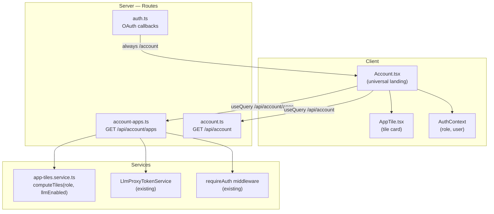
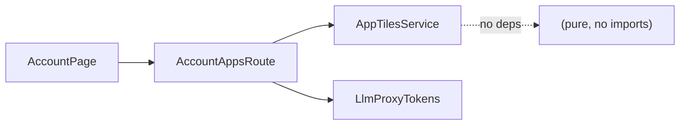

<!-- CLASI: Before changing code or making plans, review the SE process in CLAUDE.md -->

# Architecture Update — Sprint 016: Universal Account Dashboard + App Tiles

## What Changed

### New Modules

| Module | Purpose |
|---|---|
| `server/src/routes/account-apps.ts` | `GET /api/account/apps` — computes and returns the role-appropriate tile list for the current user |
| `server/src/services/app-tiles.service.ts` | Pure tile-computation logic: maps role + LLM grant status → `AppTile[]` |
| `client/src/components/AppTile.tsx` | Presentational tile component: renders icon, title, description, and link |

### Modified Modules

| Module | Change |
|---|---|
| `server/src/routes/auth.ts` | `postLoginRedirect()` simplified: always returns `/account`; removes staff → `/staff/directory` and admin → `/` special cases |
| `server/src/routes/account.ts` | Mounts the new `GET /api/account/apps` handler from `account-apps.ts` |
| `client/src/pages/Account.tsx` | Removes admin `<Navigate to="/" />` early return; adds Apps zone powered by `GET /api/account/apps`; `enabled` guard on the existing account query lifted from non-student to all-roles |
| `docs/clasi/design/specification.md` | Drops the "no OAuth stored" non-goal line; adds UC-019, UC-020, UC-021 |

---

## Step 1: Problem Understanding

Today `student-accounts` has three separate post-login destinations and no
universal landing page. `Account.tsx` redirects admins away with `<Navigate
to="/" />`, making it impossible to use `/account` as a universal dashboard.
There is no API surface to tell a client which sub-applications the user can
access, so every role needs bespoke routing logic. Sprint 016 adds that surface
and removes the per-role routing branches.

---

## Step 2: Responsibilities

**Tile computation** — given a user's role and LLM token status, produce the
correct tile list. Changes only when tile definitions or entitlement rules
change.

**Tile delivery** — HTTP handler that authenticates the caller, invokes tile
computation, and returns the list as JSON. Changes when the HTTP contract changes.

**Tile rendering** — React component that displays one tile. Changes only when
the tile visual design changes.

**Dashboard composition** — `Account.tsx` orchestrates Profile/Identity and Apps
zones. Changes when the page layout changes.

**Post-login routing** — `postLoginRedirect()` in `auth.ts`. Changes only when
the post-login destination changes.

These responsibilities change for different reasons and are separated accordingly.

---

## Step 3: Module Definitions

### `server/src/services/app-tiles.service.ts`
**Purpose**: Produce the tile list for a user.
**Boundary**: Takes `{ role, llmProxyEnabled }` as input; returns `AppTile[]`.
No I/O, no Prisma, no Express. Pure function.
**Inside**: Tile definitions (id, title, description, href, icon), entitlement
rules per role, LLM grant check.
**Outside**: HTTP concerns, session, database access.
**Use cases served**: SUC-016-001, SUC-016-002, SUC-016-003.

### `server/src/routes/account-apps.ts`
**Purpose**: Serve `GET /api/account/apps` to authenticated users.
**Boundary**: Reads `req.session.userId` and `req.session.role`; calls
`app-tiles.service.ts`; returns JSON.
**Inside**: Auth guard (requireAuth), LLM token lookup, service call, response
serialization.
**Outside**: Tile definitions, rendering.
**Use cases served**: SUC-016-001.

### `client/src/components/AppTile.tsx`
**Purpose**: Render one application tile as a navigable card.
**Boundary**: Accepts `AppTile` props; emits an `<a>` or React Router `<Link>`.
**Inside**: Icon rendering, title, description, click navigation.
**Outside**: Tile data fetching, entitlement logic.
**Use cases served**: SUC-016-001, SUC-016-002, SUC-016-003.

---

## Step 4: Diagrams

### Component / Module Diagram

### Dependency Graph

No cycles. All arrows point from unstable (UI, routes) toward stable (services, pure logic).

---

## Step 5: Full Document

## Why

The existing per-role redirect in `postLoginRedirect()` and the admin
`<Navigate to="/" />` in `Account.tsx` make it impossible to have a single
landing page. As the app evolves toward a full identity service (Sprints
017–019), every user type needs a common entry point from which to discover
their entitled sub-applications. Adding a server-computed tile list now
establishes the extension point for future sub-app registrations without any
schema changes.

## Impact on Existing Components

**`server/src/routes/auth.ts`**: `postLoginRedirect()` is simplified from a
three-branch function to a constant. The only behavioral change is for staff
(previously `/staff/directory`) and admin (previously `/`); both now land on
`/account`. The rest of the callback logic is untouched.

**`client/src/pages/Account.tsx`**: The admin early-return `<Navigate to="/"
/>` is removed. The `enabled` guard on the `useQuery(['account'])` call is
adjusted so all roles fetch their account data (or a suitable subset). The
existing Profile, Sign-in Methods, Services, Claude Code, and LLM Proxy Card
sections are preserved exactly as today. A new Apps zone is appended.

**`server/src/routes/account.ts`**: Gains a mount for the new
`/api/account/apps` sub-route. The existing `/api/account` handler keeps its
`requireRole('student')` guard; the new apps endpoint uses only `requireAuth`
so all roles can call it.

**Existing admin and staff pages** (`/admin/users`, `/staff/directory`): No
changes. They become reachable via tiles but their own implementations are
untouched.

## Migration Concerns

None. This sprint is pure routing and UI. No schema changes, no data
migrations, no breaking API changes. The new `/api/account/apps` endpoint is
additive. Existing tests for the account endpoint and auth callbacks continue
to pass.

---

## Step 6: Design Rationale

**Decision**: Compute tiles server-side via `GET /api/account/apps` rather than
deriving them client-side from `AuthContext.role`.
**Context**: The client already knows the user's role from `AuthContext`. Tile
computation could be a pure client-side function.
**Alternatives considered**: Client-side only — no new endpoint needed.
**Why this choice**: Server-side computation is the correct location as soon as
entitlements become more than role alone (e.g., LLM proxy grant, future feature
flags). Putting it on the server now avoids a breaking change later. It also
gives us a single place to add tile-level permissions checks that don't belong
in the UI layer. The endpoint is trivial to add and carries minimal overhead.
**Consequences**: One additional network round-trip per `/account` page load
(fast; no DB query for the tile list itself beyond the LLM token check that
already runs for the student).

---

**Decision**: Keep `requireRole('student')` on the existing `GET /api/account`
endpoint rather than lifting it to all roles.
**Context**: The existing account aggregate endpoint (`GET /api/account`) is
student-scoped: it returns logins, external accounts, and provisioning data
that only make sense for students. Staff and admin do not have LLM proxy tokens
or cohort assignments.
**Alternatives considered**: Lift the restriction so all roles call the same
endpoint.
**Why this choice**: The student-only guard is correct for the existing data.
Staff and admins use `/api/auth/me` for identity and `/api/account/apps` for
tile data. Mixing student-specific data into a universal endpoint would require
conditional logic in the response and tests for edge cases that don't exist yet.
**Consequences**: `Account.tsx` calls two endpoints: `/api/account` for
students and `/api/account/apps` for all roles. Staff and admin do not call
`/api/account`; the `enabled` guard in `Account.tsx` remains (condition changes
from `!isNonStudent` to `role === 'student'`).

---

## Step 7: Open Questions

1. **LLM Proxy tile `href`**: What URL should the LLM Proxy tile link to?
   Options: `/account#llm-proxy` (scroll to existing card), `/proxy`, or a
   dedicated documentation URL. Implementer should check `client/src/App.tsx`
   for existing LLM proxy routes before coding.

2. **Staff tile(s)**: Should staff see only the Directory tile, or also a
   read-only student-list tile (which is the same thing)? Implementer should
   check what `/staff/directory` currently renders to confirm one tile is
   sufficient.

3. **Icon representation**: The tile shape specifies `icon` as a string. Should
   this be an emoji string (e.g., `"👥"`), a Heroicons name, or a path to an SVG?
   Implementer to decide and document in `AppTile.tsx` props.
