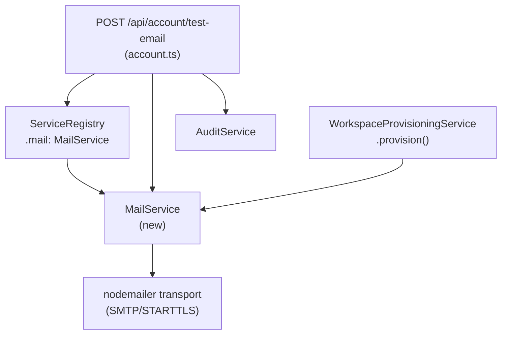
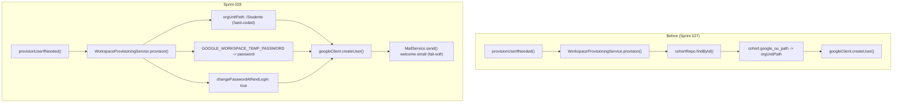
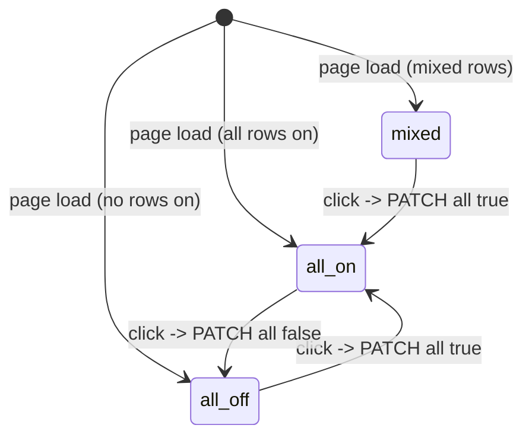
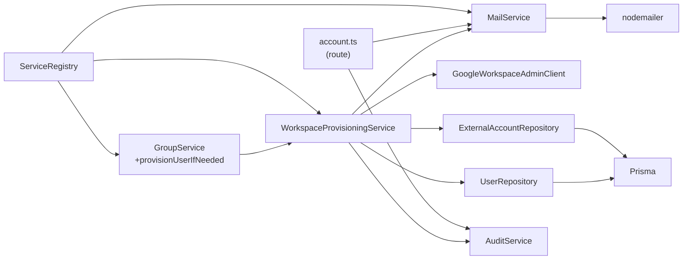

<!-- CLASI: Before changing code or making plans, review the SE process in CLAUDE.md -->

# Architecture Update — Sprint 028: SMTP MailService, student account creation flow, GroupDetailPanel redesign, AdminUsersPanel layout

## Step 1: Problem Understanding

Four independent product gaps are addressed together in this sprint:

1. **No outbound email.** The application has SMTP credentials in `.env` (Mandrill) but zero mail-sending code. The student account creation flow needs a welcome email; admins want a "Send test" button to confirm SMTP is working before relying on it in production.

2. **Incomplete Workspace provisioning.** `WorkspaceProvisioningService.provision()` still derives the OU path from `cohort.google_ou_path` — a pattern that sprint 026 removed from `WorkspaceSyncService` but never fully excised from the on-demand path. The service also omits the temp-password (`GOOGLE_WORKSPACE_TEMP_PASSWORD`) and `changePasswordAtNextLogin` flag, and sends no welcome email.

3. **GroupDetailPanel UX debt.** Sprint 027 shipped per-user permission checkboxes in the member grid. The five bulk-action buttons above the grid are now redundant and confusing. The `PassphraseCard` is buried below those buttons. The Delete button sits on its own line below the description rather than in the title row.

4. **AdminUsersPanel layout boxing.** Section containers have borders/cards that make the page visually heavy. Action buttons are below sections rather than inline-right.

---

## Step 2: Responsibilities

**R1 — Outbound mail abstraction**: A single `MailService` wraps `nodemailer`, reads SMTP env vars, and exposes `send()` + `isConfigured()`. Never throws at construction; fails-soft when unconfigured.

**R2 — ServiceRegistry mail slot**: `ServiceRegistry` gains a `readonly mail: MailService` property. Construction follows the fail-secure pattern already established for `GoogleWorkspaceAdminClientImpl`.

**R3 — Test-email API endpoint**: `POST /api/account/test-email` allows an authenticated user to send a one-off test message to their own email address. Validates ownership; writes an audit event.

**R4 — Account page test-email button**: A "Send test" button in `ProfileSection` in `Account.tsx` POSTs to the endpoint and displays a transient success/error pill.

**R5 — Workspace provisioning overhaul**: `WorkspaceProvisioningService.provision()` is changed to: (a) use `/Students` as the hard-coded OU path (no cohort lookup), (b) pass `password` from `GOOGLE_WORKSPACE_TEMP_PASSWORD`, (c) pass `changePasswordAtNextLogin: true`, (d) call `MailService.send()` with a welcome email after `createUser` succeeds. The `cohortRepo` dependency is removed.

**R6 — GroupDetailPanel title row**: `GroupDetailPanel` title block is restructured to a flex row containing the group name on the left and the Delete button on the right. Description stays below.

**R7 — PassphraseCard hoist**: `PassphraseCard` moves to immediately below the description paragraph — before the member table and any other section.

**R8 — Bulk-toolbar removal**: The five bulk-action buttons, their handler functions (`runBulkProvision`, `runBulkAll`, `runBulkLlmProxyRevoke`), `GrantLlmProxyModal`, `selectedIds` state, and the per-row select column and select-all checkbox are all deleted.

**R9 — ColumnTriToggle + bulkSetPermission**: A new `ColumnTriToggle` stateless component renders one of three glyphs (empty square / check / X) derived from row data. A `bulkSetPermission(field, value)` function loops `PATCH /api/admin/users/:id/permissions` over all members and invalidates the group detail query on completion.

**R10 — AdminUsersPanel layout**: Section border-box containers removed; user record header retains visual distinction; action buttons right-aligned per section.

---

## Step 3: Module Definitions

### `server/src/services/mail.service.ts` (new) — SUC-001, SUC-002, SUC-004

**Purpose**: Thin outbound-mail abstraction over nodemailer; the single place in the codebase that knows about SMTP credentials.

**Boundary (in)**: Reads `SMTP_HOST`, `SMTP_PORT`, `SMTP_USERNAME`, `SMTP_PASSWORD`; optionally `SMTP_SECURE` (default `false`) and `SMTP_FROM` (default: first of `ADMIN_EMAILS`, fallback `SMTP_USERNAME`).

**Boundary (out)**:
- `isConfigured(): boolean`
- `send({ to, subject, text, html? }): Promise<{ messageId: string }>`
- `MailNotConfiguredError` (extends `Error`)

Construction never throws. If any of the four required vars is absent, the service logs a `warn` once and returns `false` from `isConfigured()`.

---

### `server/src/services/service.registry.ts` (modified) — SUC-001, SUC-002, SUC-003

**Purpose**: Central service access point. Gains a `readonly mail: MailService` property. `workspaceProvisioning` construction is updated.

**Changes**:
- Add `import { MailService } from './mail.service.js'`.
- Add `readonly mail: MailService` declaration.
- Instantiate `this.mail = new MailService()` in the private constructor (no constructor args — `MailService` reads env directly).
- Update `WorkspaceProvisioningService` instantiation: remove `CohortRepository` arg, add `this.mail`.

---

### `server/src/routes/account.ts` (modified) — SUC-001

**Purpose**: Account self-service routes. Gains `POST /api/account/test-email`.

**New endpoint**:
```
POST /api/account/test-email
Auth: session (requireAuth middleware)
Body: { to?: string }
Returns: { ok: true, messageId: string, to: string }
```

Handler logic:
1. Resolve `to`: if omitted, use session user's notification email (or primary). If provided, validate ownership via same check as `PATCH /api/account/profile` `notificationEmail` validation (primary, any login email, any workspace `external_id`).
2. If `!services.mail.isConfigured()` return 400 with "SMTP not configured. Set SMTP_HOST, SMTP_PORT, SMTP_USERNAME, SMTP_PASSWORD in .env."
3. Call `services.mail.send({ to, subject: 'League Accounts - test email', text: ... })`.
4. Record audit event `account_test_email_sent` with `details: { to }`.
5. Return 200 `{ ok: true, messageId, to }`.

---

### `server/src/services/workspace-provisioning.service.ts` (modified) — SUC-003, SUC-004

**Purpose**: Executes League Workspace account creation. Overhauled to remove cohort dependency and add temp-password + welcome-email behavior.

**Changes**:
- Remove `cohortRepo: typeof CohortRepository` constructor parameter.
- Remove cohort lookup block (steps 3 and 4 in current `provision()`: cohort existence check, `google_ou_path` check).
- Remove `UnprocessableError` throws for "no cohort assigned" and "cohort has no google_ou_path".
- Hard-code `orgUnitPath: '/Students'` in the `createUser` call.
- Add `password: process.env.GOOGLE_WORKSPACE_TEMP_PASSWORD` to `createUser` payload. Throw `UnprocessableError` if env var is absent.
- Add `changePasswordAtNextLogin: true` to `createUser` payload.
- After `createUser` succeeds, call `this.mailService.send()` with a welcome email (to: user's notification email or primary email; body: new League address + temp password + first-login instruction). Wrap in try/catch — log error and continue on failure.
- Add `mailService: MailService` as a new constructor parameter (replaces `cohortRepo`).

**Updated constructor signature**:
```typescript
constructor(
  googleClient: GoogleWorkspaceAdminClient,
  externalAccountRepo: typeof ExternalAccountRepository,
  auditService: AuditService,
  userRepo: typeof UserRepository,
  mailService: MailService,    // replaces cohortRepo
)
```

---

### `client/src/pages/Account.tsx` (modified) — SUC-001

**Purpose**: My Account page. `ProfileSection` gains a "Send test" button next to the notification-email picker.

**Change**: Add "Send test" button. On click: POST to `/api/account/test-email` with the currently selected notification email. Disabled while in-flight. On success: green pill "Test email sent to \<addr\>" auto-clears after 5 s. On error: red pill with server error message, auto-clears after 5 s.

---

### `client/src/pages/admin/GroupDetailPanel.tsx` (modified) — SUC-005, SUC-006, SUC-007, SUC-008

**Purpose**: Group detail page. Four layout and feature changes.

**Sub-change A — Title row (SUC-005)**:
- Wrap group name `<h2>` and Delete button in a flex row with `justifyContent: 'space-between'`.
- Delete button moves from its own `<div>` row into the title row right side.

**Sub-change B — PassphraseCard hoist (SUC-006)**:
- Move `<PassphraseCard>` block from its current position (after banners, before bulk buttons) to immediately after the description `<p>` tag.

**Sub-change C — Bulk-toolbar removal (SUC-007)**:
- Delete the five-button bulk-action `<div>` block.
- Delete handler functions: `runBulkProvision`, `runBulkAll`, `runBulkLlmProxyRevoke`.
- Delete count-getter helpers: `getCreateLeagueCount`, `getRemoveLeagueCount`, `getSuspendCount`, `getGrantLlmProxyCount`, `getRevokeLlmProxyCount`.
- Delete `LlmProxyGrantModal` import and its render.
- Delete `showGrantModal` state, `selectedIds` state.
- Delete per-row select `<td>` column and select-all `<th>`.
- Delete unused `BulkResult` type if no longer referenced.

**Sub-change D — ColumnTriToggle (SUC-008)**:
- Add `ColumnTriToggle` component: stateless; accepts `state: 'all-on' | 'all-off' | 'mixed'`, `onClick`, `label`, `busy`. Renders unicode glyph button.
- Add `triState(field, users)`: pure function returning `'all-on' | 'all-off' | 'mixed'`.
- Add `bulkSetPermission(field, value)`: iterates `data.users`, fires `PATCH /api/admin/users/:userId/permissions` per user; shows per-column "Updating..." indicator; invalidates group detail query when all settle.
- Each permission column header (`allowsOauthClient`, `allowsLlmProxy`, `allowsLeagueAccount`) gets a `<ColumnTriToggle>` widget next to the header text.

---

### `client/src/pages/admin/AdminUsersPanel.tsx` (modified) — SUC-009

**Purpose**: Admin users list. Layout streamlined.

**Change**:
- Identify and remove `border`, `borderRadius`, `boxShadow` style properties on section-wrapping container divs (except the user-record header).
- Move action buttons to the right side of their section rows using `justifyContent: 'space-between'` or `marginLeft: 'auto'`.
- No functional changes.

---

## Step 4: Diagrams

### Component diagram — new MailService wiring



### Workspace provisioning — before vs after



### GroupDetailPanel layout — before vs after

```mermaid
graph TD
    subgraph Before["Before"]
        D1["Back button"]
        D2["Group name h2"]
        D3["Description + count"]
        D4["Delete button (own row)"]
        D5["Banners"]
        D6["PassphraseCard"]
        D7["5x Bulk-action buttons"]
        D8["Member table (select col + 3 permission col)"]
        D1-->D2-->D3-->D4-->D5-->D6-->D7-->D8
    end

    subgraph After["After"]
        A1["Back button"]
        A2["flex row: Group name (left) | Delete (right)"]
        A3["Description + count"]
        A4["Banners"]
        A5["PassphraseCard (hoisted)"]
        A6["Member table (no select col)\npermission col headers: ColumnTriToggle"]
        A1-->A2-->A3-->A4-->A5-->A6
    end
```



### ColumnTriToggle state machine



### Module dependency graph (sprint 028 changes)



No cycles. `MailService` has no dependencies on domain services. Dependency direction: routes -> services -> infrastructure (nodemailer, Google client, Prisma).

---

## Step 5: What Changed

### Server — new

| Module | Change |
|---|---|
| `server/src/services/mail.service.ts` | New. `MailService` wrapping nodemailer. `isConfigured()`, `send()`, `MailNotConfiguredError`. |
| `POST /api/account/test-email` | New endpoint in `account.ts`. Ownership-validated, audit-logged, SMTP-gated. |
| `nodemailer`, `@types/nodemailer` | New `server/package.json` dependencies. |

### Server — modified

| Module | Change |
|---|---|
| `ServiceRegistry` | `readonly mail: MailService` added; instantiated in constructor. `workspaceProvisioning` construction updated: `CohortRepository` arg removed, `this.mail` added. |
| `WorkspaceProvisioningService` | `cohortRepo` constructor param removed; `mailService` added. Cohort validation removed. `orgUnitPath: '/Students'` hard-coded. `password` and `changePasswordAtNextLogin: true` added. `MailService.send()` called post-creation (fail-soft). |

### Client — modified

| Component | Change |
|---|---|
| `Account.tsx` | "Send test" button added to `ProfileSection`. Transient success/error pill. |
| `GroupDetailPanel.tsx` | Title row restructured (Delete right-aligned). PassphraseCard hoisted. Bulk toolbar deleted. `selectedIds` deleted. Select column deleted. `GrantLlmProxyModal` deleted. `ColumnTriToggle` added. `bulkSetPermission()` added. Per-column toggle wired to headers. |
| `AdminUsersPanel.tsx` | Section border-box containers removed. Action buttons right-aligned. |

---

## Why

- **MailService**: The codebase has SMTP credentials but no mail-sending code. This sprint establishes the foundational mail abstraction; subsequent features (password reset, notifications) will reuse `MailService`.
- **Provisioning overhaul**: Sprint 026 removed cohort OU logic from `WorkspaceSyncService.syncStudents`. The on-demand path (`WorkspaceProvisioningService`) was not updated in that sprint. This sprint brings the on-demand path into alignment and adds the temp-password and welcome-email behaviors.
- **GroupDetailPanel**: The five bulk-action buttons were the mechanism for mass permission operations before sprint 027 added per-row checkboxes. Removing them reduces cognitive load; the tri-state column-header toggle restores the "apply to all" capability in a less prominent, contextually appropriate form.
- **AdminUsersPanel layout**: Pure UX improvement — less visual chrome, more readable content.

---

## Impact on Existing Components

- **`CohortService`**: Unaffected. `CohortRepository` is still injected into `CohortService`; only `WorkspaceProvisioningService` stops using it.
- **`provisionUserIfNeeded`** (group.service.ts): Signature unchanged. The `WorkspaceProvisioningService` instance it receives now includes `MailService`. All callers (`PATCH /admin/users/:id/permissions`, any `UserService.setPermissions` path) remain unchanged.
- **`GroupDetailPanel` tests**: Tests asserting on bulk buttons must be removed. New tests needed: `ColumnTriToggle` visual states; PATCH-loop behavior; Delete in title row.
- **`WorkspaceProvisioningService` tests**: Cohort mock removed. `MailService` mock added. Assert `/Students` OU, temp password, `changePasswordAtNextLogin`, and `MailService.send` invocation.
- **`Account.tsx` tests**: New test asserting "Send test" button fires POST and renders pill on success/failure.

---

## Migration Concerns

- **No schema changes** in this sprint. All changes are service-layer and client-side.
- **`WorkspaceProvisioningService` constructor arity**: `CohortRepository` removed, `MailService` added. Sole instantiation site is `ServiceRegistry`. No other code instantiates this class.
- **`nodemailer` package**: Requires `npm install` in `server/` on any machine that has not run it since this sprint lands.
- **Existing provisioned students**: Unaffected. The overhaul only changes behavior for new `provision()` calls.

---

## Design Rationale

### Decision: MailService reads env vars directly; no injected config

**Context**: Could inject individual env vars or a config object.

**Alternatives**:
1. Inject `{ host, port, username, password }` — callers must read env, defeating centralization.
2. Accept a `nodemailer.Transporter` — flexible but hides configuration in normal usage.
3. Read env vars internally — consistent with how `WorkspaceProvisioningService` reads `GOOGLE_STUDENT_DOMAIN`.

**Choice**: Option 3.

**Why**: Keeps the `ServiceRegistry` construction site clean. All SMTP policy lives in one file. Tests mock `process.env` or the entire `MailService` instance.

**Consequences**: Slightly harder to test in isolation without env var mocking, but the standard Jest `process.env` override pattern handles this cleanly.

---

### Decision: WorkspaceProvisioningService receives MailService via constructor; CohortRepository removed

**Context**: `MailService` could be accessed via a global or service locator. `CohortRepository` could be kept as dead weight.

**Alternatives**:
1. Global singleton access for `MailService` — hidden dependency, hard to test.
2. Keep `CohortRepository` alongside `MailService` — dead code misleads future readers.

**Choice**: Replace `CohortRepository` with `MailService` in the constructor. Constructor DI keeps the contract explicit and testable.

**Why**: The cohort lookup is being removed entirely. Retaining its constructor param would be dead code. The five-argument arity is preserved by the swap.

**Consequences**: Tests that construct `WorkspaceProvisioningService` must swap the fifth argument from `CohortRepository` to a `MailService` mock.

---

### Decision: Welcome email is fail-soft inside provision()

**Context**: Mail delivery failure could abort the provisioning transaction.

**Choice**: `MailService.send()` is called after `createUser` succeeds and after the `ExternalAccount` row is written. If `send()` throws, the error is logged and `provision()` returns normally.

**Why**: Workspace account creation is the critical path. A transient SMTP outage should not orphan the Google account. The student can be re-sent the welcome email manually. The admin can test SMTP availability via the test-email button before triggering bulk provisioning.

**Consequences**: A Workspace account can be created without the welcome email being delivered. This is the correct tradeoff.

---

### Decision: ColumnTriToggle is purely reactive (no internal state)

**Context**: The three-state toggle could maintain independent state, or derive it from row data.

**Choice**: State is derived from `data.users` on every render. `ColumnTriToggle` is a stateless display component.

**Why**: Row data already holds the ground truth. Duplicating state requires synchronization after each PATCH. A pure derivation is always consistent and requires no cleanup.

**Consequences**: The toggle reflects actual server state only after the group detail query is refetched post-PATCH-loop. During flight, the toggle retains its pre-click state. This is correct behavior.

---

## Open Questions

1. **PassphraseCard invitation URL**: If the invitation URL is a separate server artifact (not derivable from the passphrase value), two Regenerate buttons are needed. Implementor should inspect `PassphraseCard` and the passphrase API before coding ticket 005. Default assumption: one passphrase derives one URL; one button.

2. **`GOOGLE_WORKSPACE_TEMP_PASSWORD` absent behavior**: Current plan throws `UnprocessableError`. Alternative: omit the `password` field and let Google generate one. Confirm before implementing ticket 004.

3. **nodemailer STARTTLS vs SECURE**: Port 587 uses STARTTLS (`SMTP_SECURE=false`); port 465 uses implicit TLS (`SMTP_SECURE=true`). Mandrill supports both. Default assumption is 587/STARTTLS. Implementor should verify against Mandrill docs.
