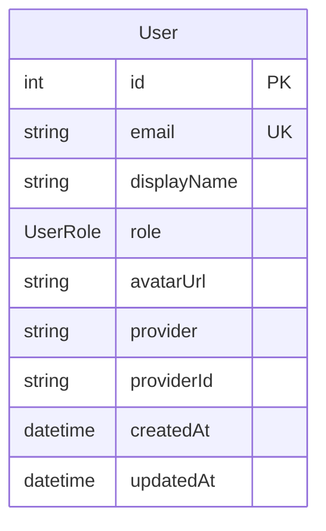

# Architecture

## Architecture Overview

This sprint adds a persistent user identity layer to the application.
Currently, OAuth login stores profile data only in the session with no
database backing. After this sprint, every authenticated user has a
`User` record in PostgreSQL, the session references that record by ID,
and middleware enforces role-based access control.

```
Browser ─► Express ─► Passport OAuth ─► OAuth Provider (GitHub/Google)
                │              │
                │              ▼
                │         Upsert User (Prisma)
                │              │
                │              ▼
                │         Session (stores user ID)
                │
                ├─► requireAuth() ─► Route handler
                │
                └─► requireAdmin() ─► Admin route handler
                         │
                         ▼
                    UserService (ServiceRegistry)
                         │
                         ▼
                    PostgreSQL (User table)
```

## Technology Stack

No new technologies. This sprint uses the existing stack:

| Layer | Technology | Notes |
|-------|-----------|-------|
| ORM | Prisma 7 | User model + UserRole enum |
| Auth | Passport.js | Existing GitHub + Google strategies |
| Session | express-session | Already configured with connect-pg-simple |
| API | Express | New middleware + admin routes |
| Frontend | React | UsersPanel admin component |
| Testing | Jest + Supertest | test-login endpoint for auth bypass |

## Component Design

### Component: User Model (Prisma)

**Purpose**: Store persistent user identity and role information.

**Boundary**: Prisma schema definition and generated migration. Inside:
User table, UserRole enum. Outside: session management, OAuth flow.

**Use Cases**: SUC-001, SUC-002, SUC-003

Prisma schema addition:

```prisma
enum UserRole {
  USER
  ADMIN
}

model User {
  id          Int       @id @default(autoincrement())
  email       String    @unique
  displayName String?
  role        UserRole  @default(USER)
  avatarUrl   String?
  provider    String?   // 'github', 'google'
  providerId  String?   // OAuth provider's user ID
  createdAt   DateTime  @default(now())
  updatedAt   DateTime  @updatedAt

  @@unique([provider, providerId])
}
```

The `@@unique([provider, providerId])` composite index enables efficient
upsert on OAuth login. The `email` unique constraint prevents duplicate
accounts across providers (a user who logs in with both GitHub and Google
using the same email gets a single record).

### Component: Passport Serialization Changes

**Purpose**: Create or update User records on OAuth login and store
user ID in the session.

**Boundary**: Inside: OAuth callback handler, serialize/deserialize
functions. Outside: OAuth provider communication (unchanged), session
store configuration (unchanged).

**Use Cases**: SUC-001

Current behavior: Passport serializes the full OAuth profile into the
session. No database write occurs.

New behavior:

1. **OAuth callback** (`server/src/routes/auth.ts`): After receiving
   the OAuth profile, upsert a User record:
   ```typescript
   const user = await prisma.user.upsert({
     where: { provider_providerId: { provider: 'github', providerId: profile.id } },
     update: { email, displayName, avatarUrl },
     create: { email, displayName, avatarUrl, provider: 'github', providerId: profile.id },
   });
   ```

2. **serializeUser**: Store only `user.id` in the session (not the
   full profile object).

3. **deserializeUser**: Load the full User record from the database
   by ID on each request. This ensures role changes take effect
   immediately without requiring re-login.

### Component: UserService

**Purpose**: Provide CRUD operations for User records through the
ServiceRegistry.

**Boundary**: Inside: User queries, role validation, list/create/update/
delete. Outside: HTTP layer, session management, OAuth flow.

**Use Cases**: SUC-001, SUC-002, SUC-003

Location: `server/src/services/user.service.ts`

Methods:

- `list()` — Return all users, ordered by createdAt descending
- `getById(id: number)` — Return a single user by ID
- `getByEmail(email: string)` — Return a user by email
- `upsertFromOAuth(provider, providerId, data)` — Create or update
  from OAuth profile data
- `create(data: { email, displayName?, role? })` — Admin-initiated
  user creation
- `update(id, data: { displayName?, role? })` — Update user fields
- `delete(id: number)` — Delete a user

Registered in ServiceRegistry as `services.users`.

### Component: Auth Middleware

**Purpose**: Enforce authentication and role requirements on routes.

**Boundary**: Inside: Session check, role check, 401/403 responses.
Outside: Route handler logic, session configuration.

**Use Cases**: SUC-004

Location: `server/src/middleware/requireAuth.ts`

Two middleware functions:

```typescript
export function requireAuth() {
  return (req, res, next) => {
    if (!req.user) {
      return res.status(401).json({ error: 'Unauthorized' });
    }
    next();
  };
}

export function requireAdmin() {
  return (req, res, next) => {
    if (!req.user) {
      return res.status(401).json({ error: 'Unauthorized' });
    }
    if (req.user.role !== 'ADMIN') {
      return res.status(403).json({ error: 'Forbidden' });
    }
    next();
  };
}
```

`requireAdmin()` checks auth first (401) then role (403), so
unauthenticated requests always get 401.

### Component: Admin User Management Routes

**Purpose**: Expose CRUD API for user management, restricted to admins.

**Boundary**: Inside: Route handlers for `/api/admin/users`. Outside:
UserService (delegated), auth middleware (composed).

**Use Cases**: SUC-002, SUC-003

Location: `server/src/routes/admin/users.ts`

| Method | Path | Description |
|--------|------|-------------|
| GET | `/api/admin/users` | List all users |
| POST | `/api/admin/users` | Create a new user |
| PUT | `/api/admin/users/:id` | Update user (displayName, role) |
| DELETE | `/api/admin/users/:id` | Delete user |

All routes use `requireAdmin()` middleware. Routes are thin handlers
that validate input and delegate to `UserService`.

Guard: `PUT /api/admin/users/:id` refuses to demote the last ADMIN
user to prevent admin lockout.

### Component: UsersPanel React Component

**Purpose**: Provide a UI for admin user management.

**Boundary**: Inside: User table, create/edit/delete forms, API calls.
Outside: Admin layout, routing, auth context.

**Use Cases**: SUC-002, SUC-003

Location: `client/src/components/admin/UsersPanel.tsx`

Features:
- Table displaying all users (email, displayName, role, provider,
  createdAt)
- Create user form (email + role dropdown)
- Inline edit or modal for updating user details and role
- Delete button with confirmation dialog
- Refresh after mutations

### Component: test-login Endpoint

**Purpose**: Allow automated tests to authenticate without OAuth.

**Boundary**: Inside: User creation/lookup, session creation. Outside:
OAuth flow (bypassed entirely).

**Use Cases**: SUC-005

Location: Added to `server/src/routes/auth.ts`

```
POST /api/auth/test-login
Content-Type: application/json

{ "email": "test@example.com", "role": "ADMIN" }
```

Behavior:
1. Check `NODE_ENV !== 'production'` — return 404 if production
2. Find or create User with the given email
3. If `role` is provided, set/update the user's role
4. Log the user in via `req.login()` (Passport)
5. Return the User record as JSON

This endpoint is the only way tests should authenticate. It replaces
any need to mock session middleware or fabricate cookies.

## Dependency Map

```
requireAuth middleware ──uses──► req.user (set by Passport deserialize)
requireAdmin middleware ──uses──► req.user.role
Admin user routes ──uses──► requireAdmin middleware
Admin user routes ──delegates──► UserService
UserService ──queries──► Prisma (User model)
Passport OAuth callback ──delegates──► UserService.upsertFromOAuth()
Passport deserializeUser ──queries──► UserService.getById()
test-login endpoint ──delegates──► UserService
test-login endpoint ──calls──► req.login() (Passport)
UsersPanel (React) ──calls──► Admin user routes (HTTP)
```

## Data Model



Single new table. The `provider` + `providerId` composite unique
constraint enables OAuth upsert. The `email` unique constraint
prevents duplicate accounts.

UserRole is a Postgres enum with values USER and ADMIN.

## Security Considerations

- **test-login is dev/test only**: Guarded by `NODE_ENV` check.
  Returns 404 in production so the endpoint is not discoverable.
- **Role escalation**: Only ADMIN users can change roles. The last
  ADMIN cannot be demoted.
- **Session integrity**: Session stores only user ID. Full user
  (including role) is loaded from the database on every request,
  so role changes take effect immediately.
- **OAuth data freshness**: Email, displayName, and avatarUrl are
  updated on every OAuth login to keep the User record current.
- **Admin routes**: All `/api/admin/*` routes require ADMIN role.
  Unauthenticated requests get 401; authenticated non-admins get 403.

## Design Rationale

**Why upsert by provider+providerId (not email)?**
A user might have different emails across OAuth providers. Matching
by provider+providerId ensures the correct account is updated. The
email unique constraint is a separate safeguard — if two providers
return the same email, they map to the same User record, which is
the desired behavior.

**Why load User from DB on every deserialize?**
Storing the full User in the session would mean role changes don't
take effect until the user re-logs in. Loading from DB on each
request adds one query per request but ensures permissions are
always current. This is acceptable for a template-scale application.

**Why keep the admin password bootstrap?**
On first deployment, there are no OAuth users yet. The admin
password mechanism (existing) allows initial admin access to
configure OAuth and promote the first user to ADMIN. Once a
database-backed admin exists, the password mechanism becomes a
fallback.

**Why autoincrement ID instead of UUID?**
Consistent with the template's existing models (Counter, Session).
Simpler, more compact, adequate for single-instance deployments.
Applications that need distributed IDs can change this later.

## Open Questions

- Should the admin password bootstrap be deprecated once a
  database-backed ADMIN user exists? (Current plan: keep both.)
- Should test-login also work in `development` mode or only in
  `test`? (Current plan: both test and development, blocked in
  production.)

## Sprint Changes

Changes planned for this sprint.

### Changed Components

**Added:**
- `User` model and `UserRole` enum in Prisma schema
- Prisma migration for User table
- `server/src/services/user.service.ts` — UserService
- `server/src/middleware/requireAuth.ts` — requireAuth, requireAdmin
- `server/src/routes/admin/users.ts` — Admin user CRUD routes
- `client/src/components/admin/UsersPanel.tsx` — Admin users panel
- `POST /api/auth/test-login` endpoint in auth routes
- `tests/server/auth.test.ts` — Auth test suite
- `tests/server/admin-users.test.ts` — Admin user management tests

**Modified:**
- `server/prisma/schema.prisma` — Add User model, UserRole enum
- `server/src/routes/auth.ts` — Update OAuth callbacks, add
  test-login, update serialize/deserialize
- `server/src/services/service.registry.ts` — Register UserService
- `server/src/app.ts` — Wire admin user routes with requireAdmin
- `GET /api/auth/me` — Return full User record from DB

### Migration Concerns

- New `User` table is additive — no existing data is affected.
- Existing sessions will not have a user ID. The deserializeUser
  function should handle missing/invalid user IDs gracefully
  (clear session, redirect to login).
- The migration should be run before the new server code is deployed
  (`prisma migrate deploy` before starting the updated server).
