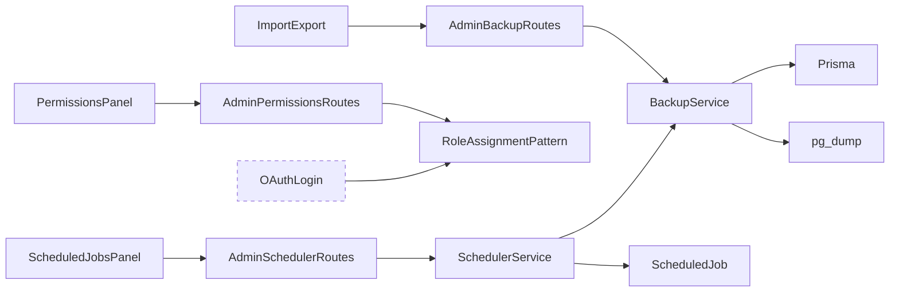
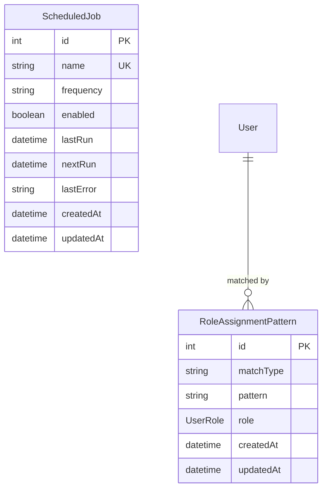

# Architecture

## Architecture Overview

Sprint 006 adds three new subsystems to the admin dashboard — Permissions,
Backup/Export, and Scheduled Jobs — and enhances two existing panels. All
new backend logic lives in services registered with the `ServiceRegistry`
(from Sprint 004). All new API routes sit under `/api/admin/` and require
the `requireAdmin` middleware (from Sprint 005).

```mermaid
graph TD
    subgraph Client
        PP[PermissionsPanel]
        IE[ImportExport]
        SJP[ScheduledJobsPanel]
        EP[EnvironmentPanel - enhanced]
        SP[SessionPanel - enhanced]
    end

    subgraph "Admin API Routes"
        PR[/api/admin/permissions]
        BR[/api/admin/backups]
        ER[/api/admin/export]
        SR[/api/admin/scheduler]
    end

    subgraph ServiceRegistry
        BS[BackupService]
        SS[SchedulerService]
    end

    subgraph Prisma
        RAP[RoleAssignmentPattern]
        SJ[ScheduledJob]
    end

    PP --> PR
    IE --> BR
    IE --> ER
    SJP --> SR
    PR --> RAP
    BR --> BS
    ER --> BS
    SR --> SS
    BS --> Prisma
    SS --> SJ
```

## Technology Stack

No new technologies. This sprint uses the existing stack:

| Layer | Technology |
|-------|-----------|
| Backend | Express 4 + TypeScript (Node.js 20) |
| Frontend | Vite + React + TypeScript |
| Database | PostgreSQL 16 via Prisma ORM |
| Testing | Jest + Supertest (server) |

The `pg_dump` utility is available in the PostgreSQL Docker image and on
hosts with PostgreSQL client tools installed. The `BackupService` shells
out to `pg_dump` for full backups.

## Component Design

### Component: RoleAssignmentPattern (Prisma Model)

**Purpose**: Store rules that auto-assign roles to users on OAuth login.

**Boundary**: Data model only — the OAuth login handler (from Sprint 005)
reads these patterns during the upsert flow; this sprint adds the model
and the admin CRUD API.

**Use Cases**: SUC-001

```prisma
model RoleAssignmentPattern {
  id        Int      @id @default(autoincrement())
  matchType String   // 'exact' or 'regex'
  pattern   String   // email address or regex pattern
  role      UserRole @default(USER)
  createdAt DateTime @default(now())
  updatedAt DateTime @updatedAt

  @@unique([matchType, pattern])
}
```

The OAuth login upsert (Sprint 005) will be updated to query
`RoleAssignmentPattern` after creating or finding the user. If the
user's email matches a pattern, their role is set accordingly. Exact
matches are checked first, then regex patterns in creation order.

### Component: ScheduledJob (Prisma Model)

**Purpose**: Persist scheduled job definitions and execution state.

**Boundary**: Stores job metadata and state. Does not contain execution
logic — handlers are registered in `SchedulerService` at application
startup.

**Use Cases**: SUC-005, SUC-006

```prisma
model ScheduledJob {
  id        Int       @id @default(autoincrement())
  name      String    @unique
  frequency String    // 'daily', 'weekly', 'hourly'
  enabled   Boolean   @default(true)
  lastRun   DateTime?
  nextRun   DateTime?
  lastError String?
  createdAt DateTime  @default(now())
  updatedAt DateTime  @updatedAt
}
```

Default seed data:

| name | frequency | enabled |
|------|-----------|---------|
| `daily-backup` | daily | true |
| `weekly-backup` | weekly | true |

### Component: BackupService

**Purpose**: Create, list, restore, and delete database backups and exports.

**Boundary**: Handles all backup I/O (filesystem and `pg_dump` subprocess).
Does not handle HTTP request/response — that is the route handler's job.

**Use Cases**: SUC-002, SUC-003, SUC-004

**Key methods**:

- `exportJson()` — Query all application tables via Prisma, return a
  JSON object with table names as keys and record arrays as values.
  Includes metadata (timestamp, table counts).
- `createBackup()` — Run `pg_dump` with the connection string from
  `DATABASE_URL`, write to backup directory, return metadata.
- `listBackups()` — Read the backup directory, return metadata for each
  file (name, size, timestamp).
- `restoreBackup(filename)` — Run `pg_restore` or `psql` with the
  selected backup file. Returns success/error.
- `deleteBackup(filename)` — Remove backup file from disk.

**Backup storage**: `data/backups/` directory (configurable via
`BACKUP_DIR` env var). The directory is created on first backup if it
does not exist. The `data/` directory is gitignored.

**Registration**: Added to `ServiceRegistry` as `backups`.

### Component: SchedulerService

**Purpose**: Execute registered job handlers when scheduled jobs are due.

**Boundary**: Manages the tick loop and job execution. Individual job
logic is provided by registered handler functions.

**Use Cases**: SUC-005, SUC-006

**Key methods**:

- `registerHandler(jobName, handler)` — Register an async function to
  run when a named job fires. Called at application startup.
- `tick()` — Query for enabled jobs where `nextRun <= now()`. For each
  due job, lock the row with `FOR UPDATE SKIP LOCKED`, execute the
  handler, update `lastRun`/`nextRun`/`lastError`. Uses a raw query
  for the locking:
  ```sql
  SELECT * FROM "ScheduledJob"
  WHERE enabled = true AND "nextRun" <= NOW()
  FOR UPDATE SKIP LOCKED
  ```
- `runJobNow(id)` — Execute a job immediately regardless of schedule.
  Updates `lastRun` and recalculates `nextRun`.
- `calculateNextRun(frequency, fromDate)` — Pure function that computes
  the next run time based on frequency string.

**Tick mechanism**: A `setInterval` that calls `tick()` every 60 seconds,
started when the Express server boots. The interval is stored so it can
be cleared on shutdown (important for tests).

**Registration**: Added to `ServiceRegistry` as `scheduler`.

**Default handlers registered at startup**:

- `daily-backup` — calls `BackupService.createBackup()`
- `weekly-backup` — calls `BackupService.createBackup()`

### Component: Admin API Routes — Permissions

**Purpose**: CRUD endpoints for role assignment patterns.

**Use Cases**: SUC-001

| Method | Path | Description |
|--------|------|-------------|
| `GET` | `/api/admin/permissions/patterns` | List all role assignment patterns |
| `POST` | `/api/admin/permissions/patterns` | Create a new pattern |
| `PUT` | `/api/admin/permissions/patterns/:id` | Update a pattern |
| `DELETE` | `/api/admin/permissions/patterns/:id` | Delete a pattern |

All routes require `requireAdmin` middleware.

### Component: Admin API Routes — Backups

**Purpose**: Backup management and JSON export endpoints.

**Use Cases**: SUC-002, SUC-003, SUC-004

| Method | Path | Description |
|--------|------|-------------|
| `POST` | `/api/admin/backups` | Create a pg_dump backup |
| `GET` | `/api/admin/backups` | List all backups |
| `POST` | `/api/admin/backups/:id/restore` | Restore from a backup |
| `DELETE` | `/api/admin/backups/:id` | Delete a backup file |
| `GET` | `/api/admin/export/json` | Export database as JSON download |

All routes require `requireAdmin` middleware.

### Component: Admin API Routes — Scheduled Jobs

**Purpose**: View and manage scheduled job state.

**Use Cases**: SUC-005, SUC-006

| Method | Path | Description |
|--------|------|-------------|
| `GET` | `/api/admin/scheduler/jobs` | List all scheduled jobs |
| `PUT` | `/api/admin/scheduler/jobs/:id` | Update job (enable/disable) |
| `POST` | `/api/admin/scheduler/jobs/:id/run` | Trigger immediate execution |

All routes require `requireAdmin` middleware.

### Component: PermissionsPanel (React)

**Purpose**: Admin UI for managing role assignment patterns.

**Use Cases**: SUC-001

- Table listing all patterns with columns: match type, pattern, role,
  created date
- "Add Pattern" form with match type selector, pattern input, role
  dropdown
- Edit and delete actions per row
- Delete requires confirmation

### Component: ImportExport (React)

**Purpose**: Admin UI for database backup and export operations.

**Use Cases**: SUC-002, SUC-003, SUC-004

- "Export JSON" button that triggers download
- "Create Backup" button
- Backup list table with columns: filename, timestamp, size
- Per-backup actions: restore (with confirmation dialog), delete
- Status messages for async operations

### Component: ScheduledJobsPanel (React)

**Purpose**: Admin UI for viewing and managing scheduled jobs.

**Use Cases**: SUC-005, SUC-006

- Table listing all jobs with columns: name, frequency, enabled,
  last run, next run, last error
- Enable/disable toggle per job
- "Run Now" button per job
- Auto-refresh every 30 seconds
- Error column highlights non-null values

### Component: EnvironmentPanel (Enhanced)

**Purpose**: Show runtime environment info including integration status.

**Use Cases**: N/A (enhancement, no dedicated use case)

Enhancement: Add an "Integrations" section showing which OAuth providers
and API keys are configured. For each integration, display whether the
required environment variables are set (without revealing values):

- GitHub OAuth: `GITHUB_CLIENT_ID` configured? Yes/No
- Google OAuth: `GOOGLE_CLIENT_ID` configured? Yes/No
- Pike 13: `PIKE13_ACCESS_TOKEN` configured? Yes/No
- MCP: `MCP_DEFAULT_TOKEN` configured? Yes/No

### Component: SessionPanel (Enhanced)

**Purpose**: Show active sessions with linked user information.

**Use Cases**: N/A (enhancement, no dedicated use case)

Enhancement: Instead of showing raw session JSON, display:

- User email and display name (looked up from User model)
- User role
- Session creation time and expiry
- Highlight sessions expiring within 1 hour
- Add a manual refresh button

## Dependency Map



The dashed `OAuthLogin` node represents the existing OAuth handler from
Sprint 005 which will be updated to read `RoleAssignmentPattern` during
user upsert.

## Data Model



The `RoleAssignmentPattern` to `User` relationship is logical, not a
foreign key — patterns are evaluated against user emails at login time.

## Security Considerations

- **Admin-only access**: All new API routes use `requireAdmin` middleware.
  Non-admin users receive 403. Unauthenticated requests receive 401.
- **Regex injection**: Regex patterns from `RoleAssignmentPattern` are
  compiled with a timeout or length limit to prevent ReDoS. Invalid
  regex patterns are rejected at creation time.
- **Backup file access**: Backup files are stored on the server filesystem
  and accessible only through authenticated admin API routes. No direct
  file serving.
- **Restore is destructive**: The restore endpoint requires explicit
  confirmation (the request body must include a `confirm: true` field).
- **pg_dump credentials**: `BackupService` uses `DATABASE_URL` from the
  environment. No credentials are logged or returned in API responses.

## Design Rationale

**Why `FOR UPDATE SKIP LOCKED` for the scheduler?**
This pattern is the standard PostgreSQL approach for job queues. It
prevents multiple processes (or a restarted tick) from executing the
same job simultaneously. It is simpler and more reliable than
application-level locks or Redis-based locking, and aligns with the
project's Postgres-does-it-all philosophy.

**Why store backups locally instead of S3?**
This is a template for local-first development. S3 support can be added
by implementors who need it, but the default should work without cloud
credentials. The `BACKUP_DIR` env var makes the location configurable.

**Why simple frequency strings instead of cron expressions?**
The template targets simplicity. `daily`, `weekly`, and `hourly` cover
the common cases. Projects that need cron-style scheduling can extend
the `calculateNextRun` function.

**Why a setInterval tick instead of middleware-driven?**
A 60-second interval is predictable and does not depend on incoming HTTP
traffic. Middleware-driven ticks would not fire if no requests arrive,
causing jobs to be delayed unpredictably.

## Open Questions

- Should `RoleAssignmentPattern` support priority ordering, or is
  first-match-wins (by creation order) sufficient?
- Should the backup restore endpoint drop and recreate the database, or
  use `pg_restore --clean`?
- Should the scheduler tick interval be configurable via environment
  variable?

## Sprint Changes

Changes planned for this sprint.

### Changed Components

**Added:**
- `RoleAssignmentPattern` Prisma model + migration
- `ScheduledJob` Prisma model + migration
- `BackupService` in `server/src/services/backup.service.ts`
- `SchedulerService` in `server/src/services/scheduler.service.ts`
- Admin routes: `server/src/routes/admin/permissions.ts`
- Admin routes: `server/src/routes/admin/backups.ts`
- Admin routes: `server/src/routes/admin/scheduler.ts`
- React component: `client/src/components/admin/PermissionsPanel.tsx`
- React component: `client/src/components/admin/ImportExport.tsx`
- React component: `client/src/components/admin/ScheduledJobsPanel.tsx`
- Seed script for default scheduled jobs
- `data/backups/` directory (gitignored)

**Modified:**
- `server/prisma/schema.prisma` — add two new models
- `server/src/services/service.registry.ts` — register BackupService and SchedulerService
- `server/src/index.ts` — start scheduler interval on boot, register default handlers
- `client/src/components/admin/EnvironmentPanel.tsx` — add integration config status
- `client/src/components/admin/SessionPanel.tsx` — add linked user info
- OAuth login handler — read RoleAssignmentPattern during upsert
- Admin route index — mount new route files

### Migration Concerns

Two new Prisma models require a migration. No existing tables are
modified. The migration is additive and backward-compatible.

Seed data for `ScheduledJob` should be idempotent (upsert by `name`)
so it can run on existing databases without duplicating records.
