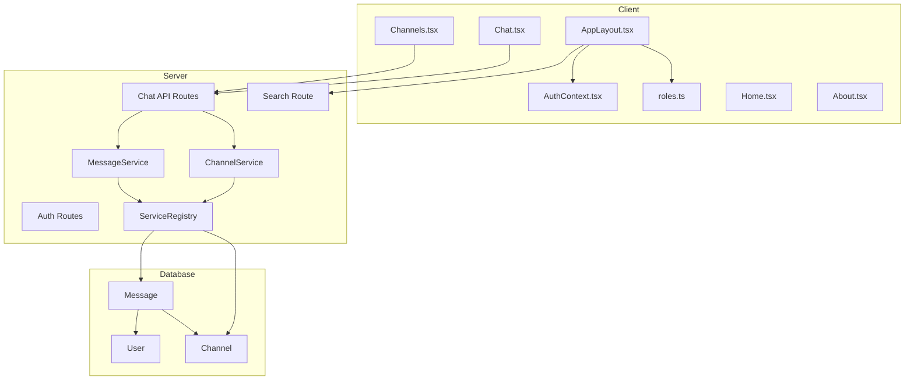
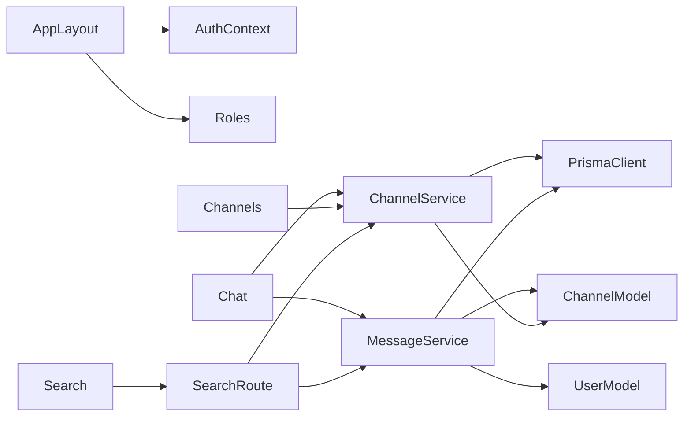
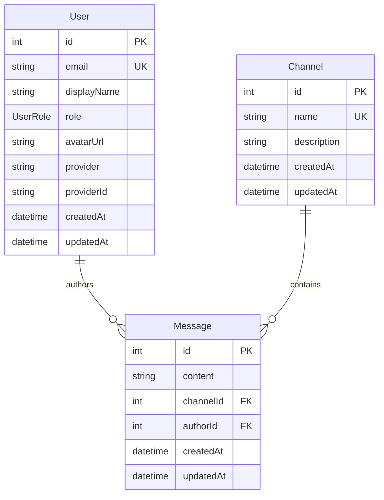

# Architecture

## Architecture Overview

This sprint adds two major subsystems to the template: the **application
shell** (AppLayout, AuthContext, roles library, navigation) and the **chat
example application** (Channel/Message models, services, API routes, React
pages). It also removes the Counter demo.



## Technology Stack

No new technologies. This sprint uses the existing stack:

| Layer | Technology | Notes |
|-------|-----------|-------|
| Frontend | React + TypeScript + Vite | New pages and components |
| Backend | Express + TypeScript | New routes and services |
| Database | PostgreSQL 16 + Prisma 7 | New Channel/Message models |
| Auth | Passport + express-session | Consumed via AuthContext |

## Component Design

### Component: AppLayout

**Purpose**: Provide the application-wide layout shell with sidebar
navigation, top bar, and content area.

**Boundary**: Wraps all authenticated routes. Does not handle
authentication logic itself — delegates to AuthContext.

**Use Cases**: SUC-001, SUC-005, SUC-006

**Structure**:

```
+------------------------------------------------------------------+
|  [=] App Name                    [ Search...  ]  [User ▼]       |
+----------+-------------------------------------------------------+
|          |                                                        |
| Sidebar  |              Content Area                              |
|          |              (child routes)                             |
|  Home    |                                                        |
|  Chat    |                                                        |
|  Admin ▼ |                                                        |
|    Users |                                                        |
|    Env   |                                                        |
|    ...   |                                                        |
|          |                                                        |
| -------- |                                                        |
| MCP Setup|                                                        |
| About    |                                                        |
+----------+-------------------------------------------------------+
```

**Sidebar sections**:
- **Top**: Logo/flag icon + application name (configurable via env or
  constant)
- **Middle**: Navigation items. Items can have children (collapsible
  groups). Role-based visibility via `hasAdminAccess(role)`.
  - Home (`/`)
  - Chat (`/chat`)
  - Admin (`/admin/*`) — admin-only, with sub-items:
    - Users, Environment, Configuration, Database, Logs, Sessions,
      Permissions, Backups, Scheduled Jobs, Integrations
- **Bottom**: MCP Setup (`/mcp-setup`), About (`/about`)

**Top bar**:
- Left: Hamburger toggle (mobile only)
- Center: Search input
- Right: User display (avatar, name, role) with dropdown (Account, Logout)

**Mobile behavior**: Sidebar hidden by default, slides in via hamburger
toggle. Content area takes full width.

### Component: AuthContext

**Purpose**: Provide authentication state to the entire React component
tree via context.

**Boundary**: Fetches user data from `/api/auth/me`. Does not handle
login flow — that is handled by dedicated login pages.

**Use Cases**: SUC-001, SUC-006

**Interface**:

```typescript
interface AuthContextValue {
  user: User | null;
  loading: boolean;
  logout: () => Promise<void>;
}

function useAuth(): AuthContextValue;
```

**Behavior**:
- On mount, fetches `GET /api/auth/me`
- If authenticated, sets `user` with the full user record (id, email,
  displayName, role, avatarUrl)
- If not authenticated (401), sets `user` to `null`
- `logout()` calls `POST /api/auth/logout` and clears user state
- Default placeholder: "Eric Busboom" / "student" when no real auth
  session exists (for template demonstration)

### Component: Roles Library

**Purpose**: Provide role constants, display labels, and access-check
helpers for the client.

**Boundary**: Pure utility module with no side effects or server calls.

**Use Cases**: SUC-001, SUC-004

**Location**: `client/src/lib/roles.ts`

```typescript
export const ROLES = {
  USER: 'USER',
  ADMIN: 'ADMIN',
} as const;

export type UserRole = keyof typeof ROLES;

export const ROLE_LABELS: Record<UserRole, string> = {
  USER: 'User',
  ADMIN: 'Administrator',
};

export const ROLE_SHORT_LABELS: Record<UserRole, string> = {
  USER: 'user',
  ADMIN: 'admin',
};

export function hasAdminAccess(role: string | undefined): boolean;
```

### Component: ChannelService

**Purpose**: Manage channel CRUD operations through the service layer.

**Boundary**: Receives PrismaClient via ServiceRegistry. Does not handle
HTTP request/response — that is the route handler's job.

**Use Cases**: SUC-002, SUC-004

**Interface**:

```typescript
class ChannelService {
  constructor(prisma: PrismaClient);
  list(): Promise<ChannelWithCount[]>;
  get(id: number, options?: { limit?: number; before?: number }): Promise<ChannelWithMessages>;
  create(name: string, description?: string): Promise<Channel>;
  delete(id: number): Promise<void>;
}
```

- `list()` returns all channels with a `messageCount` field
- `get()` returns a channel with its messages (paginated, newest first)
- `create()` validates unique name, creates channel
- `delete()` removes channel; messages cascade-delete via Prisma relation

### Component: MessageService

**Purpose**: Manage message CRUD operations through the service layer.

**Boundary**: Receives PrismaClient via ServiceRegistry.

**Use Cases**: SUC-002, SUC-003

**Interface**:

```typescript
class MessageService {
  constructor(prisma: PrismaClient);
  list(channelId: number, options?: { limit?: number; before?: number }): Promise<MessageWithAuthor[]>;
  create(channelId: number, authorId: number, content: string): Promise<Message>;
  delete(id: number): Promise<void>;
}
```

- `list()` returns messages for a channel with author info, ordered by
  `createdAt` ascending, with cursor-based pagination (`before` is a
  message ID)
- `create()` validates that channel and author exist, creates message
- `delete()` removes a single message (authorization checked in route)

### Component: Chat API Routes

**Purpose**: Expose channel and message operations as HTTP endpoints.

**Boundary**: Thin route handlers that validate input, check auth/roles,
delegate to services, and format responses.

**Use Cases**: SUC-002, SUC-003, SUC-004

**Endpoints**:

| Method | Path | Auth | Description |
|--------|------|------|-------------|
| GET | `/api/channels` | Required | List all channels with message counts |
| POST | `/api/channels` | Admin | Create a new channel |
| GET | `/api/channels/:id` | Required | Get channel with paginated messages |
| DELETE | `/api/channels/:id` | Admin | Delete channel and its messages |
| POST | `/api/channels/:id/messages` | Required | Post a message to a channel |
| DELETE | `/api/messages/:id` | Author or Admin | Delete a message |

**Query parameters**:
- `GET /api/channels/:id` accepts `?limit=50&before=123` for pagination

### Component: Chat.tsx

**Purpose**: Render the chat interface with channel selection, message
feed, and message input.

**Boundary**: Client-side page component. Communicates with the server
only via API calls.

**Use Cases**: SUC-002, SUC-003

**Layout**:

```
+------------------+----------------------------------------+
| Channel List     | Message Feed                           |
|                  |                                         |
| # general  (5)  | [Alice] Hello everyone!     10:30 AM   |
| # random   (2)  | [Bob]   Hey Alice!          10:31 AM   |
|                  | [Alice] How's it going?     10:32 AM   |
|                  |                                         |
|                  +----------------------------------------+
|                  | [Type a message...          ] [Send]   |
+------------------+----------------------------------------+
```

**Behavior**:
- Fetches channel list on mount via `GET /api/channels`
- Selects the first channel (or `#general`) by default
- Fetches messages for the selected channel via `GET /api/channels/:id`
- Polls for new messages every 3 seconds using `setInterval`
- Auto-scrolls to the bottom when new messages arrive (if user is already
  scrolled to the bottom)
- Submits new messages via `POST /api/channels/:id/messages`
- Clears input after successful send

### Component: Channels.tsx (Admin)

**Purpose**: Admin page for managing chat channels.

**Boundary**: Admin-only page. Requires admin role.

**Use Cases**: SUC-004

**Features**:
- List all channels with name, description, message count, created date
- Create channel form (name, optional description)
- Delete channel button with confirmation dialog
- Validation: unique channel name, non-empty name

### Component: Search

**Purpose**: Global search across channels and messages.

**Boundary**: Top bar input (client) + API endpoint (server).

**Use Cases**: SUC-005

**Client behavior**:
- Search input in the AppLayout top bar
- Debounced at 300ms, minimum 2 characters
- Displays results in a dropdown grouped by type (Channels, Messages)
- Clicking a result navigates to the corresponding page

**Server endpoint**:

| Method | Path | Auth | Description |
|--------|------|------|-------------|
| GET | `/api/search?q=...` | Required | Search channels and messages |

**Response format**:

```json
{
  "channels": [
    { "id": 1, "name": "general", "description": "..." }
  ],
  "messages": [
    { "id": 5, "content": "...", "channelId": 1, "channelName": "general", "authorName": "Alice" }
  ]
}
```

**Server implementation**: Uses Prisma `contains` (case-insensitive) on
channel names/descriptions and message content. Limited to 5 results per
type.

## Dependency Map



- **AppLayout** depends on **AuthContext** for user state and **Roles**
  for visibility checks
- **Chat.tsx** depends on **ChannelService** and **MessageService** via
  API routes
- **Channels.tsx** depends on **ChannelService** via API routes
- **Search** depends on both services via the search API route
- Both services depend on **PrismaClient** via the ServiceRegistry
- **Message** model has foreign keys to **User** and **Channel**

## Data Model



**Prisma schema additions**:

```prisma
model Channel {
  id          Int       @id @default(autoincrement())
  name        String    @unique
  description String?
  createdAt   DateTime  @default(now())
  updatedAt   DateTime  @updatedAt
  messages    Message[]
}

model Message {
  id        Int      @id @default(autoincrement())
  content   String
  channelId Int
  channel   Channel  @relation(fields: [channelId], references: [id], onDelete: Cascade)
  authorId  Int
  author    User     @relation(fields: [authorId], references: [id])
  createdAt DateTime @default(now())
  updatedAt DateTime @updatedAt
}
```

Add `messages Message[]` relation field to the existing `User` model.

**Seed data**: A `#general` channel is created on first run (via Prisma
seed or a migration data seed).

**Counter removal**: The `Counter` model is dropped in the same migration
that adds Channel and Message.

## Security Considerations

- All chat API routes require authentication (`requireAuth` middleware)
- Channel creation and deletion require admin role (`requireAdmin`
  middleware)
- Message deletion is restricted to the message author or an admin
- Search results are scoped to data the authenticated user can access
  (all channels and messages are public within the app)
- The user dropdown Logout action calls the server to destroy the session
- No user input is rendered as raw HTML (React's default escaping is
  sufficient)

## Design Rationale

**Polling over WebSocket**: The chat uses polling (3-second interval)
rather than WebSocket or Server-Sent Events. This keeps the template
simple and dependency-free. The todo document explicitly states "simple
interval, no WebSocket needed for the template — apps can upgrade to
LISTEN/NOTIFY later." Polling is adequate for a demo application.

**Channel list inside content area**: The chat page has its own channel
sidebar within the content area, rather than adding channels to the main
AppLayout sidebar. This keeps the app sidebar focused on top-level
navigation and avoids coupling the layout to a specific feature.

**Separate Channels.tsx admin page**: Channel management (create/delete)
is on a dedicated admin page rather than inline in the chat UI. This
follows the admin-panel pattern established in Sprint 006 and keeps the
chat page focused on messaging.

**Counter removal as migration**: Dropping the Counter table in a Prisma
migration rather than just deleting the model file. This ensures databases
are updated cleanly.

**Default user placeholder**: "Eric Busboom" / "student" as the default
display when no real auth session exists. This lets developers see the
full UI without needing to configure OAuth, and demonstrates where real
user data flows.

## Open Questions

None. All decisions are aligned with the todo document (sections 6 and 10)
and the established patterns from Sprints 004-006.

## Sprint Changes

### Changed Components

**Added**:
- `client/src/components/AppLayout.tsx` — application shell
- `client/src/context/AuthContext.tsx` — auth state provider
- `client/src/lib/roles.ts` — role constants and helpers
- `client/src/pages/Chat.tsx` — chat interface
- `client/src/pages/Channels.tsx` — channel admin page
- `client/src/pages/Home.tsx` — landing page
- `client/src/pages/About.tsx` — about page
- `server/src/services/channel.service.ts` — channel CRUD
- `server/src/services/message.service.ts` — message CRUD
- `server/src/routes/channels.ts` — channel API routes
- `server/src/routes/messages.ts` — message API routes
- `server/src/routes/search.ts` — search API route
- Prisma migration: add Channel, Message models; drop Counter model

**Modified**:
- `client/src/App.tsx` — wrap routes in AppLayout, add new page routes
- `server/src/services/service.registry.ts` — register ChannelService,
  MessageService
- `server/prisma/schema.prisma` — add Channel, Message; add messages
  relation to User; remove Counter
- `server/src/app.ts` — mount new route modules

**Removed**:
- `server/src/services/counter.ts` — counter service
- `server/src/routes/counter.ts` — counter routes
- Counter-related client code
- `client/src/pages/ExampleIntegrations.tsx` — replaced by Home page

### Migration Concerns

- The migration drops the `Counter` table. Any data in it is lost. This
  is acceptable for a template — no production instances exist.
- The `Message` model has a foreign key to `User`. Sprint 005 must be
  complete (User model exists) before this migration can run.
- The `onDelete: Cascade` on the Channel-Message relation means deleting
  a channel deletes all its messages. This is intentional.
