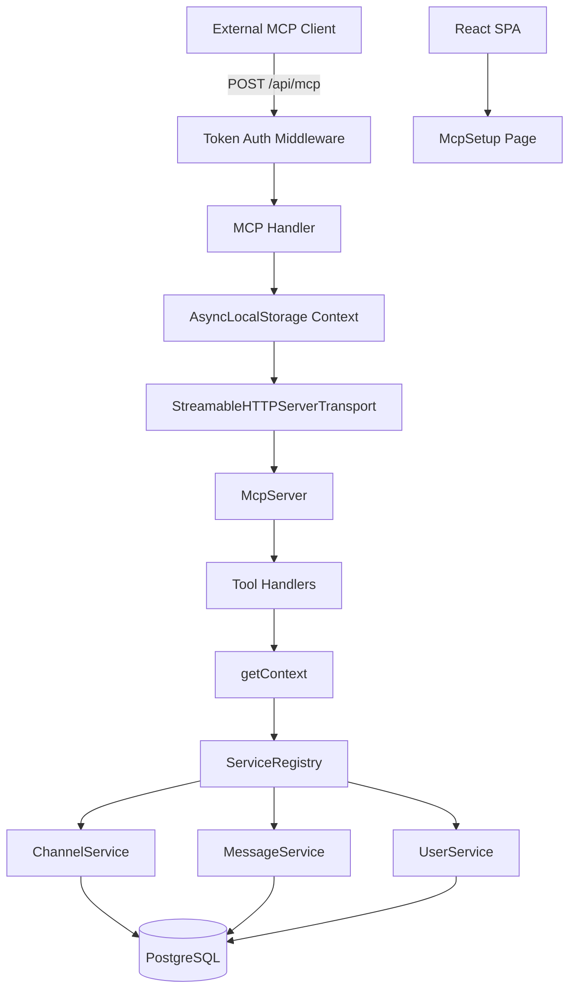
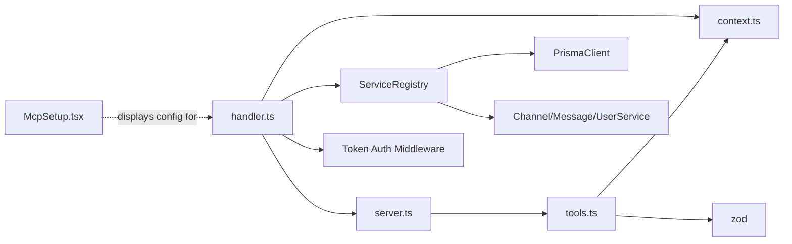

# Architecture

## Architecture Overview

This sprint adds an HTTP-based MCP (Model Context Protocol) server to the
Express backend and updates all project documentation. The MCP server
enables external AI clients to interact with the application through
registered tools that operate on the service layer.



## Technology Stack

| Technology | Purpose | Rationale |
|-----------|---------|-----------|
| `@modelcontextprotocol/sdk` | MCP protocol implementation | Official SDK, provides `McpServer` and `StreamableHTTPServerTransport` |
| `StreamableHTTPServerTransport` | HTTP transport for MCP | Stateless HTTP transport compatible with Express; no WebSocket needed |
| `AsyncLocalStorage` (Node.js built-in) | Request-scoped context | Passes user and ServiceRegistry to tool handlers without explicit threading |
| `zod` | Tool input validation | Already used by MCP SDK for tool schema definitions |
| Express middleware | Token authentication | Consistent with existing auth middleware pattern |

## Component Design

### Component: MCP Server (`server/src/mcp/server.ts`)

**Purpose**: Creates and configures the McpServer instance with all
registered tools.

**Boundary**: Inside — McpServer creation, tool registration, server
metadata. Outside — HTTP transport, authentication, Express routing.

**Use Cases**: SUC-001, SUC-002, SUC-003

The module exports a function that creates a `McpServer` instance,
registers all tools from `tools.ts`, and returns the configured server.
The server is created once at application startup and reused across
requests.

```typescript
// Pseudocode
import { McpServer } from '@modelcontextprotocol/sdk/server/mcp.js';
import { registerTools } from './tools.js';

export function createMcpServer(): McpServer {
  const server = new McpServer({
    name: 'app-mcp-server',
    version: '1.0.0',
  });
  registerTools(server);
  return server;
}
```

### Component: AsyncLocalStorage Context (`server/src/mcp/context.ts`)

**Purpose**: Provides request-scoped access to the authenticated user and
ServiceRegistry for MCP tool handlers.

**Boundary**: Inside — AsyncLocalStorage store creation, `getContext()`
accessor, `runWithContext()` wrapper. Outside — who calls `runWithContext`
(the handler) and who calls `getContext()` (the tools).

**Use Cases**: SUC-001, SUC-002, SUC-003

```typescript
// Pseudocode
import { AsyncLocalStorage } from 'node:async_hooks';
import type { ServiceRegistry } from '../services/service.registry.js';
import type { User } from '../generated/prisma/index.js';

interface McpContext {
  user: User;
  services: ServiceRegistry;
}

const store = new AsyncLocalStorage<McpContext>();

export function runWithContext<T>(ctx: McpContext, fn: () => T): T {
  return store.run(ctx, fn);
}

export function getContext(): McpContext {
  const ctx = store.getStore();
  if (!ctx) throw new Error('MCP context not available');
  return ctx;
}
```

### Component: Tool Definitions (`server/src/mcp/tools.ts`)

**Purpose**: Defines all MCP tools with Zod input schemas and handler
functions that operate through the ServiceRegistry.

**Boundary**: Inside — tool name, description, Zod schema, handler
implementation. Outside — McpServer registration, ServiceRegistry
internals.

**Use Cases**: SUC-001, SUC-002, SUC-003

Each tool follows the same pattern:

1. Define a Zod schema for the tool's input parameters
2. Define an async handler that calls `getContext()` to access services
3. Perform the operation through the appropriate service method
4. Return a result object

**Registered tools:**

| Tool | Input | Service Method | Returns |
|------|-------|---------------|---------|
| `get_version` | (none) | N/A | App version string |
| `list_users` | (none) | `userService.list()` | Array of users |
| `list_channels` | (none) | `channelService.list()` | Array of channels |
| `get_channel_messages` | `{ channelId, limit? }` | `messageService.list(channelId, { limit })` | Array of messages with author info |
| `post_message` | `{ channelId, content }` | `messageService.create(channelId, userId, content)` | Created message |
| `create_channel` | `{ name, description? }` | `channelService.create(name, description)` | Created channel |

```typescript
// Example tool registration pattern
server.tool(
  'list_channels',
  'List all chat channels',
  {},
  async () => {
    const { services } = getContext();
    const channels = await services.channelService.list();
    return {
      content: [{ type: 'text', text: JSON.stringify(channels, null, 2) }],
    };
  }
);

server.tool(
  'post_message',
  'Post a message to a chat channel',
  {
    channelId: z.number().describe('The channel ID to post to'),
    content: z.string().describe('The message content'),
  },
  async ({ channelId, content }) => {
    const { user, services } = getContext();
    const message = await services.messageService.create(channelId, user.id, content);
    return {
      content: [{ type: 'text', text: JSON.stringify(message, null, 2) }],
    };
  }
);
```

### Component: Express Handler (`server/src/mcp/handler.ts`)

**Purpose**: Bridges Express HTTP requests to the MCP server via
`StreamableHTTPServerTransport`.

**Boundary**: Inside — transport creation, context wrapping, request/response
piping. Outside — Express routing, auth middleware, McpServer internals.

**Use Cases**: SUC-001, SUC-002, SUC-003

The handler:
1. Receives the authenticated request (user already resolved by auth
   middleware)
2. Creates a `ServiceRegistry` with source `'MCP'`
3. Creates a `StreamableHTTPServerTransport`
4. Wraps the transport connection in `runWithContext()` so all tool
   handlers have access to the user and services
5. Pipes the transport to the Express response

```typescript
// Pseudocode
export function createMcpHandler(mcpServer: McpServer) {
  return async (req: Request, res: Response) => {
    const user = req.user as User;
    const services = ServiceRegistry.create(prisma, 'MCP');

    const transport = new StreamableHTTPServerTransport({ sessionIdGenerator: undefined });

    runWithContext({ user, services }, async () => {
      await mcpServer.connect(transport);
      await transport.handleRequest(req, res);
    });
  };
}
```

### Component: Token Auth Middleware

**Purpose**: Validates bearer tokens on the MCP endpoint against the
`MCP_DEFAULT_TOKEN` environment variable.

**Boundary**: Inside — token extraction from `Authorization` header,
comparison with env var, user lookup/creation. Outside — Express request
lifecycle, user model details.

**Use Cases**: SUC-001

The middleware:
1. Extracts the bearer token from the `Authorization` header
2. Compares it to `MCP_DEFAULT_TOKEN` from environment
3. On match: looks up or creates a system/bot user and attaches it to
   `req.user`
4. On mismatch or missing: returns 401

### Component: MCP Setup Page (`client/src/pages/McpSetup.tsx`)

**Purpose**: Provides developers with configuration instructions for
connecting external MCP clients.

**Boundary**: Inside — endpoint URL display, token instructions, example
config snippets. Outside — actual MCP client configuration.

**Use Cases**: SUC-004

Displays:
- The application's MCP endpoint URL (`https://<domain>/api/mcp`)
- Instructions for setting `MCP_DEFAULT_TOKEN` in environment config
- Example Claude Desktop configuration snippet (JSON)
- Example `curl` command for testing the endpoint

## Dependency Map



- `handler.ts` depends on `server.ts` (McpServer instance), `context.ts`
  (runWithContext), and `ServiceRegistry` (composition root)
- `tools.ts` depends on `context.ts` (getContext) and `zod` (schemas)
- `server.ts` depends on `tools.ts` (tool registration)
- Token Auth Middleware depends on `MCP_DEFAULT_TOKEN` env var and User
  model

## Data Model

No new database models are introduced in this sprint. The MCP server
operates on existing models from prior sprints:

- **User** (Sprint 005) — MCP bot user for message attribution
- **Channel** (Sprint 007) — chat channels for list/create tools
- **Message** (Sprint 007) — chat messages for read/write tools

The MCP bot user is a regular `User` record with a distinctive
`displayName` (e.g., "MCP Bot") and `provider` set to `'mcp'`. It is
looked up or created on first MCP request.

## Security Considerations

**Token authentication**: The MCP endpoint uses a static bearer token
(`MCP_DEFAULT_TOKEN`) rather than session-based auth. This is appropriate
for server-to-server communication where the client is a trusted AI tool
running on the developer's machine. The token is stored as a secret in
`config/dev/secrets.env` and `config/prod/secrets.env`.

**No session sharing**: MCP requests do not participate in the Express
session system. Each request is independently authenticated via the
bearer token. This prevents session fixation or CSRF concerns on the
MCP endpoint.

**Service layer enforcement**: MCP tools operate through the
ServiceRegistry, not through raw Prisma queries. This ensures that all
business rules, validation, and authorization logic in the service layer
apply equally to MCP operations and UI operations.

**Bot user attribution**: All MCP write operations are attributed to
the MCP bot user, providing a clear audit trail in the database.

## Design Rationale

### HTTP transport over WebSocket/SSE

**Decision**: Use `StreamableHTTPServerTransport` (stateless HTTP).

**Alternatives considered**: `SSEServerTransport` (server-sent events),
WebSocket transport.

**Reasoning**: HTTP transport is the simplest to integrate with Express,
requires no persistent connections, and works through all proxies and
load balancers. The MCP tools in this template are request/response
operations with no streaming needs. SSE or WebSocket transport can be
adopted later if real-time tool streaming is needed.

### AsyncLocalStorage over explicit parameter passing

**Decision**: Use Node.js `AsyncLocalStorage` to make user and services
available to tool handlers.

**Alternatives considered**: Passing context as a parameter to each tool
handler, closure-based context capture.

**Reasoning**: The MCP SDK's tool handler signature accepts only the
tool's input parameters. AsyncLocalStorage provides transparent
request-scoped context without modifying the SDK's API. This matches
the inventory app's proven pattern and keeps tool handlers clean.

### Static token over OAuth/API keys

**Decision**: Single static bearer token for MCP authentication.

**Alternatives considered**: OAuth 2.0 client credentials, per-user API
keys, session-based auth.

**Reasoning**: The MCP endpoint is designed for local development use
by the app developer, not for public API access. A static token is
the simplest approach that provides adequate security. Per-user API
keys or OAuth can be added later if the template needs multi-tenant
MCP access.

## Open Questions

None. The architecture follows the established pattern from the inventory
application.

## Sprint Changes

Changes planned for this sprint.

### Changed Components

**Added:**

- `server/src/mcp/server.ts` — McpServer creation and tool registration
- `server/src/mcp/context.ts` — AsyncLocalStorage context for MCP requests
- `server/src/mcp/tools.ts` — Tool definitions (get_version, list_users,
  list_channels, get_channel_messages, post_message, create_channel)
- `server/src/mcp/handler.ts` — Express route handler bridging HTTP to MCP
- `client/src/pages/McpSetup.tsx` — MCP configuration instructions page
- MCP token auth middleware (location TBD — likely
  `server/src/middleware/mcpAuth.ts` or inline in handler)

**Modified:**

- `server/src/index.ts` or `server/src/app.ts` — register `POST /api/mcp`
  route
- `server/package.json` — add `@modelcontextprotocol/sdk` dependency
- `config/dev/secrets.env` — add `MCP_DEFAULT_TOKEN`
- `config/prod/secrets.env` — add `MCP_DEFAULT_TOKEN`
- Sidebar navigation — add "MCP Setup" link
- `docs/template-spec.md` — add config directory, service layer, MCP
  server, Docker architecture, admin features sections
- `docs/secrets.md` — update for `config/` directory layout
- `docs/deployment.md` — update for new Docker model
- `docs/setup.md` — update for new first-time setup flow
- `docs/testing.md` — update if test patterns changed
- `AGENTS.md` — add service layer guidance (business logic in services,
  routes are thin adapters, register new services in ServiceRegistry)

### Migration Concerns

None. No database schema changes. The MCP bot user is created at runtime
on first MCP request (upsert pattern), not via migration.
