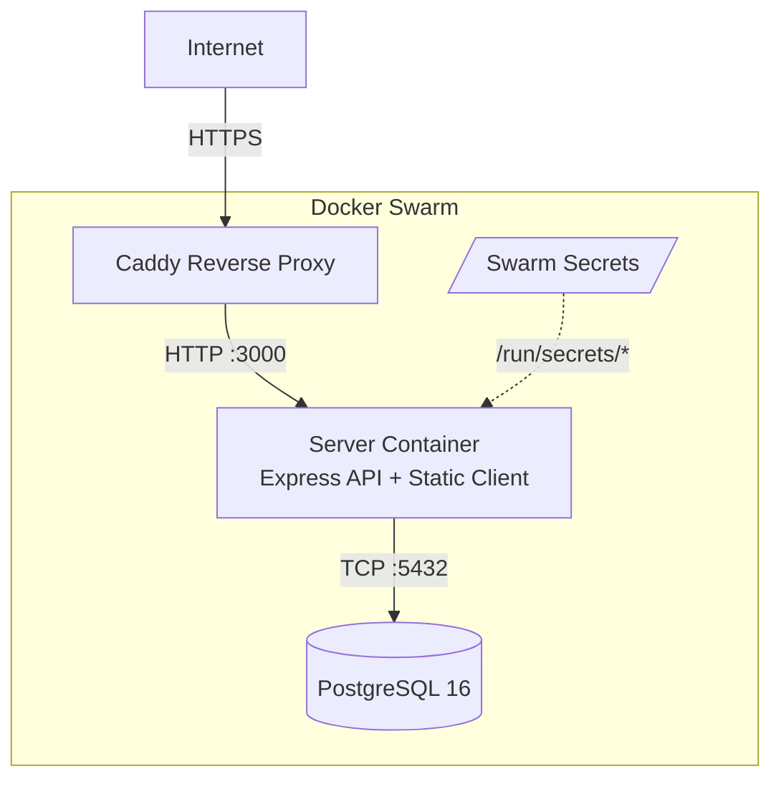
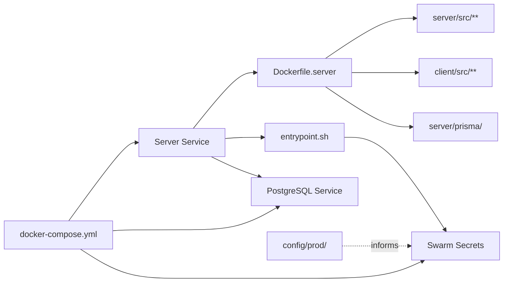

# Architecture

## Architecture Overview

Sprint 009 transitions the application from local-dev-only to a
production-ready Docker Swarm deployment. The production architecture
consolidates everything into a single server container that serves both
the Express API and the Vite-built client SPA. This container runs
behind a Caddy reverse proxy on the Swarm overlay network.



## Technology Stack

No new technologies are introduced. This sprint configures the existing
stack for production deployment:

| Component | Technology | Notes |
|-----------|-----------|-------|
| Runtime | Node.js 20 LTS (Alpine) | Same as dev |
| API | Express + TypeScript (compiled) | `tsc` output, no tsx in prod |
| Client | Vite-built static assets | Served by Express static middleware |
| Database | PostgreSQL 16 Alpine | Self-hosted in Swarm |
| ORM | Prisma 7 | Migrations via `prisma migrate deploy` |
| Orchestration | Docker Swarm | Single-node or multi-node |
| Reverse proxy | Caddy | Docker label-based automatic HTTPS |
| Secrets | Docker Swarm secrets | File-mounted at `/run/secrets/` |

## Component Design

### Component: Production Dockerfile (Multi-Stage)

**Purpose**: Build a minimal production image containing compiled server
code and built client assets.

**Boundary**: Takes source code as input, produces a runnable Docker
image. Does not handle secrets, orchestration, or networking.

**Use Cases**: SUC-001, SUC-002

The multi-stage build has three stages:

1. **`deps`** — Install all dependencies (dev + prod) in a full Node
   image. This stage is cached and reused across builds.
2. **`build`** — Compile server TypeScript with `tsc`, build Vite client
   with `npm run build`. Runs Prisma generate for the production client.
3. **`runtime`** — Alpine Node.js image. Copies only: compiled server JS,
   built client assets, production `node_modules`, Prisma schema and
   migrations, and the entrypoint script. No TypeScript source, no dev
   dependencies.

```dockerfile
# Stage 1: Dependencies
FROM node:20-alpine AS deps
WORKDIR /app
COPY server/package*.json ./server/
COPY client/package*.json ./client/
RUN cd server && npm ci
RUN cd client && npm ci

# Stage 2: Build
FROM deps AS build
COPY server/ ./server/
COPY client/ ./client/
RUN cd server && npx prisma generate
RUN cd server && npx tsc
RUN cd client && npm run build

# Stage 3: Runtime
FROM node:20-alpine AS runtime
WORKDIR /app
COPY --from=build /app/server/dist ./server/dist
COPY --from=build /app/server/node_modules ./server/node_modules
COPY --from=build /app/server/prisma ./server/prisma
COPY --from=build /app/client/dist ./client/dist
COPY docker/entrypoint.sh /entrypoint.sh
EXPOSE 3000
ENTRYPOINT ["/entrypoint.sh"]
CMD ["node", "server/dist/index.js"]
```

(Exact paths will be adjusted during implementation based on the actual
build output structure.)

### Component: Swarm Secrets & Entrypoint

**Purpose**: Load Docker Swarm secrets from mounted files into
environment variables before starting the application.

**Boundary**: Runs at container start, before the Node.js process. Reads
files from `/run/secrets/`, exports them, then `exec`s the main command.

**Use Cases**: SUC-001, SUC-003

The entrypoint script follows this pattern:

```bash
#!/bin/sh
# Load Swarm secrets as environment variables
for secret_file in /run/secrets/*; do
    if [ -f "$secret_file" ]; then
        secret_name=$(basename "$secret_file")
        export "$(echo "$secret_name" | tr '[:lower:]' '[:upper:]')=$(cat "$secret_file")"
    fi
done

# Execute the main command
exec "$@"
```

Expected Swarm secrets:

| Secret Name | Env Var | Used By |
|-------------|---------|---------|
| `database_url` | `DATABASE_URL` | Prisma, database connection |
| `session_secret` | `SESSION_SECRET` | Express session signing |
| `mcp_default_token` | `MCP_DEFAULT_TOKEN` | MCP endpoint authentication |
| `github_client_id` | `GITHUB_CLIENT_ID` | GitHub OAuth |
| `github_client_secret` | `GITHUB_CLIENT_SECRET` | GitHub OAuth |
| `google_client_id` | `GOOGLE_CLIENT_ID` | Google OAuth |
| `google_client_secret` | `GOOGLE_CLIENT_SECRET` | Google OAuth |
| `admin_password` | `ADMIN_PASSWORD` | Bootstrap admin access |

### Component: Production Compose Stack

**Purpose**: Define the Docker Swarm stack for production deployment.

**Boundary**: Orchestrates the server and database services, configures
networking, mounts secrets, and sets Caddy labels.

**Use Cases**: SUC-001, SUC-003

The production `docker-compose.yml` defines:

- **`server`** service: the production image, port 3000 (internal),
  Caddy labels for reverse proxy routing, Swarm secrets, depends on `db`
- **`db`** service: PostgreSQL 16 Alpine, persistent volume for
  `pgdata`, health check via `pg_isready`
- **Secrets**: declared as `external: true` (created before deploy)
- **Networks**: overlay network shared with Caddy

Caddy labels on the server service:

```yaml
deploy:
  labels:
    caddy: ${APP_DOMAIN}
    caddy.reverse_proxy: "{{upstreams 3000}}"
```

### Component: config/prod/

**Purpose**: Store production-specific environment values (public) and
encrypted secrets.

**Boundary**: Files in `config/prod/` are committed to the repo.
`public.env` is plaintext. `secrets.env` is SOPS-encrypted.

**Use Cases**: SUC-001

Layout:

```
config/prod/
├── public.env      # APP_DOMAIN, NODE_ENV=production, callback URLs
└── secrets.env     # SOPS-encrypted: DATABASE_URL, SESSION_SECRET, etc.
```

`public.env` contains non-secret production configuration:

- `NODE_ENV=production`
- `APP_DOMAIN=<app>.jtlapp.net`
- `PORT=3000`
- OAuth callback URLs (public, not secret)

`secrets.env` contains SOPS-encrypted secrets that are also loaded into
Swarm as Docker secrets before deployment.

## Dependency Map



## Data Model

No data model changes in this sprint. The database schema is unchanged
from sprints 004-008. Production deployment uses `prisma migrate deploy`
to apply the existing migration history to the production database.

## Security Considerations

- **Secrets never in image layers**: All secrets are injected at runtime
  via Swarm secret mounts, not baked into the Docker image.
- **Minimal attack surface**: The runtime image uses Alpine Linux, contains
  only production dependencies, and has no dev tools or source code.
- **HTTPS by default**: Caddy provides automatic TLS certificate
  provisioning for the configured domain.
- **Secret rotation**: Updating a secret requires creating a new Swarm
  secret version and redeploying the service. The entrypoint reads
  secrets fresh on each container start.
- **Old secrets/ cleanup**: The legacy `secrets/` directory is removed
  only after stakeholder confirms all values have been migrated to
  `config/`. No secret data is lost.

## Design Rationale

### Single container for API + client

The production image serves both the Express API and the Vite-built
client from a single container. This avoids the complexity of a separate
Caddy-based client container, reduces resource usage, and simplifies the
Swarm stack. Express already has middleware to serve static files with
SPA fallback (established in sprint 004). A separate client container
is only needed at scale, which is out of scope for this template.

### Self-hosted PostgreSQL in Swarm

The database runs as a Swarm service alongside the app, not as a managed
cloud database. This keeps the template self-contained and avoids cloud
vendor lock-in. Projects that need managed databases can swap the `db`
service for an external connection string.

### Named Swarm secrets (not file-path based)

Secrets are created with descriptive lowercase names (`database_url`,
`session_secret`) and the entrypoint uppercases them. This is clearer
than generic names and matches the inventory app's proven pattern.

## Open Questions

- **Registry choice**: The deployment workflow references pushing images
  to a registry. The specific registry (Docker Hub, GitHub Container
  Registry, private) is a project decision — the template documents the
  pattern but does not prescribe a registry.
- **secrets/ removal timing**: The old `secrets/` directory is removed
  in this sprint, but only after the stakeholder explicitly confirms
  the migration is complete. If not confirmed, the directory remains
  with a deprecation note.

## Sprint Changes

### Changed Components

**Added:**
- `docker-compose.yml` — Rewritten as the production Swarm stack
  (replaces the old dev-oriented compose file)
- `config/prod/public.env` — Production public environment values
- `config/prod/secrets.env` — SOPS-encrypted production secrets
- `build:docker` npm script

**Modified:**
- `docker/Dockerfile.server` — Rewritten as multi-stage production build
  (compile server TS + build Vite client)
- `docker/entrypoint.sh` — Updated for named Swarm secrets pattern
- `docs/deployment.md` — Rewritten with production workflow
- `package.json` — New build:docker script
- Root `docker-compose.yml` — Becomes the production stack (dev compose
  is `docker-compose.dev.yml` from sprint 004)

**Removed:**
- `docker/Dockerfile.client.dev` — No longer needed (client served by
  Express)
- `docker-compose.prod.yml` — Replaced by the main `docker-compose.yml`
- `secrets/` directory — Migrated to `config/` in sprint 004 (removed
  after stakeholder verification)

### Migration Concerns

- The root `docker-compose.yml` changes purpose from dev to production.
  Developers who have muscle memory for `docker compose up` will need
  to use `docker compose -f docker-compose.dev.yml up` for local dev.
  The `npm run dev` script handles this automatically.
- The old `docker-compose.prod.yml` is removed. Any existing deployment
  scripts referencing it will need updating.
- Swarm secrets must be created before the first production deploy.
  The deployment docs include the exact commands.

### Deployment Workflow

The production deployment workflow, to be documented in
`docs/deployment.md`:

1. **Build**: `npm run build:docker` (builds the multi-stage image)
2. **Tag**: `docker tag <image> <registry>/<image>:<version>`
3. **Push**: `docker push <registry>/<image>:<version>`
4. **Create secrets** (first deploy only):
   ```bash
   sops -d config/prod/secrets.env | while IFS='=' read -r key value; do
     echo "$value" | docker secret create "$(echo "$key" | tr '[:upper:]' '[:lower:]')" -
   done
   ```
5. **Deploy**: `TAG=<version> docker stack deploy -c docker-compose.yml <stackname>`
6. **Migrate**: `docker exec $(docker ps -q -f name=<stackname>_server) npx prisma migrate deploy`
7. **Verify**: Check service health, test endpoints, confirm Caddy routing

**Rolling updates**: Deploy a new tag — Swarm replaces containers with
zero downtime by default.

**Rollback**: `TAG=<previous> docker stack deploy -c docker-compose.yml <stackname>`

### Cleanup List

Files to remove during this sprint:

| File | Reason |
|------|--------|
| `docker/Dockerfile.client.dev` | Client served by Express, no separate container |
| `docker-compose.prod.yml` | Replaced by `docker-compose.yml` |
| `secrets/dev.env` | Migrated to `config/dev/secrets.env` in sprint 004 |
| `secrets/dev.env.example` | Migrated to `config/dev/` |
| `secrets/prod.env` | Migrated to `config/prod/secrets.env` |
| `secrets/prod.env.example` | Migrated to `config/prod/` |
| `secrets/` directory | Empty after above removals |

(Removal of `secrets/` is gated on stakeholder verification.)
