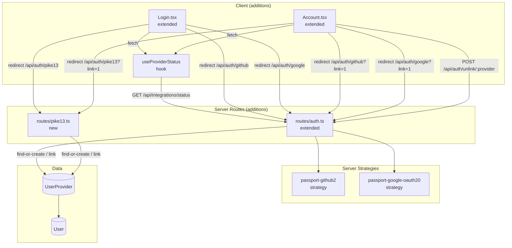
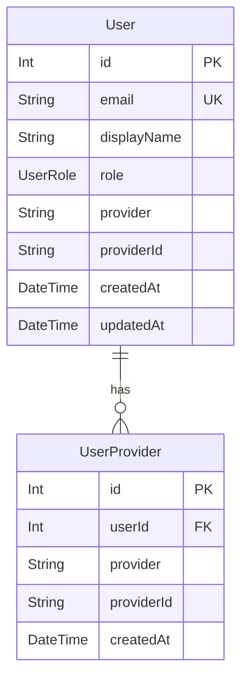

<!-- CLASI: Before changing code or making plans, review the SE process in CLAUDE.md -->

# Architecture Addendum — Sprint 018: Social Login & Account Linking

> This document is an addendum to `architecture-update.md` for Sprint 018. It describes the
> additional scope introduced by the social-login TODO. The base architecture decisions
> (strip-in-place, dual-DB Prisma + SQLite, express-session + Passport, AppLayout preserved,
> demo login kept) are unchanged and are not repeated here.

---

## What Changed (Social Login Scope)

### Server: Passport Strategies

**Re-added (were removed in ticket 004):**
- `passport-github2` strategy — registered in `routes/auth.ts`; uses `GITHUB_CLIENT_ID` /
  `GITHUB_CLIENT_SECRET`. Already present in `server/package.json`; no new install needed.
- `passport-google-oauth20` strategy — registered in `routes/auth.ts`; uses
  `GOOGLE_CLIENT_ID` / `GOOGLE_CLIENT_SECRET`. Already present in `server/package.json`.

**Registration pattern (both strategies):**

```
passport.use('github', new GitHubStrategy(...))
passport.use('google', new GoogleStrategy(...))
```

Registration is guarded: strategies are only registered when the corresponding env vars are
present. This keeps the server boot clean with zero OAuth config.

**Access token handling:** The GitHub strategy callback passes `accessToken` into the session
(`req.session.githubAccessToken`) rather than onto `req.user`. This decouples session
serialization (user ID only) from the access token lifecycle and keeps `deserializeUser`
unchanged. The existing `routes/github.ts` reads `user.accessToken` off `req.user` — that
field must be updated to read from `req.session.githubAccessToken` instead.

### Server: Routes — auth.ts (extended)

**New initiate + callback routes (both providers):**

| Method | Path | Description |
|--------|------|-------------|
| GET | `/api/auth/github` | Initiates GitHub OAuth; `?link=1` enters link mode |
| GET | `/api/auth/github/callback` | Handles GitHub callback |
| GET | `/api/auth/google` | Initiates Google OAuth; `?link=1` enters link mode |
| GET | `/api/auth/google/callback` | Handles Google callback |

**Link-mode flag:** When `?link=1` is present on the initiate route, `link=true` is stored
in `req.session.oauthLinkMode` before the redirect. The callback handler reads this flag,
runs link-mode logic instead of login-mode logic, then clears the flag.

**Find-or-create logic (login mode):**
1. Look up `UserProvider` by `(provider, providerId)`.
2. If found → return the associated `User`; establish session.
3. If not found → look up `User` by `email` (auto-link by email, decision 2).
4. If email match → create `UserProvider` row linking the OAuth identity to that user; establish session.
5. If no match → create new `User` + new `UserProvider` row; establish session.

**Link logic (link mode):**
1. Require an already-authenticated session (`req.user` must exist); reject with 401 if not.
2. Check `UserProvider` for `(provider, providerId)` — if already bound to a *different* user, return 409.
3. If already bound to the current user → no-op; redirect back to `/account`.
4. Otherwise → create `UserProvider` row binding to `req.user.id`; redirect back to `/account`.

**Extended `GET /api/auth/me`:**

Adds `linkedProviders: string[]` to the response — the union of:
- `User.provider` (primary, if not null)
- All `UserProvider.provider` values for this user

**New `POST /api/auth/unlink/:provider`:**
- Requires authenticated session.
- Counts remaining login methods: `UserProvider` rows + (`User.provider` !== null ? 1 : 0).
- Rejects with 400 if count would drop to zero after unlink (decision 4).
- Deletes the matching `UserProvider` row for this user.
- If `User.provider` matches the unlinked provider, clears `User.provider` / `User.providerId` to null.

### Server: Routes — pike13.ts (new file)

Pike 13 does not have a Passport strategy. The hand-rolled OAuth flow is reimplemented in
`server/src/routes/pike13.ts` (this file was deleted in ticket 001; it is recreated here):

| Method | Path | Description |
|--------|------|-------------|
| GET | `/api/auth/pike13` | Redirects to Pike 13 authorization URL; `?link=1` supported |
| GET | `/api/auth/pike13/callback` | Receives `code`, exchanges for token, runs find-or-create |

**Token exchange:** `POST https://pike13.com/oauth/token` with `grant_type=authorization_code`,
`code`, `redirect_uri`, `client_id`, `client_secret`. Pike 13 tokens do not expire, so no
refresh logic is needed.

**Profile fetch:** After token exchange, call a Pike 13 people API endpoint to get the user's
email/name (exact endpoint TBD during implementation — see Open Question 1 below). The
returned email is used for the find-or-create / auto-link logic identical to GitHub/Google.

**Access token:** Stored in `req.session.pike13AccessToken` (same pattern as GitHub).

The router is registered in `app.ts` at `/api`.

### Server: app.ts

`pike13Router` registered at `/api` (alongside the existing routers).

### Client: Hooks

**New `useProviderStatus()` hook** — `client/src/hooks/useProviderStatus.ts`:
- Calls `GET /api/integrations/status` on mount (once per page lifecycle).
- Returns `{ github: boolean, google: boolean, pike13: boolean, loading: boolean }`.
- Used by both `Login.tsx` and `Account.tsx`.

### Client: Login.tsx (extended, not replaced)

The existing demo form is untouched. Below the form, appended:

- A `<hr>` divider labeled "Or sign in with" (rendered only when at least one provider is
  configured).
- Up to three provider buttons, each rendered only when `useProviderStatus()` returns `true`
  for that provider.
- Clicking a button navigates to `/api/auth/<provider>` (browser redirect, not fetch).

**AuthUser type (AuthContext.tsx):** Extended with `linkedProviders?: string[]`.

### Client: Account.tsx (extended, not replaced)

A new "Sign-in methods" card section is appended after the existing fields:

- Lists each entry in `user.linkedProviders` with a "Primary" badge if it matches
  `user.provider`, plus an "Unlink" button.
- Lists each configured provider (from `useProviderStatus()`) that is NOT in
  `user.linkedProviders` with an "Add \<Provider\>" button.
- "Add \<Provider\>" navigates to `/api/auth/<provider>?link=1`.
- "Unlink" calls `POST /api/auth/unlink/:provider`; on success calls `refresh()` from
  `AuthContext`.

Unlink button is disabled when the user has only one remaining login method (client-side
guard mirrors the server-side guardrail).

---

## Component Diagram (Social Login Additions)



## Entity-Relationship Diagram (no schema changes)

The `UserProvider` model already exists and is unchanged:



`@@unique([provider, providerId])` on `UserProvider` prevents duplicate bindings.
`@@unique([provider, providerId])` on `User` is retained for primary-provider lookup.

---

## Impact on Existing Components

| Component | Impact |
|-----------|--------|
| `routes/auth.ts` | New strategy registrations, new initiate/callback routes, `/auth/me` extended, `/auth/unlink/:provider` added |
| `routes/pike13.ts` | Recreated (was deleted ticket 001) with hand-rolled OAuth flow |
| `routes/github.ts` | Access token source changed from `req.user.accessToken` to `req.session.githubAccessToken` |
| `app.ts` | `pike13Router` registered at `/api` |
| `AuthContext.tsx` | `AuthUser` type extended with `linkedProviders?: string[]` |
| `Login.tsx` | Provider buttons added below existing form |
| `Account.tsx` | "Sign-in methods" section added |
| `useProviderStatus` (new) | New hook; no existing component changed |
| `UserProvider` (Prisma model) | Existing; no schema change |
| `passport-github2` (npm) | Already in `package.json`; no install needed |
| `passport-google-oauth20` (npm) | Already in `package.json`; no install needed |

---

## Migration Concerns

**No Prisma migration needed.** `UserProvider` already exists in the current schema.

**No new npm packages.** `passport-github2` and `passport-google-oauth20` are already in
`server/package.json` (they were removed from app code in ticket 004 but left in the
manifest). No Pike 13 Passport package exists; the hand-rolled flow uses `fetch`.

**Session data:** Existing sessions do not have `githubAccessToken` or `pike13AccessToken`
— those keys are simply absent, which is handled by the `?? null` fallback in `github.ts`.

**Callback URL registration:** Developers testing OAuth must register callback URLs in the
respective provider dashboards. The existing `.claude/rules/api-integrations.md` documents
the expected paths; no doc update needed for URL values themselves (they are unchanged from
the pre-sprint-018 template).

---

## Design Rationale

### Decision: Store OAuth access tokens in session, not on req.user

**Context:** `deserializeUser` fetches `User` from DB by ID on every request. Storing the
access token on the DB User row would mean all tabs/sessions share one token and a token
refresh would require a DB write. Storing on `req.user` at login time (old approach in
github.ts) is lost on the next request cycle.

**Choice:** Store access tokens keyed by provider in `req.session`
(`githubAccessToken`, `pike13AccessToken`). Each session independently holds its own tokens.
`deserializeUser` stays user-ID-only.

**Consequences:** Access token survives across requests within a single session. Tokens are
lost on session expiry (acceptable). Multiple browser sessions for the same user each hold
their own token independently (acceptable for a demo template).

### Decision: Link-mode flag in session, not state param

**Context:** OAuth state params are the canonical way to pass data through the OAuth round
trip, but they require MAC/verification logic to be safe. Express session is already
available and trusted.

**Choice:** Set `req.session.oauthLinkMode = true` before the provider redirect; read and
clear it in the callback.

**Consequences:** Link mode flag does not survive if the user opens the OAuth consent in a
different browser/incognito session (edge case, acceptable for demo). State param approach
would be more portable but adds implementation complexity.

### Decision: Separate pike13.ts file rather than inlining in auth.ts

**Context:** The Pike 13 hand-rolled flow is ~60-80 lines. It shares the find-or-create
helper with auth.ts but has distinct initiate/callback routes and a token exchange step.

**Choice:** Separate file `routes/pike13.ts`, with the find-or-create helper extracted to
a shared utility (or duplicated if extraction is premature at this stage).

**Consequences:** File boundary matches the original structure from Sprint 011. Passport
strategies (github, google) live in auth.ts alongside the rest of the auth surface; Pike 13
lives separately, mirroring how it was structured before.

---

## Open Questions

1. **Pike 13 profile endpoint:** Which Pike 13 API endpoint returns the authenticated user's
   email and display name after token exchange? The original Sprint 011 pike13.ts implementation
   should be consulted. If lost, the Pike 13 API docs (`https://developer.pike13.com`) document
   `/api/v2/desk/people` — the implementer should verify the correct endpoint and field names
   during ticket 012.

2. **Pike 13 email verification:** Pike 13 may not guarantee that the returned email is
   verified. Decision 2 (auto-link by email) assumes trusted emails. The implementer should
   document in the PR whether Pike 13 emails are treated as verified, and add a comment in the
   code if there is doubt.

3. **GitHub repos route access token:** `routes/github.ts` currently checks `user.accessToken`
   (dead code post-ticket-004). Ticket 011 must update this to read from
   `req.session.githubAccessToken`. If the GitHub repos feature is considered out of scope for
   this social-login work, the route can remain broken with a TODO comment. Recommend fixing it
   in ticket 011 since it is a one-line change.

4. **Unlink guardrail for demo accounts:** Demo users (`user@demo.local`, `admin@demo.local`)
   have no `UserProvider` rows and their `User.provider` is null. If they link an OAuth
   provider and then unlink it, the guardrail would block the unlink only if that is their
   sole remaining method. This is correct behavior per decision 4, but the edge case
   (demo user links then unlinks their only OAuth provider, leaving them with no login method)
   should be confirmed as acceptable. The demo form credentials always work regardless, so the
   user is not truly locked out, but the guardrail does not know about hardcoded demo
   credentials.

---

## Architecture Self-Review

**Consistency:** Sprint Changes section matches document body. Dependency on existing
architecture decisions (session, Passport, dual-DB) is consistent. No new data model changes
contradict the base architecture-update.md.

**Codebase Alignment:** `UserProvider` confirmed present in `server/prisma/schema.prisma`.
`passport-github2` and `passport-google-oauth20` confirmed in `server/package.json`.
`/api/integrations/status` confirmed in `server/src/routes/integrations.ts`. `github.ts`
access token issue (Open Question 3) is flagged and handled in ticket scope.

**Design Quality:** `useProviderStatus` hook has a single responsibility (fetch and expose
integration status). OAuth strategy registration is guarded by env var presence. Passport
`deserializeUser` is unchanged (user ID only). `UserProvider` owns the provider-identity
linkage; `User` retains its primary-provider fields for backward compatibility.

**Anti-Patterns:** None detected. The find-or-create helper is shared across providers via
extraction, not duplicated. Session flag for link mode is minimal. No circular dependencies
introduced.

**Risks:**
- Pike 13 profile endpoint is unknown (Open Question 1) — medium risk; blocked only for
  ticket 012, not 011/013/014/015.
- Session-based link-mode flag requires same browser session for OAuth round trip — low risk
  for demo template use.

**Verdict: APPROVE WITH CHANGES** — Open Questions 1 and 4 are flagged for implementer
attention but do not require architectural revision. Open Question 3 (github.ts token) is
addressed within ticket 011 scope.
